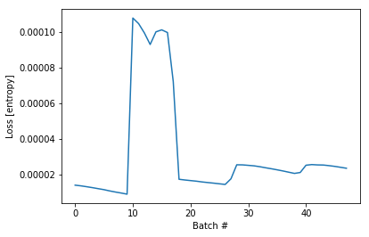

```python
# boiler plate
from collections import Counter
import pickle
from importlib import reload
import tensorflow as tf
import numpy as np
import matplotlib.pyplot as plt
import ipdb
import mytf.utils as mu

tf.enable_eager_execution()

print(tf.executing_eagerly())


```

    True


```python
# data from earlier
with open('models/2019-05-19T001217-UTC-outdata.pkl', 'rb') as fd: outdata = pickle.load(fd)
```


```python
model = tf.keras.Sequential([
    tf.keras.layers.LSTM(64,  dropout=0.2, recurrent_dropout=0.2,
                input_shape=(None, 1)
              ),
    # 4 because 'A', 'B', 'C', 'D'.
    tf.keras.layers.Dense(4)
])
```

    WARNING:tensorflow:From /usr/local/miniconda3/envs/pandars3/lib/python3.7/site-packages/tensorflow/python/ops/tensor_array_ops.py:162: colocate_with (from tensorflow.python.framework.ops) is deprecated and will be removed in a future version.
    Instructions for updating:
    Colocations handled automatically by placer.
    WARNING:tensorflow:From /usr/local/miniconda3/envs/pandars3/lib/python3.7/site-packages/tensorflow/python/keras/backend.py:4010: calling dropout (from tensorflow.python.ops.nn_ops) with keep_prob is deprecated and will be removed in a future version.
    Instructions for updating:
    Please use `rate` instead of `keep_prob`. Rate should be set to `rate = 1 - keep_prob`.


```python
%time training_indices = \
        mu.choose_training_indices(outdata, [10000, 7689, 10000, 20000])

training_groups = training_indices
training_indices = training_groups[0] + training_groups[1]\
                    + training_groups[2] + training_groups[3]

```

    CPU times: user 4.44 s, sys: 32.9 ms, total: 4.47 s
    Wall time: 4.53 s


```python
#Hand-tuned ... 
class_weights = {0: 0.1, 1: 0.5, 2: 0.1, 3: 0.3}

%time dataset_batches = mu.build_dataset_weighty(  \
    outdata, training_indices, class_weights, \
        batch_size=1000)
```

    Counter({3: 20000, 0: 10000, 2: 10000, 1: 7689})
    weights_per_class,  tf.Tensor([9.99999975e-06 6.50279617e-05 9.99999975e-06 1.50000005e-05], shape=(4,), dtype=float32)
    tf.Tensor(1.0005401, shape=(), dtype=float32)
    CPU times: user 8.02 s, sys: 858 ms, total: 8.88 s
    Wall time: 10.4 s


```python
loss_history = ipdb.runcall(mu.do_train, model, dataset_batches)
```

    > /Users/michal/LeDropbox/Dropbox/Code/Kaggle/reducing-commercial-aviation-fatalities/mytf/utils.py(125)do_train()
        124 def do_train(model, dataset_batches):
    --> 125     optimizer = tf.train.AdamOptimizer()
        126 
    
    ipdb> n
    > /Users/michal/LeDropbox/Dropbox/Code/Kaggle/reducing-commercial-aviation-fatalities/mytf/utils.py(127)do_train()
        126 
    --> 127     loss_history = []
        128 
    
    ipdb> 
    > /Users/michal/LeDropbox/Dropbox/Code/Kaggle/reducing-commercial-aviation-fatalities/mytf/utils.py(129)do_train()
        128 
    --> 129     for (batch, (invec, labels, weights)) in enumerate(dataset_batches.take(1000)):
        130 
    
    ipdb> 
    > /Users/michal/LeDropbox/Dropbox/Code/Kaggle/reducing-commercial-aviation-fatalities/mytf/utils.py(131)do_train()
        130 
    --> 131         with tf.GradientTape() as tape:
        132             logits = model(invec, training=True)
    
    ipdb> n
    > /Users/michal/LeDropbox/Dropbox/Code/Kaggle/reducing-commercial-aviation-fatalities/mytf/utils.py(132)do_train()
        131         with tf.GradientTape() as tape:
    --> 132             logits = model(invec, training=True)
        133             loss_value = tf.losses.sparse_softmax_cross_entropy(labels, logits, weights=weights)
    
    ipdb> 
    > /Users/michal/LeDropbox/Dropbox/Code/Kaggle/reducing-commercial-aviation-fatalities/mytf/utils.py(133)do_train()
        132             logits = model(invec, training=True)
    --> 133             loss_value = tf.losses.sparse_softmax_cross_entropy(labels, logits, weights=weights)
        134 
    
    ipdb> n
    WARNING:tensorflow:From /usr/local/miniconda3/envs/pandars3/lib/python3.7/site-packages/tensorflow/python/ops/losses/losses_impl.py:209: to_float (from tensorflow.python.ops.math_ops) is deprecated and will be removed in a future version.
    Instructions for updating:
    Use tf.cast instead.
    > /Users/michal/LeDropbox/Dropbox/Code/Kaggle/reducing-commercial-aviation-fatalities/mytf/utils.py(135)do_train()
        134 
    --> 135         loss_history.append(loss_value.numpy())
        136         grads = tape.gradient(loss_value, model.trainable_variables)
    
    ipdb> pp logits.shape
    TensorShape([Dimension(1000), Dimension(4)])
    ipdb> pp labels.shape
    TensorShape([Dimension(1000)])
    ipdb> pp loss_value
    <tf.Tensor: id=414520, shape=(), dtype=float32, numpy=1.481572e-05>
    ipdb> pp logits[:2]
    <tf.Tensor: id=414525, shape=(2, 4), dtype=float32, numpy=
    array([[-0.15132189, -0.00146415,  0.04771341, -0.11280347],
           [-0.13715975, -0.01876358,  0.07230264, -0.11246541]],
          dtype=float32)>
    ipdb> pp labels[:2]
    <tf.Tensor: id=414530, shape=(2,), dtype=int64, numpy=array([0, 0])>
    ipdb> pp logits[:2]*100
    <tf.Tensor: id=414537, shape=(2, 4), dtype=float32, numpy=
    array([[-15.132189  ,  -0.14641546,   4.771341  , -11.280348  ],
           [-13.715975  ,  -1.8763583 ,   7.2302637 , -11.246541  ]],
          dtype=float32)>
    ipdb> pp np.argmax(labels[:2], axis=1)
    *** numpy.AxisError: axis 1 is out of bounds for array of dimension 1
    ipdb> pp np.argmax(logits[:2], axis=1)
    array([2, 2])
    ipdb> pp mu
    *** NameError: name 'mu' is not defined
    ipdb> pp tf_f1_score
    <function tf_f1_score at 0x13512d488>
    ipdb> pp tf_f1_score(labels[:10], np.argmax(logits[:10], axis=1))
    (<tf.Tensor: id=414597, shape=(), dtype=float64, numpy=nan>,
     <tf.Tensor: id=414634, shape=(), dtype=float64, numpy=nan>,
     <tf.Tensor: id=414642, shape=(), dtype=float64, numpy=nan>,
     <tf.Tensor: id=414632, shape=(), dtype=float64, numpy=nan>)
    ipdb> pp np.argmax(logits[:10], axis=1)
    array([2, 2, 2, 2, 2, 2, 2, 2, 2, 2])
    ipdb> tf_f1_score([1,2,3], [1,3,3])
    (<tf.Tensor: id=414696, shape=(), dtype=float64, numpy=0.6>, <tf.Tensor: id=414733, shape=(), dtype=float64, numpy=0.6>, <tf.Tensor: id=414741, shape=(), dtype=float64, numpy=0.6>, <tf.Tensor: id=414731, shape=(), dtype=float64, numpy=0.6>)
    ipdb> pp labels[:10]
    <tf.Tensor: id=414749, shape=(10,), dtype=int64, numpy=array([0, 0, 0, 0, 0, 0, 0, 0, 0, 0])>
    ipdb> pp tf_f1_score(labels[:10], np.argmax(logits[:10], axis=1))
    (<tf.Tensor: id=414799, shape=(), dtype=float64, numpy=nan>,
     <tf.Tensor: id=414836, shape=(), dtype=float64, numpy=nan>,
     <tf.Tensor: id=414844, shape=(), dtype=float64, numpy=nan>,
     <tf.Tensor: id=414834, shape=(), dtype=float64, numpy=nan>)
    ipdb> pp tf_f1_score(labels[:10].numpy(), np.argmax(logits[:10], axis=1))
    (<tf.Tensor: id=414903, shape=(), dtype=float64, numpy=nan>,
     <tf.Tensor: id=414940, shape=(), dtype=float64, numpy=nan>,
     <tf.Tensor: id=414948, shape=(), dtype=float64, numpy=nan>,
     <tf.Tensor: id=414938, shape=(), dtype=float64, numpy=nan>)
    ipdb> pp tf_f1_score(labels[:10].numpy(), np.argmax(logits[:10], axis=1).numpy())
    *** AttributeError: 'numpy.ndarray' object has no attribute 'numpy'
    ipdb> pp tf.cast(labels[:2], tf.float64)
    <tf.Tensor: id=414971, shape=(2,), dtype=float64, numpy=array([0., 0.])>
    ipdb> pp tf.cast(np.argmax(logits[:10], axis=1), tf.float64)
    <tf.Tensor: id=414979, shape=(10,), dtype=float64, numpy=array([2., 2., 2., 2., 2., 2., 2., 2., 2., 2.])>
    ipdb>  pp tf_f1_score(labels[:10], np.argmax(logits[:10], axis=1))[0]
    <tf.Tensor: id=415029, shape=(), dtype=float64, numpy=nan>
    ipdb>  pp tf_f1_score(labels[:10], np.argmax(logits[:10], axis=1))[0].numpy()
    nan
    ipdb> pp tf.count_nonzero([1,2,3])
    <tf.Tensor: id=415176, shape=(), dtype=int64, numpy=3>
    ipdb> pp tf.count_nonzero( np.argmax(logits[:10], axis=1))
    <tf.Tensor: id=415188, shape=(), dtype=int64, numpy=10>
    ipdb> pp tf.cast(np.argmax(logits[:10], axis=1), tf.float64)
    <tf.Tensor: id=415196, shape=(10,), dtype=float64, numpy=array([2., 2., 2., 2., 2., 2., 2., 2., 2., 2.])>
    ipdb> pp tf.cast(np.argmax(logits[:10], axis=1), tf.float64)*labels[:10]
    *** tensorflow.python.framework.errors_impl.InvalidArgumentError: cannot compute Mul as input #0(zero-based) was expected to be a int64 tensor but is a double tensor [Op:Mul] name: mul/
    ipdb> pp tf.cast(np.argmax(logits[:10], axis=1), tf.float64)* tf.cast(labels[:10], tf.float64)
    <tf.Tensor: id=415221, shape=(10,), dtype=float64, numpy=array([0., 0., 0., 0., 0., 0., 0., 0., 0., 0.])>
    ipdb> pp tf.count_nonzero(tf.cast(np.argmax(logits[:10], axis=1), tf.float64)* tf.cast(labels[:10], tf.float64))
    <tf.Tensor: id=415240, shape=(), dtype=int64, numpy=0>
    ipdb> quit


```python
# As  I'm observing the loss_history, the one thing that stands out is that they are 
# extremely small values. And I have a feeling that's because the targets are very small,
# and the predictions are very small, so the calculated cross entropy is also very small!..

# taking a detour.... to try to use an f1 as a loss instead.. 
```


```python
# Getting a ValueError: No gradients provided for any variable: ["<tf.Variable 'lstm/kernel:0' shape=(1, 256) dtype=float32
# error and I am learning it's because loss_Value tensor, needs to be derived,
#    from the tensors used to train the model, per https://stackoverflow.com/questions/37889125/tensorflow-valueerror-no-gradients-provided-for-any-variable
# So perhaps tensor only operations allowed... 


reload(mu)
loss_history = ipdb.runcall(mu.do_train_f1_loss, model, dataset_batches)
```

    > /Users/michal/LeDropbox/Dropbox/Code/Kaggle/reducing-commercial-aviation-fatalities/mytf/utils.py(155)do_train_f1_loss()
        154 def do_train_f1_loss(model, dataset_batches):
    --> 155     optimizer = tf.train.AdamOptimizer()
        156 
    
    ipdb> n
    > /Users/michal/LeDropbox/Dropbox/Code/Kaggle/reducing-commercial-aviation-fatalities/mytf/utils.py(157)do_train_f1_loss()
        156 
    --> 157     loss_history = []
        158 
    
    ipdb> 
    > /Users/michal/LeDropbox/Dropbox/Code/Kaggle/reducing-commercial-aviation-fatalities/mytf/utils.py(159)do_train_f1_loss()
        158 
    --> 159     for (batch, (invec, labels, weights)) in enumerate(dataset_batches.take(1000)):
        160 
    
    ipdb> 
    > /Users/michal/LeDropbox/Dropbox/Code/Kaggle/reducing-commercial-aviation-fatalities/mytf/utils.py(161)do_train_f1_loss()
        160 
    --> 161         with tf.GradientTape() as tape:
        162             logits = model(invec, training=True)
    
    ipdb> 
    > /Users/michal/LeDropbox/Dropbox/Code/Kaggle/reducing-commercial-aviation-fatalities/mytf/utils.py(162)do_train_f1_loss()
        161         with tf.GradientTape() as tape:
    --> 162             logits = model(invec, training=True)
        163 
    
    ipdb> 
    > /Users/michal/LeDropbox/Dropbox/Code/Kaggle/reducing-commercial-aviation-fatalities/mytf/utils.py(164)do_train_f1_loss()
        163 
    --> 164             original_loss_value = tf.losses.sparse_softmax_cross_entropy(labels, logits, weights=weights)
        165 
    
    ipdb> 
    > /Users/michal/LeDropbox/Dropbox/Code/Kaggle/reducing-commercial-aviation-fatalities/mytf/utils.py(166)do_train_f1_loss()
        165 
    --> 166             micro, macro, weighted, f1 = tf_f1_score(
        167                     one_hot(labels, convert=True),
    
    ipdb> pp original_loss_value
    <tf.Tensor: id=900960, shape=(), dtype=float32, numpy=1.4841676e-05>
    ipdb> n
    > /Users/michal/LeDropbox/Dropbox/Code/Kaggle/reducing-commercial-aviation-fatalities/mytf/utils.py(167)do_train_f1_loss()
        166             micro, macro, weighted, f1 = tf_f1_score(
    --> 167                     one_hot(labels, convert=True),
        168                     one_hot(np.argmax(logits, axis=1), convert=False),
    
    ipdb> 
    > /Users/michal/LeDropbox/Dropbox/Code/Kaggle/reducing-commercial-aviation-fatalities/mytf/utils.py(168)do_train_f1_loss()
        167                     one_hot(labels, convert=True),
    --> 168                     one_hot(np.argmax(logits, axis=1), convert=False),
        169 
    
    ipdb> 
    > /Users/michal/LeDropbox/Dropbox/Code/Kaggle/reducing-commercial-aviation-fatalities/mytf/utils.py(171)do_train_f1_loss()
        170                     )
    --> 171             loss_value = macro
        172 
    
    ipdb> 
    > /Users/michal/LeDropbox/Dropbox/Code/Kaggle/reducing-commercial-aviation-fatalities/mytf/utils.py(174)do_train_f1_loss()
        173 
    --> 174         loss_history.append(loss_value.numpy())
        175         grads = tape.gradient(loss_value, model.trainable_variables)
    
    ipdb> pp original_loss_value, loss_value
    (<tf.Tensor: id=900960, shape=(), dtype=float32, numpy=1.4841676e-05>,
     <tf.Tensor: id=906048, shape=(), dtype=float64, numpy=0.07410562180579217>)
    ipdb> n
    > /Users/michal/LeDropbox/Dropbox/Code/Kaggle/reducing-commercial-aviation-fatalities/mytf/utils.py(175)do_train_f1_loss()
        174         loss_history.append(loss_value.numpy())
    --> 175         grads = tape.gradient(loss_value, model.trainable_variables)
        176         optimizer.apply_gradients(zip(grads, model.trainable_variables),
    
    ipdb> pp loss_history
    [0.07410562180579217]
    ipdb> pp model.trainable_variables
    [<tf.Variable 'lstm/kernel:0' shape=(1, 256) dtype=float32, numpy=
    array([[-0.13525026,  0.03569452,  0.00168721,  0.03864059, -0.09212811,
             0.14752029,  0.01056427,  0.08459091, -0.1419793 , -0.08902799,
            -0.10010253, -0.11723363,  0.07171886,  0.03446068, -0.15215907,
             0.11365075,  0.09912543, -0.11810257,  0.0839311 , -0.06348969,
            -0.10529437, -0.14483319, -0.14117582,  0.14744128, -0.11637095,
             0.11842023, -0.12055869,  0.01025772,  0.15068878,  0.00694183,
             0.01208316,  0.14620371, -0.14925599, -0.05292388, -0.09878346,
             0.06136915,  0.0526899 , -0.13075337,  0.1098517 ,  0.05186966,
            -0.02966288,  0.09453502,  0.07107453, -0.07356895, -0.14546718,
             0.0497784 , -0.09493862, -0.03619222,  0.06422989,  0.12252103,
            -0.05925597,  0.00605452,  0.10291995, -0.0541471 ,  0.0863802 ,
            -0.13485256,  0.13169457, -0.10669799, -0.05436414,  0.14366885,
             0.11445262, -0.03981503,  0.05280954, -0.1339996 , -0.02276531,
            -0.1294275 , -0.13519032, -0.0793873 ,  0.02407046, -0.00729017,
            -0.06889643,  0.1232738 ,  0.01349281, -0.12581608,  0.08188131,
             0.01008752,  0.10754178, -0.14026287,  0.12754713, -0.08317546,
             0.04173739, -0.02891689, -0.06653841, -0.03083871, -0.05877732,
             0.13126092, -0.00611635,  0.03198856,  0.02204311,  0.02957457,
             0.07543962, -0.10564373, -0.01545933, -0.14525194, -0.02102993,
             0.12433325, -0.05376718,  0.0819113 ,  0.02300808,  0.08300996,
            -0.04364622, -0.0519866 , -0.15169361, -0.05157539,  0.13948347,
             0.12718816, -0.03578855,  0.12604912,  0.12233789,  0.13412888,
            -0.06603   ,  0.11305018,  0.14504795, -0.10134658,  0.08779992,
             0.03865269,  0.00993128, -0.01318356, -0.1191643 ,  0.13138665,
             0.05337852, -0.10573742, -0.06991572, -0.04248267,  0.01717339,
             0.12960736,  0.13623966,  0.05752401, -0.11981566,  0.13477062,
            -0.14838813, -0.01879832,  0.07737742, -0.05551443,  0.12058641,
             0.02623023, -0.03598895, -0.03829193, -0.073803  ,  0.1257857 ,
            -0.12818708, -0.11901556,  0.01193462, -0.14763209,  0.0234758 ,
             0.04654357, -0.13190281, -0.12297352,  0.13750492,  0.0079927 ,
             0.14215581, -0.00438359,  0.05444206, -0.06365898, -0.10446452,
             0.11123233, -0.06069586,  0.10841759,  0.10974382,  0.071621  ,
             0.00567231,  0.10080336,  0.1349989 , -0.06923872, -0.07330709,
            -0.0477214 ,  0.0920971 ,  0.0394679 ,  0.1361533 ,  0.09280843,
             0.03349559, -0.04652332, -0.04213429,  0.03907967,  0.12125032,
             0.06319006,  0.00173162,  0.06742392,  0.07137518, -0.0964658 ,
             0.00456691, -0.02091165, -0.1436546 , -0.14056107,  0.11122201,
            -0.08518733, -0.02078524, -0.01680689, -0.01089101, -0.03693581,
            -0.05911921,  0.07566081, -0.02838509,  0.0100323 ,  0.09455633,
            -0.02120309,  0.03067653, -0.0293583 , -0.1263576 ,  0.01500838,
            -0.12734284, -0.14272577,  0.01327986,  0.12134947,  0.08421096,
             0.06578651,  0.09705144,  0.01763387, -0.14183132,  0.03532521,
            -0.00700635, -0.00043274, -0.04783542, -0.00331651, -0.07144181,
            -0.14850493,  0.09699428,  0.13723268,  0.04715113,  0.0104364 ,
            -0.05919352, -0.13772565,  0.08420978,  0.0834274 ,  0.02012704,
            -0.14252482, -0.0177516 , -0.09321775, -0.02328676, -0.04189011,
             0.03356354, -0.15137202, -0.0635393 ,  0.00993027, -0.13446444,
            -0.07634751,  0.11122067,  0.128635  ,  0.01685126, -0.00742652,
            -0.04994296, -0.00430512, -0.10005181, -0.11812618,  0.0318317 ,
            -0.09891723, -0.06324065,  0.04750155,  0.05866694, -0.10159922,
             0.09549114, -0.01542228, -0.05120701, -0.03615463, -0.0889281 ,
             0.13269512]], dtype=float32)>,
     <tf.Variable 'lstm/recurrent_kernel:0' shape=(64, 256) dtype=float32, numpy=
    array([[-0.07686234,  0.07892677,  0.03551601, ...,  0.10877464,
            -0.01912092,  0.0569455 ],
           [ 0.03789634,  0.10475445,  0.02047272, ..., -0.03330812,
             0.03831289,  0.07860027],
           [-0.08368137, -0.08135088, -0.05140793, ...,  0.08196655,
             0.00549076, -0.0752095 ],
           ...,
           [ 0.10606406,  0.04546431,  0.04949185, ...,  0.07832268,
             0.05259805,  0.04636742],
           [ 0.05318497,  0.00283271, -0.01018347, ...,  0.03728179,
             0.00636323, -0.0254452 ],
           [-0.03007535,  0.06833358,  0.02895932, ...,  0.12637116,
             0.20674746, -0.09546624]], dtype=float32)>,
     <tf.Variable 'lstm/bias:0' shape=(256,) dtype=float32, numpy=
    array([0., 0., 0., 0., 0., 0., 0., 0., 0., 0., 0., 0., 0., 0., 0., 0., 0.,
           0., 0., 0., 0., 0., 0., 0., 0., 0., 0., 0., 0., 0., 0., 0., 0., 0.,
           0., 0., 0., 0., 0., 0., 0., 0., 0., 0., 0., 0., 0., 0., 0., 0., 0.,
           0., 0., 0., 0., 0., 0., 0., 0., 0., 0., 0., 0., 0., 1., 1., 1., 1.,
           1., 1., 1., 1., 1., 1., 1., 1., 1., 1., 1., 1., 1., 1., 1., 1., 1.,
           1., 1., 1., 1., 1., 1., 1., 1., 1., 1., 1., 1., 1., 1., 1., 1., 1.,
           1., 1., 1., 1., 1., 1., 1., 1., 1., 1., 1., 1., 1., 1., 1., 1., 1.,
           1., 1., 1., 1., 1., 1., 1., 1., 1., 0., 0., 0., 0., 0., 0., 0., 0.,
           0., 0., 0., 0., 0., 0., 0., 0., 0., 0., 0., 0., 0., 0., 0., 0., 0.,
           0., 0., 0., 0., 0., 0., 0., 0., 0., 0., 0., 0., 0., 0., 0., 0., 0.,
           0., 0., 0., 0., 0., 0., 0., 0., 0., 0., 0., 0., 0., 0., 0., 0., 0.,
           0., 0., 0., 0., 0., 0., 0., 0., 0., 0., 0., 0., 0., 0., 0., 0., 0.,
           0., 0., 0., 0., 0., 0., 0., 0., 0., 0., 0., 0., 0., 0., 0., 0., 0.,
           0., 0., 0., 0., 0., 0., 0., 0., 0., 0., 0., 0., 0., 0., 0., 0., 0.,
           0., 0., 0., 0., 0., 0., 0., 0., 0., 0., 0., 0., 0., 0., 0., 0., 0.,
           0.], dtype=float32)>,
     <tf.Variable 'dense/kernel:0' shape=(64, 4) dtype=float32, numpy=
    array([[-0.08161356,  0.00486475,  0.28791505,  0.14552337],
           [-0.25036222,  0.11820635,  0.03344685,  0.09134206],
           [ 0.13866422, -0.06512029, -0.2467349 ,  0.21068376],
           [ 0.06010002,  0.14694333,  0.14969754, -0.13211748],
           [ 0.18639666,  0.28432328,  0.01689991, -0.09334035],
           [-0.00112003, -0.0892309 ,  0.24493486, -0.01646414],
           [-0.00262907, -0.23299134,  0.2610094 ,  0.22771001],
           [ 0.14304271,  0.0003221 , -0.1202018 ,  0.11398569],
           [ 0.0217835 ,  0.22289133,  0.10370535,  0.17657769],
           [ 0.14585423, -0.11602414, -0.11713645,  0.17018935],
           [ 0.2218296 ,  0.06645477,  0.2644626 , -0.12006809],
           [ 0.05600974,  0.10416958,  0.07307112, -0.10256165],
           [ 0.09641066, -0.03298306, -0.14475836, -0.01485193],
           [-0.24362594, -0.2928213 , -0.15026207, -0.00403261],
           [-0.0972423 , -0.16768074,  0.26748586,  0.15195405],
           [-0.17236066,  0.15544227,  0.0617981 , -0.24577351],
           [ 0.17939827,  0.21918231,  0.1325672 ,  0.17782235],
           [-0.18914613,  0.09968781, -0.07018483,  0.2874077 ],
           [-0.20933956,  0.16032296, -0.15487151, -0.11199677],
           [-0.28954986,  0.21157497,  0.03293228, -0.14388698],
           [ 0.20553136,  0.06222734, -0.24417876,  0.09851629],
           [ 0.259463  ,  0.03281075,  0.20366967,  0.11325824],
           [-0.11484709, -0.10216562,  0.01672816,  0.26123065],
           [-0.07850118,  0.1609272 ,  0.27907312,  0.1007902 ],
           [ 0.28159308, -0.04326895, -0.10838151,  0.14798334],
           [-0.2881038 , -0.1404708 ,  0.28125542,  0.06039858],
           [ 0.17977992, -0.16273065,  0.2640432 ,  0.18825895],
           [-0.2740646 ,  0.07203865,  0.28258097,  0.2820289 ],
           [-0.01455837,  0.25390083,  0.21385735, -0.05881397],
           [ 0.11674771,  0.00345847, -0.03450549,  0.17150167],
           [ 0.00823456,  0.11063525,  0.19225481, -0.1731411 ],
           [-0.152859  ,  0.06183973,  0.02146134, -0.00820014],
           [ 0.28825545, -0.10489471,  0.1883049 ,  0.06202668],
           [ 0.18317941, -0.07976095, -0.01470134, -0.23393005],
           [-0.27510965,  0.24517554,  0.28718072, -0.05586421],
           [-0.2636492 ,  0.0579952 ,  0.18393159, -0.21643937],
           [-0.09730661, -0.12553716,  0.26700032,  0.20486104],
           [ 0.25014424,  0.17313784, -0.1485807 , -0.05650301],
           [ 0.18370318,  0.19666424, -0.10617317,  0.16320771],
           [ 0.20483488,  0.05468193, -0.24097355,  0.10030472],
           [ 0.16699463, -0.21250674, -0.15334482,  0.14930257],
           [-0.07631841, -0.01939565, -0.10751678, -0.21738204],
           [ 0.2809862 , -0.01013681,  0.19887117,  0.23019838],
           [-0.08676831,  0.00113341,  0.13814354,  0.23892039],
           [-0.24931923,  0.15947112, -0.20407149, -0.00791368],
           [ 0.26102012, -0.29663727, -0.21801023,  0.1093885 ],
           [-0.0852621 , -0.256985  , -0.12773791, -0.14182192],
           [-0.21997905, -0.2307975 , -0.2829031 ,  0.2827025 ],
           [ 0.17463174,  0.05243683,  0.11185181, -0.14913431],
           [-0.19983575, -0.22482362,  0.24357468, -0.04493633],
           [ 0.08576721, -0.1830153 ,  0.16573134,  0.23291302],
           [-0.24421078, -0.16480485,  0.01643449, -0.05929874],
           [ 0.24299788, -0.16433907, -0.23611127,  0.06472787],
           [ 0.23044568,  0.20178086, -0.12256324,  0.2337203 ],
           [-0.04659906, -0.21025279,  0.07463083, -0.15774918],
           [ 0.04654604, -0.25756618,  0.13136542, -0.05808955],
           [ 0.2320677 ,  0.08744332, -0.06940793,  0.00275692],
           [ 0.2666139 ,  0.15005293,  0.02677956,  0.12415302],
           [ 0.09321025,  0.25518537,  0.20333338, -0.29174128],
           [ 0.03730327, -0.04399648, -0.13382354, -0.2938155 ],
           [-0.10187109,  0.21225101,  0.16849652,  0.06334955],
           [-0.27644622, -0.20494068,  0.15872246,  0.06937265],
           [ 0.0666188 ,  0.08677632,  0.20683914,  0.24452984],
           [ 0.13211286, -0.04252312,  0.27855808, -0.18873876]],
          dtype=float32)>,
     <tf.Variable 'dense/bias:0' shape=(4,) dtype=float32, numpy=array([0., 0., 0., 0.], dtype=float32)>]
    ipdb> c


    ---------------------------------------------------------------------------

    ValueError                                Traceback (most recent call last)

    <ipython-input-33-cd8ac27e9de0> in <module>
          3 
          4 reload(mu)
    ----> 5 loss_history = ipdb.runcall(mu.do_train_f1_loss, model, dataset_batches)
    

    /usr/local/miniconda3/envs/pandars3/lib/python3.7/site-packages/ipdb/__main__.py in runcall(*args, **kwargs)
         91 
         92 def runcall(*args, **kwargs):
    ---> 93     return _init_pdb().runcall(*args, **kwargs)
         94 
         95 


    /usr/local/miniconda3/envs/pandars3/lib/python3.7/bdb.py in runcall(self, func, *args, **kwds)
        626         res = None
        627         try:
    --> 628             res = func(*args, **kwds)
        629         except BdbQuit:
        630             pass


    ~/LeDropbox/Dropbox/Code/Kaggle/reducing-commercial-aviation-fatalities/mytf/utils.py in do_train_f1_loss(model, dataset_batches)
        173 
        174         loss_history.append(loss_value.numpy())
    --> 175         grads = tape.gradient(loss_value, model.trainable_variables)
        176         optimizer.apply_gradients(zip(grads, model.trainable_variables),
        177                                 global_step=tf.train.get_or_create_global_step())


    /usr/local/miniconda3/envs/pandars3/lib/python3.7/site-packages/tensorflow/python/training/optimizer.py in apply_gradients(self, grads_and_vars, global_step, name)
        591     if not var_list:
        592       raise ValueError("No gradients provided for any variable: %s." %
    --> 593                        ([str(v) for _, v, _ in converted_grads_and_vars],))
        594     with ops.init_scope():
        595       self._create_slots(var_list)


    ValueError: No gradients provided for any variable: ["<tf.Variable 'lstm/kernel:0' shape=(1, 256) dtype=float32, numpy=\narray([[-0.13525026,  0.03569452,  0.00168721,  0.03864059, -0.09212811,\n         0.14752029,  0.01056427,  0.08459091, -0.1419793 , -0.08902799,\n        -0.10010253, -0.11723363,  0.07171886,  0.03446068, -0.15215907,\n         0.11365075,  0.09912543, -0.11810257,  0.0839311 , -0.06348969,\n        -0.10529437, -0.14483319, -0.14117582,  0.14744128, -0.11637095,\n         0.11842023, -0.12055869,  0.01025772,  0.15068878,  0.00694183,\n         0.01208316,  0.14620371, -0.14925599, -0.05292388, -0.09878346,\n         0.06136915,  0.0526899 , -0.13075337,  0.1098517 ,  0.05186966,\n        -0.02966288,  0.09453502,  0.07107453, -0.07356895, -0.14546718,\n         0.0497784 , -0.09493862, -0.03619222,  0.06422989,  0.12252103,\n        -0.05925597,  0.00605452,  0.10291995, -0.0541471 ,  0.0863802 ,\n        -0.13485256,  0.13169457, -0.10669799, -0.05436414,  0.14366885,\n         0.11445262, -0.03981503,  0.05280954, -0.1339996 , -0.02276531,\n        -0.1294275 , -0.13519032, -0.0793873 ,  0.02407046, -0.00729017,\n        -0.06889643,  0.1232738 ,  0.01349281, -0.12581608,  0.08188131,\n         0.01008752,  0.10754178, -0.14026287,  0.12754713, -0.08317546,\n         0.04173739, -0.02891689, -0.06653841, -0.03083871, -0.05877732,\n         0.13126092, -0.00611635,  0.03198856,  0.02204311,  0.02957457,\n         0.07543962, -0.10564373, -0.01545933, -0.14525194, -0.02102993,\n         0.12433325, -0.05376718,  0.0819113 ,  0.02300808,  0.08300996,\n        -0.04364622, -0.0519866 , -0.15169361, -0.05157539,  0.13948347,\n         0.12718816, -0.03578855,  0.12604912,  0.12233789,  0.13412888,\n        -0.06603   ,  0.11305018,  0.14504795, -0.10134658,  0.08779992,\n         0.03865269,  0.00993128, -0.01318356, -0.1191643 ,  0.13138665,\n         0.05337852, -0.10573742, -0.06991572, -0.04248267,  0.01717339,\n         0.12960736,  0.13623966,  0.05752401, -0.11981566,  0.13477062,\n        -0.14838813, -0.01879832,  0.07737742, -0.05551443,  0.12058641,\n         0.02623023, -0.03598895, -0.03829193, -0.073803  ,  0.1257857 ,\n        -0.12818708, -0.11901556,  0.01193462, -0.14763209,  0.0234758 ,\n         0.04654357, -0.13190281, -0.12297352,  0.13750492,  0.0079927 ,\n         0.14215581, -0.00438359,  0.05444206, -0.06365898, -0.10446452,\n         0.11123233, -0.06069586,  0.10841759,  0.10974382,  0.071621  ,\n         0.00567231,  0.10080336,  0.1349989 , -0.06923872, -0.07330709,\n        -0.0477214 ,  0.0920971 ,  0.0394679 ,  0.1361533 ,  0.09280843,\n         0.03349559, -0.04652332, -0.04213429,  0.03907967,  0.12125032,\n         0.06319006,  0.00173162,  0.06742392,  0.07137518, -0.0964658 ,\n         0.00456691, -0.02091165, -0.1436546 , -0.14056107,  0.11122201,\n        -0.08518733, -0.02078524, -0.01680689, -0.01089101, -0.03693581,\n        -0.05911921,  0.07566081, -0.02838509,  0.0100323 ,  0.09455633,\n        -0.02120309,  0.03067653, -0.0293583 , -0.1263576 ,  0.01500838,\n        -0.12734284, -0.14272577,  0.01327986,  0.12134947,  0.08421096,\n         0.06578651,  0.09705144,  0.01763387, -0.14183132,  0.03532521,\n        -0.00700635, -0.00043274, -0.04783542, -0.00331651, -0.07144181,\n        -0.14850493,  0.09699428,  0.13723268,  0.04715113,  0.0104364 ,\n        -0.05919352, -0.13772565,  0.08420978,  0.0834274 ,  0.02012704,\n        -0.14252482, -0.0177516 , -0.09321775, -0.02328676, -0.04189011,\n         0.03356354, -0.15137202, -0.0635393 ,  0.00993027, -0.13446444,\n        -0.07634751,  0.11122067,  0.128635  ,  0.01685126, -0.00742652,\n        -0.04994296, -0.00430512, -0.10005181, -0.11812618,  0.0318317 ,\n        -0.09891723, -0.06324065,  0.04750155,  0.05866694, -0.10159922,\n         0.09549114, -0.01542228, -0.05120701, -0.03615463, -0.0889281 ,\n         0.13269512]], dtype=float32)>", "<tf.Variable 'lstm/recurrent_kernel:0' shape=(64, 256) dtype=float32, numpy=\narray([[-0.07686234,  0.07892677,  0.03551601, ...,  0.10877464,\n        -0.01912092,  0.0569455 ],\n       [ 0.03789634,  0.10475445,  0.02047272, ..., -0.03330812,\n         0.03831289,  0.07860027],\n       [-0.08368137, -0.08135088, -0.05140793, ...,  0.08196655,\n         0.00549076, -0.0752095 ],\n       ...,\n       [ 0.10606406,  0.04546431,  0.04949185, ...,  0.07832268,\n         0.05259805,  0.04636742],\n       [ 0.05318497,  0.00283271, -0.01018347, ...,  0.03728179,\n         0.00636323, -0.0254452 ],\n       [-0.03007535,  0.06833358,  0.02895932, ...,  0.12637116,\n         0.20674746, -0.09546624]], dtype=float32)>", "<tf.Variable 'lstm/bias:0' shape=(256,) dtype=float32, numpy=\narray([0., 0., 0., 0., 0., 0., 0., 0., 0., 0., 0., 0., 0., 0., 0., 0., 0.,\n       0., 0., 0., 0., 0., 0., 0., 0., 0., 0., 0., 0., 0., 0., 0., 0., 0.,\n       0., 0., 0., 0., 0., 0., 0., 0., 0., 0., 0., 0., 0., 0., 0., 0., 0.,\n       0., 0., 0., 0., 0., 0., 0., 0., 0., 0., 0., 0., 0., 1., 1., 1., 1.,\n       1., 1., 1., 1., 1., 1., 1., 1., 1., 1., 1., 1., 1., 1., 1., 1., 1.,\n       1., 1., 1., 1., 1., 1., 1., 1., 1., 1., 1., 1., 1., 1., 1., 1., 1.,\n       1., 1., 1., 1., 1., 1., 1., 1., 1., 1., 1., 1., 1., 1., 1., 1., 1.,\n       1., 1., 1., 1., 1., 1., 1., 1., 1., 0., 0., 0., 0., 0., 0., 0., 0.,\n       0., 0., 0., 0., 0., 0., 0., 0., 0., 0., 0., 0., 0., 0., 0., 0., 0.,\n       0., 0., 0., 0., 0., 0., 0., 0., 0., 0., 0., 0., 0., 0., 0., 0., 0.,\n       0., 0., 0., 0., 0., 0., 0., 0., 0., 0., 0., 0., 0., 0., 0., 0., 0.,\n       0., 0., 0., 0., 0., 0., 0., 0., 0., 0., 0., 0., 0., 0., 0., 0., 0.,\n       0., 0., 0., 0., 0., 0., 0., 0., 0., 0., 0., 0., 0., 0., 0., 0., 0.,\n       0., 0., 0., 0., 0., 0., 0., 0., 0., 0., 0., 0., 0., 0., 0., 0., 0.,\n       0., 0., 0., 0., 0., 0., 0., 0., 0., 0., 0., 0., 0., 0., 0., 0., 0.,\n       0.], dtype=float32)>", "<tf.Variable 'dense/kernel:0' shape=(64, 4) dtype=float32, numpy=\narray([[-0.08161356,  0.00486475,  0.28791505,  0.14552337],\n       [-0.25036222,  0.11820635,  0.03344685,  0.09134206],\n       [ 0.13866422, -0.06512029, -0.2467349 ,  0.21068376],\n       [ 0.06010002,  0.14694333,  0.14969754, -0.13211748],\n       [ 0.18639666,  0.28432328,  0.01689991, -0.09334035],\n       [-0.00112003, -0.0892309 ,  0.24493486, -0.01646414],\n       [-0.00262907, -0.23299134,  0.2610094 ,  0.22771001],\n       [ 0.14304271,  0.0003221 , -0.1202018 ,  0.11398569],\n       [ 0.0217835 ,  0.22289133,  0.10370535,  0.17657769],\n       [ 0.14585423, -0.11602414, -0.11713645,  0.17018935],\n       [ 0.2218296 ,  0.06645477,  0.2644626 , -0.12006809],\n       [ 0.05600974,  0.10416958,  0.07307112, -0.10256165],\n       [ 0.09641066, -0.03298306, -0.14475836, -0.01485193],\n       [-0.24362594, -0.2928213 , -0.15026207, -0.00403261],\n       [-0.0972423 , -0.16768074,  0.26748586,  0.15195405],\n       [-0.17236066,  0.15544227,  0.0617981 , -0.24577351],\n       [ 0.17939827,  0.21918231,  0.1325672 ,  0.17782235],\n       [-0.18914613,  0.09968781, -0.07018483,  0.2874077 ],\n       [-0.20933956,  0.16032296, -0.15487151, -0.11199677],\n       [-0.28954986,  0.21157497,  0.03293228, -0.14388698],\n       [ 0.20553136,  0.06222734, -0.24417876,  0.09851629],\n       [ 0.259463  ,  0.03281075,  0.20366967,  0.11325824],\n       [-0.11484709, -0.10216562,  0.01672816,  0.26123065],\n       [-0.07850118,  0.1609272 ,  0.27907312,  0.1007902 ],\n       [ 0.28159308, -0.04326895, -0.10838151,  0.14798334],\n       [-0.2881038 , -0.1404708 ,  0.28125542,  0.06039858],\n       [ 0.17977992, -0.16273065,  0.2640432 ,  0.18825895],\n       [-0.2740646 ,  0.07203865,  0.28258097,  0.2820289 ],\n       [-0.01455837,  0.25390083,  0.21385735, -0.05881397],\n       [ 0.11674771,  0.00345847, -0.03450549,  0.17150167],\n       [ 0.00823456,  0.11063525,  0.19225481, -0.1731411 ],\n       [-0.152859  ,  0.06183973,  0.02146134, -0.00820014],\n       [ 0.28825545, -0.10489471,  0.1883049 ,  0.06202668],\n       [ 0.18317941, -0.07976095, -0.01470134, -0.23393005],\n       [-0.27510965,  0.24517554,  0.28718072, -0.05586421],\n       [-0.2636492 ,  0.0579952 ,  0.18393159, -0.21643937],\n       [-0.09730661, -0.12553716,  0.26700032,  0.20486104],\n       [ 0.25014424,  0.17313784, -0.1485807 , -0.05650301],\n       [ 0.18370318,  0.19666424, -0.10617317,  0.16320771],\n       [ 0.20483488,  0.05468193, -0.24097355,  0.10030472],\n       [ 0.16699463, -0.21250674, -0.15334482,  0.14930257],\n       [-0.07631841, -0.01939565, -0.10751678, -0.21738204],\n       [ 0.2809862 , -0.01013681,  0.19887117,  0.23019838],\n       [-0.08676831,  0.00113341,  0.13814354,  0.23892039],\n       [-0.24931923,  0.15947112, -0.20407149, -0.00791368],\n       [ 0.26102012, -0.29663727, -0.21801023,  0.1093885 ],\n       [-0.0852621 , -0.256985  , -0.12773791, -0.14182192],\n       [-0.21997905, -0.2307975 , -0.2829031 ,  0.2827025 ],\n       [ 0.17463174,  0.05243683,  0.11185181, -0.14913431],\n       [-0.19983575, -0.22482362,  0.24357468, -0.04493633],\n       [ 0.08576721, -0.1830153 ,  0.16573134,  0.23291302],\n       [-0.24421078, -0.16480485,  0.01643449, -0.05929874],\n       [ 0.24299788, -0.16433907, -0.23611127,  0.06472787],\n       [ 0.23044568,  0.20178086, -0.12256324,  0.2337203 ],\n       [-0.04659906, -0.21025279,  0.07463083, -0.15774918],\n       [ 0.04654604, -0.25756618,  0.13136542, -0.05808955],\n       [ 0.2320677 ,  0.08744332, -0.06940793,  0.00275692],\n       [ 0.2666139 ,  0.15005293,  0.02677956,  0.12415302],\n       [ 0.09321025,  0.25518537,  0.20333338, -0.29174128],\n       [ 0.03730327, -0.04399648, -0.13382354, -0.2938155 ],\n       [-0.10187109,  0.21225101,  0.16849652,  0.06334955],\n       [-0.27644622, -0.20494068,  0.15872246,  0.06937265],\n       [ 0.0666188 ,  0.08677632,  0.20683914,  0.24452984],\n       [ 0.13211286, -0.04252312,  0.27855808, -0.18873876]],\n      dtype=float32)>", "<tf.Variable 'dense/bias:0' shape=(4,) dtype=float32, numpy=array([0., 0., 0., 0.], dtype=float32)>"].


```python
model = tf.keras.Sequential([
    tf.keras.layers.LSTM(256,  dropout=0.2, recurrent_dropout=0.2,
                input_shape=(None, 1)
              ),
    # 4 because 'A', 'B', 'C', 'D'.
    tf.keras.layers.Dense(4)
])

```


```python
outdata['x_train'].shape
```


    (446110, 256, 1)


```python

reload(mu)
loss_history = ipdb.runcall(mu.do_train, model, dataset_batches)
```

    > /Users/michal/LeDropbox/Dropbox/Code/Kaggle/reducing-commercial-aviation-fatalities/mytf/utils.py(135)do_train()
        134 def do_train(model, dataset_batches):
    --> 135     optimizer = tf.train.AdamOptimizer()
        136 
    
    ipdb> n
    > /Users/michal/LeDropbox/Dropbox/Code/Kaggle/reducing-commercial-aviation-fatalities/mytf/utils.py(137)do_train()
        136 
    --> 137     loss_history = []
        138 
    
    ipdb> 
    > /Users/michal/LeDropbox/Dropbox/Code/Kaggle/reducing-commercial-aviation-fatalities/mytf/utils.py(139)do_train()
        138 
    --> 139     for (batch, (invec, labels, weights)) in enumerate(dataset_batches.take(1000)):
        140 
    
    ipdb> 
    > /Users/michal/LeDropbox/Dropbox/Code/Kaggle/reducing-commercial-aviation-fatalities/mytf/utils.py(141)do_train()
        140 
    --> 141         with tf.GradientTape() as tape:
        142             logits = model(invec, training=True)
    
    ipdb> 
    > /Users/michal/LeDropbox/Dropbox/Code/Kaggle/reducing-commercial-aviation-fatalities/mytf/utils.py(142)do_train()
        141         with tf.GradientTape() as tape:
    --> 142             logits = model(invec, training=True)
        143             loss_value = tf.losses.sparse_softmax_cross_entropy(labels, logits, weights=weights)
    
    ipdb> 
    > /Users/michal/LeDropbox/Dropbox/Code/Kaggle/reducing-commercial-aviation-fatalities/mytf/utils.py(143)do_train()
        142             logits = model(invec, training=True)
    --> 143             loss_value = tf.losses.sparse_softmax_cross_entropy(labels, logits, weights=weights)
        144 
    
    ipdb> pp logits.shape
    TensorShape([Dimension(1000), Dimension(4)])
    ipdb> pp logits[:5]
    <tf.Tensor: id=939691, shape=(5, 4), dtype=float32, numpy=
    array([[-0.01248115,  0.05365701, -0.08199808,  0.06205967],
           [-0.03362612,  0.02666725, -0.07512894,  0.08255046],
           [-0.01845703,  0.0020959 , -0.09089172,  0.04044653],
           [-0.02458981,  0.02113547, -0.06597628,  0.05709369],
           [-0.07161217,  0.03867598, -0.08886804,  0.04147812]],
          dtype=float32)>
    ipdb> nn
    *** NameError: name 'nn' is not defined
    ipdb> n
    > /Users/michal/LeDropbox/Dropbox/Code/Kaggle/reducing-commercial-aviation-fatalities/mytf/utils.py(145)do_train()
        144 
    --> 145         loss_history.append(loss_value.numpy())
        146         grads = tape.gradient(loss_value, model.trainable_variables)
    
    ipdb> pp loss_value.numpy()
    1.40929915e-05
    ipdb> pp labels[:5]
    <tf.Tensor: id=939723, shape=(5,), dtype=int64, numpy=array([0, 0, 0, 0, 0])>
    ipdb> c


```python
# ... 
plt.plot(loss_history)
plt.xlabel('Batch #')
plt.ylabel('Loss [entropy]')
```


    Text(0, 0.5, 'Loss [entropy]')





```python
test_subset = np.random.choice(np.arange(0, outdata['x_test'].shape[0], 1),
                               10000, replace=False)
expected_onehot = tf.convert_to_tensor(outdata['y_test'][test_subset])
print(np.count_nonzero (expected_onehot, axis=0))

%time y_pred = model(tf.convert_to_tensor(outdata['x_test'][test_subset], dtype=tf.float32))
```

    [5829  255 3411  505]
    CPU times: user 2min 30s, sys: 46.8 s, total: 3min 17s
    Wall time: 2min 5s


```python
print(Counter(np.argmax(y_pred, axis=1)))
```

    Counter({1: 9991, 3: 9})


```python
# np.argmax( outdata['y_test'][test_subset, :], axis=1) .shape
y_pred.shape
```


    TensorShape([Dimension(10000), Dimension(4)])


```python
# confusion... 
confus = tf.confusion_matrix(
    np.argmax( outdata['y_test'][test_subset, :], axis=1),  # labels

    np.argmax(y_pred, axis=1), # predictions
    num_classes=4)
```

    WARNING:tensorflow:From /usr/local/miniconda3/envs/pandars3/lib/python3.7/site-packages/tensorflow/python/ops/confusion_matrix.py:193: to_int64 (from tensorflow.python.ops.math_ops) is deprecated and will be removed in a future version.
    Instructions for updating:
    Use tf.cast instead.
    WARNING:tensorflow:From /usr/local/miniconda3/envs/pandars3/lib/python3.7/site-packages/tensorflow/python/ops/confusion_matrix.py:194: to_int32 (from tensorflow.python.ops.math_ops) is deprecated and will be removed in a future version.
    Instructions for updating:
    Use tf.cast instead.


```python
confus
```


    <tf.Tensor: id=4963846, shape=(4, 4), dtype=int32, numpy=
    array([[   0, 5820,    0,    9],
           [   0,  255,    0,    0],
           [   0, 3411,    0,    0],
           [   0,  505,    0,    0]], dtype=int32)>


```python
Counter(np.argmax( outdata['y_test'][test_subset, :], axis=1))
```


    Counter({2: 3411, 0: 5829, 3: 505, 1: 255})


```python
# So one change I made above ^^  was changing the LSTM layer size from 64 to 256, 
#   since that's actually the size of the input.
```


```python
# Oh but how do predictions look like on the training set?
# choose some 10,000 randoms...
print(outdata['x_train'].shape)
train_subset = np.random.choice(np.arange(0, outdata['x_train'].shape[0], 1),
                               10000, replace=False)
```

    (446110, 256, 1)


```python
Counter(np.argmax(outdata['y_train'][train_subset, :], axis=1))
```


    Counter({2: 3992, 0: 5303, 3: 531, 1: 174})


```python
# ok.. pred for the train set...
%time y_pred_train = model(tf.convert_to_tensor(outdata['x_train'][train_subset], dtype=tf.float32))
```

    CPU times: user 2min 37s, sys: 56.4 s, total: 3min 34s
    Wall time: 4min 4s


```python
# confusion... 
tf.confusion_matrix(
    np.argmax( outdata['y_train'][train_subset, :], axis=1),  # labels

    np.argmax(y_pred_train, axis=1), # predictions
    num_classes=4)
```


    <tf.Tensor: id=4996054, shape=(4, 4), dtype=int32, numpy=
    array([[   0, 2651,    0, 2652],
           [   0,   91,    0,   83],
           [   0, 1917,    0, 2075],
           [   0,  262,    0,  269]], dtype=int32)>


```python
# Well train error is also terrible, but it's actually looking like it's randomly,
# splitting between class=1 and class=3,
#.
# whereas in the test confusion matrix, it is basically all class=1 
#
#
# Hmm so since the minority classes are being ignored even in the train data
# that was used, then this is some kind of underfitting. 
```


```python
model.summary()
```

    _________________________________________________________________
    Layer (type)                 Output Shape              Param #   
    =================================================================
    lstm_2 (LSTM)                (None, 256)               264192    
    _________________________________________________________________
    dense_2 (Dense)              (None, 4)                 1028      
    =================================================================
    Total params: 265,220
    Trainable params: 265,220
    Non-trainable params: 0
    _________________________________________________________________


```python
[[x, outdata[x].shape]
 for x in ['x_train', 'y_train', 'x_test', 'y_test', 'y_train_original', 'y_test_original',]]
# outdata.keys()

```


    [['x_train', (446110, 256, 1)],
     ['y_train', (446110, 4)],
     ['x_test', (551326, 256, 1)],
     ['y_test', (551326, 4)],
     ['y_train_original', (446110,)],
     ['y_test_original', (551326,)]]


```python
reload(mu)
```


    <module 'mytf.utils' from '/Users/michal/LeDropbox/Dropbox/Code/Kaggle/reducing-commercial-aviation-fatalities/mytf/utils.py'>


```python
shrunkoutdata = mu.shrink_dataset_subset(
                outdata,
                training_indices,
                test_subset
                )
```


```python
with open('models/2019-05-19T001217-UTC-outdata--SUBSET.pkl', 'wb') as fd:
    pickle.dump(shrunkoutdata, fd)
    
    
```


```python
train_subset.shape, np.array(training_indices).shape
```


    ((10000,), (47689,))


```python

Counter(np.argmax(outdata['y_train'][training_indices, :], axis=1))
```


    Counter({0: 10000, 1: 7689, 2: 10000, 3: 20000})


```python
# oh wait crap so i was using the wrong indices for the training test... 
# ok.. pred for the train set...
%time y_pred_train = model(tf.convert_to_tensor(outdata['x_train'][training_indices], dtype=tf.float32))
```

    CPU times: user 14min 39s, sys: 7min 23s, total: 22min 3s
    Wall time: 33min 25s


```python
tf.confusion_matrix(
    np.argmax( outdata['y_train'][training_indices, :], axis=1),  # labels

    np.argmax(y_pred_train, axis=1), # predictions
    num_classes=4)
```


    <tf.Tensor: id=5028262, shape=(4, 4), dtype=int32, numpy=
    array([[    0,     0,     0, 10000],
           [    0,  3852,     0,  3837],
           [    0,     0,     0, 10000],
           [    0,  7927,     0, 12073]], dtype=int32)>


```python
# ok darn, so it is settled. this model still underfitting. not even random even split between
# class 1 and 3 anymore. just mainly in for class=3.
```
