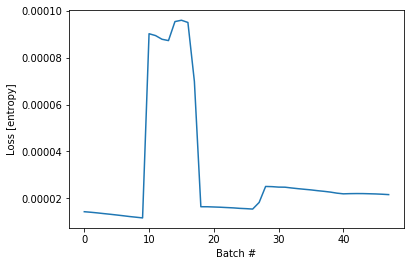
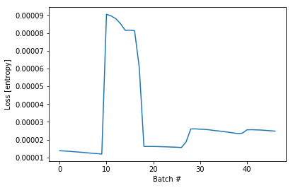
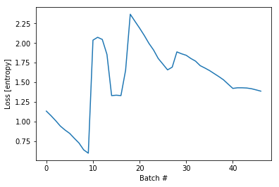
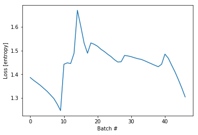

```python
# boiler plate
from collections import Counter
import pickle
from importlib import reload
import tensorflow as tf
import numpy as np
import matplotlib.pyplot as plt
import ipdb
import mytf.utils as mu

tf.enable_eager_execution()

print(tf.executing_eagerly())

```

    True


```python
with open('models/2019-05-19T001217-UTC-outdata--SUBSET.pkl', 'rb') as fd:
    minidata = pickle.load(fd)
```


```python
minidata.keys()
```


    dict_keys(['x_train', 'x_test', 'y_train', 'y_test', 'y_train_original', 'y_test_original'])


```python
# Trying this time to use a different input shape,
# this time batch_input_shape=(None, 256, 1)
# as opposed to input_shape=(None, 1)
#
# That's because each sequence has size of 256. 
# Still not sure if this is the correct way to do it.

model = tf.keras.Sequential([
    tf.keras.layers.LSTM(64,   dropout=0.2, recurrent_dropout=0.2,
                batch_input_shape=(None, 256, 1), 
              ),
    # 4 because 'A', 'B', 'C', 'D'.
    tf.keras.layers.Dense(4)
])


# ValueError: Input 0 of layer lstm is incompatible with the layer: 
# expected ndim=3, found ndim=4. Full shape received: [None, None, 256, 1]

# when i tried this i got this error 
# stateful=True , with batch_input_shape=(None, 256, 1)
# ValueError: If a RNN is stateful, it needs to know its batch size. Specify the batch size of your input tensors: 
# - If using a Sequential model, specify the batch size by passing a `batch_input_shape` argument to your first layer.
# - If using the functional API, specify the batch size by passing a `batch_shape` argument to your Input layer.
```

    WARNING:tensorflow:From /usr/local/miniconda3/envs/pandars3/lib/python3.7/site-packages/tensorflow/python/keras/backend.py:4010: calling dropout (from tensorflow.python.ops.nn_ops) with keep_prob is deprecated and will be removed in a future version.
    Instructions for updating:
    Please use `rate` instead of `keep_prob`. Rate should be set to `rate = 1 - keep_prob`.


```python
minidata['x_train'].shape
```


    (47689, 256, 1)


```python
# okay since this is minidataset... use all of it..
#Hand-tuned ... 
class_weights = {0: 0.1, 1: 0.5, 2: 0.1, 3: 0.3}

# everything basically..
training_indices = np.arange(0, minidata['x_train'].shape[0], 1)

%time dataset_batches = mu.build_dataset_weighty(  \
    minidata, training_indices, class_weights, \
        batch_size=1000)
```

    Counter({3: 20000, 0: 10000, 2: 10000, 1: 7689})
    weights_per_class,  tf.Tensor([9.99999975e-06 6.50279617e-05 9.99999975e-06 1.50000005e-05], shape=(4,), dtype=float32)
    tf.Tensor(1.0005401, shape=(), dtype=float32)
    CPU times: user 7.82 s, sys: 568 ms, total: 8.39 s
    Wall time: 8.93 s


```python
%time loss_history = mu.do_train(model, dataset_batches)
```

    WARNING:tensorflow:From /usr/local/miniconda3/envs/pandars3/lib/python3.7/site-packages/tensorflow/python/ops/losses/losses_impl.py:209: to_float (from tensorflow.python.ops.math_ops) is deprecated and will be removed in a future version.
    Instructions for updating:
    Use tf.cast instead.
    CPU times: user 5min 28s, sys: 2min 10s, total: 7min 38s
    Wall time: 4min 55s


```python
# ... 
plt.plot(loss_history)
plt.xlabel('Batch #')
plt.ylabel('Loss [entropy]')
```


    Text(0, 0.5, 'Loss [entropy]')





```python
# The loss curve still looks way too low . So again most likely there will be
# underfitting.

# predict from training set first..
# some random from here..

print(minidata['x_train'].shape)
train_subset = np.random.choice(np.arange(0, minidata['x_train'].shape[0], 1),
                               10000, replace=False)
print('subset, ', len(train_subset))
%time y_pred_train = model(tf.convert_to_tensor(minidata['x_train'][train_subset], dtype=tf.float32))

```

    (47689, 256, 1)
    subset,  10000
    CPU times: user 27.9 s, sys: 8.66 s, total: 36.6 s
    Wall time: 10.2 s


```python
# First make sure this random training subset covers all four classes.
Counter(np.argmax(minidata['y_train'][train_subset, :], axis=1))
# 
```


    Counter({3: 4217, 0: 2160, 1: 1546, 2: 2077})


```python
# confusion... 
tf.confusion_matrix(
    np.argmax(minidata['y_train'][train_subset, :], axis=1),  # labels

    np.argmax(y_pred_train, axis=1), # predictions
    num_classes=4)
```

    WARNING:tensorflow:From /usr/local/miniconda3/envs/pandars3/lib/python3.7/site-packages/tensorflow/python/ops/confusion_matrix.py:193: to_int64 (from tensorflow.python.ops.math_ops) is deprecated and will be removed in a future version.
    Instructions for updating:
    Use tf.cast instead.
    WARNING:tensorflow:From /usr/local/miniconda3/envs/pandars3/lib/python3.7/site-packages/tensorflow/python/ops/confusion_matrix.py:194: to_int32 (from tensorflow.python.ops.math_ops) is deprecated and will be removed in a future version.
    Instructions for updating:
    Use tf.cast instead.


    <tf.Tensor: id=4438602, shape=(4, 4), dtype=int32, numpy=
    array([[2160,    0,    0,    0],
           [ 785,  761,    0,    0],
           [2077,    0,    0,    0],
           [2526, 1691,    0,    0]], dtype=int32)>


```python
# Indeed, I have a feeling something is still terribly wrong. Anyway memory performance
# using just that small subset was at least way more tolerable.
#
# Prediction is taking seconds and not minutes.
```


```python
#hmm try to specify the batch size... since i know it...

model = tf.keras.Sequential([
    tf.keras.layers.LSTM(64,   dropout=0.2, recurrent_dropout=0.2,
                batch_input_shape=(1000, 256, 1), 
                         stateful=True
              ),
    # 4 because 'A', 'B', 'C', 'D'.
    tf.keras.layers.Dense(4)
])
```


```python
# Ah darn first time I tried to train, i got this error...
#  
# InvalidArgumentError: Incompatible shapes: [689,64] vs. [1000,64] 
# [Op:Add] name: sequential_5/lstm_5/lstm_5/add/
#
# , because the last batch is not a 1000 batch size. 

# Got to clip the last 689 elements I guess.


%time loss_history = mu.do_train(model, dataset_batches)
```


    ---------------------------------------------------------------------------

    InvalidArgumentError                      Traceback (most recent call last)

    <timed exec> in <module>


    ~/LeDropbox/Dropbox/Code/Kaggle/reducing-commercial-aviation-fatalities/mytf/utils.py in do_train(model, dataset_batches)
        156 
        157         with tf.GradientTape() as tape:
    --> 158             logits = model(invec, training=True)
        159             loss_value = tf.losses.sparse_softmax_cross_entropy(labels, logits, weights=weights)
        160 


    /usr/local/miniconda3/envs/pandars3/lib/python3.7/site-packages/tensorflow/python/keras/engine/base_layer.py in __call__(self, inputs, *args, **kwargs)
        590       else:
        591         # Eager execution on data tensors.
    --> 592         outputs = self.call(inputs, *args, **kwargs)
        593         self._handle_activity_regularization(inputs, outputs)
        594         return outputs


    /usr/local/miniconda3/envs/pandars3/lib/python3.7/site-packages/tensorflow/python/keras/engine/sequential.py in call(self, inputs, training, mask)
        228   def call(self, inputs, training=None, mask=None):
        229     if self._is_graph_network:
    --> 230       return super(Sequential, self).call(inputs, training=training, mask=mask)
        231 
        232     outputs, _ = self._call_and_compute_mask(


    /usr/local/miniconda3/envs/pandars3/lib/python3.7/site-packages/tensorflow/python/keras/engine/network.py in call(self, inputs, training, mask)
        813     outputs, _ = self._run_internal_graph(inputs,
        814                                           training=training,
    --> 815                                           mask=masks)
        816     return outputs
        817 


    /usr/local/miniconda3/envs/pandars3/lib/python3.7/site-packages/tensorflow/python/keras/engine/network.py in _run_internal_graph(self, inputs, training, mask)
        998               else:
        999                 if context.executing_eagerly():
    -> 1000                   output_tensors = layer(computed_tensor, **kwargs)
       1001                 else:
       1002                   output_tensors = layer.call(computed_tensor, **kwargs)


    /usr/local/miniconda3/envs/pandars3/lib/python3.7/site-packages/tensorflow/python/keras/layers/recurrent.py in __call__(self, inputs, initial_state, constants, **kwargs)
        699 
        700     if initial_state is None and constants is None:
    --> 701       return super(RNN, self).__call__(inputs, **kwargs)
        702 
        703     # If any of `initial_state` or `constants` are specified and are Keras


    /usr/local/miniconda3/envs/pandars3/lib/python3.7/site-packages/tensorflow/python/keras/engine/base_layer.py in __call__(self, inputs, *args, **kwargs)
        590       else:
        591         # Eager execution on data tensors.
    --> 592         outputs = self.call(inputs, *args, **kwargs)
        593         self._handle_activity_regularization(inputs, outputs)
        594         return outputs


    /usr/local/miniconda3/envs/pandars3/lib/python3.7/site-packages/tensorflow/python/keras/layers/recurrent.py in call(self, inputs, mask, training, initial_state)
       2414     self.cell._recurrent_dropout_mask = None
       2415     return super(LSTM, self).call(
    -> 2416         inputs, mask=mask, training=training, initial_state=initial_state)
       2417 
       2418   @property


    /usr/local/miniconda3/envs/pandars3/lib/python3.7/site-packages/tensorflow/python/keras/layers/recurrent.py in call(self, inputs, mask, training, initial_state, constants)
        820         input_length=timesteps,
        821         time_major=self.time_major,
    --> 822         zero_output_for_mask=self.zero_output_for_mask)
        823     if self.stateful:
        824       updates = []


    /usr/local/miniconda3/envs/pandars3/lib/python3.7/site-packages/tensorflow/python/keras/backend.py in rnn(step_function, inputs, initial_states, go_backwards, mask, constants, unroll, input_length, time_major, zero_output_for_mask)
       3451     # the value is discarded.
       3452     output_time_zero, _ = step_function(input_time_zero,
    -> 3453                                         initial_states + constants)
       3454     output_ta = tuple(
       3455         tensor_array_ops.TensorArray(


    /usr/local/miniconda3/envs/pandars3/lib/python3.7/site-packages/tensorflow/python/keras/layers/recurrent.py in step(inputs, states)
        805       def step(inputs, states):
        806         states = states[0] if len(states) == 1 and is_tf_rnn_cell else states
    --> 807         output, new_states = self.cell.call(inputs, states, **kwargs)
        808         if not nest.is_sequence(new_states):
        809           new_states = [new_states]


    /usr/local/miniconda3/envs/pandars3/lib/python3.7/site-packages/tensorflow/python/keras/layers/recurrent.py in call(self, inputs, states, training)
       2128       x = (x_i, x_f, x_c, x_o)
       2129       h_tm1 = (h_tm1_i, h_tm1_f, h_tm1_c, h_tm1_o)
    -> 2130       c, o = self._compute_carry_and_output(x, h_tm1, c_tm1)
       2131     else:
       2132       if 0. < self.dropout < 1.:


    /usr/local/miniconda3/envs/pandars3/lib/python3.7/site-packages/tensorflow/python/keras/layers/recurrent.py in _compute_carry_and_output(self, x, h_tm1, c_tm1)
       2054     h_tm1_i, h_tm1_f, h_tm1_c, h_tm1_o = h_tm1
       2055     i = self.recurrent_activation(
    -> 2056         x_i + K.dot(h_tm1_i, self.recurrent_kernel[:, :self.units]))
       2057     f = self.recurrent_activation(x_f + K.dot(
       2058         h_tm1_f, self.recurrent_kernel[:, self.units:self.units * 2]))


    /usr/local/miniconda3/envs/pandars3/lib/python3.7/site-packages/tensorflow/python/ops/math_ops.py in binary_op_wrapper(x, y)
        810     with ops.name_scope(None, op_name, [x, y]) as name:
        811       if isinstance(x, ops.Tensor) and isinstance(y, ops.Tensor):
    --> 812         return func(x, y, name=name)
        813       elif not isinstance(y, sparse_tensor.SparseTensor):
        814         try:


    /usr/local/miniconda3/envs/pandars3/lib/python3.7/site-packages/tensorflow/python/ops/gen_math_ops.py in add(x, y, name)
        359       else:
        360         message = e.message
    --> 361       _six.raise_from(_core._status_to_exception(e.code, message), None)
        362   # Add nodes to the TensorFlow graph.
        363   try:


    /usr/local/miniconda3/envs/pandars3/lib/python3.7/site-packages/six.py in raise_from(value, from_value)


    InvalidArgumentError: Incompatible shapes: [689,64] vs. [1000,64] [Op:Add] name: sequential_5/lstm_5/lstm_5/add/


```python
len(training_indices)
```


    47689


```python
class_weights = {0: 0.1, 1: 0.5, 2: 0.1, 3: 0.3}

# Try again but keep each batch 1000.
training_indices = np.arange(0, minidata['x_train'].shape[0], 1)[:47000]
print('training indices...', training_indices.shape)

%time dataset_batches = mu.build_dataset_weighty(  \
    minidata, training_indices, class_weights, \
        batch_size=1000)

```

    training indices... (47000,)
    Counter({3: 19311, 0: 10000, 2: 10000, 1: 7689})
    weights_per_class,  tf.Tensor([9.9999997e-06 6.5027962e-05 9.9999997e-06 1.5535188e-05], shape=(4,), dtype=float32)
    tf.Tensor(1.0005482, shape=(), dtype=float32)
    CPU times: user 7.74 s, sys: 1.5 s, total: 9.25 s
    Wall time: 12.1 s


```python
# Okay try stateful train take #2... 
%time loss_history = mu.do_train(model, dataset_batches)

```

    CPU times: user 5min 53s, sys: 3min 17s, total: 9min 10s
    Wall time: 5min 51s


```python
# ... 
plt.plot(loss_history)
plt.xlabel('Batch #')
plt.ylabel('Loss [entropy]')
```


    Text(0, 0.5, 'Loss [entropy]')





```python
# okay well the losses are still incredibly low. Actually 10x lower for some reason.

# Also looks like prediction also needs to be with 1000 size here as well...
# Since getting similar exception...
# InvalidArgumentError: Incompatible shapes: [10000,64] vs. [1000,64]
# [Op:Add] name: sequential_5/lstm_5/lstm_5/add/
train_subset_1 = train_subset[:1000]
%time y_pred_train = model(tf.convert_to_tensor(minidata['x_train'][train_subset_1], dtype=tf.float32))

```

    CPU times: user 2.07 s, sys: 564 ms, total: 2.63 s
    Wall time: 1.8 s


```python
# confusion... 
tf.confusion_matrix(
    np.argmax(minidata['y_train'][train_subset_1, :], axis=1),  # labels

    np.argmax(y_pred_train[:1000], axis=1), # predictions
    num_classes=4)
```


    <tf.Tensor: id=12727896, shape=(4, 4), dtype=int32, numpy=
    array([[201,   0,   0,   0],
           [ 84,  83,   0,   0],
           [218,   0,   0,   0],
           [249, 165,   0,   0]], dtype=int32)>


```python
# Dang. So yea something still not right... need to keep looking.
```


```python
# Now that I've got a different input shape, try w/o weights now.

# Each batch  1000.
training_indices = np.arange(0, minidata['x_train'].shape[0], 1)[:47000]
print('training indices...', training_indices.shape)

dataset_batches = mu.build_dataset(minidata, training_indices, batch_size=1000)

```

    training indices... (47000,)


```python
model = tf.keras.Sequential([
    tf.keras.layers.LSTM(64,   dropout=0.2, recurrent_dropout=0.2,
                batch_input_shape=(1000, 256, 1), 
                         stateful=True
              ),
    # 4 because 'A', 'B', 'C', 'D'.
    tf.keras.layers.Dense(4)
])
```


```python
%time loss_history = mu.do_train_noweights(model, dataset_batches)

```

    CPU times: user 5min 41s, sys: 2min 32s, total: 8min 13s
    Wall time: 5min 15s


```python
# ... 
plt.plot(loss_history)
plt.xlabel('Batch #')
plt.ylabel('Loss [entropy]')
```


    Text(0, 0.5, 'Loss [entropy]')





```python
# umm okay so at least, after removing the crazy weights, we indeed know that
# the loss was so dang low because the weights were so extreme...

```


```python
train_subset_1 = train_subset[:1000]
%time y_pred_train = model(tf.convert_to_tensor(minidata['x_train'][train_subset_1], dtype=tf.float32))

```

    CPU times: user 2.11 s, sys: 681 ms, total: 2.79 s
    Wall time: 2.25 s


```python
# confusion... grr.. damn still quite crappy.
tf.confusion_matrix(
    np.argmax(minidata['y_train'][train_subset_1, :], axis=1),  # labels

    np.argmax(y_pred_train[:1000], axis=1), # predictions
    num_classes=4).numpy()
```


    array([[201,   0,   0,   0],
           [ 84,  83,   0,   0],
           [218,   0,   0,   0],
           [249, 165,   0,   0]], dtype=int32)


```python
# Going to compute confusion matrix across all the 1000-large train data
minidata['x_train'].shape
```


    (47689, 256, 1)


```python
%%time
confusion_vec = []

for i in range(47):
    this_slice = (1000*i, 1000*(i+1))
    y_pred_train = model(tf.convert_to_tensor(
            minidata['x_train'][this_slice[0]:this_slice[1]],
            dtype=tf.float32))
    assert y_pred_train.shape[0] == 1000
    
    confusion_vec.append(
        tf.confusion_matrix(
        np.argmax(minidata['y_train'][this_slice[0]:this_slice[1], :], axis=1),  # labels

        np.argmax(y_pred_train, axis=1), # predictions
        num_classes=4).numpy())
    

```

    CPU times: user 1min 36s, sys: 12.6 s, total: 1min 49s
    Wall time: 1min 15s


```python
np.sum(confusion_vec, axis=0)
```


    array([[10000,     0,     0,     0],
           [ 3837,  3852,     0,     0],
           [10000,     0,     0,     0],
           [12073,  7238,     0,     0]])


```python
# Okay indeed still quite asymmetric. I expected the asymmetry since now there are no
# weights, but this is on the other extreme indeed.
```


```python
# Quick thought on whether i should scale the data perhaps..
minidata['x_train'][0,:2,:]
```


    array([[-0.9586470767805308],
           [-0.9586470767805308]], dtype=object)


```python
 
minidata['x_train'].shape # [0,:,:]
```


    (47689, 256, 1)


```python
llist = np.reshape(minidata['x_train'], newshape=(47689*256,))
print('min, ', min(llist), 'max, ', max(llist))
```

    min,  -1.1162120493020151 max,  1.036747306158156


```python
llist.shape
```


    (12208384,)


```python
from sklearn.preprocessing import MinMaxScaler

```


```python
llist2 = np.reshape(minidata['x_train'], newshape=(47689*256,1))
```


```python
llist2[:2]
```


    array([[-0.9586470767805308],
           [-0.9586470767805308]], dtype=object)


```python
# Going to see if this makes any difference...

scaler = MinMaxScaler(feature_range=(0, 1))
scaled_data = scaler.fit_transform(llist2)
print('min, ', min(scaled_data), 'max, ', max(scaled_data))
```

    /usr/local/miniconda3/envs/pandars3/lib/python3.7/site-packages/sklearn/utils/validation.py:595: DataConversionWarning: Data with input dtype object was converted to float64 by MinMaxScaler.
      warnings.warn(msg, DataConversionWarning)


    min,  [0.] max,  [1.]


```python
# reshape it...
newminidata = {'x_train': np.reshape(scaled_data, newshape=(47689,256,1)),
              'y_train': minidata['y_train']}
```


```python
newminidata['x_test'] = mu.scale_this_thing(minidata['x_test'], scaler)
```


```python
newminidata['y_test'] = minidata['y_test']
```


```python
# okay... now try use that ..
model = tf.keras.Sequential([
    tf.keras.layers.LSTM(64,   dropout=0.2, recurrent_dropout=0.2,
                batch_input_shape=(1000, 256, 1), 
                         stateful=True
              ),
    # 4 because 'A', 'B', 'C', 'D'.
    tf.keras.layers.Dense(4)
])
```


```python
training_indices = np.arange(0, newminidata['x_train'].shape[0], 1)[:47000]
print('training indices...', training_indices.shape)

dataset_batches = mu.build_dataset(newminidata, training_indices, batch_size=1000)

```

    training indices... (47000,)


```python
%time loss_history = mu.do_train_noweights(model, dataset_batches)

```

    CPU times: user 6min 5s, sys: 3min 38s, total: 9min 44s
    Wall time: 6min 10s


```python
# ... 
plt.plot(loss_history)
plt.xlabel('Batch #')
plt.ylabel('Loss [entropy]')
```


    Text(0, 0.5, 'Loss [entropy]')





```python
# hmm this does look a bit different.
```


```python
%%time
confusion_vec = []

for i in range(47):
    this_slice = (1000*i, 1000*(i+1))
    y_pred_train = model(tf.convert_to_tensor(
            newminidata['x_train'][this_slice[0]:this_slice[1]],
            dtype=tf.float32))
    assert y_pred_train.shape[0] == 1000
    
    confusion_vec.append(
        tf.confusion_matrix(
        np.argmax(newminidata['y_train'][this_slice[0]:this_slice[1], :], axis=1),  # labels

        np.argmax(y_pred_train, axis=1), # predictions
        num_classes=4).numpy())
    

```

    CPU times: user 1min 36s, sys: 11.9 s, total: 1min 48s
    Wall time: 1min 14s


```python
# full... confusion now ...
np.sum(confusion_vec, axis=0)
```


    array([[    0,     0,     0, 10000],
           [    0,     0,     0,  7689],
           [    0,     0,     0, 10000],
           [    0,     0,     0, 19311]])


```python
# What the heck? Ummm.. So weird.
```
