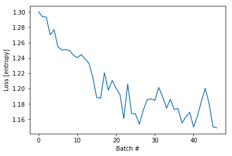

```python
# boiler plate
from collections import Counter
import pickle
from importlib import reload
import tensorflow as tf
import numpy as np
import matplotlib.pyplot as plt

from sklearn.preprocessing import MinMaxScaler


import ipdb
import mytf.utils as mu

tf.enable_eager_execution()

print(tf.executing_eagerly())


```

    True


```python
with open('models/2019-05-19T001217-UTC-outdata--SUBSET.pkl', 'rb') as fd:
    minidata = pickle.load(fd)
    
```


```python
reload(mu)
#Hand-tuned ... 
# Previous weights:
# class_weights = {0: 1.0, 1: 1.3, 2: 1.0, 3: 0.55}

# New weights:
class_weights = {0: 1.0, 1: 1.3, 2: 1.0, 3: 0.75}
training_indices = np.arange(0, minidata['x_train'].shape[0], 1)[:47000]
print('training indices...', training_indices.shape)

dataset_batches = mu.build_dataset_weighty_v3(minidata, training_indices, class_weights,
        batch_size=1000)

```

    training indices... (47000,)
    Start build v3: .. doesnt add up to 1.0
    num slices 47
    size_remainder,  0
    Counter({3: 408, 2: 249, 0: 205, 1: 138})
    weights_per_class,  tf.Tensor([0.00487805 0.00942029 0.00401606 0.00183824], shape=(4,), dtype=float32)
    939.3999999999974
    Counter({3: 418, 2: 217, 0: 211, 1: 154})
    weights_per_class,  tf.Tensor([0.00473934 0.00844156 0.00460829 0.00179426], shape=(4,), dtype=float32)
    941.6999999999975
    Counter({3: 409, 0: 218, 2: 214, 1: 159})
    weights_per_class,  tf.Tensor([0.00458716 0.0081761  0.0046729  0.00183374], shape=(4,), dtype=float32)
    945.4499999999972
    Counter({3: 422, 2: 224, 0: 212, 1: 142})
    weights_per_class,  tf.Tensor([0.00471698 0.00915493 0.00446429 0.00177725], shape=(4,), dtype=float32)
    937.0999999999974
    Counter({3: 419, 0: 205, 2: 197, 1: 179})
    weights_per_class,  tf.Tensor([0.00487805 0.00726257 0.00507614 0.00178998], shape=(4,), dtype=float32)
    948.9499999999971
    Counter({3: 439, 0: 225, 2: 179, 1: 157})
    weights_per_class,  tf.Tensor([0.00444444 0.00828025 0.00558659 0.00170843], shape=(4,), dtype=float32)
    937.3499999999976
    Counter({3: 454, 0: 207, 2: 184, 1: 155})
    weights_per_class,  tf.Tensor([0.00483092 0.0083871  0.00543478 0.00165198], shape=(4,), dtype=float32)
    932.9999999999977
    Counter({3: 422, 2: 215, 0: 209, 1: 154})
    weights_per_class,  tf.Tensor([0.00478469 0.00844156 0.00465116 0.00177725], shape=(4,), dtype=float32)
    940.6999999999974
    Counter({3: 400, 0: 221, 2: 207, 1: 172})
    weights_per_class,  tf.Tensor([0.00452489 0.00755814 0.00483092 0.001875  ], shape=(4,), dtype=float32)
    951.5999999999974
    Counter({3: 425, 2: 207, 0: 200, 1: 168})
    weights_per_class,  tf.Tensor([0.005      0.00773809 0.00483092 0.00176471], shape=(4,), dtype=float32)
    944.1499999999972
    Counter({3: 403, 0: 225, 2: 211, 1: 161})
    weights_per_class,  tf.Tensor([0.00444444 0.00807453 0.00473934 0.00186104], shape=(4,), dtype=float32)
    947.5499999999972
    Counter({3: 413, 2: 227, 1: 182, 0: 178})
    weights_per_class,  tf.Tensor([0.00561798 0.00714286 0.00440529 0.00181598], shape=(4,), dtype=float32)
    951.3499999999967
    Counter({3: 407, 0: 213, 1: 194, 2: 186})
    weights_per_class,  tf.Tensor([0.00469484 0.00670103 0.00537634 0.00184275], shape=(4,), dtype=float32)
    956.4499999999966
    Counter({3: 412, 2: 217, 0: 207, 1: 164})
    weights_per_class,  tf.Tensor([0.00483092 0.00792683 0.00460829 0.00182039], shape=(4,), dtype=float32)
    946.1999999999977
    Counter({3: 423, 0: 221, 2: 200, 1: 156})
    weights_per_class,  tf.Tensor([0.00452489 0.00833333 0.005      0.00177305], shape=(4,), dtype=float32)
    941.0499999999976
    Counter({3: 425, 0: 219, 2: 218, 1: 138})
    weights_per_class,  tf.Tensor([0.00456621 0.00942029 0.00458716 0.00176471], shape=(4,), dtype=float32)
    935.1499999999976
    Counter({3: 421, 0: 222, 2: 209, 1: 148})
    weights_per_class,  tf.Tensor([0.0045045  0.00878378 0.00478469 0.00178147], shape=(4,), dtype=float32)
    939.1499999999975
    Counter({3: 396, 2: 231, 0: 211, 1: 162})
    weights_per_class,  tf.Tensor([0.00473934 0.00802469 0.004329   0.00189394], shape=(4,), dtype=float32)
    949.5999999999971
    Counter({3: 421, 2: 215, 0: 211, 1: 153})
    weights_per_class,  tf.Tensor([0.00473934 0.00849673 0.00465116 0.00178147], shape=(4,), dtype=float32)
    940.6499999999976
    Counter({3: 409, 0: 227, 2: 198, 1: 166})
    weights_per_class,  tf.Tensor([0.00440529 0.00783132 0.00505051 0.00183374], shape=(4,), dtype=float32)
    947.5499999999968
    Counter({3: 418, 2: 215, 0: 206, 1: 161})
    weights_per_class,  tf.Tensor([0.00485437 0.00807453 0.00465116 0.00179426], shape=(4,), dtype=float32)
    943.7999999999972
    Counter({3: 423, 2: 207, 0: 201, 1: 169})
    weights_per_class,  tf.Tensor([0.00497512 0.00769231 0.00483092 0.00177305], shape=(4,), dtype=float32)
    944.9499999999971
    Counter({3: 426, 0: 205, 2: 203, 1: 166})
    weights_per_class,  tf.Tensor([0.00487805 0.00783132 0.00492611 0.00176056], shape=(4,), dtype=float32)
    943.2999999999973
    Counter({3: 402, 2: 215, 0: 212, 1: 171})
    weights_per_class,  tf.Tensor([0.00471698 0.00760234 0.00465116 0.00186567], shape=(4,), dtype=float32)
    950.7999999999976
    Counter({3: 419, 2: 223, 0: 205, 1: 153})
    weights_per_class,  tf.Tensor([0.00487805 0.00849673 0.00448431 0.00178998], shape=(4,), dtype=float32)
    941.1499999999978
    Counter({3: 431, 2: 214, 0: 209, 1: 146})
    weights_per_class,  tf.Tensor([0.00478469 0.00890411 0.0046729  0.00174014], shape=(4,), dtype=float32)
    936.0499999999979
    Counter({3: 420, 0: 235, 2: 194, 1: 151})
    weights_per_class,  tf.Tensor([0.00425532 0.00860927 0.00515464 0.00178571], shape=(4,), dtype=float32)
    940.2999999999975
    Counter({3: 417, 2: 201, 0: 192, 1: 190})
    weights_per_class,  tf.Tensor([0.00520833 0.00684211 0.00497512 0.00179856], shape=(4,), dtype=float32)
    952.7499999999965
    Counter({3: 401, 0: 216, 2: 210, 1: 173})
    weights_per_class,  tf.Tensor([0.00462963 0.00751445 0.0047619  0.00187032], shape=(4,), dtype=float32)
    951.6499999999969
    Counter({3: 398, 0: 227, 2: 205, 1: 170})
    weights_per_class,  tf.Tensor([0.00440529 0.00764706 0.00487805 0.00188442], shape=(4,), dtype=float32)
    951.4999999999975
    Counter({3: 390, 0: 242, 2: 223, 1: 145})
    weights_per_class,  tf.Tensor([0.00413223 0.00896552 0.00448431 0.00192308], shape=(4,), dtype=float32)
    945.9999999999975
    Counter({3: 367, 0: 240, 2: 237, 1: 156})
    weights_per_class,  tf.Tensor([0.00416667 0.00833333 0.00421941 0.0020436 ], shape=(4,), dtype=float32)
    955.049999999997
    Counter({3: 391, 2: 240, 0: 206, 1: 163})
    weights_per_class,  tf.Tensor([0.00485437 0.00797546 0.00416667 0.00191816], shape=(4,), dtype=float32)
    951.149999999997
    Counter({3: 401, 2: 238, 0: 191, 1: 170})
    weights_per_class,  tf.Tensor([0.0052356  0.00764706 0.00420168 0.00187032], shape=(4,), dtype=float32)
    950.7499999999973
    Counter({3: 387, 0: 220, 2: 215, 1: 178})
    weights_per_class,  tf.Tensor([0.00454545 0.00730337 0.00465116 0.00193798], shape=(4,), dtype=float32)
    956.6499999999969
    Counter({3: 402, 2: 223, 0: 209, 1: 166})
    weights_per_class,  tf.Tensor([0.00478469 0.00783132 0.00448431 0.00186567], shape=(4,), dtype=float32)
    949.2999999999976
    Counter({3: 386, 2: 237, 0: 211, 1: 166})
    weights_per_class,  tf.Tensor([0.00473934 0.00783132 0.00421941 0.00194301], shape=(4,), dtype=float32)
    953.299999999997
    Counter({3: 411, 0: 216, 1: 196, 2: 177})
    weights_per_class,  tf.Tensor([0.00462963 0.00663265 0.00564972 0.00182482], shape=(4,), dtype=float32)
    956.0499999999964
    Counter({3: 422, 2: 232, 0: 207, 1: 139})
    weights_per_class,  tf.Tensor([0.00483092 0.00935252 0.00431034 0.00177725], shape=(4,), dtype=float32)
    936.199999999998
    Counter({3: 421, 2: 213, 0: 203, 1: 163})
    weights_per_class,  tf.Tensor([0.00492611 0.00797546 0.00469484 0.00178147], shape=(4,), dtype=float32)
    943.6499999999974
    Counter({3: 405, 2: 225, 0: 211, 1: 159})
    weights_per_class,  tf.Tensor([0.00473934 0.0081761  0.00444444 0.00185185], shape=(4,), dtype=float32)
    946.4499999999973
    Counter({3: 418, 0: 216, 2: 188, 1: 178})
    weights_per_class,  tf.Tensor([0.00462963 0.00730337 0.00531915 0.00179426], shape=(4,), dtype=float32)
    948.8999999999966
    Counter({3: 399, 2: 221, 0: 207, 1: 173})
    weights_per_class,  tf.Tensor([0.00483092 0.00751445 0.00452489 0.0018797 ], shape=(4,), dtype=float32)
    952.1499999999974
    Counter({3: 381, 0: 233, 2: 202, 1: 184})
    weights_per_class,  tf.Tensor([0.00429185 0.00706522 0.00495049 0.0019685 ], shape=(4,), dtype=float32)
    959.9499999999969
    Counter({3: 385, 0: 234, 2: 211, 1: 170})
    weights_per_class,  tf.Tensor([0.0042735  0.00764706 0.00473934 0.00194805], shape=(4,), dtype=float32)
    954.7499999999975
    Counter({3: 405, 2: 222, 0: 207, 1: 166})
    weights_per_class,  tf.Tensor([0.00483092 0.00783132 0.0045045  0.00185185], shape=(4,), dtype=float32)
    948.5499999999975
    Counter({3: 439, 2: 204, 0: 192, 1: 165})
    weights_per_class,  tf.Tensor([0.00520833 0.00787879 0.00490196 0.00170843], shape=(4,), dtype=float32)
    939.7499999999975


```python
# okay... now try use that ..
model = tf.keras.Sequential([
    tf.keras.layers.LSTM(64,   dropout=0.2, recurrent_dropout=0.2,
                batch_input_shape=(None, 256, 1), 
              ),
    # 4 because 'A', 'B', 'C', 'D'.
    tf.keras.layers.Dense(4)
])

%time loss_history = mu.do_train(model, dataset_batches)

```

    WARNING:tensorflow:From /usr/local/miniconda3/envs/pandars3/lib/python3.7/site-packages/tensorflow/python/ops/tensor_array_ops.py:162: colocate_with (from tensorflow.python.framework.ops) is deprecated and will be removed in a future version.
    Instructions for updating:
    Colocations handled automatically by placer.
    WARNING:tensorflow:From /usr/local/miniconda3/envs/pandars3/lib/python3.7/site-packages/tensorflow/python/keras/backend.py:4010: calling dropout (from tensorflow.python.ops.nn_ops) with keep_prob is deprecated and will be removed in a future version.
    Instructions for updating:
    Please use `rate` instead of `keep_prob`. Rate should be set to `rate = 1 - keep_prob`.
    WARNING:tensorflow:From /usr/local/miniconda3/envs/pandars3/lib/python3.7/site-packages/tensorflow/python/ops/losses/losses_impl.py:209: to_float (from tensorflow.python.ops.math_ops) is deprecated and will be removed in a future version.
    Instructions for updating:
    Use tf.cast instead.
    CPU times: user 5min 40s, sys: 3min 6s, total: 8min 46s
    Wall time: 5min 35s


```python
# Loss still pretty small. but Since this is the first time I shuffled, 
# the loss history looks really much more interesting.
plt.plot(loss_history)
plt.xlabel('Batch #')
plt.ylabel('Loss [entropy]')

print(minidata['x_train'].shape)
train_subset = np.random.choice(np.arange(0, minidata['x_train'].shape[0], 1),
                               10000, replace=False)
print('subset, ', len(train_subset))

# First make sure this random training subset covers all four classes.
print('train subset classes,', Counter(np.argmax(minidata['y_train'][train_subset, :], axis=1)))

%time y_pred_train = model(tf.convert_to_tensor(minidata['x_train'][train_subset], dtype=tf.float32))

# confusion... 
tf.confusion_matrix(
    np.argmax(minidata['y_train'][train_subset, :], axis=1),  # labels

    np.argmax(y_pred_train, axis=1), # predictions
    num_classes=4)


```

    (47689, 256, 1)
    subset,  10000
    train subset classes, Counter({3: 4286, 0: 2137, 2: 2029, 1: 1548})
    CPU times: user 28.5 s, sys: 8.53 s, total: 37 s
    Wall time: 10.1 s
    WARNING:tensorflow:From /usr/local/miniconda3/envs/pandars3/lib/python3.7/site-packages/tensorflow/python/ops/confusion_matrix.py:193: to_int64 (from tensorflow.python.ops.math_ops) is deprecated and will be removed in a future version.
    Instructions for updating:
    Use tf.cast instead.
    WARNING:tensorflow:From /usr/local/miniconda3/envs/pandars3/lib/python3.7/site-packages/tensorflow/python/ops/confusion_matrix.py:194: to_int32 (from tensorflow.python.ops.math_ops) is deprecated and will be removed in a future version.
    Instructions for updating:
    Use tf.cast instead.


    <tf.Tensor: id=3973101, shape=(4, 4), dtype=int32, numpy=
    array([[2131,    0,    6,    0],
           [ 761,  787,    0,    0],
           [2029,    0,    0,    0],
           [2544, 1717,   25,    0]], dtype=int32)>





```python
# Wow that is so volatile. Here I brought down the class=3 weight again ever so slightly.
# And again now we flip back to class=1. 
#
# At this point I can only assume that the one 'respiration' feature I have is not
# good enough to help distinguish between class=1 and class=3 properly. 
# So have to add more of the data...
```


```python
# Quick Look at how crisp the outputs are .
# And actually hmm wow that looks pretty nice and crisp.


bins = np.linspace(-2.5, 3.5, 100)
plt.hist(y_pred_train[:, 0], bins, alpha=0.5, label='0')
plt.hist(y_pred_train[:, 1], bins, alpha=0.5, label='1')
plt.hist(y_pred_train[:, 2], bins, alpha=0.5, label='2')
plt.hist(y_pred_train[:, 3], bins, alpha=0.5, label='3')
plt.legend(loc='upper right')
plt.show()

```


