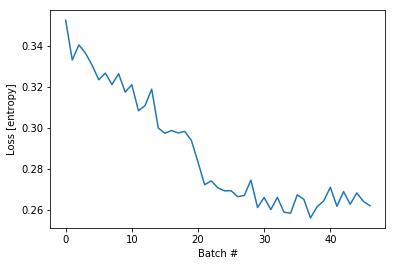

```python
# boiler plate
from collections import Counter
import pickle
from importlib import reload
import tensorflow as tf
import numpy as np
import matplotlib.pyplot as plt

from sklearn.preprocessing import MinMaxScaler


import ipdb
import mytf.utils as mu

tf.enable_eager_execution()

print(tf.executing_eagerly())


```

    True


```python
# Last trial in book 2019-07-07, I changed over to 
# "build_dataset_weighty_v2"  , which had two major changes, 
# (a) I shuffled the 47,000 training examples . So for the 47 batches, each was mixed.
# (b) the weights tensor, shape (47000,1), now added up to 1.0 for each 1000-element batch.

# But the result still looked like the losses in the loss history plot were very small. 
# So this time, I am trying something new and I am not scaling down those weights the same way.
#
# Maybe I misunderstood that part. 
# I am now using "build_dataset_weighty_v3" , which still shuffles but doesn't scale.
# Instead, the weight for each training example is just one of the class weights.
```


```python
with open('models/2019-05-19T001217-UTC-outdata--SUBSET.pkl', 'rb') as fd:
    minidata = pickle.load(fd)
```


```python
reload(mu)
#Hand-tuned ... 
class_weights = {0: 0.1, 1: 0.5, 2: 0.1, 3: 0.3}

training_indices = np.arange(0, minidata['x_train'].shape[0], 1)[:47000]
print('training indices...', training_indices.shape)

dataset_batches = mu.build_dataset_weighty_v3(minidata, training_indices, class_weights,
        batch_size=1000)

```

    training indices... (47000,)
    Start build v3: .. doesnt add up to 1.0
    num slices 47
    size_remainder,  0
    Counter({3: 404, 2: 213, 0: 204, 1: 179})
    weights_per_class,  tf.Tensor([0.0004902  0.0027933  0.00046948 0.00074257], shape=(4,), dtype=float32)
    252.40000000000003
    Counter({3: 417, 0: 236, 2: 202, 1: 145})
    weights_per_class,  tf.Tensor([0.00042373 0.00344828 0.00049505 0.00071942], shape=(4,), dtype=float32)
    241.39999999999998
    Counter({3: 380, 0: 232, 2: 209, 1: 179})
    weights_per_class,  tf.Tensor([0.00043103 0.0027933  0.00047847 0.00078947], shape=(4,), dtype=float32)
    247.5999999999997
    Counter({3: 429, 2: 219, 0: 199, 1: 153})
    weights_per_class,  tf.Tensor([0.00050251 0.00326797 0.00045662 0.0006993 ], shape=(4,), dtype=float32)
    247.00000000000028
    Counter({3: 384, 2: 232, 0: 218, 1: 166})
    weights_per_class,  tf.Tensor([0.00045872 0.00301205 0.00043103 0.00078125], shape=(4,), dtype=float32)
    243.20000000000002
    Counter({3: 406, 0: 233, 2: 209, 1: 152})
    weights_per_class,  tf.Tensor([0.00042918 0.00328947 0.00047847 0.00073892], shape=(4,), dtype=float32)
    242.00000000000003
    Counter({3: 400, 0: 228, 2: 210, 1: 162})
    weights_per_class,  tf.Tensor([0.0004386  0.00308642 0.00047619 0.00075   ], shape=(4,), dtype=float32)
    244.8
    Counter({3: 401, 0: 240, 2: 205, 1: 154})
    weights_per_class,  tf.Tensor([0.00041667 0.00324675 0.0004878  0.00074813], shape=(4,), dtype=float32)
    241.79999999999987
    Counter({3: 413, 0: 219, 2: 200, 1: 168})
    weights_per_class,  tf.Tensor([0.00045662 0.00297619 0.0005     0.00072639], shape=(4,), dtype=float32)
    249.80000000000018
    Counter({3: 348, 0: 240, 2: 227, 1: 185})
    weights_per_class,  tf.Tensor([0.00041667 0.0027027  0.00044053 0.00086207], shape=(4,), dtype=float32)
    243.59999999999988
    Counter({3: 421, 2: 222, 0: 197, 1: 160})
    weights_per_class,  tf.Tensor([0.00050761 0.003125   0.00045045 0.00071259], shape=(4,), dtype=float32)
    248.20000000000024
    Counter({3: 394, 2: 233, 0: 214, 1: 159})
    weights_per_class,  tf.Tensor([0.00046729 0.00314465 0.00042918 0.00076142], shape=(4,), dtype=float32)
    242.39999999999992
    Counter({3: 417, 0: 225, 2: 198, 1: 160})
    weights_per_class,  tf.Tensor([0.00044444 0.003125   0.00050505 0.00071942], shape=(4,), dtype=float32)
    247.40000000000032
    Counter({3: 429, 2: 204, 0: 195, 1: 172})
    weights_per_class,  tf.Tensor([0.00051282 0.00290698 0.0004902  0.0006993 ], shape=(4,), dtype=float32)
    254.6000000000004
    Counter({3: 408, 0: 226, 2: 220, 1: 146})
    weights_per_class,  tf.Tensor([0.00044248 0.00342466 0.00045455 0.00073529], shape=(4,), dtype=float32)
    239.99999999999991
    Counter({3: 384, 0: 236, 2: 225, 1: 155})
    weights_per_class,  tf.Tensor([0.00042373 0.00322581 0.00044444 0.00078125], shape=(4,), dtype=float32)
    238.8
    Counter({3: 420, 2: 211, 0: 203, 1: 166})
    weights_per_class,  tf.Tensor([0.00049261 0.00301205 0.00047393 0.00071429], shape=(4,), dtype=float32)
    250.40000000000015
    Counter({3: 428, 0: 205, 2: 204, 1: 163})
    weights_per_class,  tf.Tensor([0.0004878  0.00306748 0.0004902  0.00070093], shape=(4,), dtype=float32)
    250.8000000000004
    Counter({3: 419, 0: 210, 2: 201, 1: 170})
    weights_per_class,  tf.Tensor([0.00047619 0.00294118 0.00049751 0.00071599], shape=(4,), dtype=float32)
    251.80000000000035
    Counter({3: 421, 2: 208, 0: 192, 1: 179})
    weights_per_class,  tf.Tensor([0.00052083 0.0027933  0.00048077 0.00071259], shape=(4,), dtype=float32)
    255.8000000000002
    Counter({3: 399, 2: 222, 0: 217, 1: 162})
    weights_per_class,  tf.Tensor([0.00046083 0.00308642 0.00045045 0.00075188], shape=(4,), dtype=float32)
    244.59999999999997
    Counter({3: 423, 2: 220, 0: 204, 1: 153})
    weights_per_class,  tf.Tensor([0.0004902  0.00326797 0.00045455 0.00070922], shape=(4,), dtype=float32)
    245.80000000000007
    Counter({3: 386, 0: 226, 2: 222, 1: 166})
    weights_per_class,  tf.Tensor([0.00044248 0.00301205 0.00045045 0.0007772 ], shape=(4,), dtype=float32)
    243.59999999999974
    Counter({3: 416, 0: 219, 2: 202, 1: 163})
    weights_per_class,  tf.Tensor([0.00045662 0.00306748 0.00049505 0.00072115], shape=(4,), dtype=float32)
    248.40000000000018
    Counter({3: 407, 0: 229, 2: 202, 1: 162})
    weights_per_class,  tf.Tensor([0.00043668 0.00308642 0.00049505 0.0007371 ], shape=(4,), dtype=float32)
    246.20000000000027
    Counter({3: 421, 0: 225, 2: 182, 1: 172})
    weights_per_class,  tf.Tensor([0.00044444 0.00290698 0.00054945 0.00071259], shape=(4,), dtype=float32)
    253.00000000000026
    Counter({3: 420, 0: 210, 2: 209, 1: 161})
    weights_per_class,  tf.Tensor([0.00047619 0.00310559 0.00047847 0.00071429], shape=(4,), dtype=float32)
    248.40000000000006
    Counter({3: 420, 2: 208, 0: 208, 1: 164})
    weights_per_class,  tf.Tensor([0.00048077 0.00304878 0.00048077 0.00071429], shape=(4,), dtype=float32)
    249.60000000000056
    Counter({3: 420, 2: 221, 0: 182, 1: 177})
    weights_per_class,  tf.Tensor([0.00054945 0.00282486 0.00045249 0.00071429], shape=(4,), dtype=float32)
    254.8000000000002
    Counter({3: 430, 2: 214, 0: 195, 1: 161})
    weights_per_class,  tf.Tensor([0.00051282 0.00310559 0.00046729 0.00069767], shape=(4,), dtype=float32)
    250.40000000000052
    Counter({3: 391, 2: 233, 0: 215, 1: 161})
    weights_per_class,  tf.Tensor([0.00046512 0.00310559 0.00042918 0.00076726], shape=(4,), dtype=float32)
    242.59999999999985
    Counter({3: 435, 2: 228, 0: 191, 1: 146})
    weights_per_class,  tf.Tensor([0.00052356 0.00342466 0.0004386  0.00068966], shape=(4,), dtype=float32)
    245.4000000000001
    Counter({3: 430, 2: 221, 0: 193, 1: 156})
    weights_per_class,  tf.Tensor([0.00051813 0.00320513 0.00045249 0.00069767], shape=(4,), dtype=float32)
    248.4000000000003
    Counter({3: 413, 2: 227, 0: 218, 1: 142})
    weights_per_class,  tf.Tensor([0.00045872 0.00352113 0.00044053 0.00072639], shape=(4,), dtype=float32)
    239.40000000000003
    Counter({3: 426, 0: 217, 2: 203, 1: 154})
    weights_per_class,  tf.Tensor([0.00046083 0.00324675 0.00049261 0.00070423], shape=(4,), dtype=float32)
    246.8000000000002
    Counter({3: 419, 2: 227, 0: 181, 1: 173})
    weights_per_class,  tf.Tensor([0.00055249 0.00289017 0.00044053 0.00071599], shape=(4,), dtype=float32)
    253.00000000000028
    Counter({3: 434, 2: 203, 0: 195, 1: 168})
    weights_per_class,  tf.Tensor([0.00051282 0.00297619 0.00049261 0.00069124], shape=(4,), dtype=float32)
    254.00000000000054
    Counter({3: 414, 0: 234, 2: 212, 1: 140})
    weights_per_class,  tf.Tensor([0.00042735 0.00357143 0.0004717  0.00072464], shape=(4,), dtype=float32)
    238.7999999999999
    Counter({3: 395, 2: 222, 0: 217, 1: 166})
    weights_per_class,  tf.Tensor([0.00046083 0.00301205 0.00045045 0.00075949], shape=(4,), dtype=float32)
    245.40000000000006
    Counter({3: 439, 0: 194, 2: 192, 1: 175})
    weights_per_class,  tf.Tensor([0.00051546 0.00285714 0.00052083 0.00068337], shape=(4,), dtype=float32)
    257.80000000000075
    Counter({3: 411, 0: 204, 2: 203, 1: 182})
    weights_per_class,  tf.Tensor([0.0004902  0.00274725 0.00049261 0.00072993], shape=(4,), dtype=float32)
    255.00000000000009
    Counter({3: 413, 2: 217, 0: 212, 1: 158})
    weights_per_class,  tf.Tensor([0.0004717  0.00316456 0.00046083 0.00072639], shape=(4,), dtype=float32)
    245.80000000000024
    Counter({3: 403, 2: 212, 0: 203, 1: 182})
    weights_per_class,  tf.Tensor([0.00049261 0.00274725 0.0004717  0.00074442], shape=(4,), dtype=float32)
    253.40000000000038
    Counter({3: 392, 2: 225, 0: 216, 1: 167})
    weights_per_class,  tf.Tensor([0.00046296 0.00299401 0.00044444 0.00076531], shape=(4,), dtype=float32)
    245.20000000000005
    Counter({3: 394, 0: 217, 2: 213, 1: 176})
    weights_per_class,  tf.Tensor([0.00046083 0.00284091 0.00046948 0.00076142], shape=(4,), dtype=float32)
    249.20000000000016
    Counter({3: 411, 0: 216, 2: 208, 1: 165})
    weights_per_class,  tf.Tensor([0.00046296 0.0030303  0.00048077 0.00072993], shape=(4,), dtype=float32)
    248.20000000000024
    Counter({3: 426, 0: 210, 2: 200, 1: 164})
    weights_per_class,  tf.Tensor([0.00047619 0.00304878 0.0005     0.00070423], shape=(4,), dtype=float32)
    250.8000000000001


```python
# okay... now try use that ..
model = tf.keras.Sequential([
    tf.keras.layers.LSTM(64,   dropout=0.2, recurrent_dropout=0.2,
                batch_input_shape=(None, 256, 1), 
              ),
    # 4 because 'A', 'B', 'C', 'D'.
    tf.keras.layers.Dense(4)
])

```

    WARNING:tensorflow:From /usr/local/miniconda3/envs/pandars3/lib/python3.7/site-packages/tensorflow/python/ops/tensor_array_ops.py:162: colocate_with (from tensorflow.python.framework.ops) is deprecated and will be removed in a future version.
    Instructions for updating:
    Colocations handled automatically by placer.
    WARNING:tensorflow:From /usr/local/miniconda3/envs/pandars3/lib/python3.7/site-packages/tensorflow/python/keras/backend.py:4010: calling dropout (from tensorflow.python.ops.nn_ops) with keep_prob is deprecated and will be removed in a future version.
    Instructions for updating:
    Please use `rate` instead of `keep_prob`. Rate should be set to `rate = 1 - keep_prob`.


```python

%time loss_history = mu.do_train(model, dataset_batches)

```

    WARNING:tensorflow:From /usr/local/miniconda3/envs/pandars3/lib/python3.7/site-packages/tensorflow/python/ops/losses/losses_impl.py:209: to_float (from tensorflow.python.ops.math_ops) is deprecated and will be removed in a future version.
    Instructions for updating:
    Use tf.cast instead.
    CPU times: user 5min 26s, sys: 2min 25s, total: 7min 51s
    Wall time: 4min 59s


```python
# Loss still pretty small. but Since this is the first time I shuffled, 
# the loss history looks really much more interesting.
plt.plot(loss_history)
plt.xlabel('Batch #')
plt.ylabel('Loss [entropy]')
```


    Text(0, 0.5, 'Loss [entropy]')





```python
print(minidata['x_train'].shape)
train_subset = np.random.choice(np.arange(0, minidata['x_train'].shape[0], 1),
                               10000, replace=False)
print('subset, ', len(train_subset))

# First make sure this random training subset covers all four classes.
Counter(np.argmax(minidata['y_train'][train_subset, :], axis=1))


```

    (47689, 256, 1)
    subset,  10000


    Counter({3: 4127, 1: 1614, 0: 2073, 2: 2186})


```python
%time y_pred_train = model(tf.convert_to_tensor(minidata['x_train'][train_subset], dtype=tf.float32))
```

    CPU times: user 27.3 s, sys: 8.76 s, total: 36.1 s
    Wall time: 10.7 s


```python
# confusion... 
tf.confusion_matrix(
    np.argmax(minidata['y_train'][train_subset, :], axis=1),  # labels

    np.argmax(y_pred_train, axis=1), # predictions
    num_classes=4)
```

    WARNING:tensorflow:From /usr/local/miniconda3/envs/pandars3/lib/python3.7/site-packages/tensorflow/python/ops/confusion_matrix.py:193: to_int64 (from tensorflow.python.ops.math_ops) is deprecated and will be removed in a future version.
    Instructions for updating:
    Use tf.cast instead.
    WARNING:tensorflow:From /usr/local/miniconda3/envs/pandars3/lib/python3.7/site-packages/tensorflow/python/ops/confusion_matrix.py:194: to_int32 (from tensorflow.python.ops.math_ops) is deprecated and will be removed in a future version.
    Instructions for updating:
    Use tf.cast instead.


    <tf.Tensor: id=3973524, shape=(4, 4), dtype=int32, numpy=
    array([[   0,    0,    0, 2073],
           [   0,  839,    0,  775],
           [   0,    0,    0, 2186],
           [   0, 1657,    0, 2470]], dtype=int32)>


```python
print(class_weights)
```

    {0: 0.1, 1: 0.5, 2: 0.1, 3: 0.3}


```python
# Okay well so I for sure misunderstood the requirement for the weights. 
# They don't need to add  up to 1.0
# - In the previous attempt, all the predictions were on class=1, which I have the highest weight
#   for.
# - This time around, all the predictions went to class=1 and class=3 , which have the 
#   top two highest weights.
# - Thing is that I had already used those weights to build the training dataset in the 
#   first place. 
# 
# But  I know from notebook "2019-07-06-today", using no weights (also no shuffling), 
#  skewed the train predictions to all go to class=3 , which is the class with 2x examples
#  compared to any other class.
```


```python
Counter(np.argmax(minidata['y_train'][training_indices], axis=1))
```


    Counter({0: 10000, 1: 7689, 2: 10000, 3: 19311})


```python
counts = dict(Counter(np.argmax(minidata['y_train'][training_indices], axis=1)))

print('training set counts, ', counts)

{k:class_weights[k]*counts[k] for k in [0,1,2,3]} 
```

    training set counts,  {0: 10000, 1: 7689, 2: 10000, 3: 19311}


    {0: 1000.0, 1: 3844.5, 2: 1000.0, 3: 5793.3}


```python
# Going to adjust that to be more even...
class_weights = {0: 1.0, 1: 1.3, 2: 1.0, 3: 0.55}
print({k:class_weights[k]*counts[k] for k in [0,1,2,3]})

```

    {0: 10000.0, 1: 9995.7, 2: 10000.0, 3: 10621.050000000001}

