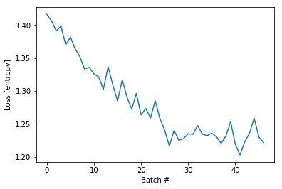

```python
# boiler plate
from collections import Counter
import pickle
from importlib import reload
import tensorflow as tf
import numpy as np
import matplotlib.pyplot as plt

from sklearn.preprocessing import MinMaxScaler


import ipdb
import mytf.utils as mu

tf.enable_eager_execution()

print(tf.executing_eagerly())


```

    True


```python
with open('models/2019-05-19T001217-UTC-outdata--SUBSET.pkl', 'rb') as fd:
    minidata = pickle.load(fd)
    
```


```python
reload(mu)
#Hand-tuned ... 
# Previous weights:
# class_weights = {0: 1.0, 1: 1.3, 2: 1.0, 3: 0.55}

# New weights:
class_weights = {0: 1.0, 1: 1.3, 2: 1.0, 3: 0.9}
training_indices = np.arange(0, minidata['x_train'].shape[0], 1)[:47000]
print('training indices...', training_indices.shape)

dataset_batches = mu.build_dataset_weighty_v3(minidata, training_indices, class_weights,
        batch_size=1000)

```

    training indices... (47000,)
    Start build v3: .. doesnt add up to 1.0
    num slices 47
    size_remainder,  0
    Counter({3: 413, 2: 230, 0: 201, 1: 156})
    weights_per_class,  tf.Tensor([0.00497512 0.00833333 0.00434783 0.00217918], shape=(4,), dtype=float32)
    1005.4999999999907
    Counter({3: 428, 0: 213, 2: 198, 1: 161})
    weights_per_class,  tf.Tensor([0.00469484 0.00807453 0.00505051 0.0021028 ], shape=(4,), dtype=float32)
    1005.49999999999
    Counter({3: 410, 0: 217, 2: 215, 1: 158})
    weights_per_class,  tf.Tensor([0.00460829 0.00822785 0.00465116 0.00219512], shape=(4,), dtype=float32)
    1006.3999999999902
    Counter({3: 387, 0: 233, 2: 208, 1: 172})
    weights_per_class,  tf.Tensor([0.00429185 0.00755814 0.00480769 0.00232558], shape=(4,), dtype=float32)
    1012.8999999999909
    Counter({3: 406, 0: 225, 2: 221, 1: 148})
    weights_per_class,  tf.Tensor([0.00444444 0.00878378 0.00452489 0.00221675], shape=(4,), dtype=float32)
    1003.7999999999904
    Counter({3: 395, 0: 230, 2: 192, 1: 183})
    weights_per_class,  tf.Tensor([0.00434783 0.00710382 0.00520833 0.00227848], shape=(4,), dtype=float32)
    1015.3999999999902
    Counter({3: 394, 2: 235, 0: 196, 1: 175})
    weights_per_class,  tf.Tensor([0.00510204 0.00742857 0.00425532 0.00228426], shape=(4,), dtype=float32)
    1013.0999999999905
    Counter({3: 413, 2: 211, 0: 210, 1: 166})
    weights_per_class,  tf.Tensor([0.0047619  0.00783132 0.00473934 0.00217918], shape=(4,), dtype=float32)
    1008.4999999999901
    Counter({3: 408, 0: 224, 2: 220, 1: 148})
    weights_per_class,  tf.Tensor([0.00446429 0.00878378 0.00454545 0.00220588], shape=(4,), dtype=float32)
    1003.5999999999907
    Counter({3: 410, 0: 217, 2: 212, 1: 161})
    weights_per_class,  tf.Tensor([0.00460829 0.00807453 0.00471698 0.00219512], shape=(4,), dtype=float32)
    1007.2999999999904
    Counter({3: 418, 2: 215, 0: 207, 1: 160})
    weights_per_class,  tf.Tensor([0.00483092 0.008125   0.00465116 0.00215311], shape=(4,), dtype=float32)
    1006.1999999999908
    Counter({3: 437, 0: 217, 2: 186, 1: 160})
    weights_per_class,  tf.Tensor([0.00460829 0.008125   0.00537634 0.0020595 ], shape=(4,), dtype=float32)
    1004.2999999999902
    Counter({3: 432, 2: 214, 0: 199, 1: 155})
    weights_per_class,  tf.Tensor([0.00502513 0.0083871  0.0046729  0.00208333], shape=(4,), dtype=float32)
    1003.2999999999902
    Counter({3: 426, 2: 215, 0: 181, 1: 178})
    weights_per_class,  tf.Tensor([0.00552486 0.00730337 0.00465116 0.00211268], shape=(4,), dtype=float32)
    1010.7999999999897
    Counter({3: 442, 2: 206, 0: 182, 1: 170})
    weights_per_class,  tf.Tensor([0.00549451 0.00764706 0.00485437 0.0020362 ], shape=(4,), dtype=float32)
    1006.7999999999902
    Counter({3: 411, 0: 233, 2: 219, 1: 137})
    weights_per_class,  tf.Tensor([0.00429185 0.00948905 0.00456621 0.00218978], shape=(4,), dtype=float32)
    999.9999999999917
    Counter({3: 396, 0: 211, 1: 197, 2: 196})
    weights_per_class,  tf.Tensor([0.00473934 0.00659898 0.00510204 0.00227273], shape=(4,), dtype=float32)
    1019.4999999999898
    Counter({3: 417, 0: 213, 2: 207, 1: 163})
    weights_per_class,  tf.Tensor([0.00469484 0.00797546 0.00483092 0.00215827], shape=(4,), dtype=float32)
    1007.1999999999902
    Counter({3: 422, 2: 215, 0: 204, 1: 159})
    weights_per_class,  tf.Tensor([0.00490196 0.0081761  0.00465116 0.0021327 ], shape=(4,), dtype=float32)
    1005.4999999999907
    Counter({3: 399, 2: 214, 0: 206, 1: 181})
    weights_per_class,  tf.Tensor([0.00485437 0.00718232 0.0046729  0.00225564], shape=(4,), dtype=float32)
    1014.3999999999908
    Counter({3: 410, 2: 224, 0: 208, 1: 158})
    weights_per_class,  tf.Tensor([0.00480769 0.00822785 0.00446429 0.00219512], shape=(4,), dtype=float32)
    1006.3999999999909
    Counter({3: 428, 0: 205, 2: 201, 1: 166})
    weights_per_class,  tf.Tensor([0.00487805 0.00783132 0.00497512 0.0021028 ], shape=(4,), dtype=float32)
    1006.9999999999903
    Counter({3: 410, 0: 225, 2: 202, 1: 163})
    weights_per_class,  tf.Tensor([0.00444444 0.00797546 0.00495049 0.00219512], shape=(4,), dtype=float32)
    1007.8999999999902
    Counter({3: 390, 2: 211, 1: 200, 0: 199})
    weights_per_class,  tf.Tensor([0.00502513 0.0065     0.00473934 0.00230769], shape=(4,), dtype=float32)
    1020.9999999999899
    Counter({3: 383, 2: 247, 0: 211, 1: 159})
    weights_per_class,  tf.Tensor([0.00473934 0.0081761  0.00404858 0.00234987], shape=(4,), dtype=float32)
    1009.3999999999905
    Counter({3: 421, 0: 214, 2: 192, 1: 173})
    weights_per_class,  tf.Tensor([0.0046729  0.00751445 0.00520833 0.00213777], shape=(4,), dtype=float32)
    1009.7999999999896
    Counter({3: 422, 2: 231, 0: 196, 1: 151})
    weights_per_class,  tf.Tensor([0.00510204 0.00860927 0.004329   0.0021327 ], shape=(4,), dtype=float32)
    1003.0999999999902
    Counter({3: 403, 0: 227, 2: 219, 1: 151})
    weights_per_class,  tf.Tensor([0.00440529 0.00860927 0.00456621 0.00223325], shape=(4,), dtype=float32)
    1004.9999999999911
    Counter({3: 412, 2: 227, 0: 215, 1: 146})
    weights_per_class,  tf.Tensor([0.00465116 0.00890411 0.00440529 0.00218447], shape=(4,), dtype=float32)
    1002.5999999999906
    Counter({3: 416, 0: 228, 2: 206, 1: 150})
    weights_per_class,  tf.Tensor([0.00438596 0.00866667 0.00485437 0.00216346], shape=(4,), dtype=float32)
    1003.3999999999904
    Counter({3: 404, 2: 213, 0: 204, 1: 179})
    weights_per_class,  tf.Tensor([0.00490196 0.00726257 0.00469484 0.00222772], shape=(4,), dtype=float32)
    1013.2999999999902
    Counter({3: 422, 0: 217, 2: 197, 1: 164})
    weights_per_class,  tf.Tensor([0.00460829 0.00792683 0.00507614 0.0021327 ], shape=(4,), dtype=float32)
    1006.9999999999902
    Counter({3: 402, 2: 231, 0: 193, 1: 174})
    weights_per_class,  tf.Tensor([0.00518135 0.00747126 0.004329   0.00223881], shape=(4,), dtype=float32)
    1011.9999999999905
    Counter({3: 398, 0: 223, 2: 218, 1: 161})
    weights_per_class,  tf.Tensor([0.00448431 0.00807453 0.00458716 0.00226131], shape=(4,), dtype=float32)
    1008.4999999999911
    Counter({3: 408, 0: 216, 2: 213, 1: 163})
    weights_per_class,  tf.Tensor([0.00462963 0.00797546 0.00469484 0.00220588], shape=(4,), dtype=float32)
    1008.0999999999905
    Counter({3: 401, 2: 235, 0: 219, 1: 145})
    weights_per_class,  tf.Tensor([0.00456621 0.00896552 0.00425532 0.00224439], shape=(4,), dtype=float32)
    1003.3999999999918
    Counter({3: 405, 0: 222, 2: 204, 1: 169})
    weights_per_class,  tf.Tensor([0.0045045  0.00769231 0.00490196 0.00222222], shape=(4,), dtype=float32)
    1010.1999999999898
    Counter({3: 413, 0: 221, 2: 218, 1: 148})
    weights_per_class,  tf.Tensor([0.00452489 0.00878378 0.00458716 0.00217918], shape=(4,), dtype=float32)
    1003.0999999999909
    Counter({3: 410, 2: 213, 0: 206, 1: 171})
    weights_per_class,  tf.Tensor([0.00485437 0.00760234 0.00469484 0.00219512], shape=(4,), dtype=float32)
    1010.2999999999902
    Counter({3: 390, 0: 228, 2: 214, 1: 168})
    weights_per_class,  tf.Tensor([0.00438596 0.00773809 0.0046729  0.00230769], shape=(4,), dtype=float32)
    1011.3999999999911
    Counter({3: 401, 2: 233, 0: 220, 1: 146})
    weights_per_class,  tf.Tensor([0.00454545 0.00890411 0.00429185 0.00224439], shape=(4,), dtype=float32)
    1003.6999999999911
    Counter({3: 430, 0: 216, 2: 201, 1: 153})
    weights_per_class,  tf.Tensor([0.00462963 0.00849673 0.00497512 0.00209302], shape=(4,), dtype=float32)
    1002.8999999999908
    Counter({3: 428, 2: 219, 0: 187, 1: 166})
    weights_per_class,  tf.Tensor([0.00534759 0.00783132 0.00456621 0.0021028 ], shape=(4,), dtype=float32)
    1006.9999999999899
    Counter({3: 410, 0: 218, 2: 190, 1: 182})
    weights_per_class,  tf.Tensor([0.00458716 0.00714286 0.00526316 0.00219512], shape=(4,), dtype=float32)
    1013.5999999999906
    Counter({3: 387, 2: 230, 0: 215, 1: 168})
    weights_per_class,  tf.Tensor([0.00465116 0.00773809 0.00434783 0.00232558], shape=(4,), dtype=float32)
    1011.6999999999903
    Counter({3: 426, 0: 228, 2: 175, 1: 171})
    weights_per_class,  tf.Tensor([0.00438596 0.00760234 0.00571429 0.00211268], shape=(4,), dtype=float32)
    1008.6999999999911
    Counter({3: 417, 0: 220, 2: 207, 1: 156})
    weights_per_class,  tf.Tensor([0.00454545 0.00833333 0.00483092 0.00215827], shape=(4,), dtype=float32)
    1005.0999999999901


```python
# okay... now try use that ..
model = tf.keras.Sequential([
    tf.keras.layers.LSTM(64,   dropout=0.2, recurrent_dropout=0.2,
                batch_input_shape=(None, 256, 1), 
              ),
    # 4 because 'A', 'B', 'C', 'D'.
    tf.keras.layers.Dense(4)
])

%time loss_history = mu.do_train(model, dataset_batches)

```

    WARNING:tensorflow:From /usr/local/miniconda3/envs/pandars3/lib/python3.7/site-packages/tensorflow/python/ops/losses/losses_impl.py:209: to_float (from tensorflow.python.ops.math_ops) is deprecated and will be removed in a future version.
    Instructions for updating:
    Use tf.cast instead.
    CPU times: user 6min 9s, sys: 3min 44s, total: 9min 53s
    Wall time: 6min 10s


```python
# Loss still pretty small. but Since this is the first time I shuffled, 
# the loss history looks really much more interesting.
plt.plot(loss_history)
plt.xlabel('Batch #')
plt.ylabel('Loss [entropy]')
```


    Text(0, 0.5, 'Loss [entropy]')





```python
print(minidata['x_train'].shape)
train_subset = np.random.choice(np.arange(0, minidata['x_train'].shape[0], 1),
                               10000, replace=False)
print('subset, ', len(train_subset))

# First make sure this random training subset covers all four classes.
print('train subset classes,', Counter(np.argmax(minidata['y_train'][train_subset, :], axis=1)))

%time y_pred_train = model(tf.convert_to_tensor(minidata['x_train'][train_subset], dtype=tf.float32))

# confusion... 
tf.confusion_matrix(
    np.argmax(minidata['y_train'][train_subset, :], axis=1),  # labels

    np.argmax(y_pred_train, axis=1), # predictions
    num_classes=4)


```

    (47689, 256, 1)
    subset,  10000
    train subset classes, Counter({3: 4208, 2: 2093, 0: 2088, 1: 1611})
    CPU times: user 27.3 s, sys: 7.35 s, total: 34.6 s
    Wall time: 8.97 s
    WARNING:tensorflow:From /usr/local/miniconda3/envs/pandars3/lib/python3.7/site-packages/tensorflow/python/ops/confusion_matrix.py:193: to_int64 (from tensorflow.python.ops.math_ops) is deprecated and will be removed in a future version.
    Instructions for updating:
    Use tf.cast instead.
    WARNING:tensorflow:From /usr/local/miniconda3/envs/pandars3/lib/python3.7/site-packages/tensorflow/python/ops/confusion_matrix.py:194: to_int32 (from tensorflow.python.ops.math_ops) is deprecated and will be removed in a future version.
    Instructions for updating:
    Use tf.cast instead.


    <tf.Tensor: id=3973761, shape=(4, 4), dtype=int32, numpy=
    array([[ 370,    0,    5, 1713],
           [   0,    0,    0, 1611],
           [2091,    0,    0,    2],
           [ 308,    0,   24, 3876]], dtype=int32)>


```python
# Hmm wow, these weights seem to make a big difference huh.
# So between "2019-07-13-Two" to "2019-07-13-Three" , the only change was to the 
# weights on class=3 , and we went from class=3 being totally ignored , to 
# , class=1 being totally ignored. 
```
