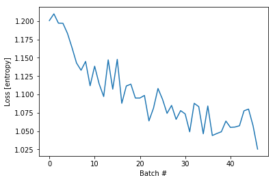

```python
# boiler plate
from collections import Counter
import pickle
from importlib import reload
import tensorflow as tf
import numpy as np
import matplotlib.pyplot as plt

from sklearn.preprocessing import MinMaxScaler


import ipdb
import mytf.utils as mu

tf.enable_eager_execution()

print(tf.executing_eagerly())


```

    True


```python
with open('models/2019-05-19T001217-UTC-outdata--SUBSET.pkl', 'rb') as fd:
    minidata = pickle.load(fd)
    
```


```python
reload(mu)
#Hand-tuned ... 
# Previous weights:
# class_weights = {0: 0.1, 1: 0.5, 2: 0.1, 3: 0.3}

# New weights:
class_weights = {0: 1.0, 1: 1.3, 2: 1.0, 3: 0.55}
training_indices = np.arange(0, minidata['x_train'].shape[0], 1)[:47000]
print('training indices...', training_indices.shape)

dataset_batches = mu.build_dataset_weighty_v3(minidata, training_indices, class_weights,
        batch_size=1000)

```

    training indices... (47000,)
    Start build v3: .. doesnt add up to 1.0
    num slices 47
    size_remainder,  0
    Counter({3: 435, 2: 215, 0: 193, 1: 157})
    weights_per_class,  tf.Tensor([0.00518135 0.00828025 0.00465116 0.00126437], shape=(4,), dtype=float32)
    851.3499999999923
    Counter({3: 422, 0: 230, 2: 179, 1: 169})
    weights_per_class,  tf.Tensor([0.00434783 0.00769231 0.00558659 0.00130332], shape=(4,), dtype=float32)
    860.7999999999922
    Counter({3: 400, 0: 229, 2: 221, 1: 150})
    weights_per_class,  tf.Tensor([0.00436681 0.00866667 0.00452489 0.001375  ], shape=(4,), dtype=float32)
    864.9999999999928
    Counter({3: 394, 2: 228, 0: 206, 1: 172})
    weights_per_class,  tf.Tensor([0.00485437 0.00755814 0.00438596 0.00139594], shape=(4,), dtype=float32)
    874.2999999999915
    Counter({3: 409, 2: 221, 0: 205, 1: 165})
    weights_per_class,  tf.Tensor([0.00487805 0.00787879 0.00452489 0.00134474], shape=(4,), dtype=float32)
    865.4499999999922
    Counter({3: 425, 2: 209, 0: 196, 1: 170})
    weights_per_class,  tf.Tensor([0.00510204 0.00764706 0.00478469 0.00129412], shape=(4,), dtype=float32)
    859.7499999999922
    Counter({3: 431, 2: 216, 0: 202, 1: 151})
    weights_per_class,  tf.Tensor([0.00495049 0.00860927 0.00462963 0.0012761 ], shape=(4,), dtype=float32)
    851.3499999999922
    Counter({3: 434, 0: 219, 2: 201, 1: 146})
    weights_per_class,  tf.Tensor([0.00456621 0.00890411 0.00497512 0.00126728], shape=(4,), dtype=float32)
    848.4999999999917
    Counter({3: 406, 2: 230, 0: 207, 1: 157})
    weights_per_class,  tf.Tensor([0.00483092 0.00828025 0.00434783 0.00135468], shape=(4,), dtype=float32)
    864.3999999999925
    Counter({3: 444, 0: 207, 2: 203, 1: 146})
    weights_per_class,  tf.Tensor([0.00483092 0.00890411 0.00492611 0.00123874], shape=(4,), dtype=float32)
    843.9999999999915
    Counter({3: 389, 0: 232, 2: 226, 1: 153})
    weights_per_class,  tf.Tensor([0.00431034 0.00849673 0.00442478 0.00141388], shape=(4,), dtype=float32)
    870.8499999999923
    Counter({3: 433, 0: 230, 2: 177, 1: 160})
    weights_per_class,  tf.Tensor([0.00434783 0.008125   0.00564972 0.00127021], shape=(4,), dtype=float32)
    853.1499999999917
    Counter({3: 437, 0: 213, 2: 204, 1: 146})
    weights_per_class,  tf.Tensor([0.00469484 0.00890411 0.00490196 0.00125858], shape=(4,), dtype=float32)
    847.1499999999926
    Counter({3: 377, 2: 233, 0: 220, 1: 170})
    weights_per_class,  tf.Tensor([0.00454545 0.00764706 0.00429185 0.00145889], shape=(4,), dtype=float32)
    881.349999999992
    Counter({3: 415, 0: 231, 2: 197, 1: 157})
    weights_per_class,  tf.Tensor([0.004329   0.00828025 0.00507614 0.0013253 ], shape=(4,), dtype=float32)
    860.3499999999924
    Counter({3: 370, 2: 234, 0: 203, 1: 193})
    weights_per_class,  tf.Tensor([0.00492611 0.00673575 0.0042735  0.00148649], shape=(4,), dtype=float32)
    891.3999999999927
    Counter({3: 424, 2: 216, 0: 204, 1: 156})
    weights_per_class,  tf.Tensor([0.00490196 0.00833333 0.00462963 0.00129717], shape=(4,), dtype=float32)
    855.999999999992
    Counter({3: 414, 2: 203, 0: 201, 1: 182})
    weights_per_class,  tf.Tensor([0.00497512 0.00714286 0.00492611 0.0013285 ], shape=(4,), dtype=float32)
    868.2999999999922
    Counter({3: 371, 0: 246, 2: 208, 1: 175})
    weights_per_class,  tf.Tensor([0.00406504 0.00742857 0.00480769 0.00148248], shape=(4,), dtype=float32)
    885.5499999999918
    Counter({3: 407, 2: 215, 0: 206, 1: 172})
    weights_per_class,  tf.Tensor([0.00485437 0.00755814 0.00465116 0.00135135], shape=(4,), dtype=float32)
    868.449999999992
    Counter({3: 393, 0: 212, 2: 210, 1: 185})
    weights_per_class,  tf.Tensor([0.00471698 0.00702703 0.0047619  0.00139949], shape=(4,), dtype=float32)
    878.6499999999917
    Counter({3: 399, 2: 235, 0: 218, 1: 148})
    weights_per_class,  tf.Tensor([0.00458716 0.00878378 0.00425532 0.00137845], shape=(4,), dtype=float32)
    864.8499999999917
    Counter({3: 418, 0: 227, 2: 217, 1: 138})
    weights_per_class,  tf.Tensor([0.00440529 0.00942029 0.00460829 0.00131579], shape=(4,), dtype=float32)
    853.299999999992
    Counter({3: 441, 2: 194, 0: 193, 1: 172})
    weights_per_class,  tf.Tensor([0.00518135 0.00755814 0.00515464 0.00124717], shape=(4,), dtype=float32)
    853.1499999999915
    Counter({3: 378, 0: 221, 2: 204, 1: 197})
    weights_per_class,  tf.Tensor([0.00452489 0.00659898 0.00490196 0.00145503], shape=(4,), dtype=float32)
    888.9999999999912
    Counter({3: 401, 0: 230, 2: 212, 1: 157})
    weights_per_class,  tf.Tensor([0.00434783 0.00828025 0.00471698 0.00137157], shape=(4,), dtype=float32)
    866.6499999999926
    Counter({3: 408, 2: 221, 0: 211, 1: 160})
    weights_per_class,  tf.Tensor([0.00473934 0.008125   0.00452489 0.00134804], shape=(4,), dtype=float32)
    864.3999999999925
    Counter({3: 411, 2: 203, 0: 199, 1: 187})
    weights_per_class,  tf.Tensor([0.00502513 0.00695187 0.00492611 0.0013382 ], shape=(4,), dtype=float32)
    871.1499999999924
    Counter({3: 402, 2: 229, 0: 209, 1: 160})
    weights_per_class,  tf.Tensor([0.00478469 0.008125   0.00436681 0.00136816], shape=(4,), dtype=float32)
    867.0999999999924
    Counter({3: 407, 2: 217, 0: 213, 1: 163})
    weights_per_class,  tf.Tensor([0.00469484 0.00797546 0.00460829 0.00135135], shape=(4,), dtype=float32)
    865.7499999999927
    Counter({3: 396, 2: 229, 0: 220, 1: 155})
    weights_per_class,  tf.Tensor([0.00454545 0.0083871  0.00436681 0.00138889], shape=(4,), dtype=float32)
    868.2999999999922
    Counter({3: 424, 0: 212, 2: 211, 1: 153})
    weights_per_class,  tf.Tensor([0.00471698 0.00849673 0.00473934 0.00129717], shape=(4,), dtype=float32)
    855.0999999999927
    Counter({3: 401, 2: 240, 0: 192, 1: 167})
    weights_per_class,  tf.Tensor([0.00520833 0.00778443 0.00416667 0.00137157], shape=(4,), dtype=float32)
    869.6499999999917
    Counter({3: 403, 0: 234, 2: 204, 1: 159})
    weights_per_class,  tf.Tensor([0.0042735  0.0081761  0.00490196 0.00136476], shape=(4,), dtype=float32)
    866.3499999999921
    Counter({3: 410, 2: 222, 0: 197, 1: 171})
    weights_per_class,  tf.Tensor([0.00507614 0.00760234 0.0045045  0.00134146], shape=(4,), dtype=float32)
    866.7999999999921
    Counter({3: 398, 0: 219, 2: 219, 1: 164})
    weights_per_class,  tf.Tensor([0.00456621 0.00792683 0.00456621 0.00138191], shape=(4,), dtype=float32)
    870.0999999999917
    Counter({3: 403, 2: 236, 0: 209, 1: 152})
    weights_per_class,  tf.Tensor([0.00478469 0.00855263 0.00423729 0.00136476], shape=(4,), dtype=float32)
    864.2499999999925
    Counter({3: 433, 0: 216, 2: 185, 1: 166})
    weights_per_class,  tf.Tensor([0.00462963 0.00783132 0.00540541 0.00127021], shape=(4,), dtype=float32)
    854.9499999999919
    Counter({3: 412, 2: 217, 0: 215, 1: 156})
    weights_per_class,  tf.Tensor([0.00465116 0.00833333 0.00460829 0.00133495], shape=(4,), dtype=float32)
    861.3999999999927
    Counter({3: 418, 0: 215, 2: 207, 1: 160})
    weights_per_class,  tf.Tensor([0.00465116 0.008125   0.00483092 0.00131579], shape=(4,), dtype=float32)
    859.8999999999911
    Counter({3: 423, 0: 220, 2: 202, 1: 155})
    weights_per_class,  tf.Tensor([0.00454545 0.0083871  0.00495049 0.00130024], shape=(4,), dtype=float32)
    856.1499999999924
    Counter({3: 419, 2: 215, 0: 204, 1: 162})
    weights_per_class,  tf.Tensor([0.00490196 0.00802469 0.00465116 0.00131265], shape=(4,), dtype=float32)
    860.049999999992
    Counter({3: 430, 2: 216, 0: 202, 1: 152})
    weights_per_class,  tf.Tensor([0.00495049 0.00855263 0.00462963 0.00127907], shape=(4,), dtype=float32)
    852.099999999993
    Counter({3: 408, 2: 209, 1: 196, 0: 187})
    weights_per_class,  tf.Tensor([0.00534759 0.00663265 0.00478469 0.00134804], shape=(4,), dtype=float32)
    875.1999999999912
    Counter({3: 395, 0: 232, 2: 204, 1: 169})
    weights_per_class,  tf.Tensor([0.00431034 0.00769231 0.00490196 0.00139241], shape=(4,), dtype=float32)
    872.9499999999923
    Counter({3: 407, 0: 219, 2: 206, 1: 168})
    weights_per_class,  tf.Tensor([0.00456621 0.00773809 0.00485437 0.00135135], shape=(4,), dtype=float32)
    867.2499999999914
    Counter({3: 436, 2: 200, 0: 194, 1: 170})
    weights_per_class,  tf.Tensor([0.00515464 0.00764706 0.005      0.00126147], shape=(4,), dtype=float32)
    854.7999999999913


```python
# okay... now try use that ..
model = tf.keras.Sequential([
    tf.keras.layers.LSTM(64,   dropout=0.2, recurrent_dropout=0.2,
                batch_input_shape=(None, 256, 1), 
              ),
    # 4 because 'A', 'B', 'C', 'D'.
    tf.keras.layers.Dense(4)
])

```

    WARNING:tensorflow:From /usr/local/miniconda3/envs/pandars3/lib/python3.7/site-packages/tensorflow/python/ops/tensor_array_ops.py:162: colocate_with (from tensorflow.python.framework.ops) is deprecated and will be removed in a future version.
    Instructions for updating:
    Colocations handled automatically by placer.
    WARNING:tensorflow:From /usr/local/miniconda3/envs/pandars3/lib/python3.7/site-packages/tensorflow/python/keras/backend.py:4010: calling dropout (from tensorflow.python.ops.nn_ops) with keep_prob is deprecated and will be removed in a future version.
    Instructions for updating:
    Please use `rate` instead of `keep_prob`. Rate should be set to `rate = 1 - keep_prob`.


```python

%time loss_history = mu.do_train(model, dataset_batches)

```

    WARNING:tensorflow:From /usr/local/miniconda3/envs/pandars3/lib/python3.7/site-packages/tensorflow/python/ops/losses/losses_impl.py:209: to_float (from tensorflow.python.ops.math_ops) is deprecated and will be removed in a future version.
    Instructions for updating:
    Use tf.cast instead.
    CPU times: user 5min 39s, sys: 2min 59s, total: 8min 38s
    Wall time: 5min 31s


```python
# Loss still pretty small. but Since this is the first time I shuffled, 
# the loss history looks really much more interesting.
plt.plot(loss_history)
plt.xlabel('Batch #')
plt.ylabel('Loss [entropy]')
```


    Text(0, 0.5, 'Loss [entropy]')





```python
print(minidata['x_train'].shape)
train_subset = np.random.choice(np.arange(0, minidata['x_train'].shape[0], 1),
                               10000, replace=False)
print('subset, ', len(train_subset))

# First make sure this random training subset covers all four classes.
Counter(np.argmax(minidata['y_train'][train_subset, :], axis=1))


```

    (47689, 256, 1)
    subset,  10000


    Counter({3: 4095, 2: 2085, 1: 1637, 0: 2183})


```python
%time y_pred_train = model(tf.convert_to_tensor(minidata['x_train'][train_subset], dtype=tf.float32))
```

    CPU times: user 26.8 s, sys: 8.49 s, total: 35.3 s
    Wall time: 11 s


```python
# confusion... 
tf.confusion_matrix(
    np.argmax(minidata['y_train'][train_subset, :], axis=1),  # labels

    np.argmax(y_pred_train, axis=1), # predictions
    num_classes=4)
```

    WARNING:tensorflow:From /usr/local/miniconda3/envs/pandars3/lib/python3.7/site-packages/tensorflow/python/ops/confusion_matrix.py:193: to_int64 (from tensorflow.python.ops.math_ops) is deprecated and will be removed in a future version.
    Instructions for updating:
    Use tf.cast instead.
    WARNING:tensorflow:From /usr/local/miniconda3/envs/pandars3/lib/python3.7/site-packages/tensorflow/python/ops/confusion_matrix.py:194: to_int32 (from tensorflow.python.ops.math_ops) is deprecated and will be removed in a future version.
    Instructions for updating:
    Use tf.cast instead.


    <tf.Tensor: id=3973115, shape=(4, 4), dtype=int32, numpy=
    array([[ 778,    0, 1405,    0],
           [ 168,  842,  627,    0],
           [   0,    0, 2085,    0],
           [ 219, 1618, 2258,    0]], dtype=int32)>


