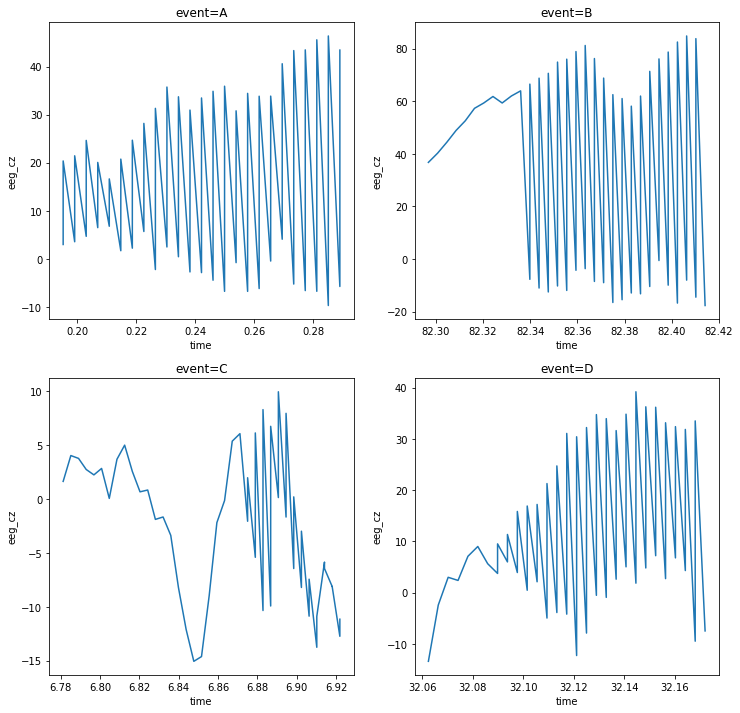

#### Took another stab at looking at this data...
And summing up some of the below findings, wow umm, the columns which I have been using up until now, `r`, `ecg` and `gsr` are basically the worst choices because they sort of appear stable between the different events. So the other columns are likely better choices to try .

```python
import boto3
import botocore
import os
import pandas as pd
from io import StringIO
import itertools

import datetime
from collections import Counter


import tensorflow as tf
from tensorflow import keras

# Helper libraries
import numpy as np
import matplotlib.pyplot as plt

print(tf.__version__)

from keras.preprocessing import sequence
from keras.models import Sequential
from keras.layers import Dense, Embedding
from keras.layers import LSTM

from keras.callbacks import EarlyStopping

from sklearn.preprocessing import StandardScaler
```

    1.14.0


    Using TensorFlow backend.


```python
def make_s3_resource():
    s3 = boto3.resource('s3',
            # aws_access_key_id=os.getenv('S3_BLOG_UPLOAD_ACCESS_KEY'),
            # aws_secret_access_key=os.getenv('S3_BLOG_UPLOAD_SECRET'),
            region_name='us-east-1')
    return s3


def write_s3_file(bucket_name, s3_filename, content):
    # assert isinstance(content, basestring)
    s3conn = make_s3_resource()
    # try:
    s3conn.Object(bucket_name, s3_filename).put(
            Body=content)
    # return True
    # except botocore.exceptions.ClientError as e:
    # return False


def read_s3_file(bucket_name, s3_filename):
    s3conn = make_s3_resource()
    # try:
    return s3conn.Object(bucket_name, s3_filename).get()["Body"].read()
    # except botocore.exceptions.ClientError as e:


def s3_csv_to_df(bucket_name, s3_filename):
    blah = read_s3_file(bucket_name, s3_filename)
    foo = StringIO(blah.decode("utf-8"))
    return pd.read_csv(foo)

def big_s3_csv_to_df(bucket_name, s3_filename_prefix, suffixes):
    filenames = [s3_filename_prefix + suff
            for suff in suffixes]
    # return filenames
    parts = [read_s3_file(bucket_name, s3_filename) 
            for s3_filename in filenames ]
    blah = functools.reduce(lambda x, y: x+y, parts)
    foo = StringIO(blah.decode("utf-8"))
    return pd.read_csv(foo)
```


```python
# df = read_s3_file('my-sagemaker-blah',
#          'aviation/sorted_train.csv.part1a')
df = s3_csv_to_df('my-sagemaker-blah',  'aviation/sorted_train.csv.part1a')

# s3://my-sagemaker-blah/aviation/sorted_train.csv.part1a
```


```python
df.iloc[0]
```


    crew                  1
    experiment           CA
    time          0.0117188
    seat                  1
    eeg_fp1        -5.28545
    eeg_f7          26.7758
    eeg_f8         -9.52731
    eeg_t4         -12.7932
    eeg_t6          16.7178
    eeg_t5          33.7375
    eeg_t3          23.7123
    eeg_fp2        -6.69587
    eeg_o1          29.2321
    eeg_p3          24.8429
    eeg_pz          3.92134
    eeg_f3           18.447
    eeg_fz          1.07547
    eeg_f4          3.09029
    eeg_c4           37.369
    eeg_p4          17.4376
    eeg_poz         19.2019
    eeg_c3          20.5968
    eeg_cz         -3.95115
    eeg_o2          14.5076
    ecg               -4520
    r               817.706
    gsr              388.83
    event                 A
    Name: 0, dtype: object


```python
df.event.value_counts()
```


    A    236235
    C    232856
    D     23219
    B      7689
    Name: event, dtype: int64


    


```python
# fig = plt.figure()
fig = plt.figure(figsize=(12,4))# plt.figaspect(1.0))
ax = fig.add_subplot(111)
# ax.plot(x, y, linewidth=3)
ax.plot(df.iloc[:250].time, df.iloc[:250].ecg)
```


    [<matplotlib.lines.Line2D at 0x7fc4aac775f8>]


```python
# fig = plt.figure()
fig = plt.figure(figsize=(12,4))# plt.figaspect(1.0))
ax = fig.add_subplot(111)
# ax.plot(x, y, linewidth=3)
ax.plot(df.iloc[50:100].time, df.iloc[50:100].ecg)
```


    [<matplotlib.lines.Line2D at 0x7fc4aac995c0>]


```python

def fetch_some_examples(arrays, which_col, dict_key, n=10):
    '''
    Lazily find the row indices of the training data, 
    for the given class (which_col).

    n: how many indices to fetch
    '''
    rows = arrays[dict_key].shape[0]
    gg = (i for i in np.arange(1, rows, 1) 
            if arrays[dict_key].iloc[i]['event'] == which_col)
    
    return [gg.__next__() for i in range(n)]


def choose_training_indices(arrays, counts, dict_key):
    return {
        i: fetch_some_examples(arrays, i, dict_key=dict_key, n=n)
        for (i, n) in enumerate(counts) }


```


```python
# choose_training_indices(arrays={'blah': df}, counts=[10, 10, 10, 10], dict_key='blah')
indices = {}
indices['A'] = df.iloc[50:][df.event == 'A'].iloc[:50].index.tolist()
indices['B'] = df.iloc[50:][df.event == 'B'].iloc[:50].index.tolist()
indices['C'] = df.iloc[50:][df.event == 'C'].iloc[:50].index.tolist()
indices['D'] = df.iloc[50:][df.event == 'D'].iloc[:50].index.tolist()
```

    /home/ec2-user/anaconda3/envs/tensorflow_p36/lib/python3.6/site-packages/ipykernel/__main__.py:3: UserWarning: Boolean Series key will be reindexed to match DataFrame index.
      app.launch_new_instance()
    /home/ec2-user/anaconda3/envs/tensorflow_p36/lib/python3.6/site-packages/ipykernel/__main__.py:4: UserWarning: Boolean Series key will be reindexed to match DataFrame index.
    /home/ec2-user/anaconda3/envs/tensorflow_p36/lib/python3.6/site-packages/ipykernel/__main__.py:5: UserWarning: Boolean Series key will be reindexed to match DataFrame index.
    /home/ec2-user/anaconda3/envs/tensorflow_p36/lib/python3.6/site-packages/ipykernel/__main__.py:6: UserWarning: Boolean Series key will be reindexed to match DataFrame index.


```python
print(indices)
```

    {'A': [50, 51, 52, 53, 54, 55, 56, 57, 58, 59, 60, 61, 62, 63, 64, 65, 66, 67, 68, 69, 70, 71, 72, 73, 74, 75, 76, 77, 78, 79, 80, 81, 82, 83, 84, 85, 86, 87, 88, 89, 90, 91, 92, 93, 94, 95, 96, 97, 98, 99], 'B': [410613, 410615, 410617, 410619, 410621, 410623, 410625, 410627, 410629, 410631, 410633, 410634, 410635, 410636, 410637, 410638, 410639, 410640, 410641, 410642, 410643, 410644, 410645, 410646, 410647, 410648, 410649, 410650, 410651, 410652, 410653, 410654, 410655, 410656, 410657, 410658, 410659, 410660, 410661, 410662, 410663, 410664, 410665, 410666, 410667, 410668, 410669, 410670, 410671, 410672], 'C': [3423, 3425, 3427, 3429, 3431, 3433, 3435, 3437, 3439, 3441, 3443, 3445, 3447, 3449, 3451, 3453, 3455, 3457, 3459, 3461, 3463, 3465, 3467, 3469, 3470, 3471, 3472, 3473, 3474, 3475, 3476, 3477, 3478, 3479, 3480, 3481, 3482, 3483, 3484, 3485, 3486, 3487, 3488, 3489, 3490, 3491, 3492, 3493, 3494, 3495], 'D': [200667, 200669, 200671, 200673, 200675, 200677, 200679, 200681, 200682, 200683, 200684, 200685, 200686, 200687, 200688, 200689, 200690, 200691, 200692, 200693, 200694, 200695, 200696, 200697, 200698, 200699, 200700, 200701, 200702, 200703, 200704, 200705, 200706, 200707, 200708, 200709, 200710, 200711, 200712, 200713, 200714, 200715, 200716, 200717, 200718, 200719, 200720, 200721, 200722, 200723]}


```python
# plot for each event though..
fig = plt.figure(figsize=(12,12))
ax = fig.add_subplot(221)
ax.plot(df.loc[indices['A']].time, df.loc[indices['A']].ecg)

ax = fig.add_subplot(222)
ax.plot(df.loc[indices['B']].time, df.loc[indices['B']].ecg)

ax = fig.add_subplot(223)
ax.plot(df.loc[indices['C']].time, df.loc[indices['C']].ecg)

ax = fig.add_subplot(224)
ax.plot(df.loc[indices['D']].time, df.loc[indices['D']].ecg)
```


    [<matplotlib.lines.Line2D at 0x7fc4aa8978d0>]


```python
# choose_training_indices(arrays={'blah': df}, counts=[10, 10, 10, 10], dict_key='blah')
indices = {}
indices['A'] = df.iloc[50:][df.event == 'A'].iloc[:50].index.tolist()
indices['B'] = df.iloc[50:][df.event == 'B'].iloc[:50].index.tolist()
indices['C'] = df.iloc[50:][df.event == 'C'].iloc[:50].index.tolist()
indices['D'] = df.iloc[50:][df.event == 'D'].iloc[:50].index.tolist()

def produce_plots_for_col(df, col, indices):
    # plot for each event though..
    fig = plt.figure(figsize=(12,12))
    ax = fig.add_subplot(221)
    ax.plot(df.loc[indices['A']].time, df.loc[indices['A']][col])
    ax.set(title='event=' + 'A',
            ylabel=col,
            xlabel='time')

    ax = fig.add_subplot(222)
    ax.plot(df.loc[indices['B']].time, df.loc[indices['B']][col])
    ax.set(title='event=' + 'B',
            ylabel=col,
            xlabel='time')

    ax = fig.add_subplot(223)
    ax.plot(df.loc[indices['C']].time, df.loc[indices['C']][col])
    ax.set(title='event=' + 'C',
            ylabel=col,
            xlabel='time')

    ax = fig.add_subplot(224)
    ax.plot(df.loc[indices['D']].time, df.loc[indices['D']][col])
    ax.set(title='event=' + 'D',
            ylabel=col,
            xlabel='time')
```

    /home/ec2-user/anaconda3/envs/tensorflow_p36/lib/python3.6/site-packages/ipykernel/__main__.py:3: UserWarning: Boolean Series key will be reindexed to match DataFrame index.
      app.launch_new_instance()
    /home/ec2-user/anaconda3/envs/tensorflow_p36/lib/python3.6/site-packages/ipykernel/__main__.py:4: UserWarning: Boolean Series key will be reindexed to match DataFrame index.
    /home/ec2-user/anaconda3/envs/tensorflow_p36/lib/python3.6/site-packages/ipykernel/__main__.py:5: UserWarning: Boolean Series key will be reindexed to match DataFrame index.
    /home/ec2-user/anaconda3/envs/tensorflow_p36/lib/python3.6/site-packages/ipykernel/__main__.py:6: UserWarning: Boolean Series key will be reindexed to match DataFrame index.


```python


```


```python
print(df.columns.tolist())
```

    ['crew', 'experiment', 'time', 'seat', 'eeg_fp1', 'eeg_f7', 'eeg_f8', 'eeg_t4', 'eeg_t6', 'eeg_t5', 'eeg_t3', 'eeg_fp2', 'eeg_o1', 'eeg_p3', 'eeg_pz', 'eeg_f3', 'eeg_fz', 'eeg_f4', 'eeg_c4', 'eeg_p4', 'eeg_poz', 'eeg_c3', 'eeg_cz', 'eeg_o2', 'ecg', 'r', 'gsr', 'event']


```python
produce_plots_for_col(df, 'eeg_fp1', indices)
```


```python
for col in ['eeg_fp1', 'eeg_f7', 'eeg_f8', 'eeg_t4', 'eeg_t6', 'eeg_t5', 'eeg_t3', 'eeg_fp2', 'eeg_o1', 'eeg_p3', 'eeg_pz', 'eeg_f3', 'eeg_fz', 'eeg_f4', 'eeg_c4', 'eeg_p4', 'eeg_poz', 'eeg_c3', 'eeg_cz', 'eeg_o2', 'ecg', 'r', 'gsr']:
    produce_plots_for_col(df, col, indices)
```


    /home/ec2-user/anaconda3/envs/tensorflow_p36/lib/python3.6/site-packages/matplotlib/pyplot.py:514: RuntimeWarning: More than 20 figures have been opened. Figures created through the pyplot interface (`matplotlib.pyplot.figure`) are retained until explicitly closed and may consume too much memory. (To control this warning, see the rcParam `figure.max_open_warning`).
      max_open_warning, RuntimeWarning)





