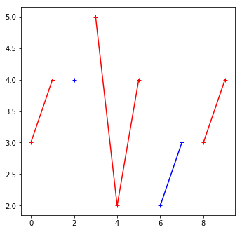
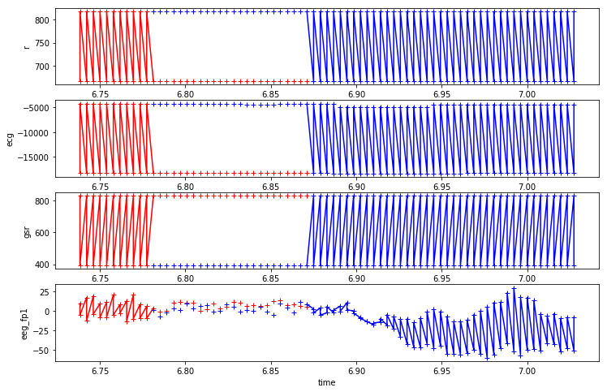
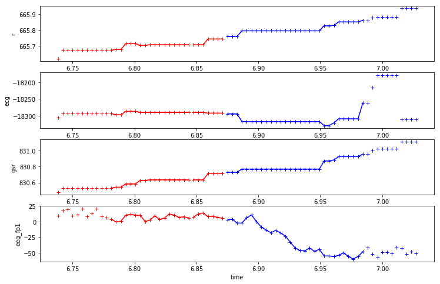
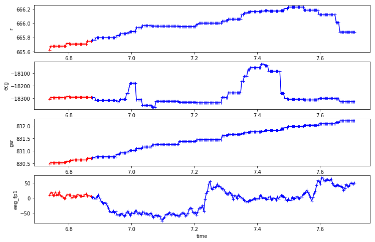
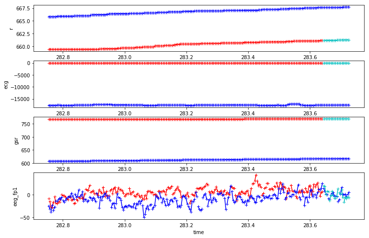

```python
### import boto3
import botocore
import os
import pandas as pd
from io import StringIO
import itertools

import datetime
from collections import Counter


import tensorflow as tf
from tensorflow import keras

# Helper libraries
import numpy as np
import matplotlib.pyplot as plt

print(tf.__version__)

from keras.preprocessing import sequence
from keras.models import Sequential
from keras.layers import Dense, Embedding
from keras.layers import LSTM

from keras.callbacks import EarlyStopping

from sklearn.preprocessing import StandardScaler
```

    1.14.0


    Using TensorFlow backend.


```python
import mytf.s3utils as msu
import mytf.utils as mu
```


```python
# Previously my sequence ingestion interval was 256 because, 
# 256Hz was the defined data rate.
interval = 0.00390625
print(1/256)

# It might make sense to try others as well. 
# (But this is not to be confused with the minibatch size, which
#  is spelled out as good around 32, as a rule of thumb by Yann LeCun
#  So I will keep that in mind for the update rule.)
```

    0.00390625


```python
%%time
# So from my earlier look, 
not_these = ['r', 'ecg', 'gsr']

# Start with this one
cols = ['eeg_fp1' , 'eeg_f7' , 'eeg_t4']
bucket = 'my-sagemaker-blah'

#df = pd.read_csv('data/2019-07-14-crews1-2.csv')   
df = msu.s3_csv_to_df(bucket, 'aviation/2019-07-14-crews1-2.csv')

outdata = mu.make_data(df, crews={'training': [1], 
                             'test': [2]}, 
                   sequence_window=256, percent_of_data=1, 
                  feature_cols=cols)
```


    ---------------------------------------------------------------------------

    KeyError                                  Traceback (most recent call last)

    <timed exec> in <module>()


    ~/SageMaker/aviation-pilot-physiology-hmm/mytf/utils.py in make_data(df, crews, sequence_window, percent_of_data, feature_cols)
        405 
        406     # Training
    --> 407     traindf = df[df.crew.isin(crews['training'])][what_cols].copy()
        408 
        409     scalar_dict, _ = do_standard_scaling(traindf, feature_cols)


    ~/anaconda3/envs/tensorflow_p36/lib/python3.6/site-packages/pandas/core/frame.py in __getitem__(self, key)
       2932                 key = list(key)
       2933             indexer = self.loc._convert_to_indexer(key, axis=1,
    -> 2934                                                    raise_missing=True)
       2935 
       2936         # take() does not accept boolean indexers


    ~/anaconda3/envs/tensorflow_p36/lib/python3.6/site-packages/pandas/core/indexing.py in _convert_to_indexer(self, obj, axis, is_setter, raise_missing)
       1352                 kwargs = {'raise_missing': True if is_setter else
       1353                           raise_missing}
    -> 1354                 return self._get_listlike_indexer(obj, axis, **kwargs)[1]
       1355         else:
       1356             try:


    ~/anaconda3/envs/tensorflow_p36/lib/python3.6/site-packages/pandas/core/indexing.py in _get_listlike_indexer(self, key, axis, raise_missing)
       1159         self._validate_read_indexer(keyarr, indexer,
       1160                                     o._get_axis_number(axis),
    -> 1161                                     raise_missing=raise_missing)
       1162         return keyarr, indexer
       1163 


    ~/anaconda3/envs/tensorflow_p36/lib/python3.6/site-packages/pandas/core/indexing.py in _validate_read_indexer(self, key, indexer, axis, raise_missing)
       1250             if not(self.name == 'loc' and not raise_missing):
       1251                 not_found = list(set(key) - set(ax))
    -> 1252                 raise KeyError("{} not in index".format(not_found))
       1253 
       1254             # we skip the warning on Categorical/Interval


    KeyError: "['eeg_fp1', 'eeg_f7', 'eeg_t4'] not in index"


```python
df = msu.s3_csv_to_df('my-sagemaker-blah',  'aviation/sorted_train.csv.part1a')

```


```python
# with a df part1a of 499,999 rows, the step always seems to be the same 
print(set([ [x[i+1] - x[i] for i in range(999)] for x in [df.time.iloc[:1000]]][0]))

# So although 500,000 sounds like a lot, it covers 
print(5e5*0.00390625, 'seconds', 5e5*0.00390625/60, 'minutes')
```

    {0.00390625, 0.0}
    1953.125 seconds 32.552083333333336 minutes


```python
df.iloc[0]
```


    crew                  1
    experiment           CA
    time          0.0117188
    seat                  1
    eeg_fp1        -5.28545
    eeg_f7          26.7758
    eeg_f8         -9.52731
    eeg_t4         -12.7932
    eeg_t6          16.7178
    eeg_t5          33.7375
    eeg_t3          23.7123
    eeg_fp2        -6.69587
    eeg_o1          29.2321
    eeg_p3          24.8429
    eeg_pz          3.92134
    eeg_f3           18.447
    eeg_fz          1.07547
    eeg_f4          3.09029
    eeg_c4           37.369
    eeg_p4          17.4376
    eeg_poz         19.2019
    eeg_c3          20.5968
    eeg_cz         -3.95115
    eeg_o2          14.5076
    ecg               -4520
    r               817.706
    gsr              388.83
    event                 A
    Name: 0, dtype: object


```python
# So this is what I did last time to plot data.. but its not continguous i am seeing..
# so might be a problem in how i was plotting data and how I was even building 
# datasets to begin with. the label needs to be what is observed at the end of the time series.


indices = {}
indices['A'] = df.iloc[50:][df.event == 'A'].iloc[:50].index.tolist()
indices['B'] = df.iloc[50:][df.event == 'B'].iloc[:50].index.tolist()
indices['C'] = df.iloc[50:][df.event == 'C'].iloc[:50].index.tolist()
indices['D'] = df.iloc[50:][df.event == 'D'].iloc[:50].index.tolist()

```

    /home/ec2-user/anaconda3/envs/tensorflow_p36/lib/python3.6/site-packages/ipykernel/__main__.py:2: UserWarning: Boolean Series key will be reindexed to match DataFrame index.
      from ipykernel import kernelapp as app
    /home/ec2-user/anaconda3/envs/tensorflow_p36/lib/python3.6/site-packages/ipykernel/__main__.py:3: UserWarning: Boolean Series key will be reindexed to match DataFrame index.
      app.launch_new_instance()
    /home/ec2-user/anaconda3/envs/tensorflow_p36/lib/python3.6/site-packages/ipykernel/__main__.py:4: UserWarning: Boolean Series key will be reindexed to match DataFrame index.
    /home/ec2-user/anaconda3/envs/tensorflow_p36/lib/python3.6/site-packages/ipykernel/__main__.py:5: UserWarning: Boolean Series key will be reindexed to match DataFrame index.


```python
print(indices['D'])
```

    [200667, 200669, 200671, 200673, 200675, 200677, 200679, 200681, 200682, 200683, 200684, 200685, 200686, 200687, 200688, 200689, 200690, 200691, 200692, 200693, 200694, 200695, 200696, 200697, 200698, 200699, 200700, 200701, 200702, 200703, 200704, 200705, 200706, 200707, 200708, 200709, 200710, 200711, 200712, 200713, 200714, 200715, 200716, 200717, 200718, 200719, 200720, 200721, 200722, 200723]


```python
# Trying out another possible way to plot the data as classes transition..
fig = plt.figure(figsize=(12,12))
ax = fig.add_subplot(221)
n = np.nan
ax.plot(range(10), 
        [3, 4, n, 5, 2, 4, n, n, 3, 4], 
        'r+-')
ax.plot(range(10), 
        [n, n, 4, n, n, n, 2, 3, n, n],
        'b+-')
```


    [<matplotlib.lines.Line2D at 0x7f2a23c6ab38>]





```python
df[['r', 'event']].iloc[50:60].values
```


    array([[665.0020139999998, 'A'],
           [817.687012, 'A'],
           [665.0020139999998, 'A'],
           [817.687012, 'A'],
           [665.0020139999998, 'A'],
           [817.679993, 'A'],
           [665.0020139999998, 'A'],
           [817.679993, 'A'],
           [665.0020139999998, 'A'],
           [817.679993, 'A']], dtype=object)


```python
def make_series_from_cols(df, col, indices):
    label_col = 'event'    
    return [[
        x if y == event else np.nan
     
        for (x, y)
        in df[[col, label_col]].loc[indices].values]
        
        for event in ['A', 'B', 'C', 'D']
    ] 
```


```python
make_series_from_cols(df, 'r', range(5000,5010))
```


    [[nan, nan, nan, nan, nan, nan, nan, nan, nan, nan],
     [nan, nan, nan, nan, nan, nan, nan, nan, nan, nan],
     [665.979004,
      817.580994,
      665.979004,
      817.580994,
      665.979004,
      817.580994,
      665.979004,
      817.5830080000003,
      665.979004,
      817.5830080000003],
     [nan, nan, nan, nan, nan, nan, nan, nan, nan, nan]]


```python
def produce_plots_for_col(df, cols, indices):
    event_col = 'event'
    # plot for each event though..
    fig = plt.figure(figsize=(12,8))

    assert len(cols) == 4
    
    for i, col in enumerate(cols):
        Y = make_series_from_cols(df, col, indices)
        ax = fig.add_subplot(int('41' + str(i+1)))
        
        ax.plot(df.loc[indices].time, Y[0], 'r+-')
        ax.plot(df.loc[indices].time, Y[1], 'g+-')
        ax.plot(df.loc[indices].time, Y[2], 'b+-')
        ax.plot(df.loc[indices].time, Y[3], 'c+-')
        
        ax.set(#title=col,
            ylabel=col,
            xlabel='time')

```


```python
start = 3400; produce_plots_for_col(df, ['r', 'ecg', 'gsr', 'eeg_fp1'],
                                range(start,start+150))
```





### This transition above is pretty cool . 
I can try mining for more transitions, looking at which attributes appear 
to be sensitive to changes. Above it looks like indeed `r`, `ecg`, `gsr` dont change when
transitioning `r->b` , meaning `A` to `C`. But `eeg_fp1` does appear to change.

Also the back and forth here is pretty weird. Does it indicate some weirdness in the way
they were labeling the data? How are they producing that ? 

Ah ooooops... looking at the below, ... that's just because the two crew members data
was being mixed togher oh man wow. Going to have to redo this plot..


```python
indices = range(start,start+150)
start = 3420
df.loc[start:start+10][['crew', 'seat', 'experiment', 'time', 'event']]
```


<div>
<style scoped>
    .dataframe tbody tr th:only-of-type {
        vertical-align: middle;
    }

    .dataframe tbody tr th {
        vertical-align: top;
    }

    .dataframe thead th {
        text-align: right;
    }
</style>
<table border="1" class="dataframe">
  <thead>
    <tr style="text-align: right;">
      <th></th>
      <th>crew</th>
      <th>seat</th>
      <th>experiment</th>
      <th>time</th>
      <th>event</th>
    </tr>
  </thead>
  <tbody>
    <tr>
      <th>3420</th>
      <td>1</td>
      <td>0</td>
      <td>CA</td>
      <td>6.777344</td>
      <td>A</td>
    </tr>
    <tr>
      <th>3421</th>
      <td>1</td>
      <td>1</td>
      <td>CA</td>
      <td>6.777344</td>
      <td>A</td>
    </tr>
    <tr>
      <th>3422</th>
      <td>1</td>
      <td>0</td>
      <td>CA</td>
      <td>6.781250</td>
      <td>A</td>
    </tr>
    <tr>
      <th>3423</th>
      <td>1</td>
      <td>1</td>
      <td>CA</td>
      <td>6.781250</td>
      <td>C</td>
    </tr>
    <tr>
      <th>3424</th>
      <td>1</td>
      <td>0</td>
      <td>CA</td>
      <td>6.785156</td>
      <td>A</td>
    </tr>
    <tr>
      <th>3425</th>
      <td>1</td>
      <td>1</td>
      <td>CA</td>
      <td>6.785156</td>
      <td>C</td>
    </tr>
    <tr>
      <th>3426</th>
      <td>1</td>
      <td>0</td>
      <td>CA</td>
      <td>6.789062</td>
      <td>A</td>
    </tr>
    <tr>
      <th>3427</th>
      <td>1</td>
      <td>1</td>
      <td>CA</td>
      <td>6.789062</td>
      <td>C</td>
    </tr>
    <tr>
      <th>3428</th>
      <td>1</td>
      <td>0</td>
      <td>CA</td>
      <td>6.792969</td>
      <td>A</td>
    </tr>
    <tr>
      <th>3429</th>
      <td>1</td>
      <td>1</td>
      <td>CA</td>
      <td>6.792969</td>
      <td>C</td>
    </tr>
    <tr>
      <th>3430</th>
      <td>1</td>
      <td>0</td>
      <td>CA</td>
      <td>6.796875</td>
      <td>A</td>
    </tr>
  </tbody>
</table>
</div>


```python
start = 3400; 
someindices = list(set(df[df['seat'] == 0].index.tolist()) & set(range(start,start+150)))
print('len(someindices)', len(someindices))
print('someindices', someindices)
produce_plots_for_col(
    df[df['seat'] == 0], 
    ['r', 'ecg', 'gsr', 'eeg_fp1'],
    someindices)
```

    len(someindices) 75
    someindices [3456, 3458, 3460, 3462, 3464, 3466, 3468, 3470, 3472, 3474, 3476, 3478, 3480, 3482, 3484, 3486, 3488, 3490, 3492, 3494, 3496, 3498, 3500, 3502, 3504, 3506, 3508, 3510, 3512, 3514, 3516, 3518, 3520, 3522, 3524, 3526, 3400, 3528, 3402, 3530, 3404, 3532, 3406, 3534, 3408, 3536, 3410, 3538, 3412, 3540, 3414, 3542, 3416, 3544, 3418, 3546, 3420, 3548, 3422, 3424, 3426, 3428, 3430, 3432, 3434, 3436, 3438, 3440, 3442, 3444, 3446, 3448, 3450, 3452, 3454]





```python
start = 3400; 
someindices = list(set(df[df['seat'] == 0].index.tolist()) & set(range(start,start+500)))
print('len(someindices)', len(someindices))
#print('someindices', someindices)
produce_plots_for_col(
    df[df['seat'] == 0], 
    ['r', 'ecg', 'gsr', 'eeg_fp1'],
    someindices)
```

    len(someindices) 250





#### Wow.
Ok so duh the fact that I had interleaved `seat=0,1` was causing the zig zagging appearance 
in the first place. I thought I had sorted by `crew, seat, experiment, time`, 
but perhaps that last sort column undid the sort of the `seat` column?

Anyways, this looks like a pretty promising way to finally better study this visually.


```python
%%time
dfso = df.sort_values(by=['crew','seat', 'experiment', 'time'])
```

    CPU times: user 241 ms, sys: 36.5 ms, total: 277 ms
    Wall time: 279 ms


```python
def look_for_transitions(df, cap):
    transitions = []
    choices = ([1], [0], ['CA'])#, 'DA', 'SS'])
    
    for crew, seat, experiment in itertools.product(*choices):
        query = (df.crew == crew)&(df.seat == seat)#&(df.experiment == experiment)
        thisdf = df[query]#[cols]
        
        indices = thisdf.index.tolist()
        laststate = thisdf.loc[indices[0]].event
        for i in tqdm(indices[1:]):
            thisstate = thisdf.loc[i].event
            if thisstate != laststate:
                transitions.append([laststate, thisstate, thisdf.loc[i].time, i])
                laststate = thisstate
                
    return transitions

def is_it_sorted_by_time(df):
    choices = (df.crew.unique(), df.seat.unique())#, 'DA', 'SS'])
    meta = {}
    for crew, seat in itertools.product(*choices):
        query = (df.crew == crew)&(df.seat == seat)
        times = df[query].time.tolist()
        meta[(crew, seat)] = times == sorted(times)
    return meta
```


```python
is_it_sorted_by_time(dfso), is_it_sorted_by_time(df.sort_values(by=['crew','seat',  'time']))
```


    ({(1, 1): False, (1, 0): False, (2, 1): True, (2, 0): True},
     {(1, 0): True, (1, 1): True, (2, 0): True, (2, 1): True})


```python
print(is_it_sorted_by_time(df))
dfso = df.sort_values(by=['crew','seat',  'time']); 
print(is_it_sorted_by_time(dfso))
print(df.equals(dfso)) 
dfso = dfso.reindex(range(df.shape[0])); 
print(is_it_sorted_by_time(dfso))
print (df.equals(dfso))
print('okay wtf, why does reindex() change the sort. thats not cool')
dfso = df.sort_values(by=['crew','seat',  'time']).copy().reindex(range(df.shape[0]))
print ('how about now that I did a copy()', df.equals(dfso));
print(is_it_sorted_by_time(dfso))
dfso = df.sort_values(by=['crew','seat',  'time']).copy(deep=True)
dfso.index = range(df.shape[0])
print ('how about now that I did a copy() and manual index change', df.equals(dfso));
print(is_it_sorted_by_time(dfso))


```

    {(1, 1): False, (1, 0): False, (2, 1): True, (2, 0): True}
    {(1, 0): True, (1, 1): True, (2, 0): True, (2, 1): True}
    False
    {(1, 1): False, (1, 0): False, (2, 1): True, (2, 0): True}
    True
    okay wtf, why does reindex() change the sort. thats not cool
    how about now that I did a copy() True
    {(1, 1): False, (1, 0): False, (2, 1): True, (2, 0): True}
    how about now that I did a copy() and manual index change False
    {(1, 0): True, (1, 1): True, (2, 0): True, (2, 1): True}


```python
%%time
from tqdm import tqdm
transitions = look_for_transitions(dfso, None)
```

    
      0%|          | 0/223770 [00:00<?, ?it/s]
      0%|          | 342/223770 [00:00<01:05, 3415.35it/s]
      0%|          | 671/223770 [00:00<01:06, 3375.36it/s]
      0%|          | 998/223770 [00:00<01:06, 3342.98it/s]
      1%|          | 1331/223770 [00:00<01:06, 3336.70it/s]
      1%|          | 1648/223770 [00:00<01:07, 3282.74it/s]
      1%|          | 1958/223770 [00:00<01:08, 3225.31it/s]
      1%|          | 2268/223770 [00:00<01:09, 3185.16it/s]
      1%|          | 2580/223770 [00:00<01:09, 3163.85it/s]
      1%|▏         | 2891/223770 [00:00<01:10, 3145.69it/s]
      1%|▏         | 3224/223770 [00:01<01:08, 3196.68it/s]
      2%|▏         | 3543/223770 [00:01<01:08, 3192.27it/s]
      2%|▏         | 3856/223770 [00:01<01:09, 3162.97it/s]
      2%|▏         | 4168/223770 [00:01<01:09, 3143.91it/s]
      2%|▏         | 4480/223770 [00:01<01:09, 3136.44it/s]
      2%|▏         | 4815/223770 [00:01<01:08, 3195.50it/s]
      2%|▏         | 5151/223770 [00:01<01:07, 3240.75it/s]
      2%|▏         | 5475/223770 [00:01<01:07, 3221.17it/s]
      3%|▎         | 5797/223770 [00:01<01:08, 3183.70it/s]
      3%|▎         | 6116/223770 [00:01<01:08, 3168.13it/s]
      3%|▎         | 6445/223770 [00:02<01:07, 3203.50it/s]
      3%|▎         | 6781/223770 [00:02<01:06, 3247.62it/s]
      3%|▎         | 7106/223770 [00:02<01:06, 3234.19it/s]
      3%|▎         | 7430/223770 [00:02<01:07, 3205.85it/s]
      3%|▎         | 7751/223770 [00:02<01:07, 3186.74it/s]
      4%|▎         | 8070/223770 [00:02<01:07, 3180.91it/s]
      4%|▎         | 8389/223770 [00:02<01:07, 3169.49it/s]
      4%|▍         | 8723/223770 [00:02<01:06, 3216.00it/s]
      4%|▍         | 9053/223770 [00:02<01:06, 3238.52it/s]
      4%|▍         | 9389/223770 [00:02<01:05, 3272.78it/s]
      4%|▍         | 9723/223770 [00:03<01:05, 3292.30it/s]
      4%|▍         | 10060/223770 [00:03<01:04, 3314.27it/s]
      5%|▍         | 10396/223770 [00:03<01:04, 3326.77it/s]
      5%|▍         | 10729/223770 [00:03<01:04, 3287.11it/s]
      5%|▍         | 11058/223770 [00:03<01:05, 3235.86it/s]
      5%|▌         | 11382/223770 [00:03<01:06, 3205.65it/s]
      5%|▌         | 11703/223770 [00:03<01:06, 3178.21it/s]
      5%|▌         | 12022/223770 [00:03<01:06, 3160.45it/s]
      6%|▌         | 12339/223770 [00:03<01:07, 3131.38it/s]
      6%|▌         | 12653/223770 [00:03<01:07, 3125.58it/s]
      6%|▌         | 12967/223770 [00:04<01:07, 3127.12it/s]
      6%|▌         | 13280/223770 [00:04<01:07, 3127.41it/s]
      6%|▌         | 13597/223770 [00:04<01:06, 3139.69it/s]
      6%|▌         | 13932/223770 [00:04<01:05, 3197.57it/s]
      6%|▋         | 14261/223770 [00:04<01:04, 3223.73it/s]
      7%|▋         | 14584/223770 [00:04<01:05, 3216.97it/s]
      7%|▋         | 14906/223770 [00:04<01:05, 3209.79it/s]
      7%|▋         | 15228/223770 [00:04<01:05, 3202.46it/s]
      7%|▋         | 15549/223770 [00:04<01:05, 3184.97it/s]
      7%|▋         | 15871/223770 [00:04<01:05, 3194.29it/s]
      7%|▋         | 16191/223770 [00:05<01:04, 3195.60it/s]
      7%|▋         | 16511/223770 [00:05<01:05, 3186.29it/s]
      8%|▊         | 16831/223770 [00:05<01:04, 3190.14it/s]
      8%|▊         | 17151/223770 [00:05<01:04, 3187.35it/s]
      8%|▊         | 17484/223770 [00:05<01:03, 3226.74it/s]
      8%|▊         | 17814/223770 [00:05<01:03, 3247.06it/s]
      8%|▊         | 18146/223770 [00:05<01:02, 3268.29it/s]
      8%|▊         | 18483/223770 [00:05<01:02, 3297.91it/s]
      8%|▊         | 18813/223770 [00:05<01:02, 3294.32it/s]
      9%|▊         | 19149/223770 [00:05<01:01, 3311.61it/s]
      9%|▊         | 19486/223770 [00:06<01:01, 3327.07it/s]
      9%|▉         | 19819/223770 [00:06<01:01, 3324.99it/s]
      9%|▉         | 20157/223770 [00:06<01:00, 3338.89it/s]
      9%|▉         | 20491/223770 [00:06<01:01, 3329.60it/s]
      9%|▉         | 20825/223770 [00:06<01:01, 3283.77it/s]
      9%|▉         | 21154/223770 [00:06<01:02, 3239.66it/s]
     10%|▉         | 21479/223770 [00:06<01:02, 3216.65it/s]
     10%|▉         | 21815/223770 [00:06<01:02, 3256.88it/s]
     10%|▉         | 22146/223770 [00:06<01:01, 3271.17it/s]
     10%|█         | 22474/223770 [00:06<01:02, 3241.70it/s]
     10%|█         | 22799/223770 [00:07<01:02, 3212.47it/s]
     10%|█         | 23121/223770 [00:07<01:02, 3197.60it/s]
     10%|█         | 23457/223770 [00:07<01:01, 3244.64it/s]
     11%|█         | 23791/223770 [00:07<01:01, 3271.30it/s]
     11%|█         | 24127/223770 [00:07<01:00, 3297.02it/s]
     11%|█         | 24457/223770 [00:07<01:01, 3265.11it/s]
     11%|█         | 24784/223770 [00:07<01:01, 3222.84it/s]
     11%|█         | 25107/223770 [00:07<01:02, 3189.91it/s]
     11%|█▏        | 25434/223770 [00:07<01:01, 3210.97it/s]
     12%|█▏        | 25760/223770 [00:07<01:01, 3223.30it/s]
     12%|█▏        | 26088/223770 [00:08<01:01, 3239.55it/s]
     12%|█▏        | 26416/223770 [00:08<01:00, 3249.14it/s]
     12%|█▏        | 26742/223770 [00:08<01:01, 3229.05it/s]
     12%|█▏        | 27075/223770 [00:08<01:00, 3256.95it/s]
     12%|█▏        | 27401/223770 [00:08<01:00, 3227.40it/s]
     12%|█▏        | 27724/223770 [00:08<01:01, 3186.53it/s]
     13%|█▎        | 28043/223770 [00:08<01:01, 3178.07it/s]
     13%|█▎        | 28376/223770 [00:08<01:00, 3221.64it/s]
     13%|█▎        | 28705/223770 [00:08<01:00, 3241.59it/s]
     13%|█▎        | 29035/223770 [00:09<00:59, 3256.16it/s]
     13%|█▎        | 29368/223770 [00:09<00:59, 3275.24it/s]
     13%|█▎        | 29696/223770 [00:09<01:00, 3216.01it/s]
     13%|█▎        | 30018/223770 [00:09<01:00, 3201.02it/s]
     14%|█▎        | 30339/223770 [00:09<01:00, 3192.37it/s]
     14%|█▎        | 30659/223770 [00:09<01:00, 3182.65it/s]
     14%|█▍        | 30992/223770 [00:09<00:59, 3224.76it/s]
     14%|█▍        | 31320/223770 [00:09<00:59, 3238.59it/s]
     14%|█▍        | 31653/223770 [00:09<00:58, 3263.24it/s]
     14%|█▍        | 31980/223770 [00:09<00:59, 3236.22it/s]
     14%|█▍        | 32304/223770 [00:10<00:59, 3198.47it/s]
     15%|█▍        | 32625/223770 [00:10<01:00, 3184.15it/s]
     15%|█▍        | 32944/223770 [00:10<00:59, 3184.82it/s]
     15%|█▍        | 33263/223770 [00:10<00:59, 3185.52it/s]
     15%|█▌        | 33582/223770 [00:10<00:59, 3182.37it/s]
     15%|█▌        | 33901/223770 [00:10<00:59, 3183.72it/s]
     15%|█▌        | 34220/223770 [00:10<00:59, 3168.36it/s]
     15%|█▌        | 34539/223770 [00:10<00:59, 3174.72it/s]
     16%|█▌        | 34857/223770 [00:10<00:59, 3167.81it/s]
     16%|█▌        | 35175/223770 [00:10<00:59, 3171.20it/s]
     16%|█▌        | 35494/223770 [00:11<00:59, 3175.15it/s]
     16%|█▌        | 35813/223770 [00:11<00:59, 3178.67it/s]
     16%|█▌        | 36132/223770 [00:11<00:58, 3181.60it/s]
     16%|█▋        | 36451/223770 [00:11<00:59, 3161.53it/s]
     16%|█▋        | 36768/223770 [00:11<00:59, 3139.79it/s]
     17%|█▋        | 37086/223770 [00:11<00:59, 3150.09it/s]
     17%|█▋        | 37420/223770 [00:11<00:58, 3203.45it/s]
     17%|█▋        | 37747/223770 [00:11<00:57, 3222.23it/s]
     17%|█▋        | 38077/223770 [00:11<00:57, 3245.15it/s]
     17%|█▋        | 38412/223770 [00:11<00:56, 3273.96it/s]
     17%|█▋        | 38747/223770 [00:12<00:56, 3296.00it/s]
     17%|█▋        | 39077/223770 [00:12<00:56, 3264.36it/s]
     18%|█▊        | 39404/223770 [00:12<00:57, 3227.62it/s]
     18%|█▊        | 39736/223770 [00:12<00:56, 3252.24it/s]
     18%|█▊        | 40066/223770 [00:12<00:56, 3264.57it/s]
     18%|█▊        | 40399/223770 [00:12<00:55, 3283.02it/s]
     18%|█▊        | 40734/223770 [00:12<00:55, 3301.08it/s]
     18%|█▊        | 41065/223770 [00:12<00:56, 3254.06it/s]
     18%|█▊        | 41391/223770 [00:12<00:56, 3215.43it/s]
     19%|█▊        | 41726/223770 [00:12<00:55, 3254.10it/s]
     19%|█▉        | 42063/223770 [00:13<00:55, 3286.63it/s]
     19%|█▉        | 42392/223770 [00:13<00:56, 3236.58it/s]
     19%|█▉        | 42726/223770 [00:13<00:55, 3264.39it/s]
     19%|█▉        | 43059/223770 [00:13<00:55, 3281.19it/s]
     19%|█▉        | 43388/223770 [00:13<00:55, 3250.38it/s]
     20%|█▉        | 43714/223770 [00:13<00:55, 3218.44it/s]
     20%|█▉        | 44037/223770 [00:13<00:56, 3191.02it/s]
     20%|█▉        | 44370/223770 [00:13<00:55, 3231.14it/s]
     20%|█▉        | 44700/223770 [00:13<00:55, 3249.87it/s]
     20%|██        | 45026/223770 [00:13<00:55, 3227.03it/s]
     20%|██        | 45349/223770 [00:14<00:55, 3193.99it/s]
     20%|██        | 45669/223770 [00:14<00:56, 3174.97it/s]
     21%|██        | 45988/223770 [00:14<00:55, 3177.88it/s]
     21%|██        | 46306/223770 [00:14<00:56, 3159.37it/s]
     21%|██        | 46623/223770 [00:14<00:56, 3144.12it/s]
     21%|██        | 46938/223770 [00:14<00:56, 3135.32it/s]
     21%|██        | 47252/223770 [00:14<00:56, 3121.44it/s]
     21%|██▏       | 47583/223770 [00:14<00:55, 3173.98it/s]
     21%|██▏       | 47914/223770 [00:14<00:54, 3211.09it/s]
     22%|██▏       | 48236/223770 [00:14<00:54, 3198.32it/s]
     22%|██▏       | 48557/223770 [00:15<00:55, 3177.63it/s]
     22%|██▏       | 48875/223770 [00:15<00:55, 3152.12it/s]
     22%|██▏       | 49194/223770 [00:15<00:55, 3162.65it/s]
     22%|██▏       | 49512/223770 [00:15<00:55, 3166.15it/s]
     22%|██▏       | 49831/223770 [00:15<00:54, 3171.43it/s]
     22%|██▏       | 50149/223770 [00:15<00:54, 3171.66it/s]
     23%|██▎       | 50483/223770 [00:15<00:53, 3218.97it/s]
     23%|██▎       | 50810/223770 [00:15<00:53, 3232.60it/s]
     23%|██▎       | 51141/223770 [00:15<00:53, 3253.85it/s]
     23%|██▎       | 51470/223770 [00:15<00:52, 3262.30it/s]
     23%|██▎       | 51808/223770 [00:16<00:52, 3295.95it/s]
     23%|██▎       | 52138/223770 [00:16<00:52, 3261.01it/s]
     23%|██▎       | 52465/223770 [00:16<00:52, 3237.68it/s]
     24%|██▎       | 52789/223770 [00:16<00:53, 3215.63it/s]
     24%|██▎       | 53111/223770 [00:16<00:53, 3194.35it/s]
     24%|██▍       | 53431/223770 [00:16<00:53, 3191.80it/s]
     24%|██▍       | 53766/223770 [00:16<00:52, 3237.66it/s]
     24%|██▍       | 54095/223770 [00:16<00:52, 3251.30it/s]
     24%|██▍       | 54421/223770 [00:16<00:52, 3218.78it/s]
     24%|██▍       | 54756/223770 [00:17<00:51, 3255.42it/s]
     25%|██▍       | 55082/223770 [00:17<00:51, 3244.88it/s]
     25%|██▍       | 55415/223770 [00:17<00:51, 3269.18it/s]
     25%|██▍       | 55747/223770 [00:17<00:51, 3281.88it/s]
     25%|██▌       | 56080/223770 [00:17<00:50, 3294.90it/s]
     25%|██▌       | 56410/223770 [00:17<00:51, 3263.33it/s]
     25%|██▌       | 56737/223770 [00:17<00:52, 3210.92it/s]
     25%|██▌       | 57059/223770 [00:17<00:52, 3186.42it/s]
     26%|██▌       | 57378/223770 [00:17<00:52, 3158.01it/s]
     26%|██▌       | 57695/223770 [00:17<00:52, 3146.41it/s]
     26%|██▌       | 58010/223770 [00:18<00:52, 3138.24it/s]
     26%|██▌       | 58324/223770 [00:18<00:52, 3128.06it/s]
     26%|██▌       | 58640/223770 [00:18<00:52, 3137.11it/s]
     26%|██▋       | 58958/223770 [00:18<00:52, 3149.82it/s]
     26%|██▋       | 59274/223770 [00:18<00:52, 3150.95it/s]
     27%|██▋       | 59606/223770 [00:18<00:51, 3199.66it/s]
     27%|██▋       | 59936/223770 [00:18<00:50, 3228.68it/s]
     27%|██▋       | 60270/223770 [00:18<00:50, 3260.09it/s]
     27%|██▋       | 60602/223770 [00:18<00:49, 3277.78it/s]
     27%|██▋       | 60936/223770 [00:18<00:49, 3295.08it/s]
     27%|██▋       | 61269/223770 [00:19<00:49, 3303.62it/s]
     28%|██▊       | 61600/223770 [00:19<00:49, 3263.24it/s]
     28%|██▊       | 61933/223770 [00:19<00:49, 3282.00it/s]
     28%|██▊       | 62262/223770 [00:19<00:49, 3253.49it/s]
     28%|██▊       | 62588/223770 [00:19<00:49, 3227.30it/s]
     28%|██▊       | 62911/223770 [00:19<00:49, 3218.51it/s]
     28%|██▊       | 63233/223770 [00:19<00:50, 3206.88it/s]
     28%|██▊       | 63555/223770 [00:19<00:49, 3208.58it/s]
     29%|██▊       | 63876/223770 [00:19<00:50, 3171.51it/s]
     29%|██▊       | 64194/223770 [00:19<00:50, 3152.52it/s]
     29%|██▉       | 64510/223770 [00:20<00:51, 3121.51it/s]
     29%|██▉       | 64839/223770 [00:20<00:50, 3166.02it/s]
     29%|██▉       | 65160/223770 [00:20<00:49, 3178.02it/s]
     29%|██▉       | 65493/223770 [00:20<00:49, 3219.49it/s]
     29%|██▉       | 65817/223770 [00:20<00:48, 3224.21it/s]
     30%|██▉       | 66152/223770 [00:20<00:48, 3260.23it/s]
     30%|██▉       | 66479/223770 [00:20<00:48, 3219.76it/s]
     30%|██▉       | 66802/223770 [00:20<00:48, 3208.36it/s]
     30%|███       | 67134/223770 [00:20<00:48, 3238.76it/s]
     30%|███       | 67468/223770 [00:20<00:47, 3265.84it/s]
     30%|███       | 67802/223770 [00:21<00:47, 3287.71it/s]
     30%|███       | 68135/223770 [00:21<00:47, 3299.92it/s]
     31%|███       | 68471/223770 [00:21<00:46, 3317.12it/s]
     31%|███       | 68803/223770 [00:21<00:47, 3296.96it/s]
     31%|███       | 69133/223770 [00:21<00:47, 3289.18it/s]
     31%|███       | 69462/223770 [00:21<00:46, 3283.54it/s]
     31%|███       | 69791/223770 [00:21<00:46, 3282.26it/s]
     31%|███▏      | 70120/223770 [00:21<00:47, 3240.48it/s]
     31%|███▏      | 70445/223770 [00:21<00:48, 3192.66it/s]
     32%|███▏      | 70765/223770 [00:21<00:47, 3192.94it/s]
     32%|███▏      | 71098/223770 [00:22<00:47, 3231.74it/s]
     32%|███▏      | 71429/223770 [00:22<00:46, 3254.41it/s]
     32%|███▏      | 71764/223770 [00:22<00:46, 3280.50it/s]
     32%|███▏      | 72093/223770 [00:22<00:46, 3246.70it/s]
     32%|███▏      | 72418/223770 [00:22<00:47, 3209.84it/s]
     33%|███▎      | 72751/223770 [00:22<00:46, 3244.08it/s]
     33%|███▎      | 73076/223770 [00:22<00:46, 3226.52it/s]
     33%|███▎      | 73399/223770 [00:22<00:46, 3200.83it/s]
     33%|███▎      | 73727/223770 [00:22<00:46, 3223.69it/s]
     33%|███▎      | 74050/223770 [00:22<00:46, 3210.03it/s]
     33%|███▎      | 74372/223770 [00:23<00:47, 3177.87it/s]
     33%|███▎      | 74690/223770 [00:23<00:47, 3158.22it/s]
     34%|███▎      | 75008/223770 [00:23<00:47, 3162.64it/s]
     34%|███▎      | 75341/223770 [00:23<00:46, 3210.14it/s]
     34%|███▍      | 75671/223770 [00:23<00:45, 3235.80it/s]
     34%|███▍      | 75995/223770 [00:23<00:45, 3216.63it/s]
     34%|███▍      | 76317/223770 [00:23<00:46, 3202.64it/s]
     34%|███▍      | 76638/223770 [00:23<00:46, 3196.42it/s]
     34%|███▍      | 76958/223770 [00:23<00:46, 3176.67it/s]
     35%|███▍      | 77276/223770 [00:23<00:46, 3174.91it/s]
     35%|███▍      | 77596/223770 [00:24<00:45, 3181.10it/s]
     35%|███▍      | 77915/223770 [00:24<00:46, 3162.44it/s]
     35%|███▍      | 78232/223770 [00:24<00:46, 3149.42it/s]
     35%|███▌      | 78551/223770 [00:24<00:45, 3158.83it/s]
     35%|███▌      | 78870/223770 [00:24<00:45, 3166.56it/s]
     35%|███▌      | 79205/223770 [00:24<00:44, 3216.93it/s]
     36%|███▌      | 79527/223770 [00:24<00:44, 3209.86it/s]
     36%|███▌      | 79849/223770 [00:24<00:44, 3203.99it/s]
     36%|███▌      | 80170/223770 [00:24<00:45, 3165.53it/s]
     36%|███▌      | 80487/223770 [00:25<00:45, 3149.61it/s]
     36%|███▌      | 80803/223770 [00:25<00:45, 3134.28it/s]
     36%|███▋      | 81117/223770 [00:25<00:45, 3125.26it/s]
     36%|███▋      | 81430/223770 [00:25<00:45, 3118.91it/s]
     37%|███▋      | 81745/223770 [00:25<00:45, 3125.66it/s]
     37%|███▋      | 82059/223770 [00:25<00:45, 3127.48it/s]
     37%|███▋      | 82378/223770 [00:25<00:44, 3145.05it/s]
     37%|███▋      | 82693/223770 [00:25<00:44, 3137.76it/s]
     37%|███▋      | 83007/223770 [00:25<00:44, 3136.83it/s]
     37%|███▋      | 83324/223770 [00:25<00:44, 3146.25it/s]
     37%|███▋      | 83639/223770 [00:26<00:44, 3135.20it/s]
     38%|███▊      | 83966/223770 [00:26<00:44, 3173.86it/s]
     38%|███▊      | 84301/223770 [00:26<00:43, 3223.83it/s]
     38%|███▊      | 84624/223770 [00:26<00:43, 3213.13it/s]
     38%|███▊      | 84946/223770 [00:26<00:43, 3201.13it/s]
     38%|███▊      | 85267/223770 [00:26<00:43, 3193.36it/s]
     38%|███▊      | 85597/223770 [00:26<00:42, 3223.98it/s]
     38%|███▊      | 85924/223770 [00:26<00:42, 3235.17it/s]
     39%|███▊      | 86248/223770 [00:26<00:42, 3210.54it/s]
     39%|███▊      | 86570/223770 [00:26<00:43, 3188.28it/s]
     39%|███▉      | 86900/223770 [00:27<00:42, 3219.85it/s]
     39%|███▉      | 87227/223770 [00:27<00:42, 3232.79it/s]
     39%|███▉      | 87555/223770 [00:27<00:41, 3246.01it/s]
     39%|███▉      | 87884/223770 [00:27<00:41, 3258.92it/s]
     39%|███▉      | 88216/223770 [00:27<00:41, 3276.79it/s]
     40%|███▉      | 88544/223770 [00:27<00:41, 3253.31it/s]
     40%|███▉      | 88870/223770 [00:27<00:41, 3237.53it/s]
     40%|███▉      | 89194/223770 [00:27<00:41, 3226.28it/s]
     40%|████      | 89517/223770 [00:27<00:41, 3201.65it/s]
     40%|████      | 89838/223770 [00:27<00:41, 3192.44it/s]
     40%|████      | 90158/223770 [00:28<00:41, 3189.44it/s]
     40%|████      | 90492/223770 [00:28<00:41, 3231.97it/s]
     41%|████      | 90822/223770 [00:28<00:40, 3249.72it/s]
     41%|████      | 91158/223770 [00:28<00:40, 3281.63it/s]
     41%|████      | 91487/223770 [00:28<00:40, 3244.77it/s]
     41%|████      | 91812/223770 [00:28<00:40, 3228.19it/s]
     41%|████      | 92135/223770 [00:28<00:41, 3202.63it/s]
     41%|████▏     | 92456/223770 [00:28<00:41, 3195.27it/s]
     41%|████▏     | 92776/223770 [00:28<00:41, 3184.69it/s]
     42%|████▏     | 93095/223770 [00:28<00:41, 3173.73it/s]
     42%|████▏     | 93426/223770 [00:29<00:40, 3211.32it/s]
     42%|████▏     | 93755/223770 [00:29<00:40, 3232.65it/s]
     42%|████▏     | 94089/223770 [00:29<00:39, 3262.89it/s]
     42%|████▏     | 94417/223770 [00:29<00:39, 3266.96it/s]
     42%|████▏     | 94744/223770 [00:29<00:39, 3242.95it/s]
     42%|████▏     | 95069/223770 [00:29<00:39, 3229.48it/s]
     43%|████▎     | 95393/223770 [00:29<00:39, 3216.27it/s]
     43%|████▎     | 95715/223770 [00:29<00:39, 3209.34it/s]
     43%|████▎     | 96036/223770 [00:29<00:40, 3154.06it/s]
     43%|████▎     | 96354/223770 [00:29<00:40, 3161.17it/s]
     43%|████▎     | 96671/223770 [00:30<00:40, 3145.61it/s]
     43%|████▎     | 97001/223770 [00:30<00:39, 3189.70it/s]
     43%|████▎     | 97330/223770 [00:30<00:39, 3216.43it/s]
     44%|████▎     | 97652/223770 [00:30<00:39, 3197.67it/s]
     44%|████▍     | 97972/223770 [00:30<00:39, 3174.88it/s]
     44%|████▍     | 98290/223770 [00:30<00:39, 3166.69it/s]
     44%|████▍     | 98607/223770 [00:30<00:39, 3151.30it/s]
     44%|████▍     | 98940/223770 [00:30<00:38, 3201.13it/s]
     44%|████▍     | 99261/223770 [00:30<00:39, 3182.36it/s]
     45%|████▍     | 99580/223770 [00:30<00:38, 3184.51it/s]
     45%|████▍     | 99899/223770 [00:31<00:38, 3182.47it/s]
     45%|████▍     | 100218/223770 [00:31<00:38, 3175.48it/s]
     45%|████▍     | 100537/223770 [00:31<00:38, 3178.36it/s]
     45%|████▌     | 100858/223770 [00:31<00:38, 3185.15it/s]
     45%|████▌     | 101191/223770 [00:31<00:38, 3225.60it/s]
     45%|████▌     | 101520/223770 [00:31<00:37, 3243.69it/s]
     46%|████▌     | 101853/223770 [00:31<00:37, 3266.60it/s]
     46%|████▌     | 102185/223770 [00:31<00:37, 3282.42it/s]
     46%|████▌     | 102518/223770 [00:31<00:36, 3295.27it/s]
     46%|████▌     | 102848/223770 [00:31<00:37, 3254.42it/s]
     46%|████▌     | 103174/223770 [00:32<00:37, 3215.71it/s]
     46%|████▋     | 103496/223770 [00:32<00:37, 3200.58it/s]
     46%|████▋     | 103817/223770 [00:32<00:37, 3193.45it/s]
     47%|████▋     | 104137/223770 [00:32<00:37, 3184.46it/s]
     47%|████▋     | 104456/223770 [00:32<00:37, 3182.78it/s]
     47%|████▋     | 104775/223770 [00:32<00:37, 3154.67it/s]
     47%|████▋     | 105094/223770 [00:32<00:37, 3165.17it/s]
     47%|████▋     | 105411/223770 [00:32<00:37, 3148.26it/s]
     47%|████▋     | 105726/223770 [00:32<00:37, 3121.49it/s]
     47%|████▋     | 106041/223770 [00:32<00:37, 3127.58it/s]
     48%|████▊     | 106354/223770 [00:33<00:37, 3125.49it/s]
     48%|████▊     | 106667/223770 [00:33<00:37, 3126.79it/s]
     48%|████▊     | 106981/223770 [00:33<00:37, 3128.13it/s]
     48%|████▊     | 107294/223770 [00:33<00:37, 3126.04it/s]
     48%|████▊     | 107608/223770 [00:33<00:37, 3128.63it/s]
     48%|████▊     | 107926/223770 [00:33<00:36, 3141.23it/s]
     48%|████▊     | 108259/223770 [00:33<00:36, 3193.85it/s]
     49%|████▊     | 108587/223770 [00:33<00:35, 3216.74it/s]
     49%|████▊     | 108914/223770 [00:33<00:35, 3230.74it/s]
     49%|████▉     | 109238/223770 [00:34<00:35, 3213.07it/s]
     49%|████▉     | 109570/223770 [00:34<00:35, 3243.41it/s]
     49%|████▉     | 109901/223770 [00:34<00:34, 3261.52it/s]
     49%|████▉     | 110228/223770 [00:34<00:35, 3235.67it/s]
     49%|████▉     | 110552/223770 [00:34<00:35, 3220.90it/s]
     50%|████▉     | 110875/223770 [00:34<00:35, 3213.64it/s]
     50%|████▉     | 111208/223770 [00:34<00:34, 3246.49it/s]
     50%|████▉     | 111539/223770 [00:34<00:34, 3265.26it/s]
     50%|████▉     | 111866/223770 [00:34<00:34, 3236.46it/s]
     50%|█████     | 112190/223770 [00:34<00:34, 3202.11it/s]
     50%|█████     | 112511/223770 [00:35<00:34, 3194.89it/s]
     50%|█████     | 112845/223770 [00:35<00:34, 3236.21it/s]
     51%|█████     | 113175/223770 [00:35<00:33, 3253.72it/s]
     51%|█████     | 113506/223770 [00:35<00:33, 3267.84it/s]
     51%|█████     | 113835/223770 [00:35<00:33, 3271.87it/s]
     51%|█████     | 114163/223770 [00:35<00:33, 3271.42it/s]
     51%|█████     | 114496/223770 [00:35<00:33, 3286.36it/s]
     51%|█████▏    | 114833/223770 [00:35<00:32, 3308.38it/s]
     51%|█████▏    | 115167/223770 [00:35<00:32, 3315.91it/s]
     52%|█████▏    | 115499/223770 [00:35<00:33, 3251.09it/s]
     52%|█████▏    | 115825/223770 [00:36<00:33, 3219.78it/s]
     52%|█████▏    | 116148/223770 [00:36<00:33, 3206.15it/s]
     52%|█████▏    | 116481/223770 [00:36<00:33, 3240.37it/s]
     52%|█████▏    | 116806/223770 [00:36<00:33, 3227.81it/s]
     52%|█████▏    | 117129/223770 [00:36<00:33, 3213.53it/s]
     52%|█████▏    | 117451/223770 [00:36<00:33, 3200.91it/s]
     53%|█████▎    | 117772/223770 [00:36<00:33, 3196.59it/s]
     53%|█████▎    | 118092/223770 [00:36<00:33, 3195.85it/s]
     53%|█████▎    | 118412/223770 [00:36<00:32, 3195.54it/s]
     53%|█████▎    | 118732/223770 [00:36<00:32, 3188.15it/s]
     53%|█████▎    | 119051/223770 [00:37<00:32, 3181.75it/s]
     53%|█████▎    | 119371/223770 [00:37<00:32, 3186.82it/s]
     53%|█████▎    | 119702/223770 [00:37<00:32, 3220.28it/s]
     54%|█████▎    | 120033/223770 [00:37<00:31, 3246.28it/s]
     54%|█████▍    | 120366/223770 [00:37<00:31, 3269.96it/s]
     54%|█████▍    | 120695/223770 [00:37<00:31, 3275.46it/s]
     54%|█████▍    | 121032/223770 [00:37<00:31, 3303.14it/s]
     54%|█████▍    | 121363/223770 [00:37<00:31, 3251.43it/s]
     54%|█████▍    | 121689/223770 [00:37<00:31, 3231.77it/s]
     55%|█████▍    | 122013/223770 [00:37<00:31, 3212.50it/s]
     55%|█████▍    | 122335/223770 [00:38<00:31, 3189.81it/s]
     55%|█████▍    | 122670/223770 [00:38<00:31, 3234.92it/s]
     55%|█████▍    | 123001/223770 [00:38<00:30, 3256.09it/s]
     55%|█████▌    | 123336/223770 [00:38<00:30, 3283.07it/s]
     55%|█████▌    | 123665/223770 [00:38<00:30, 3253.82it/s]
     55%|█████▌    | 123991/223770 [00:38<00:31, 3208.80it/s]
     56%|█████▌    | 124321/223770 [00:38<00:30, 3234.28it/s]
     56%|█████▌    | 124649/223770 [00:38<00:30, 3247.59it/s]
     56%|█████▌    | 124980/223770 [00:38<00:30, 3265.80it/s]
     56%|█████▌    | 125307/223770 [00:38<00:30, 3262.95it/s]
     56%|█████▌    | 125637/223770 [00:39<00:29, 3272.28it/s]
     56%|█████▋    | 125966/223770 [00:39<00:29, 3275.38it/s]
     56%|█████▋    | 126296/223770 [00:39<00:29, 3280.83it/s]
     57%|█████▋    | 126625/223770 [00:39<00:29, 3241.34it/s]
     57%|█████▋    | 126950/223770 [00:39<00:30, 3204.94it/s]
     57%|█████▋    | 127271/223770 [00:39<00:30, 3178.02it/s]
     57%|█████▋    | 127589/223770 [00:39<00:30, 3175.46it/s]
     57%|█████▋    | 127907/223770 [00:39<00:30, 3152.70it/s]
     57%|█████▋    | 128227/223770 [00:39<00:30, 3165.71it/s]
     57%|█████▋    | 128559/223770 [00:39<00:29, 3209.21it/s]
     58%|█████▊    | 128891/223770 [00:40<00:29, 3239.61it/s]
     58%|█████▊    | 129223/223770 [00:40<00:28, 3261.34it/s]
     58%|█████▊    | 129556/223770 [00:40<00:28, 3279.00it/s]
     58%|█████▊    | 129890/223770 [00:40<00:28, 3296.45it/s]
     58%|█████▊    | 130229/223770 [00:40<00:28, 3323.94it/s]
     58%|█████▊    | 130562/223770 [00:40<00:28, 3283.90it/s]
     58%|█████▊    | 130891/223770 [00:40<00:28, 3243.98it/s]
     59%|█████▊    | 131216/223770 [00:40<00:28, 3225.48it/s]
     59%|█████▉    | 131553/223770 [00:40<00:28, 3265.69it/s]
     59%|█████▉    | 131880/223770 [00:40<00:28, 3231.04it/s]
     59%|█████▉    | 132204/223770 [00:41<00:28, 3198.18it/s]
     59%|█████▉    | 132538/223770 [00:41<00:28, 3238.35it/s]
     59%|█████▉    | 132874/223770 [00:41<00:27, 3273.63it/s]
     60%|█████▉    | 133209/223770 [00:41<00:27, 3294.36it/s]
     60%|█████▉    | 133545/223770 [00:41<00:27, 3312.59it/s]
     60%|█████▉    | 133880/223770 [00:41<00:27, 3321.00it/s]
     60%|█████▉    | 134213/223770 [00:41<00:27, 3281.00it/s]
     60%|██████    | 134542/223770 [00:41<00:27, 3233.45it/s]
     60%|██████    | 134866/223770 [00:41<00:27, 3184.37it/s]
     60%|██████    | 135185/223770 [00:42<00:27, 3164.16it/s]
     61%|██████    | 135519/223770 [00:42<00:27, 3214.78it/s]
     61%|██████    | 135841/223770 [00:42<00:27, 3210.67it/s]
     61%|██████    | 136163/223770 [00:42<00:27, 3195.60it/s]
     61%|██████    | 136483/223770 [00:42<00:27, 3178.84it/s]
     61%|██████    | 136805/223770 [00:42<00:27, 3189.83it/s]
     61%|██████▏   | 137125/223770 [00:42<00:27, 3190.01it/s]
     61%|██████▏   | 137446/223770 [00:42<00:27, 3195.54it/s]
     62%|██████▏   | 137766/223770 [00:42<00:26, 3185.55it/s]
     62%|██████▏   | 138085/223770 [00:42<00:26, 3181.95it/s]
     62%|██████▏   | 138420/223770 [00:43<00:26, 3228.80it/s]
     62%|██████▏   | 138752/223770 [00:43<00:26, 3254.84it/s]
     62%|██████▏   | 139082/223770 [00:43<00:25, 3265.89it/s]
     62%|██████▏   | 139420/223770 [00:43<00:25, 3298.59it/s]
     62%|██████▏   | 139755/223770 [00:43<00:25, 3311.35it/s]
     63%|██████▎   | 140091/223770 [00:43<00:25, 3325.59it/s]
     63%|██████▎   | 140426/223770 [00:43<00:25, 3332.52it/s]
     63%|██████▎   | 140762/223770 [00:43<00:24, 3339.35it/s]
     63%|██████▎   | 141096/223770 [00:43<00:25, 3288.69it/s]
     63%|██████▎   | 141426/223770 [00:43<00:25, 3245.94it/s]
     63%|██████▎   | 141751/223770 [00:44<00:25, 3227.59it/s]
     63%|██████▎   | 142086/223770 [00:44<00:25, 3261.90it/s]
     64%|██████▎   | 142413/223770 [00:44<00:24, 3259.59it/s]
     64%|██████▍   | 142743/223770 [00:44<00:24, 3270.36it/s]
     64%|██████▍   | 143072/223770 [00:44<00:24, 3275.19it/s]
     64%|██████▍   | 143400/223770 [00:44<00:24, 3249.57it/s]
     64%|██████▍   | 143726/223770 [00:44<00:24, 3232.17it/s]
     64%|██████▍   | 144050/223770 [00:44<00:24, 3219.78it/s]
     65%|██████▍   | 144373/223770 [00:44<00:24, 3196.65it/s]
     65%|██████▍   | 144693/223770 [00:44<00:24, 3177.04it/s]
     65%|██████▍   | 145011/223770 [00:45<00:24, 3169.11it/s]
     65%|██████▍   | 145347/223770 [00:45<00:24, 3222.82it/s]
     65%|██████▌   | 145682/223770 [00:45<00:23, 3258.64it/s]
     65%|██████▌   | 146019/223770 [00:45<00:23, 3290.75it/s]
     65%|██████▌   | 146349/223770 [00:45<00:23, 3290.88it/s]
     66%|██████▌   | 146679/223770 [00:45<00:23, 3263.86it/s]
     66%|██████▌   | 147006/223770 [00:45<00:23, 3242.46it/s]
     66%|██████▌   | 147331/223770 [00:45<00:23, 3232.96it/s]
     66%|██████▌   | 147666/223770 [00:45<00:23, 3267.07it/s]
     66%|██████▌   | 147993/223770 [00:45<00:23, 3228.78it/s]
     66%|██████▋   | 148329/223770 [00:46<00:23, 3266.99it/s]
     66%|██████▋   | 148658/223770 [00:46<00:22, 3271.20it/s]
     67%|██████▋   | 148990/223770 [00:46<00:22, 3283.99it/s]
     67%|██████▋   | 149319/223770 [00:46<00:22, 3262.47it/s]
     67%|██████▋   | 149646/223770 [00:46<00:22, 3239.12it/s]
     67%|██████▋   | 149981/223770 [00:46<00:22, 3270.49it/s]
     67%|██████▋   | 150309/223770 [00:46<00:22, 3245.38it/s]
     67%|██████▋   | 150634/223770 [00:46<00:22, 3210.96it/s]
     67%|██████▋   | 150956/223770 [00:46<00:23, 3165.58it/s]
     68%|██████▊   | 151273/223770 [00:46<00:23, 3148.78it/s]
     68%|██████▊   | 151589/223770 [00:47<00:23, 3133.72it/s]
     68%|██████▊   | 151905/223770 [00:47<00:22, 3138.80it/s]
     68%|██████▊   | 152220/223770 [00:47<00:22, 3127.51it/s]
     68%|██████▊   | 152541/223770 [00:47<00:22, 3150.56it/s]
     68%|██████▊   | 152859/223770 [00:47<00:22, 3158.37it/s]
     68%|██████▊   | 153182/223770 [00:47<00:22, 3176.78it/s]
     69%|██████▊   | 153518/223770 [00:47<00:21, 3229.03it/s]
     69%|██████▉   | 153849/223770 [00:47<00:21, 3252.50it/s]
     69%|██████▉   | 154182/223770 [00:47<00:21, 3273.45it/s]
     69%|██████▉   | 154513/223770 [00:47<00:21, 3281.92it/s]
     69%|██████▉   | 154843/223770 [00:48<00:20, 3285.83it/s]
     69%|██████▉   | 155175/223770 [00:48<00:20, 3293.78it/s]
     69%|██████▉   | 155506/223770 [00:48<00:20, 3296.31it/s]
     70%|██████▉   | 155844/223770 [00:48<00:20, 3319.10it/s]
     70%|██████▉   | 156179/223770 [00:48<00:20, 3326.74it/s]
     70%|██████▉   | 156515/223770 [00:48<00:20, 3336.50it/s]
     70%|███████   | 156850/223770 [00:48<00:20, 3339.00it/s]
     70%|███████   | 157184/223770 [00:48<00:20, 3296.42it/s]
     70%|███████   | 157520/223770 [00:48<00:19, 3313.09it/s]
     71%|███████   | 157852/223770 [00:48<00:20, 3266.72it/s]
     71%|███████   | 158179/223770 [00:49<00:20, 3227.42it/s]
     71%|███████   | 158516/223770 [00:49<00:19, 3266.69it/s]
     71%|███████   | 158843/223770 [00:49<00:20, 3245.40it/s]
     71%|███████   | 159168/223770 [00:49<00:19, 3232.91it/s]
     71%|███████▏  | 159492/223770 [00:49<00:19, 3215.61it/s]
     71%|███████▏  | 159814/223770 [00:49<00:19, 3209.41it/s]
     72%|███████▏  | 160136/223770 [00:49<00:19, 3191.19it/s]
     72%|███████▏  | 160456/223770 [00:49<00:19, 3193.63it/s]
     72%|███████▏  | 160787/223770 [00:49<00:19, 3225.18it/s]
     72%|███████▏  | 161110/223770 [00:50<00:19, 3209.80it/s]
     72%|███████▏  | 161445/223770 [00:50<00:19, 3248.76it/s]
     72%|███████▏  | 161780/223770 [00:50<00:18, 3277.84it/s]
     72%|███████▏  | 162108/223770 [00:50<00:18, 3252.66it/s]
     73%|███████▎  | 162441/223770 [00:50<00:18, 3274.84it/s]
     73%|███████▎  | 162774/223770 [00:50<00:18, 3290.51it/s]
     73%|███████▎  | 163106/223770 [00:50<00:18, 3298.96it/s]
     73%|███████▎  | 163438/223770 [00:50<00:18, 3302.89it/s]
     73%|███████▎  | 163771/223770 [00:50<00:18, 3308.58it/s]
     73%|███████▎  | 164108/223770 [00:50<00:17, 3324.86it/s]
     73%|███████▎  | 164441/223770 [00:51<00:18, 3276.86it/s]
     74%|███████▎  | 164769/223770 [00:51<00:18, 3244.62it/s]
     74%|███████▍  | 165094/223770 [00:51<00:18, 3231.77it/s]
     74%|███████▍  | 165418/223770 [00:51<00:18, 3203.48it/s]
     74%|███████▍  | 165739/223770 [00:51<00:18, 3186.32it/s]
     74%|███████▍  | 166058/223770 [00:51<00:18, 3178.47it/s]
     74%|███████▍  | 166381/223770 [00:51<00:17, 3192.65it/s]
     74%|███████▍  | 166701/223770 [00:51<00:17, 3171.71it/s]
     75%|███████▍  | 167019/223770 [00:51<00:17, 3155.84it/s]
     75%|███████▍  | 167350/223770 [00:51<00:17, 3199.70it/s]
     75%|███████▍  | 167671/223770 [00:52<00:17, 3199.79it/s]
     75%|███████▌  | 167992/223770 [00:52<00:17, 3192.07it/s]
     75%|███████▌  | 168328/223770 [00:52<00:17, 3238.98it/s]
     75%|███████▌  | 168663/223770 [00:52<00:16, 3269.71it/s]
     76%|███████▌  | 168997/223770 [00:52<00:16, 3290.19it/s]
     76%|███████▌  | 169327/223770 [00:52<00:16, 3258.48it/s]
     76%|███████▌  | 169654/223770 [00:52<00:16, 3232.85it/s]
     76%|███████▌  | 169978/223770 [00:52<00:16, 3205.53it/s]
     76%|███████▌  | 170299/223770 [00:52<00:16, 3186.08it/s]
     76%|███████▌  | 170618/223770 [00:52<00:16, 3167.92it/s]
     76%|███████▋  | 170935/223770 [00:53<00:16, 3161.05it/s]
     77%|███████▋  | 171252/223770 [00:53<00:16, 3158.98it/s]
     77%|███████▋  | 171568/223770 [00:53<00:16, 3157.48it/s]
     77%|███████▋  | 171884/223770 [00:53<00:16, 3149.45it/s]
     77%|███████▋  | 172215/223770 [00:53<00:16, 3195.84it/s]
     77%|███████▋  | 172535/223770 [00:53<00:16, 3179.09it/s]
     77%|███████▋  | 172870/223770 [00:53<00:15, 3228.17it/s]
     77%|███████▋  | 173206/223770 [00:53<00:15, 3265.00it/s]
     78%|███████▊  | 173533/223770 [00:53<00:15, 3235.38it/s]
     78%|███████▊  | 173857/223770 [00:53<00:15, 3203.12it/s]
     78%|███████▊  | 174179/223770 [00:54<00:15, 3207.23it/s]
     78%|███████▊  | 174500/223770 [00:54<00:15, 3191.48it/s]
     78%|███████▊  | 174820/223770 [00:54<00:15, 3175.26it/s]
     78%|███████▊  | 175153/223770 [00:54<00:15, 3219.89it/s]
     78%|███████▊  | 175484/223770 [00:54<00:14, 3245.38it/s]
     79%|███████▊  | 175819/223770 [00:54<00:14, 3273.71it/s]
     79%|███████▊  | 176155/223770 [00:54<00:14, 3298.24it/s]
     79%|███████▉  | 176489/223770 [00:54<00:14, 3309.30it/s]
     79%|███████▉  | 176825/223770 [00:54<00:14, 3324.26it/s]
     79%|███████▉  | 177158/223770 [00:54<00:14, 3320.11it/s]
     79%|███████▉  | 177494/223770 [00:55<00:13, 3330.00it/s]
     79%|███████▉  | 177828/223770 [00:55<00:13, 3289.96it/s]
     80%|███████▉  | 178158/223770 [00:55<00:14, 3248.75it/s]
     80%|███████▉  | 178484/223770 [00:55<00:14, 3208.25it/s]
     80%|███████▉  | 178806/223770 [00:55<00:14, 3205.29it/s]
     80%|████████  | 179142/223770 [00:55<00:13, 3248.58it/s]
     80%|████████  | 179478/223770 [00:55<00:13, 3279.62it/s]
     80%|████████  | 179807/223770 [00:55<00:13, 3254.66it/s]
     81%|████████  | 180144/223770 [00:55<00:13, 3287.80it/s]
     81%|████████  | 180474/223770 [00:55<00:13, 3275.46it/s]
     81%|████████  | 180809/223770 [00:56<00:13, 3294.76it/s]
     81%|████████  | 181140/223770 [00:56<00:12, 3299.23it/s]
     81%|████████  | 181471/223770 [00:56<00:12, 3293.51it/s]
     81%|████████  | 181801/223770 [00:56<00:12, 3266.56it/s]
     81%|████████▏ | 182132/223770 [00:56<00:12, 3277.73it/s]
     82%|████████▏ | 182460/223770 [00:56<00:12, 3193.50it/s]
     82%|████████▏ | 182780/223770 [00:56<00:12, 3177.43it/s]
     82%|████████▏ | 183099/223770 [00:56<00:12, 3174.10it/s]
     82%|████████▏ | 183432/223770 [00:56<00:12, 3219.20it/s]
     82%|████████▏ | 183755/223770 [00:56<00:12, 3214.79it/s]
     82%|████████▏ | 184084/223770 [00:57<00:12, 3236.27it/s]
     82%|████████▏ | 184411/223770 [00:57<00:12, 3245.01it/s]
     83%|████████▎ | 184741/223770 [00:57<00:11, 3259.95it/s]
     83%|████████▎ | 185070/223770 [00:57<00:11, 3267.39it/s]
     83%|████████▎ | 185400/223770 [00:57<00:11, 3276.84it/s]
     83%|████████▎ | 185728/223770 [00:57<00:11, 3272.59it/s]
     83%|████████▎ | 186060/223770 [00:57<00:11, 3286.44it/s]
     83%|████████▎ | 186393/223770 [00:57<00:11, 3299.28it/s]
     83%|████████▎ | 186723/223770 [00:57<00:11, 3295.83it/s]
     84%|████████▎ | 187053/223770 [00:58<00:11, 3295.71it/s]
     84%|████████▎ | 187383/223770 [00:58<00:11, 3265.03it/s]
     84%|████████▍ | 187710/223770 [00:58<00:11, 3230.21it/s]
     84%|████████▍ | 188034/223770 [00:58<00:11, 3203.44it/s]
     84%|████████▍ | 188371/223770 [00:58<00:10, 3250.79it/s]
     84%|████████▍ | 188708/223770 [00:58<00:10, 3284.56it/s]
     84%|████████▍ | 189037/223770 [00:58<00:10, 3261.89it/s]
     85%|████████▍ | 189364/223770 [00:58<00:10, 3235.87it/s]
     85%|████████▍ | 189700/223770 [00:58<00:10, 3270.28it/s]
     85%|████████▍ | 190032/223770 [00:58<00:10, 3284.85it/s]
     85%|████████▌ | 190364/223770 [00:59<00:10, 3293.85it/s]
     85%|████████▌ | 190701/223770 [00:59<00:09, 3314.99it/s]
     85%|████████▌ | 191036/223770 [00:59<00:09, 3324.96it/s]
     86%|████████▌ | 191369/223770 [00:59<00:09, 3269.34it/s]
     86%|████████▌ | 191697/223770 [00:59<00:09, 3248.73it/s]
     86%|████████▌ | 192023/223770 [00:59<00:09, 3226.49it/s]
     86%|████████▌ | 192360/223770 [00:59<00:09, 3266.05it/s]
     86%|████████▌ | 192691/223770 [00:59<00:09, 3276.43it/s]
     86%|████████▋ | 193021/223770 [00:59<00:09, 3282.83it/s]
     86%|████████▋ | 193350/223770 [00:59<00:09, 3283.00it/s]
     87%|████████▋ | 193679/223770 [01:00<00:09, 3265.61it/s]
     87%|████████▋ | 194015/223770 [01:00<00:09, 3291.25it/s]
     87%|████████▋ | 194350/223770 [01:00<00:08, 3307.81it/s]
     87%|████████▋ | 194688/223770 [01:00<00:08, 3326.50it/s]
     87%|████████▋ | 195021/223770 [01:00<00:08, 3285.62it/s]
     87%|████████▋ | 195350/223770 [01:00<00:08, 3239.81it/s]
     87%|████████▋ | 195675/223770 [01:00<00:08, 3211.09it/s]
     88%|████████▊ | 195997/223770 [01:00<00:08, 3189.98it/s]
     88%|████████▊ | 196317/223770 [01:00<00:08, 3155.98it/s]
     88%|████████▊ | 196633/223770 [01:00<00:08, 3153.40it/s]
     88%|████████▊ | 196949/223770 [01:01<00:08, 3130.86it/s]
     88%|████████▊ | 197270/223770 [01:01<00:08, 3153.63it/s]
     88%|████████▊ | 197586/223770 [01:01<00:08, 3153.24it/s]
     88%|████████▊ | 197905/223770 [01:01<00:08, 3163.93it/s]
     89%|████████▊ | 198222/223770 [01:01<00:08, 3164.05it/s]
     89%|████████▊ | 198557/223770 [01:01<00:07, 3216.07it/s]
     89%|████████▉ | 198884/223770 [01:01<00:07, 3229.98it/s]
     89%|████████▉ | 199214/223770 [01:01<00:07, 3249.59it/s]
     89%|████████▉ | 199550/223770 [01:01<00:07, 3280.75it/s]
     89%|████████▉ | 199879/223770 [01:01<00:07, 3251.16it/s]
     89%|████████▉ | 200205/223770 [01:02<00:07, 3221.56it/s]
     90%|████████▉ | 200528/223770 [01:02<00:07, 3215.02it/s]
     90%|████████▉ | 200850/223770 [01:02<00:07, 3206.98it/s]
     90%|████████▉ | 201186/223770 [01:02<00:06, 3249.35it/s]
     90%|█████████ | 201521/223770 [01:02<00:06, 3277.19it/s]
     90%|█████████ | 201857/223770 [01:02<00:06, 3300.91it/s]
     90%|█████████ | 202193/223770 [01:02<00:06, 3317.46it/s]
     91%|█████████ | 202525/223770 [01:02<00:06, 3282.41it/s]
     91%|█████████ | 202854/223770 [01:02<00:06, 3238.89it/s]
     91%|█████████ | 203179/223770 [01:02<00:06, 3201.37it/s]
     91%|█████████ | 203500/223770 [01:03<00:06, 3193.67it/s]
     91%|█████████ | 203821/223770 [01:03<00:06, 3196.81it/s]
     91%|█████████ | 204141/223770 [01:03<00:06, 3188.86it/s]
     91%|█████████▏| 204461/223770 [01:03<00:06, 3189.53it/s]
     92%|█████████▏| 204781/223770 [01:03<00:05, 3185.89it/s]
     92%|█████████▏| 205118/223770 [01:03<00:05, 3237.13it/s]
     92%|█████████▏| 205444/223770 [01:03<00:05, 3243.11it/s]
     92%|█████████▏| 205777/223770 [01:03<00:05, 3266.54it/s]
     92%|█████████▏| 206104/223770 [01:03<00:05, 3237.32it/s]
     92%|█████████▏| 206436/223770 [01:03<00:05, 3259.17it/s]
     92%|█████████▏| 206769/223770 [01:04<00:05, 3279.83it/s]
     93%|█████████▎| 207108/223770 [01:04<00:05, 3312.04it/s]
     93%|█████████▎| 207440/223770 [01:04<00:04, 3305.73it/s]
     93%|█████████▎| 207771/223770 [01:04<00:04, 3271.38it/s]
     93%|█████████▎| 208099/223770 [01:04<00:04, 3236.39it/s]
     93%|█████████▎| 208431/223770 [01:04<00:04, 3258.73it/s]
     93%|█████████▎| 208762/223770 [01:04<00:04, 3271.63it/s]
     93%|█████████▎| 209090/223770 [01:04<00:04, 3255.03it/s]
     94%|█████████▎| 209416/223770 [01:04<00:04, 3234.58it/s]
     94%|█████████▎| 209749/223770 [01:04<00:04, 3262.56it/s]
     94%|█████████▍| 210082/223770 [01:05<00:04, 3281.90it/s]
     94%|█████████▍| 210411/223770 [01:05<00:04, 3258.51it/s]
     94%|█████████▍| 210737/223770 [01:05<00:04, 3241.48it/s]
     94%|█████████▍| 211062/223770 [01:05<00:03, 3232.48it/s]
     94%|█████████▍| 211386/223770 [01:05<00:03, 3212.98it/s]
     95%|█████████▍| 211708/223770 [01:05<00:03, 3198.86it/s]
     95%|█████████▍| 212028/223770 [01:05<00:03, 3197.66it/s]
     95%|█████████▍| 212366/223770 [01:05<00:03, 3248.12it/s]
     95%|█████████▌| 212696/223770 [01:05<00:03, 3261.46it/s]
     95%|█████████▌| 213029/223770 [01:06<00:03, 3279.27it/s]
     95%|█████████▌| 213358/223770 [01:06<00:03, 3254.56it/s]
     95%|█████████▌| 213684/223770 [01:06<00:03, 3244.47it/s]
     96%|█████████▌| 214021/223770 [01:06<00:02, 3279.78it/s]
     96%|█████████▌| 214359/223770 [01:06<00:02, 3307.01it/s]
     96%|█████████▌| 214694/223770 [01:06<00:02, 3317.96it/s]
     96%|█████████▌| 215034/223770 [01:06<00:02, 3340.32it/s]
     96%|█████████▌| 215369/223770 [01:06<00:02, 3296.45it/s]
     96%|█████████▋| 215699/223770 [01:06<00:02, 3261.66it/s]
     97%|█████████▋| 216034/223770 [01:06<00:02, 3284.15it/s]
     97%|█████████▋| 216363/223770 [01:07<00:02, 3276.69it/s]
     97%|█████████▋| 216698/223770 [01:07<00:02, 3295.76it/s]
     97%|█████████▋| 217034/223770 [01:07<00:02, 3313.23it/s]
     97%|█████████▋| 217368/223770 [01:07<00:01, 3321.10it/s]
     97%|█████████▋| 217703/223770 [01:07<00:01, 3327.24it/s]
     97%|█████████▋| 218036/223770 [01:07<00:01, 3287.21it/s]
     98%|█████████▊| 218365/223770 [01:07<00:01, 3265.25it/s]
     98%|█████████▊| 218702/223770 [01:07<00:01, 3293.66it/s]
     98%|█████████▊| 219032/223770 [01:07<00:01, 3287.01it/s]
     98%|█████████▊| 219361/223770 [01:07<00:01, 3253.23it/s]
     98%|█████████▊| 219692/223770 [01:08<00:01, 3268.13it/s]
     98%|█████████▊| 220021/223770 [01:08<00:01, 3273.68it/s]
     98%|█████████▊| 220357/223770 [01:08<00:01, 3297.48it/s]
     99%|█████████▊| 220687/223770 [01:08<00:00, 3292.76it/s]
     99%|█████████▉| 221017/223770 [01:08<00:00, 3291.71it/s]
     99%|█████████▉| 221354/223770 [01:08<00:00, 3312.62it/s]
     99%|█████████▉| 221692/223770 [01:08<00:00, 3331.50it/s]
     99%|█████████▉| 222026/223770 [01:08<00:00, 3288.84it/s]
     99%|█████████▉| 222360/223770 [01:08<00:00, 3302.84it/s]
    100%|█████████▉| 222697/223770 [01:08<00:00, 3320.89it/s]
    100%|█████████▉| 223033/223770 [01:09<00:00, 3331.91it/s]
    100%|█████████▉| 223372/223770 [01:09<00:00, 3347.06it/s]
    100%|██████████| 223770/223770 [01:09<00:00, 3230.52it/s]

    CPU times: user 1min 9s, sys: 308 ms, total: 1min 10s
    Wall time: 1min 9s


    


```python
dfso.shape
```


    (499999, 28)


```python
transitions
```


    [['A', 'C', 6.875, 3470],
     ['C', 'A', 0.17578125, 184341],
     ['A', 'D', 32.0625, 200667],
     ['D', 'A', 37.06640625, 203229],
     ['A', 'D', 69.6796875, 219927],
     ['D', 'A', 74.68359375, 222489],
     ['A', 'D', 106.30859375, 238681],
     ['D', 'A', 111.3125, 241243],
     ['A', 'D', 140.72265625, 256301],
     ['D', 'A', 145.7265625, 258863],
     ['A', 'D', 180.09765625, 276461],
     ['D', 'A', 185.1015625, 279023],
     ['A', 'D', 215.0, 294331],
     ['D', 'A', 220.00390625, 296893],
     ['A', 'D', 240.99609375, 307641],
     ['D', 'A', 246.0, 310203],
     ['A', 'D', 283.64453125, 329477],
     ['D', 'A', 288.6484375, 332039],
     ['A', 'D', 322.04296875, 349137],
     ['D', 'A', 327.046875, 351699],
     ['A', 'D', 357.72265625, 367405],
     ['D', 'A', 0.10546875, 368530],
     ['A', 'B', 82.33984375, 410634],
     ['B', 'A', 97.328125, 418308]]


Feels like there are not enough transitions with "C" or "B"  in there. Perhaps more of the data would help.


```python
# ah oh yea the index is messed up now...
dfso.iloc[:6][['crew','seat', 'experiment', 'time']]
```


<div>
<style scoped>
    .dataframe tbody tr th:only-of-type {
        vertical-align: middle;
    }

    .dataframe tbody tr th {
        vertical-align: top;
    }

    .dataframe thead th {
        text-align: right;
    }
</style>
<table border="1" class="dataframe">
  <thead>
    <tr style="text-align: right;">
      <th></th>
      <th>crew</th>
      <th>seat</th>
      <th>experiment</th>
      <th>time</th>
    </tr>
  </thead>
  <tbody>
    <tr>
      <th>0</th>
      <td>1</td>
      <td>0</td>
      <td>SS</td>
      <td>0.105469</td>
    </tr>
    <tr>
      <th>1</th>
      <td>1</td>
      <td>0</td>
      <td>SS</td>
      <td>0.109375</td>
    </tr>
    <tr>
      <th>2</th>
      <td>1</td>
      <td>0</td>
      <td>SS</td>
      <td>0.113281</td>
    </tr>
    <tr>
      <th>3</th>
      <td>1</td>
      <td>0</td>
      <td>SS</td>
      <td>0.117188</td>
    </tr>
    <tr>
      <th>4</th>
      <td>1</td>
      <td>0</td>
      <td>SS</td>
      <td>0.121094</td>
    </tr>
    <tr>
      <th>5</th>
      <td>1</td>
      <td>0</td>
      <td>SS</td>
      <td>0.125000</td>
    </tr>
  </tbody>
</table>
</div>


```python
dfso.equals(df)
```


    False


```python
start = transitions[1][-1] - 100; print('start', start)
someindices = sorted(list(set(dfso[dfso['seat'] == 0].index.tolist()) & set(range(start,start+500))))
print('len(someindices)', len(someindices))
print('someindices', someindices)
produce_plots_for_col(
    dfso[dfso['seat'] == 0], 
    ['r', 'ecg', 'gsr', 'eeg_fp1'],
    someindices)
```

    start 184241
    len(someindices) 500
    someindices [184241, 184242, 184243, 184244, 184245, 184246, 184247, 184248, 184249, 184250, 184251, 184252, 184253, 184254, 184255, 184256, 184257, 184258, 184259, 184260, 184261, 184262, 184263, 184264, 184265, 184266, 184267, 184268, 184269, 184270, 184271, 184272, 184273, 184274, 184275, 184276, 184277, 184278, 184279, 184280, 184281, 184282, 184283, 184284, 184285, 184286, 184287, 184288, 184289, 184290, 184291, 184292, 184293, 184294, 184295, 184296, 184297, 184298, 184299, 184300, 184301, 184302, 184303, 184304, 184305, 184306, 184307, 184308, 184309, 184310, 184311, 184312, 184313, 184314, 184315, 184316, 184317, 184318, 184319, 184320, 184321, 184322, 184323, 184324, 184325, 184326, 184327, 184328, 184329, 184330, 184331, 184332, 184333, 184334, 184335, 184336, 184337, 184338, 184339, 184340, 184341, 184342, 184343, 184344, 184345, 184346, 184347, 184348, 184349, 184350, 184351, 184352, 184353, 184354, 184355, 184356, 184357, 184358, 184359, 184360, 184361, 184362, 184363, 184364, 184365, 184366, 184367, 184368, 184369, 184370, 184371, 184372, 184373, 184374, 184375, 184376, 184377, 184378, 184379, 184380, 184381, 184382, 184383, 184384, 184385, 184386, 184387, 184388, 184389, 184390, 184391, 184392, 184393, 184394, 184395, 184396, 184397, 184398, 184399, 184400, 184401, 184402, 184403, 184404, 184405, 184406, 184407, 184408, 184409, 184410, 184411, 184412, 184413, 184414, 184415, 184416, 184417, 184418, 184419, 184420, 184421, 184422, 184423, 184424, 184425, 184426, 184427, 184428, 184429, 184430, 184431, 184432, 184433, 184434, 184435, 184436, 184437, 184438, 184439, 184440, 184441, 184442, 184443, 184444, 184445, 184446, 184447, 184448, 184449, 184450, 184451, 184452, 184453, 184454, 184455, 184456, 184457, 184458, 184459, 184460, 184461, 184462, 184463, 184464, 184465, 184466, 184467, 184468, 184469, 184470, 184471, 184472, 184473, 184474, 184475, 184476, 184477, 184478, 184479, 184480, 184481, 184482, 184483, 184484, 184485, 184486, 184487, 184488, 184489, 184490, 184491, 184492, 184493, 184494, 184495, 184496, 184497, 184498, 184499, 184500, 184501, 184502, 184503, 184504, 184505, 184506, 184507, 184508, 184509, 184510, 184511, 184512, 184513, 184514, 184515, 184516, 184517, 184518, 184519, 184520, 184521, 184522, 184523, 184524, 184525, 184526, 184527, 184528, 184529, 184530, 184531, 184532, 184533, 184534, 184535, 184536, 184537, 184538, 184539, 184540, 184541, 184542, 184543, 184544, 184545, 184546, 184547, 184548, 184549, 184550, 184551, 184552, 184553, 184554, 184555, 184556, 184557, 184558, 184559, 184560, 184561, 184562, 184563, 184564, 184565, 184566, 184567, 184568, 184569, 184570, 184571, 184572, 184573, 184574, 184575, 184576, 184577, 184578, 184579, 184580, 184581, 184582, 184583, 184584, 184585, 184586, 184587, 184588, 184589, 184590, 184591, 184592, 184593, 184594, 184595, 184596, 184597, 184598, 184599, 184600, 184601, 184602, 184603, 184604, 184605, 184606, 184607, 184608, 184609, 184610, 184611, 184612, 184613, 184614, 184615, 184616, 184617, 184618, 184619, 184620, 184621, 184622, 184623, 184624, 184625, 184626, 184627, 184628, 184629, 184630, 184631, 184632, 184633, 184634, 184635, 184636, 184637, 184638, 184639, 184640, 184641, 184642, 184643, 184644, 184645, 184646, 184647, 184648, 184649, 184650, 184651, 184652, 184653, 184654, 184655, 184656, 184657, 184658, 184659, 184660, 184661, 184662, 184663, 184664, 184665, 184666, 184667, 184668, 184669, 184670, 184671, 184672, 184673, 184674, 184675, 184676, 184677, 184678, 184679, 184680, 184681, 184682, 184683, 184684, 184685, 184686, 184687, 184688, 184689, 184690, 184691, 184692, 184693, 184694, 184695, 184696, 184697, 184698, 184699, 184700, 184701, 184702, 184703, 184704, 184705, 184706, 184707, 184708, 184709, 184710, 184711, 184712, 184713, 184714, 184715, 184716, 184717, 184718, 184719, 184720, 184721, 184722, 184723, 184724, 184725, 184726, 184727, 184728, 184729, 184730, 184731, 184732, 184733, 184734, 184735, 184736, 184737, 184738, 184739, 184740]





```python
dfso.loc[someindices][['time','crew', 'seat', 'event']].iloc[:10]
```


<div>
<style scoped>
    .dataframe tbody tr th:only-of-type {
        vertical-align: middle;
    }

    .dataframe tbody tr th {
        vertical-align: top;
    }

    .dataframe thead th {
        text-align: right;
    }
</style>
<table border="1" class="dataframe">
  <thead>
    <tr style="text-align: right;">
      <th></th>
      <th>time</th>
      <th>crew</th>
      <th>seat</th>
      <th>event</th>
    </tr>
  </thead>
  <tbody>
    <tr>
      <th>184241</th>
      <td>282.753906</td>
      <td>1</td>
      <td>0</td>
      <td>A</td>
    </tr>
    <tr>
      <th>184242</th>
      <td>282.753906</td>
      <td>1</td>
      <td>0</td>
      <td>C</td>
    </tr>
    <tr>
      <th>184243</th>
      <td>282.757812</td>
      <td>1</td>
      <td>0</td>
      <td>C</td>
    </tr>
    <tr>
      <th>184244</th>
      <td>282.757812</td>
      <td>1</td>
      <td>0</td>
      <td>A</td>
    </tr>
    <tr>
      <th>184245</th>
      <td>282.761719</td>
      <td>1</td>
      <td>0</td>
      <td>A</td>
    </tr>
    <tr>
      <th>184246</th>
      <td>282.761719</td>
      <td>1</td>
      <td>0</td>
      <td>C</td>
    </tr>
    <tr>
      <th>184247</th>
      <td>282.765625</td>
      <td>1</td>
      <td>0</td>
      <td>C</td>
    </tr>
    <tr>
      <th>184248</th>
      <td>282.765625</td>
      <td>1</td>
      <td>0</td>
      <td>A</td>
    </tr>
    <tr>
      <th>184249</th>
      <td>282.769531</td>
      <td>1</td>
      <td>0</td>
      <td>A</td>
    </tr>
    <tr>
      <th>184250</th>
      <td>282.769531</td>
      <td>1</td>
      <td>0</td>
      <td>C</td>
    </tr>
  </tbody>
</table>
</div>


```python
df[df.time >= 282.753906][['time','crew', 'seat', 'event']].iloc[:10]
```


<div>
<style scoped>
    .dataframe tbody tr th:only-of-type {
        vertical-align: middle;
    }

    .dataframe tbody tr th {
        vertical-align: top;
    }

    .dataframe thead th {
        text-align: right;
    }
</style>
<table border="1" class="dataframe">
  <thead>
    <tr style="text-align: right;">
      <th></th>
      <th>time</th>
      <th>crew</th>
      <th>seat</th>
      <th>event</th>
    </tr>
  </thead>
  <tbody>
    <tr>
      <th>144720</th>
      <td>282.753906</td>
      <td>1</td>
      <td>1</td>
      <td>C</td>
    </tr>
    <tr>
      <th>144721</th>
      <td>282.753906</td>
      <td>1</td>
      <td>0</td>
      <td>C</td>
    </tr>
    <tr>
      <th>144722</th>
      <td>282.757812</td>
      <td>1</td>
      <td>0</td>
      <td>C</td>
    </tr>
    <tr>
      <th>144723</th>
      <td>282.757812</td>
      <td>1</td>
      <td>1</td>
      <td>C</td>
    </tr>
    <tr>
      <th>144724</th>
      <td>282.761719</td>
      <td>1</td>
      <td>1</td>
      <td>C</td>
    </tr>
    <tr>
      <th>144725</th>
      <td>282.761719</td>
      <td>1</td>
      <td>0</td>
      <td>C</td>
    </tr>
    <tr>
      <th>144726</th>
      <td>282.765625</td>
      <td>1</td>
      <td>0</td>
      <td>C</td>
    </tr>
    <tr>
      <th>144727</th>
      <td>282.765625</td>
      <td>1</td>
      <td>1</td>
      <td>C</td>
    </tr>
    <tr>
      <th>144728</th>
      <td>282.769531</td>
      <td>1</td>
      <td>1</td>
      <td>C</td>
    </tr>
    <tr>
      <th>144729</th>
      <td>282.769531</td>
      <td>1</td>
      <td>0</td>
      <td>C</td>
    </tr>
  </tbody>
</table>
</div>


Ok what the heck is going on this data is corrupted after all the sorting?
I have to re-read it . 


```python
df = msu.s3_csv_to_df('my-sagemaker-blah',  'aviation/sorted_train.csv.part1a')
```


```python
df[df.time >= 282.753906][['time','crew', 'seat', 'event']].iloc[:10]
```


<div>
<style scoped>
    .dataframe tbody tr th:only-of-type {
        vertical-align: middle;
    }

    .dataframe tbody tr th {
        vertical-align: top;
    }

    .dataframe thead th {
        text-align: right;
    }
</style>
<table border="1" class="dataframe">
  <thead>
    <tr style="text-align: right;">
      <th></th>
      <th>time</th>
      <th>crew</th>
      <th>seat</th>
      <th>event</th>
    </tr>
  </thead>
  <tbody>
    <tr>
      <th>144720</th>
      <td>282.753906</td>
      <td>1</td>
      <td>1</td>
      <td>C</td>
    </tr>
    <tr>
      <th>144721</th>
      <td>282.753906</td>
      <td>1</td>
      <td>0</td>
      <td>C</td>
    </tr>
    <tr>
      <th>144722</th>
      <td>282.757812</td>
      <td>1</td>
      <td>0</td>
      <td>C</td>
    </tr>
    <tr>
      <th>144723</th>
      <td>282.757812</td>
      <td>1</td>
      <td>1</td>
      <td>C</td>
    </tr>
    <tr>
      <th>144724</th>
      <td>282.761719</td>
      <td>1</td>
      <td>1</td>
      <td>C</td>
    </tr>
    <tr>
      <th>144725</th>
      <td>282.761719</td>
      <td>1</td>
      <td>0</td>
      <td>C</td>
    </tr>
    <tr>
      <th>144726</th>
      <td>282.765625</td>
      <td>1</td>
      <td>0</td>
      <td>C</td>
    </tr>
    <tr>
      <th>144727</th>
      <td>282.765625</td>
      <td>1</td>
      <td>1</td>
      <td>C</td>
    </tr>
    <tr>
      <th>144728</th>
      <td>282.769531</td>
      <td>1</td>
      <td>1</td>
      <td>C</td>
    </tr>
    <tr>
      <th>144729</th>
      <td>282.769531</td>
      <td>1</td>
      <td>0</td>
      <td>C</td>
    </tr>
  </tbody>
</table>
</div>


```python
dfso = df.copy(deep=True).sort_values(by=['crew','seat','time'])
print('sorted? ', is_it_sorted_by_time(dfso))
print('index still messed up right? index sorted=', dfso.index.tolist() == sorted(dfso.index.tolist()))
dfso.index = range(dfso.shape[0])
print('ok redid dfso.index..\n')

print('Now sorted? ', is_it_sorted_by_time(dfso))
print('index sorted=', dfso.index.tolist() == sorted(dfso.index.tolist()))

```

    sorted?  {(1, 0): True, (1, 1): True, (2, 0): True, (2, 1): True}
    index still messed up right? index sorted= False
    ok redid dfso.index..
    
    Now sorted?  {(1, 0): True, (1, 1): True, (2, 0): True, (2, 1): True}
    index sorted= True


```python
dfso[dfso.time >= 282.753906][['time','crew', 'seat', 'event']].iloc[:10]
```


<div>
<style scoped>
    .dataframe tbody tr th:only-of-type {
        vertical-align: middle;
    }

    .dataframe tbody tr th {
        vertical-align: top;
    }

    .dataframe thead th {
        text-align: right;
    }
</style>
<table border="1" class="dataframe">
  <thead>
    <tr style="text-align: right;">
      <th></th>
      <th>time</th>
      <th>crew</th>
      <th>seat</th>
      <th>event</th>
    </tr>
  </thead>
  <tbody>
    <tr>
      <th>184241</th>
      <td>282.753906</td>
      <td>1</td>
      <td>0</td>
      <td>A</td>
    </tr>
    <tr>
      <th>184242</th>
      <td>282.753906</td>
      <td>1</td>
      <td>0</td>
      <td>C</td>
    </tr>
    <tr>
      <th>184243</th>
      <td>282.757812</td>
      <td>1</td>
      <td>0</td>
      <td>C</td>
    </tr>
    <tr>
      <th>184244</th>
      <td>282.757812</td>
      <td>1</td>
      <td>0</td>
      <td>A</td>
    </tr>
    <tr>
      <th>184245</th>
      <td>282.761719</td>
      <td>1</td>
      <td>0</td>
      <td>A</td>
    </tr>
    <tr>
      <th>184246</th>
      <td>282.761719</td>
      <td>1</td>
      <td>0</td>
      <td>C</td>
    </tr>
    <tr>
      <th>184247</th>
      <td>282.765625</td>
      <td>1</td>
      <td>0</td>
      <td>C</td>
    </tr>
    <tr>
      <th>184248</th>
      <td>282.765625</td>
      <td>1</td>
      <td>0</td>
      <td>A</td>
    </tr>
    <tr>
      <th>184249</th>
      <td>282.769531</td>
      <td>1</td>
      <td>0</td>
      <td>A</td>
    </tr>
    <tr>
      <th>184250</th>
      <td>282.769531</td>
      <td>1</td>
      <td>0</td>
      <td>C</td>
    </tr>
  </tbody>
</table>
</div>


```python
# it's messed up again? but whtf?? Going to rebuild this from scratch.
```
