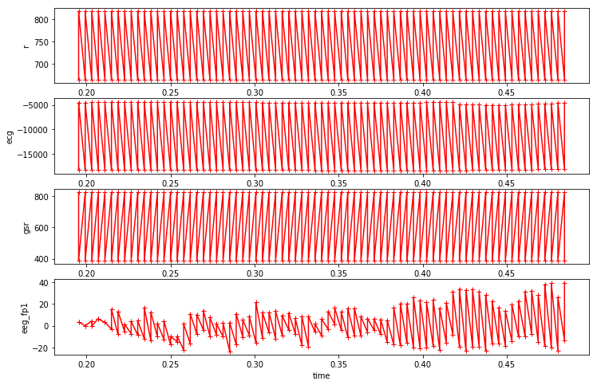

#### Off by one error in to_sequences
Last week I fixed two minor looking off by one errors in my `to_sequences`  func.
I oringinally borrowed this func from  https://github.com/jeffheaton/t81_558_deep_learning/blob/master/t81_558_class10_lstm.ipynb
, and I modified it for my use case, but I may have introduced a copy error.

I had been using as the label of a sequence the y value of the element after the  sequence insteada of the last element of the sequence. Given the nature of continuous data, this might not make a difference, but I changed this just in case.

#### Different data
Since also in the previous week I started questioning whether the `'r', 'ecg', 'gsr'` features had good signal, (and although I think I had accidentally combined data for two `seats` in the post analysis, I think I should still look at the rest of the features anyhow). 

#### Different window sizes
Up until now I had been using a window size of `256`, which has been blowing up my memory whenenever I tried this, so now out of curiosity I want to try `64` or `128`.

#### Scaling
I think earlier, I did not use the other features because I was having weird outputs from scaling. Maybe I can revisit this again.

#### Possibly a more online approach to learning?
Since this data is super huge (especially when sequencifying it), I wonder if it is possible
to try learning in chunks. As far as I understand, multiple calls to `fit` in keras are perfectly fine and tensorflow style weight updates are done in a for loop anyway. I just need to improve the data feeding logistics..


```python
from importlib import reload
import os
import pandas as pd
from io import StringIO
import itertools

import datetime
from collections import Counter


import tensorflow as tf
from tensorflow import keras

# Helper libraries
import numpy as np
import matplotlib.pyplot as plt

print(tf.__version__)

from keras.preprocessing import sequence
from keras.models import Sequential
from keras.layers import Dense, Embedding
from keras.layers import LSTM

from keras.callbacks import EarlyStopping

from sklearn.preprocessing import StandardScaler

import mytf.s3utils as msu
import mytf.utils as mu
import mytf.plot as mp
```

    1.14.0


```python
# I had 
crew1df = pd.read_pickle('data/crew_1-train.pkl')
crew2df = pd.read_pickle('data/crew_2-train.pkl')

df1to2 = pd.concat([crew1df, crew2df])

cols = ['r', 'ecg', 'gsr', 'eeg_fp1','eeg_f7', 'eeg_f8', 'eeg_t4', 'eeg_t6', ]

```


```python
mp.produce_plots_for_col(
    crew1df, ['r', 'ecg', 'gsr', 'eeg_fp1',], range(50, 200)
)
```





```python
crew1df.iloc[50:60][['time','crew', 'seat', 'event', 'ecg']]
```


<div>
<style scoped>
    .dataframe tbody tr th:only-of-type {
        vertical-align: middle;
    }

    .dataframe tbody tr th {
        vertical-align: top;
    }

    .dataframe thead th {
        text-align: right;
    }
</style>
<table border="1" class="dataframe">
  <thead>
    <tr style="text-align: right;">
      <th></th>
      <th>time</th>
      <th>crew</th>
      <th>seat</th>
      <th>event</th>
      <th>ecg</th>
    </tr>
  </thead>
  <tbody>
    <tr>
      <th>144</th>
      <td>0.378906</td>
      <td>1</td>
      <td>0</td>
      <td>A</td>
      <td>-18278.90039</td>
    </tr>
    <tr>
      <th>146</th>
      <td>0.382812</td>
      <td>1</td>
      <td>0</td>
      <td>A</td>
      <td>-18278.90039</td>
    </tr>
    <tr>
      <th>148</th>
      <td>0.386719</td>
      <td>1</td>
      <td>0</td>
      <td>A</td>
      <td>-18278.90039</td>
    </tr>
    <tr>
      <th>150</th>
      <td>0.390625</td>
      <td>1</td>
      <td>0</td>
      <td>A</td>
      <td>-18278.90039</td>
    </tr>
    <tr>
      <th>152</th>
      <td>0.394531</td>
      <td>1</td>
      <td>0</td>
      <td>A</td>
      <td>-18278.90039</td>
    </tr>
    <tr>
      <th>154</th>
      <td>0.398438</td>
      <td>1</td>
      <td>0</td>
      <td>A</td>
      <td>-18278.90039</td>
    </tr>
    <tr>
      <th>156</th>
      <td>0.402344</td>
      <td>1</td>
      <td>0</td>
      <td>A</td>
      <td>-18278.90039</td>
    </tr>
    <tr>
      <th>158</th>
      <td>0.406250</td>
      <td>1</td>
      <td>0</td>
      <td>A</td>
      <td>-18278.90039</td>
    </tr>
    <tr>
      <th>160</th>
      <td>0.410156</td>
      <td>1</td>
      <td>0</td>
      <td>A</td>
      <td>-18278.90039</td>
    </tr>
    <tr>
      <th>162</th>
      <td>0.414062</td>
      <td>1</td>
      <td>0</td>
      <td>A</td>
      <td>-18278.90039</td>
    </tr>
  </tbody>
</table>
</div>


```python
print(crew1df.shape)
crew1df.index = list(range(crew1df.shape[0]))
```

    (447652, 28)


```python
crew1df.iloc[:10][['time','crew', 'seat', 'event', 'ecg']]
```


<div>
<style scoped>
    .dataframe tbody tr th:only-of-type {
        vertical-align: middle;
    }

    .dataframe tbody tr th {
        vertical-align: top;
    }

    .dataframe thead th {
        text-align: right;
    }
</style>
<table border="1" class="dataframe">
  <thead>
    <tr style="text-align: right;">
      <th></th>
      <th>time</th>
      <th>crew</th>
      <th>seat</th>
      <th>event</th>
      <th>ecg</th>
    </tr>
  </thead>
  <tbody>
    <tr>
      <th>0</th>
      <td>0.183594</td>
      <td>1</td>
      <td>0</td>
      <td>A</td>
      <td>-18260.80078</td>
    </tr>
    <tr>
      <th>1</th>
      <td>0.187500</td>
      <td>1</td>
      <td>0</td>
      <td>A</td>
      <td>-18260.80078</td>
    </tr>
    <tr>
      <th>2</th>
      <td>0.191406</td>
      <td>1</td>
      <td>0</td>
      <td>A</td>
      <td>-18260.80078</td>
    </tr>
    <tr>
      <th>3</th>
      <td>0.195312</td>
      <td>1</td>
      <td>0</td>
      <td>A</td>
      <td>-18260.80078</td>
    </tr>
    <tr>
      <th>4</th>
      <td>0.199219</td>
      <td>1</td>
      <td>0</td>
      <td>A</td>
      <td>-18260.80078</td>
    </tr>
    <tr>
      <th>5</th>
      <td>0.203125</td>
      <td>1</td>
      <td>0</td>
      <td>A</td>
      <td>-18260.80078</td>
    </tr>
    <tr>
      <th>6</th>
      <td>0.207031</td>
      <td>1</td>
      <td>0</td>
      <td>A</td>
      <td>-18260.80078</td>
    </tr>
    <tr>
      <th>7</th>
      <td>0.210938</td>
      <td>1</td>
      <td>0</td>
      <td>A</td>
      <td>-18260.80078</td>
    </tr>
    <tr>
      <th>8</th>
      <td>0.214844</td>
      <td>1</td>
      <td>0</td>
      <td>A</td>
      <td>-18261.69922</td>
    </tr>
    <tr>
      <th>9</th>
      <td>0.218750</td>
      <td>1</td>
      <td>0</td>
      <td>A</td>
      <td>-18261.69922</td>
    </tr>
  </tbody>
</table>
</div>


```python
mp.produce_plots_for_col(
    crew1df, ['r', 'ecg', 'gsr', 'eeg_fp1',], range(0, 200)
)
```


```python
print(crew1df.shape)
crew2df.index = list(range(crew2df.shape[0]))
```

    (447652, 28)


```python
df1to2 = pd.concat([crew1df, crew2df])
```


```python
crew1df.shape , crew2df.shape, df1to2.shape
```


    ((447652, 28), (552868, 28), (1000520, 28))


```python
mu.make_data?
```


```python
!pip install ipdb
```

    Collecting ipdb
      Downloading https://files.pythonhosted.org/packages/df/78/3d0d7253dc85549db182cbe4b43b30c506c84008fcd39898122c9b6306a9/ipdb-0.12.2.tar.gz
    Requirement already satisfied: setuptools in /home/ec2-user/anaconda3/envs/tensorflow_p36/lib/python3.6/site-packages (from ipdb) (41.0.1)
    Requirement already satisfied: ipython>=5.1.0 in /home/ec2-user/anaconda3/envs/tensorflow_p36/lib/python3.6/site-packages (from ipdb) (6.4.0)
    Requirement already satisfied: prompt-toolkit<2.0.0,>=1.0.15 in /home/ec2-user/anaconda3/envs/tensorflow_p36/lib/python3.6/site-packages (from ipython>=5.1.0->ipdb) (1.0.15)
    Requirement already satisfied: backcall in /home/ec2-user/anaconda3/envs/tensorflow_p36/lib/python3.6/site-packages (from ipython>=5.1.0->ipdb) (0.1.0)
    Requirement already satisfied: simplegeneric>0.8 in /home/ec2-user/anaconda3/envs/tensorflow_p36/lib/python3.6/site-packages (from ipython>=5.1.0->ipdb) (0.8.1)
    Requirement already satisfied: pickleshare in /home/ec2-user/anaconda3/envs/tensorflow_p36/lib/python3.6/site-packages (from ipython>=5.1.0->ipdb) (0.7.4)
    Requirement already satisfied: jedi>=0.10 in /home/ec2-user/anaconda3/envs/tensorflow_p36/lib/python3.6/site-packages (from ipython>=5.1.0->ipdb) (0.12.0)
    Requirement already satisfied: pexpect; sys_platform != "win32" in /home/ec2-user/anaconda3/envs/tensorflow_p36/lib/python3.6/site-packages (from ipython>=5.1.0->ipdb) (4.5.0)
    Requirement already satisfied: decorator in /home/ec2-user/anaconda3/envs/tensorflow_p36/lib/python3.6/site-packages (from ipython>=5.1.0->ipdb) (4.3.0)
    Requirement already satisfied: pygments in /home/ec2-user/anaconda3/envs/tensorflow_p36/lib/python3.6/site-packages (from ipython>=5.1.0->ipdb) (2.2.0)
    Requirement already satisfied: traitlets>=4.2 in /home/ec2-user/anaconda3/envs/tensorflow_p36/lib/python3.6/site-packages (from ipython>=5.1.0->ipdb) (4.3.2)
    Requirement already satisfied: six>=1.9.0 in /home/ec2-user/anaconda3/envs/tensorflow_p36/lib/python3.6/site-packages (from prompt-toolkit<2.0.0,>=1.0.15->ipython>=5.1.0->ipdb) (1.11.0)
    Requirement already satisfied: wcwidth in /home/ec2-user/anaconda3/envs/tensorflow_p36/lib/python3.6/site-packages (from prompt-toolkit<2.0.0,>=1.0.15->ipython>=5.1.0->ipdb) (0.1.7)
    Requirement already satisfied: parso>=0.2.0 in /home/ec2-user/anaconda3/envs/tensorflow_p36/lib/python3.6/site-packages (from jedi>=0.10->ipython>=5.1.0->ipdb) (0.2.0)
    Requirement already satisfied: ptyprocess>=0.5 in /home/ec2-user/anaconda3/envs/tensorflow_p36/lib/python3.6/site-packages (from pexpect; sys_platform != "win32"->ipython>=5.1.0->ipdb) (0.5.2)
    Requirement already satisfied: ipython_genutils in /home/ec2-user/anaconda3/envs/tensorflow_p36/lib/python3.6/site-packages (from traitlets>=4.2->ipython>=5.1.0->ipdb) (0.2.0)
    Building wheels for collected packages: ipdb
      Running setup.py bdist_wheel for ipdb ... [?25ldone
    [?25h  Stored in directory: /home/ec2-user/.cache/pip/wheels/7a/00/07/c906eaf1b90367fbb81bd840e56bf8859dbd3efe3838c0b4ba
    Successfully built ipdb
    Installing collected packages: ipdb
    Successfully installed ipdb-0.12.2
    You are using pip version 10.0.1, however version 19.3.1 is available.
    You should consider upgrading via the 'pip install --upgrade pip' command.


```python

reload(mu)
```


    <module 'mytf.utils' from '/home/ec2-user/SageMaker/aviation-pilot-physiology-hmm/mytf/utils.py'>


```python
%%time
with ipdb.launch_ipdb_on_exception():
    out = mu.make_data(df1to2, crews={'training': [1],
                        'test': [2]},
                  window_size=64,
                   row_batch_size=10000,
             feature_cols=cols,
                  save_dir='data')
```

    Start building training set 2019-11-04T003043Z
    num slices 44
    size_remainder,  7652
    Start building testing set 2019-11-04T003119Z
    num slices 55
    size_remainder,  2868
    CPU times: user 1min 9s, sys: 9.73 s, total: 1min 19s
    Wall time: 1min 19s


```python
with h5py.File('data/test.h5', 'r+') as fd:
    print(list(fd.keys()))

```

    ['dataset_0_X', 'dataset_0_Y', 'dataset_10_X', 'dataset_10_Y', 'dataset_11_X', 'dataset_11_Y', 'dataset_12_X', 'dataset_12_Y', 'dataset_13_X', 'dataset_13_Y', 'dataset_14_X', 'dataset_14_Y', 'dataset_15_X', 'dataset_15_Y', 'dataset_16_X', 'dataset_16_Y', 'dataset_17_X', 'dataset_17_Y', 'dataset_18_X', 'dataset_18_Y', 'dataset_19_X', 'dataset_19_Y', 'dataset_1_X', 'dataset_1_Y', 'dataset_20_X', 'dataset_20_Y', 'dataset_21_X', 'dataset_21_Y', 'dataset_22_X', 'dataset_22_Y', 'dataset_23_X', 'dataset_23_Y', 'dataset_24_X', 'dataset_24_Y', 'dataset_25_X', 'dataset_25_Y', 'dataset_26_X', 'dataset_26_Y', 'dataset_27_X', 'dataset_27_Y', 'dataset_28_X', 'dataset_28_Y', 'dataset_29_X', 'dataset_29_Y', 'dataset_2_X', 'dataset_2_Y', 'dataset_30_X', 'dataset_30_Y', 'dataset_31_X', 'dataset_31_Y', 'dataset_32_X', 'dataset_32_Y', 'dataset_33_X', 'dataset_33_Y', 'dataset_34_X', 'dataset_34_Y', 'dataset_35_X', 'dataset_35_Y', 'dataset_36_X', 'dataset_36_Y', 'dataset_37_X', 'dataset_37_Y', 'dataset_38_X', 'dataset_38_Y', 'dataset_39_X', 'dataset_39_Y', 'dataset_3_X', 'dataset_3_Y', 'dataset_40_X', 'dataset_40_Y', 'dataset_41_X', 'dataset_41_Y', 'dataset_42_X', 'dataset_42_Y', 'dataset_43_X', 'dataset_43_Y', 'dataset_44_X', 'dataset_44_Y', 'dataset_45_X', 'dataset_45_Y', 'dataset_46_X', 'dataset_46_Y', 'dataset_47_X', 'dataset_47_Y', 'dataset_48_X', 'dataset_48_Y', 'dataset_49_X', 'dataset_49_Y', 'dataset_4_X', 'dataset_4_Y', 'dataset_50_X', 'dataset_50_Y', 'dataset_51_X', 'dataset_51_Y', 'dataset_52_X', 'dataset_52_Y', 'dataset_53_X', 'dataset_53_Y', 'dataset_54_X', 'dataset_54_Y', 'dataset_55_X', 'dataset_55_Y', 'dataset_5_X', 'dataset_5_Y', 'dataset_6_X', 'dataset_6_Y', 'dataset_7_X', 'dataset_7_Y', 'dataset_8_X', 'dataset_8_Y', 'dataset_9_X', 'dataset_9_Y']


```python
with h5py.File('data/test.h5', 'r+') as fd:
    X1 = fd['dataset_0_X'].__array__()
    Y1 = fd['dataset_0_Y'].__array__()
```


```python
Y1[:10]

Counter([np.argmax(Y1[i]) for i in range(Y1.shape[0])]
)
```


    Counter({0: 117, 2: 9819})


```python
Y1.file
```


    ---------------------------------------------------------------------------

    RuntimeError                              Traceback (most recent call last)

    <ipython-input-54-22669eeab91e> in <module>()
    ----> 1 Y1.file
    

    ~/anaconda3/envs/tensorflow_p36/lib/python3.6/site-packages/h5py/_hl/base.py in file(self)
        214         from . import files
        215         with phil:
    --> 216             return files.File(self.id)
        217 
        218     @property


    ~/anaconda3/envs/tensorflow_p36/lib/python3.6/site-packages/h5py/_hl/files.py in __init__(self, name, mode, driver, libver, userblock_size, swmr, **kwds)
        305         if isinstance(name, _objects.ObjectID):
        306             with phil:
    --> 307                 fid = h5i.get_file_id(name)
        308         else:
        309             name = filename_encode(name)


    h5py/_objects.pyx in h5py._objects.with_phil.wrapper()


    h5py/_objects.pyx in h5py._objects.with_phil.wrapper()


    h5py/h5i.pyx in h5py.h5i.get_file_id()


    RuntimeError: Can't retrieve file id (invalid object ID)


```python
!top
```


    ---------------------------------------------------------------------------

    OSError                                   Traceback (most recent call last)

    <ipython-input-31-b16953238af9> in <module>()
    ----> 1 get_ipython().system('top')
    

    ~/anaconda3/envs/tensorflow_p36/lib/python3.6/site-packages/IPython/core/interactiveshell.py in system_piped(self, cmd)
       2259         # a non-None value would trigger :func:`sys.displayhook` calls.
       2260         # Instead, we store the exit_code in user_ns.
    -> 2261         self.user_ns['_exit_code'] = system(self.var_expand(cmd, depth=1))
       2262 
       2263     def system_raw(self, cmd):


    ~/anaconda3/envs/tensorflow_p36/lib/python3.6/site-packages/IPython/utils/_process_posix.py in system(self, cmd)
        154                 child = pexpect.spawnb(self.sh, args=['-c', cmd]) # Pexpect-U
        155             else:
    --> 156                 child = pexpect.spawn(self.sh, args=['-c', cmd])  # Vanilla Pexpect
        157             flush = sys.stdout.flush
        158             while True:


    ~/anaconda3/envs/tensorflow_p36/lib/python3.6/site-packages/pexpect/pty_spawn.py in __init__(self, command, args, timeout, maxread, searchwindowsize, logfile, cwd, env, ignore_sighup, echo, preexec_fn, encoding, codec_errors, dimensions, use_poll)
        202             self.name = '<pexpect factory incomplete>'
        203         else:
    --> 204             self._spawn(command, args, preexec_fn, dimensions)
        205         self.use_poll = use_poll
        206 


    ~/anaconda3/envs/tensorflow_p36/lib/python3.6/site-packages/pexpect/pty_spawn.py in _spawn(self, command, args, preexec_fn, dimensions)
        301 
        302         self.ptyproc = self._spawnpty(self.args, env=self.env,
    --> 303                                      cwd=self.cwd, **kwargs)
        304 
        305         self.pid = self.ptyproc.pid


    ~/anaconda3/envs/tensorflow_p36/lib/python3.6/site-packages/pexpect/pty_spawn.py in _spawnpty(self, args, **kwargs)
        312     def _spawnpty(self, args, **kwargs):
        313         '''Spawn a pty and return an instance of PtyProcess.'''
    --> 314         return ptyprocess.PtyProcess.spawn(args, **kwargs)
        315 
        316     def close(self, force=True):


    ~/anaconda3/envs/tensorflow_p36/lib/python3.6/site-packages/ptyprocess/ptyprocess.py in spawn(cls, argv, cwd, env, echo, preexec_fn, dimensions)
        220 
        221         if use_native_pty_fork:
    --> 222             pid, fd = pty.fork()
        223         else:
        224             # Use internal fork_pty, for Solaris


    ~/anaconda3/envs/tensorflow_p36/lib/python3.6/pty.py in fork()
         95 
         96     master_fd, slave_fd = openpty()
    ---> 97     pid = os.fork()
         98     if pid == CHILD:
         99         # Establish a new session.


    OSError: [Errno 12] Cannot allocate memory

