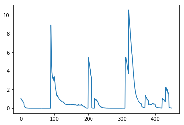
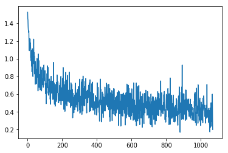
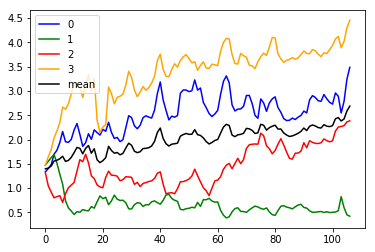

```python

# Helper libraries
import numpy as np
import matplotlib.pyplot as plt
import time
import json
import os
from tensorflow import keras
import tensorflow as tf
from tqdm import tqdm
import mytf.utils as mu

```


```python
tf.enable_eager_execution()

```


```python
historydir = 'history'
with open(f'{historydir}/2019-12-01T223537Z.json') as fd:
    losshistory = json.load(fd)
    
plt.plot(losshistory) 
```


    [<matplotlib.lines.Line2D at 0x7f446828ce80>]





```python
'2019-12-08T220612Z'

historydir = 'history'
with open(f'{historydir}/2019-12-08T220612Z/01068_train_loss_history.json') as fd:
    losshistory = json.load(fd)
    
plt.plot(losshistory) 
```


    [<matplotlib.lines.Line2D at 0x7f8a94071358>]





```python
from tensorflow import keras
import mytf.utils as mu
import ipdb
from tqdm import tqdm
```


```python
def get_performance_parts(model, dataloc, dataset_names):
    # dataloc contains the test data..
    lossvec = []
    for Xdataset, Ydataset in tqdm(dataset_names):

        X, Ylabels = mu.read_h5_two(dataloc, Xdataset, Ydataset) 
        parts = mu.get_partitions(range(X.shape[0]), 100)
        batchlosses = []
        for part in parts:
            preds = model(X[part].astype('float32'))
            loss = tf.losses.sparse_softmax_cross_entropy(
                        labels=Ylabels[part].astype('int64'),
                        logits=preds.numpy()).numpy()
            batchlosses.append(loss)

        lossvec.append(np.mean(batchlosses))
    return lossvec


```


```python
# mu.get_performance(model, dataloc, dataset_names)
def perf_wrapper(modelloc):
    model = mu.load_model(modelloc)
    #mu.get_performance(model=model, 
    return get_performance_parts(
                    model=model,
                    dataloc='data/2019-12-07-test-balanced.h5',
                    dataset_names=[['X_0', 'Ylabels_0'],
                                  ['X_1', 'Ylabels_1'],
                                  ['X_2', 'Ylabels_2'],
                                  ['X_3', 'Ylabels_3']])
```


```python
import os; os.getpid()
```


    10936


```python
batch_losses_vec = []
for step in np.arange(0, 1068, 10):
    print(step)
    modelname = f'history/2019-12-08T220612Z/{str(step).zfill(5)}_model.h5'
    print(modelname)
    steploss = perf_wrapper(modelname)
    print('steploss, ', steploss)
    batch_losses_vec.append(steploss)
```

    0
    history/2019-12-08T220612Z/00000_model.h5


    W1208 22:36:50.513340 140235498792768 hdf5_format.py:221] No training configuration found in save file: the model was *not* compiled. Compile it manually.
      0%|          | 0/4 [00:00<?, ?it/s]

    num slices 160
    size_remainder,  80


     25%|██▌       | 1/4 [00:31<01:35, 31.95s/it]

    num slices 153
    size_remainder,  71


     50%|█████     | 2/4 [01:00<01:01, 30.95s/it]

    num slices 197
    size_remainder,  55


     75%|███████▌  | 3/4 [01:38<00:32, 32.91s/it]

    num slices 155
    size_remainder,  42


    100%|██████████| 4/4 [02:07<00:00, 31.76s/it]


    steploss,  [1.3351634, 1.4731871, 1.3140502, 1.4657389]
    10
    history/2019-12-08T220612Z/00010_model.h5


    W1208 22:38:57.902706 140235498792768 hdf5_format.py:221] No training configuration found in save file: the model was *not* compiled. Compile it manually.
      0%|          | 0/4 [00:00<?, ?it/s]

    num slices 160
    size_remainder,  80


     25%|██▌       | 1/4 [00:30<01:32, 30.82s/it]

    num slices 153
    size_remainder,  71


     50%|█████     | 2/4 [00:59<01:00, 30.15s/it]

    num slices 197
    size_remainder,  55


     75%|███████▌  | 3/4 [01:38<00:32, 32.85s/it]

    num slices 155
    size_remainder,  42


    100%|██████████| 4/4 [02:07<00:00, 31.96s/it]


    steploss,  [1.4036251, 1.5530692, 1.0446882, 1.645331]
    20
    history/2019-12-08T220612Z/00020_model.h5


    W1208 22:41:06.212420 140235498792768 hdf5_format.py:221] No training configuration found in save file: the model was *not* compiled. Compile it manually.
      0%|          | 0/4 [00:00<?, ?it/s]

    num slices 160
    size_remainder,  80


     25%|██▌       | 1/4 [00:30<01:31, 30.53s/it]

    num slices 153
    size_remainder,  71


     50%|█████     | 2/4 [00:59<01:00, 30.04s/it]

    num slices 197
    size_remainder,  55


     75%|███████▌  | 3/4 [01:37<00:32, 32.31s/it]

    num slices 155
    size_remainder,  42


    100%|██████████| 4/4 [02:07<00:00, 31.93s/it]


    steploss,  [1.4810811, 1.6259581, 0.91911376, 1.7881192]
    30
    history/2019-12-08T220612Z/00030_model.h5


    W1208 22:43:14.271758 140235498792768 hdf5_format.py:221] No training configuration found in save file: the model was *not* compiled. Compile it manually.
      0%|          | 0/4 [00:00<?, ?it/s]

    num slices 160
    size_remainder,  80


     25%|██▌       | 1/4 [00:30<01:31, 30.42s/it]

    num slices 153
    size_remainder,  71


     50%|█████     | 2/4 [00:59<00:59, 30.00s/it]

    num slices 197
    size_remainder,  55


     75%|███████▌  | 3/4 [01:36<00:32, 32.22s/it]

    num slices 155
    size_remainder,  42


    100%|██████████| 4/4 [02:06<00:00, 31.71s/it]


    steploss,  [1.6964207, 1.6927042, 0.8015094, 2.0324314]
    40
    history/2019-12-08T220612Z/00040_model.h5


    W1208 22:45:21.598507 140235498792768 hdf5_format.py:221] No training configuration found in save file: the model was *not* compiled. Compile it manually.
      0%|          | 0/4 [00:00<?, ?it/s]

    num slices 160
    size_remainder,  80


     25%|██▌       | 1/4 [00:30<01:31, 30.47s/it]

    num slices 153
    size_remainder,  71


     50%|█████     | 2/4 [01:00<01:00, 30.47s/it]

    num slices 197
    size_remainder,  55


     75%|███████▌  | 3/4 [01:37<00:32, 32.42s/it]

    num slices 155
    size_remainder,  42


    100%|██████████| 4/4 [02:07<00:00, 31.93s/it]


    steploss,  [1.7781167, 1.5143406, 0.8248832, 2.1740363]
    50
    history/2019-12-08T220612Z/00050_model.h5


    W1208 22:47:29.679005 140235498792768 hdf5_format.py:221] No training configuration found in save file: the model was *not* compiled. Compile it manually.
      0%|          | 0/4 [00:00<?, ?it/s]

    num slices 160
    size_remainder,  80


     25%|██▌       | 1/4 [00:30<01:30, 30.04s/it]

    num slices 153
    size_remainder,  71


     50%|█████     | 2/4 [00:59<00:59, 29.87s/it]

    num slices 197
    size_remainder,  55


     75%|███████▌  | 3/4 [01:36<00:32, 32.10s/it]

    num slices 155
    size_remainder,  42


    100%|██████████| 4/4 [02:07<00:00, 31.98s/it]


    steploss,  [1.935156, 1.2892603, 0.84526, 2.3428662]
    60
    history/2019-12-08T220612Z/00060_model.h5


    W1208 22:49:37.933955 140235498792768 hdf5_format.py:221] No training configuration found in save file: the model was *not* compiled. Compile it manually.
      0%|          | 0/4 [00:00<?, ?it/s]

    num slices 160
    size_remainder,  80


     25%|██▌       | 1/4 [00:30<01:31, 30.37s/it]

    num slices 153
    size_remainder,  71


     50%|█████     | 2/4 [00:59<01:00, 30.09s/it]

    num slices 197
    size_remainder,  55


     75%|███████▌  | 3/4 [01:37<00:32, 32.29s/it]

    num slices 155
    size_remainder,  42


    100%|██████████| 4/4 [02:06<00:00, 31.70s/it]


    steploss,  [2.1638696, 1.0792673, 0.70872974, 2.6655743]
    70
    history/2019-12-08T220612Z/00070_model.h5


    W1208 22:51:45.103929 140235498792768 hdf5_format.py:221] No training configuration found in save file: the model was *not* compiled. Compile it manually.
      0%|          | 0/4 [00:00<?, ?it/s]

    num slices 160
    size_remainder,  80


     25%|██▌       | 1/4 [00:31<01:35, 31.86s/it]

    num slices 153
    size_remainder,  71


     50%|█████     | 2/4 [01:01<01:02, 31.09s/it]

    num slices 197
    size_remainder,  55


     75%|███████▌  | 3/4 [01:38<00:33, 33.03s/it]

    num slices 155
    size_remainder,  42


    100%|██████████| 4/4 [02:07<00:00, 32.00s/it]


    steploss,  [1.9534022, 0.73756737, 0.8852098, 2.622182]
    80
    history/2019-12-08T220612Z/00080_model.h5


    W1208 22:53:53.603564 140235498792768 hdf5_format.py:221] No training configuration found in save file: the model was *not* compiled. Compile it manually.
      0%|          | 0/4 [00:00<?, ?it/s]

    num slices 160
    size_remainder,  80


     25%|██▌       | 1/4 [00:30<01:31, 30.55s/it]

    num slices 153
    size_remainder,  71


     50%|█████     | 2/4 [00:59<01:00, 30.05s/it]

    num slices 197
    size_remainder,  55


     75%|███████▌  | 3/4 [01:38<00:32, 32.67s/it]

    num slices 155
    size_remainder,  42


    100%|██████████| 4/4 [02:06<00:00, 31.73s/it]


    steploss,  [1.9406806, 0.5933818, 1.0058273, 2.7354705]
    90
    history/2019-12-08T220612Z/00090_model.h5


    W1208 22:56:00.893813 140235498792768 hdf5_format.py:221] No training configuration found in save file: the model was *not* compiled. Compile it manually.
      0%|          | 0/4 [00:00<?, ?it/s]

    num slices 160
    size_remainder,  80


     25%|██▌       | 1/4 [00:30<01:31, 30.36s/it]

    num slices 153
    size_remainder,  71


     50%|█████     | 2/4 [00:58<00:59, 29.80s/it]

    num slices 197
    size_remainder,  55


     75%|███████▌  | 3/4 [01:36<00:32, 32.06s/it]

    num slices 155
    size_remainder,  42


    100%|██████████| 4/4 [02:05<00:00, 31.26s/it]


    steploss,  [2.0017438, 0.5292517, 1.0626508, 2.9350176]
    100
    history/2019-12-08T220612Z/00100_model.h5


    W1208 22:58:06.454778 140235498792768 hdf5_format.py:221] No training configuration found in save file: the model was *not* compiled. Compile it manually.
      0%|          | 0/4 [00:00<?, ?it/s]

    num slices 160
    size_remainder,  80


     25%|██▌       | 1/4 [00:31<01:33, 31.31s/it]

    num slices 153
    size_remainder,  71


     50%|█████     | 2/4 [00:59<01:00, 30.46s/it]

    num slices 197
    size_remainder,  55


     75%|███████▌  | 3/4 [01:36<00:32, 32.40s/it]

    num slices 155
    size_remainder,  42


    100%|██████████| 4/4 [02:05<00:00, 31.48s/it]


    steploss,  [2.196939, 0.45657447, 1.1189158, 3.1512318]
    110
    history/2019-12-08T220612Z/00110_model.h5


    W1208 23:00:12.708862 140235498792768 hdf5_format.py:221] No training configuration found in save file: the model was *not* compiled. Compile it manually.
      0%|          | 0/4 [00:00<?, ?it/s]

    num slices 160
    size_remainder,  80


     25%|██▌       | 1/4 [00:30<01:31, 30.62s/it]

    num slices 153
    size_remainder,  71


     50%|█████     | 2/4 [01:00<01:01, 30.54s/it]

    num slices 197
    size_remainder,  55


     75%|███████▌  | 3/4 [01:38<00:32, 32.49s/it]

    num slices 155
    size_remainder,  42


    100%|██████████| 4/4 [02:07<00:00, 31.82s/it]


    steploss,  [2.329297, 0.51421535, 1.352263, 3.1518145]
    120
    history/2019-12-08T220612Z/00120_model.h5


    W1208 23:02:20.350752 140235498792768 hdf5_format.py:221] No training configuration found in save file: the model was *not* compiled. Compile it manually.
      0%|          | 0/4 [00:00<?, ?it/s]

    num slices 160
    size_remainder,  80


     25%|██▌       | 1/4 [00:29<01:29, 29.97s/it]

    num slices 153
    size_remainder,  71


     50%|█████     | 2/4 [00:59<00:59, 29.72s/it]

    num slices 197
    size_remainder,  55


     75%|███████▌  | 3/4 [01:35<00:31, 31.86s/it]

    num slices 155
    size_remainder,  42


    100%|██████████| 4/4 [02:06<00:00, 31.65s/it]


    steploss,  [2.1047034, 0.5037825, 1.5859323, 3.08032]
    130
    history/2019-12-08T220612Z/00130_model.h5


    W1208 23:04:27.466412 140235498792768 hdf5_format.py:221] No training configuration found in save file: the model was *not* compiled. Compile it manually.
      0%|          | 0/4 [00:00<?, ?it/s]

    num slices 160
    size_remainder,  80


     25%|██▌       | 1/4 [00:29<01:29, 29.71s/it]

    num slices 153
    size_remainder,  71


     50%|█████     | 2/4 [00:58<00:59, 29.51s/it]

    num slices 197
    size_remainder,  55


     75%|███████▌  | 3/4 [01:35<00:31, 31.72s/it]

    num slices 155
    size_remainder,  42


    100%|██████████| 4/4 [02:04<00:00, 31.23s/it]


    steploss,  [1.8594807, 0.5587238, 1.5429379, 2.8631775]
    140
    history/2019-12-08T220612Z/00140_model.h5


    W1208 23:06:32.740970 140235498792768 hdf5_format.py:221] No training configuration found in save file: the model was *not* compiled. Compile it manually.
      0%|          | 0/4 [00:00<?, ?it/s]

    num slices 160
    size_remainder,  80


     25%|██▌       | 1/4 [00:30<01:30, 30.05s/it]

    num slices 153
    size_remainder,  71


     50%|█████     | 2/4 [01:00<01:00, 30.19s/it]

    num slices 197
    size_remainder,  55


     75%|███████▌  | 3/4 [01:37<00:32, 32.22s/it]

    num slices 155
    size_remainder,  42


    100%|██████████| 4/4 [02:06<00:00, 31.65s/it]


    steploss,  [1.9347439, 0.5394595, 1.6954019, 3.0993047]
    150
    history/2019-12-08T220612Z/00150_model.h5


    W1208 23:08:39.711524 140235498792768 hdf5_format.py:221] No training configuration found in save file: the model was *not* compiled. Compile it manually.
      0%|          | 0/4 [00:00<?, ?it/s]

    num slices 160
    size_remainder,  80


     25%|██▌       | 1/4 [00:30<01:30, 30.07s/it]

    num slices 153
    size_remainder,  71


     50%|█████     | 2/4 [00:58<00:59, 29.67s/it]

    num slices 197
    size_remainder,  55


     75%|███████▌  | 3/4 [01:37<00:32, 32.35s/it]

    num slices 155
    size_remainder,  42


    100%|██████████| 4/4 [02:06<00:00, 31.67s/it]


    steploss,  [2.1181533, 0.5336305, 1.5180852, 3.3368828]
    160
    history/2019-12-08T220612Z/00160_model.h5


    W1208 23:10:46.943087 140235498792768 hdf5_format.py:221] No training configuration found in save file: the model was *not* compiled. Compile it manually.
      0%|          | 0/4 [00:00<?, ?it/s]

    num slices 160
    size_remainder,  80


     25%|██▌       | 1/4 [00:30<01:30, 30.18s/it]

    num slices 153
    size_remainder,  71


     50%|█████     | 2/4 [00:58<00:59, 29.71s/it]

    num slices 197
    size_remainder,  55


     75%|███████▌  | 3/4 [01:36<00:31, 31.97s/it]

    num slices 155
    size_remainder,  42


    100%|██████████| 4/4 [02:04<00:00, 31.22s/it]


    steploss,  [2.0038323, 0.6204544, 1.2530756, 2.9970613]
    170
    history/2019-12-08T220612Z/00170_model.h5


    W1208 23:12:52.186210 140235498792768 hdf5_format.py:221] No training configuration found in save file: the model was *not* compiled. Compile it manually.
      0%|          | 0/4 [00:00<?, ?it/s]

    num slices 160
    size_remainder,  80


     25%|██▌       | 1/4 [00:31<01:35, 31.99s/it]

    num slices 153
    size_remainder,  71


     50%|█████     | 2/4 [01:00<01:01, 30.94s/it]

    num slices 197
    size_remainder,  55


     75%|███████▌  | 3/4 [01:37<00:32, 32.72s/it]

    num slices 155
    size_remainder,  42


    100%|██████████| 4/4 [02:06<00:00, 31.52s/it]


    steploss,  [2.1981256, 0.58792925, 1.1931396, 3.2589035]
    180
    history/2019-12-08T220612Z/00180_model.h5


    W1208 23:14:58.608531 140235498792768 hdf5_format.py:221] No training configuration found in save file: the model was *not* compiled. Compile it manually.
      0%|          | 0/4 [00:00<?, ?it/s]

    num slices 160
    size_remainder,  80


     25%|██▌       | 1/4 [00:30<01:31, 30.54s/it]

    num slices 153
    size_remainder,  71


     50%|█████     | 2/4 [00:59<00:59, 29.94s/it]

    num slices 197
    size_remainder,  55


     75%|███████▌  | 3/4 [01:37<00:32, 32.53s/it]

    num slices 155
    size_remainder,  42


    100%|██████████| 4/4 [02:06<00:00, 31.67s/it]


    steploss,  [2.1430426, 0.7190803, 1.0682174, 2.4001927]
    190
    history/2019-12-08T220612Z/00190_model.h5


    W1208 23:17:05.644954 140235498792768 hdf5_format.py:221] No training configuration found in save file: the model was *not* compiled. Compile it manually.
      0%|          | 0/4 [00:00<?, ?it/s]

    num slices 160
    size_remainder,  80


     25%|██▌       | 1/4 [00:30<01:32, 30.70s/it]

    num slices 153
    size_remainder,  71


     50%|█████     | 2/4 [00:59<01:00, 30.10s/it]

    num slices 197
    size_remainder,  55


     75%|███████▌  | 3/4 [01:36<00:32, 32.21s/it]

    num slices 155
    size_remainder,  42


    100%|██████████| 4/4 [02:06<00:00, 31.65s/it]


    steploss,  [2.0913672, 0.8401063, 1.0228812, 2.1404743]
    200
    history/2019-12-08T220612Z/00200_model.h5


    W1208 23:19:12.693792 140235498792768 hdf5_format.py:221] No training configuration found in save file: the model was *not* compiled. Compile it manually.
      0%|          | 0/4 [00:00<?, ?it/s]

    num slices 160
    size_remainder,  80


     25%|██▌       | 1/4 [00:30<01:32, 30.67s/it]

    num slices 153
    size_remainder,  71


     50%|█████     | 2/4 [00:59<01:00, 30.17s/it]

    num slices 197
    size_remainder,  55


     75%|███████▌  | 3/4 [01:36<00:32, 32.25s/it]

    num slices 155
    size_remainder,  42


    100%|██████████| 4/4 [02:06<00:00, 31.57s/it]


    steploss,  [2.2090833, 0.78182775, 1.0093541, 2.2566795]
    210
    history/2019-12-08T220612Z/00210_model.h5


    W1208 23:21:19.328857 140235498792768 hdf5_format.py:221] No training configuration found in save file: the model was *not* compiled. Compile it manually.
      0%|          | 0/4 [00:00<?, ?it/s]

    num slices 160
    size_remainder,  80


     25%|██▌       | 1/4 [00:30<01:30, 30.06s/it]

    num slices 153
    size_remainder,  71


     50%|█████     | 2/4 [01:00<01:00, 30.25s/it]

    num slices 197
    size_remainder,  55


     75%|███████▌  | 3/4 [01:37<00:32, 32.29s/it]

    num slices 155
    size_remainder,  42


    100%|██████████| 4/4 [02:07<00:00, 31.93s/it]


    steploss,  [2.1692474, 0.811452, 1.2212783, 2.3062282]
    220
    history/2019-12-08T220612Z/00220_model.h5


    W1208 23:23:27.384353 140235498792768 hdf5_format.py:221] No training configuration found in save file: the model was *not* compiled. Compile it manually.
      0%|          | 0/4 [00:00<?, ?it/s]

    num slices 160
    size_remainder,  80


     25%|██▌       | 1/4 [00:29<01:29, 29.84s/it]

    num slices 153
    size_remainder,  71


     50%|█████     | 2/4 [00:59<00:59, 29.64s/it]

    num slices 197
    size_remainder,  55


     75%|███████▌  | 3/4 [01:35<00:31, 31.79s/it]

    num slices 155
    size_remainder,  42


    100%|██████████| 4/4 [02:06<00:00, 31.64s/it]


    steploss,  [2.3541267, 0.65815514, 1.3489636, 3.077089]
    230
    history/2019-12-08T220612Z/00230_model.h5


    W1208 23:25:34.571402 140235498792768 hdf5_format.py:221] No training configuration found in save file: the model was *not* compiled. Compile it manually.
      0%|          | 0/4 [00:00<?, ?it/s]

    num slices 160
    size_remainder,  80


     25%|██▌       | 1/4 [00:29<01:29, 29.89s/it]

    num slices 153
    size_remainder,  71


     50%|█████     | 2/4 [00:58<00:59, 29.65s/it]

    num slices 197
    size_remainder,  55


     75%|███████▌  | 3/4 [01:36<00:31, 31.86s/it]

    num slices 155
    size_remainder,  42


    100%|██████████| 4/4 [02:06<00:00, 31.51s/it]


    steploss,  [2.1464877, 0.737907, 1.2662387, 2.9448156]
    240
    history/2019-12-08T220612Z/00240_model.h5


    W1208 23:27:40.935809 140235498792768 hdf5_format.py:221] No training configuration found in save file: the model was *not* compiled. Compile it manually.
      0%|          | 0/4 [00:00<?, ?it/s]

    num slices 160
    size_remainder,  80


     25%|██▌       | 1/4 [00:31<01:34, 31.46s/it]

    num slices 153
    size_remainder,  71


     50%|█████     | 2/4 [01:01<01:01, 30.90s/it]

    num slices 197
    size_remainder,  55


     75%|███████▌  | 3/4 [01:38<00:32, 32.79s/it]

    num slices 155
    size_remainder,  42


    100%|██████████| 4/4 [02:07<00:00, 31.78s/it]


    steploss,  [2.0213137, 0.8562525, 1.2609545, 2.7348871]
    250
    history/2019-12-08T220612Z/00250_model.h5


    W1208 23:29:48.421571 140235498792768 hdf5_format.py:221] No training configuration found in save file: the model was *not* compiled. Compile it manually.
      0%|          | 0/4 [00:00<?, ?it/s]

    num slices 160
    size_remainder,  80


     25%|██▌       | 1/4 [00:30<01:31, 30.36s/it]

    num slices 153
    size_remainder,  71


     50%|█████     | 2/4 [00:59<00:59, 29.88s/it]

    num slices 197
    size_remainder,  55


     75%|███████▌  | 3/4 [01:37<00:32, 32.44s/it]

    num slices 155
    size_remainder,  42


    100%|██████████| 4/4 [02:06<00:00, 31.62s/it]


    steploss,  [2.0428443, 0.77263075, 1.2463275, 2.8663592]
    260
    history/2019-12-08T220612Z/00260_model.h5


    W1208 23:31:55.242940 140235498792768 hdf5_format.py:221] No training configuration found in save file: the model was *not* compiled. Compile it manually.
      0%|          | 0/4 [00:00<?, ?it/s]

    num slices 160
    size_remainder,  80


     25%|██▌       | 1/4 [00:30<01:30, 30.23s/it]

    num slices 153
    size_remainder,  71


     50%|█████     | 2/4 [00:58<00:59, 29.68s/it]

    num slices 197
    size_remainder,  55


     75%|███████▌  | 3/4 [01:35<00:31, 31.93s/it]

    num slices 155
    size_remainder,  42


    100%|██████████| 4/4 [02:04<00:00, 31.16s/it]


    steploss,  [1.9546723, 0.7461912, 1.1496452, 2.8901618]
    270
    history/2019-12-08T220612Z/00270_model.h5


    W1208 23:34:00.490465 140235498792768 hdf5_format.py:221] No training configuration found in save file: the model was *not* compiled. Compile it manually.
      0%|          | 0/4 [00:00<?, ?it/s]

    num slices 160
    size_remainder,  80


     25%|██▌       | 1/4 [00:31<01:35, 31.81s/it]

    num slices 153
    size_remainder,  71


     50%|█████     | 2/4 [01:00<01:01, 30.90s/it]

    num slices 197
    size_remainder,  55


     75%|███████▌  | 3/4 [01:38<00:32, 32.94s/it]

    num slices 155
    size_remainder,  42


    100%|██████████| 4/4 [02:07<00:00, 31.87s/it]


    steploss,  [1.9966451, 0.7508285, 1.1748587, 2.9331622]
    280
    history/2019-12-08T220612Z/00280_model.h5


    W1208 23:36:08.344754 140235498792768 hdf5_format.py:221] No training configuration found in save file: the model was *not* compiled. Compile it manually.
      0%|          | 0/4 [00:00<?, ?it/s]

    num slices 160
    size_remainder,  80


     25%|██▌       | 1/4 [00:30<01:30, 30.31s/it]

    num slices 153
    size_remainder,  71


     50%|█████     | 2/4 [00:59<00:59, 29.84s/it]

    num slices 197
    size_remainder,  55


     75%|███████▌  | 3/4 [01:37<00:32, 32.44s/it]

    num slices 155
    size_remainder,  42


    100%|██████████| 4/4 [02:06<00:00, 31.73s/it]


    steploss,  [2.2410986, 0.69919235, 1.2346983, 3.122286]
    290
    history/2019-12-08T220612Z/00290_model.h5


    W1208 23:38:15.620586 140235498792768 hdf5_format.py:221] No training configuration found in save file: the model was *not* compiled. Compile it manually.
      0%|          | 0/4 [00:00<?, ?it/s]

    num slices 160
    size_remainder,  80


     25%|██▌       | 1/4 [00:29<01:29, 29.88s/it]

    num slices 153
    size_remainder,  71


     50%|█████     | 2/4 [00:58<00:59, 29.57s/it]

    num slices 197
    size_remainder,  55


     75%|███████▌  | 3/4 [01:35<00:31, 31.70s/it]

    num slices 155
    size_remainder,  42


    100%|██████████| 4/4 [02:06<00:00, 31.52s/it]


    steploss,  [2.4885015, 0.57462883, 1.2301722, 3.4027977]
    300
    history/2019-12-08T220612Z/00300_model.h5


    W1208 23:40:22.034533 140235498792768 hdf5_format.py:221] No training configuration found in save file: the model was *not* compiled. Compile it manually.
      0%|          | 0/4 [00:00<?, ?it/s]

    num slices 160
    size_remainder,  80


     25%|██▌       | 1/4 [00:30<01:30, 30.27s/it]

    num slices 153
    size_remainder,  71


     50%|█████     | 2/4 [00:59<00:59, 29.97s/it]

    num slices 197
    size_remainder,  55


     75%|███████▌  | 3/4 [01:36<00:32, 32.06s/it]

    num slices 155
    size_remainder,  42


    100%|██████████| 4/4 [02:06<00:00, 31.54s/it]


    steploss,  [2.4516363, 0.57067007, 1.2223443, 3.2781599]
    310
    history/2019-12-08T220612Z/00310_model.h5


    W1208 23:42:28.529260 140235498792768 hdf5_format.py:221] No training configuration found in save file: the model was *not* compiled. Compile it manually.
      0%|          | 0/4 [00:00<?, ?it/s]

    num slices 160
    size_remainder,  80


     25%|██▌       | 1/4 [00:29<01:29, 29.76s/it]

    num slices 153
    size_remainder,  71


     50%|█████     | 2/4 [01:00<01:00, 30.00s/it]

    num slices 197
    size_remainder,  55


     75%|███████▌  | 3/4 [01:37<00:32, 32.15s/it]

    num slices 155
    size_remainder,  42


    100%|██████████| 4/4 [02:07<00:00, 31.75s/it]


    steploss,  [2.2824984, 0.65961546, 1.0776057, 3.0167935]
    320
    history/2019-12-08T220612Z/00320_model.h5


    W1208 23:44:36.169148 140235498792768 hdf5_format.py:221] No training configuration found in save file: the model was *not* compiled. Compile it manually.
      0%|          | 0/4 [00:00<?, ?it/s]

    num slices 160
    size_remainder,  80


     25%|██▌       | 1/4 [00:30<01:30, 30.30s/it]

    num slices 153
    size_remainder,  71


     50%|█████     | 2/4 [00:59<01:00, 30.01s/it]

    num slices 197
    size_remainder,  55


     75%|███████▌  | 3/4 [01:38<00:32, 32.52s/it]

    num slices 155
    size_remainder,  42


    100%|██████████| 4/4 [02:07<00:00, 31.87s/it]


    steploss,  [2.2210763, 0.69872713, 1.1177806, 2.8805058]
    330
    history/2019-12-08T220612Z/00330_model.h5


    W1208 23:46:43.984826 140235498792768 hdf5_format.py:221] No training configuration found in save file: the model was *not* compiled. Compile it manually.
      0%|          | 0/4 [00:00<?, ?it/s]

    num slices 160
    size_remainder,  80


     25%|██▌       | 1/4 [00:30<01:30, 30.27s/it]

    num slices 153
    size_remainder,  71


     50%|█████     | 2/4 [00:59<00:59, 29.86s/it]

    num slices 197
    size_remainder,  55


     75%|███████▌  | 3/4 [01:36<00:32, 32.10s/it]

    num slices 155
    size_remainder,  42


    100%|██████████| 4/4 [02:05<00:00, 31.39s/it]


    steploss,  [2.2931957, 0.69109434, 1.032774, 2.9761772]
    340
    history/2019-12-08T220612Z/00340_model.h5


    W1208 23:48:49.903443 140235498792768 hdf5_format.py:221] No training configuration found in save file: the model was *not* compiled. Compile it manually.
      0%|          | 0/4 [00:00<?, ?it/s]

    num slices 160
    size_remainder,  80


     25%|██▌       | 1/4 [00:32<01:36, 32.24s/it]

    num slices 153
    size_remainder,  71


     50%|█████     | 2/4 [01:01<01:02, 31.24s/it]

    num slices 197
    size_remainder,  55


     75%|███████▌  | 3/4 [01:38<00:33, 33.20s/it]

    num slices 155
    size_remainder,  42


    100%|██████████| 4/4 [02:08<00:00, 32.01s/it]


    steploss,  [2.4493954, 0.622795, 1.0957028, 3.0888433]
    350
    history/2019-12-08T220612Z/00350_model.h5


    W1208 23:50:58.282538 140235498792768 hdf5_format.py:221] No training configuration found in save file: the model was *not* compiled. Compile it manually.
      0%|          | 0/4 [00:00<?, ?it/s]

    num slices 160
    size_remainder,  80


     25%|██▌       | 1/4 [00:30<01:32, 30.86s/it]

    num slices 153
    size_remainder,  71


     50%|█████     | 2/4 [00:59<01:00, 30.17s/it]

    num slices 197
    size_remainder,  55


     75%|███████▌  | 3/4 [01:38<00:32, 32.80s/it]

    num slices 155
    size_remainder,  42


    100%|██████████| 4/4 [02:07<00:00, 31.91s/it]


    steploss,  [2.4876742, 0.6601831, 1.1140472, 3.013493]
    360
    history/2019-12-08T220612Z/00360_model.h5


    W1208 23:53:06.261666 140235498792768 hdf5_format.py:221] No training configuration found in save file: the model was *not* compiled. Compile it manually.
      0%|          | 0/4 [00:00<?, ?it/s]

    num slices 160
    size_remainder,  80


     25%|██▌       | 1/4 [00:30<01:31, 30.42s/it]

    num slices 153
    size_remainder,  71


     50%|█████     | 2/4 [00:59<00:59, 29.97s/it]

    num slices 197
    size_remainder,  55


     75%|███████▌  | 3/4 [01:36<00:32, 32.14s/it]

    num slices 155
    size_remainder,  42


    100%|██████████| 4/4 [02:07<00:00, 31.79s/it]


    steploss,  [2.4601307, 0.6562334, 1.1353438, 3.0694702]
    370
    history/2019-12-08T220612Z/00370_model.h5


    W1208 23:55:14.163098 140235498792768 hdf5_format.py:221] No training configuration found in save file: the model was *not* compiled. Compile it manually.
      0%|          | 0/4 [00:00<?, ?it/s]

    num slices 160
    size_remainder,  80


     25%|██▌       | 1/4 [00:30<01:30, 30.32s/it]

    num slices 153
    size_remainder,  71


     50%|█████     | 2/4 [00:59<00:59, 29.96s/it]

    num slices 197
    size_remainder,  55


     75%|███████▌  | 3/4 [01:36<00:32, 32.10s/it]

    num slices 155
    size_remainder,  42


    100%|██████████| 4/4 [02:06<00:00, 31.55s/it]


    steploss,  [2.4411385, 0.71929234, 1.1507264, 3.159165]
    380
    history/2019-12-08T220612Z/00380_model.h5


    W1208 23:57:20.725820 140235498792768 hdf5_format.py:221] No training configuration found in save file: the model was *not* compiled. Compile it manually.
      0%|          | 0/4 [00:00<?, ?it/s]

    num slices 160
    size_remainder,  80


     25%|██▌       | 1/4 [00:30<01:30, 30.17s/it]

    num slices 153
    size_remainder,  71


     50%|█████     | 2/4 [01:00<01:00, 30.23s/it]

    num slices 197
    size_remainder,  55


     75%|███████▌  | 3/4 [01:37<00:32, 32.20s/it]

    num slices 155
    size_remainder,  42


    100%|██████████| 4/4 [02:07<00:00, 31.80s/it]


    steploss,  [2.6047325, 0.73656625, 1.1984404, 3.3015747]
    390
    history/2019-12-08T220612Z/00390_model.h5


    W1208 23:59:28.264349 140235498792768 hdf5_format.py:221] No training configuration found in save file: the model was *not* compiled. Compile it manually.
      0%|          | 0/4 [00:00<?, ?it/s]

    num slices 160
    size_remainder,  80


     25%|██▌       | 1/4 [00:29<01:29, 29.83s/it]

    num slices 153
    size_remainder,  71


     50%|█████     | 2/4 [01:00<01:00, 30.13s/it]

    num slices 197
    size_remainder,  55


     75%|███████▌  | 3/4 [01:39<00:32, 32.86s/it]

    num slices 155
    size_remainder,  42


    100%|██████████| 4/4 [02:12<00:00, 33.02s/it]


    steploss,  [2.9491456, 0.7011701, 1.3073893, 3.6267223]
    400
    history/2019-12-08T220612Z/00400_model.h5


    W1209 00:01:40.691636 140235498792768 hdf5_format.py:221] No training configuration found in save file: the model was *not* compiled. Compile it manually.
      0%|          | 0/4 [00:00<?, ?it/s]

    num slices 160
    size_remainder,  80


     25%|██▌       | 1/4 [00:31<01:35, 31.87s/it]

    num slices 153
    size_remainder,  71


     50%|█████     | 2/4 [01:01<01:02, 31.34s/it]

    num slices 197
    size_remainder,  55


     75%|███████▌  | 3/4 [01:40<00:33, 33.64s/it]

    num slices 155
    size_remainder,  42


    100%|██████████| 4/4 [02:11<00:00, 32.88s/it]


    steploss,  [3.1835597, 0.67035425, 1.3346659, 3.7555268]
    410
    history/2019-12-08T220612Z/00410_model.h5


    W1209 00:03:52.605529 140235498792768 hdf5_format.py:221] No training configuration found in save file: the model was *not* compiled. Compile it manually.
      0%|          | 0/4 [00:00<?, ?it/s]

    num slices 160
    size_remainder,  80


     25%|██▌       | 1/4 [00:33<01:40, 33.46s/it]

    num slices 153
    size_remainder,  71


     50%|█████     | 2/4 [01:04<01:05, 32.65s/it]

    num slices 197
    size_remainder,  55


     75%|███████▌  | 3/4 [01:44<00:34, 34.86s/it]

    num slices 155
    size_remainder,  42


    100%|██████████| 4/4 [02:13<00:00, 33.48s/it]


    steploss,  [2.8140779, 0.7479792, 1.0791199, 3.442301]
    420
    history/2019-12-08T220612Z/00420_model.h5


    W1209 00:06:06.860921 140235498792768 hdf5_format.py:221] No training configuration found in save file: the model was *not* compiled. Compile it manually.
      0%|          | 0/4 [00:00<?, ?it/s]

    num slices 160
    size_remainder,  80


     25%|██▌       | 1/4 [00:31<01:33, 31.27s/it]

    num slices 153
    size_remainder,  71


     50%|█████     | 2/4 [01:00<01:01, 30.72s/it]

    num slices 197
    size_remainder,  55


     75%|███████▌  | 3/4 [01:40<00:33, 33.36s/it]

    num slices 155
    size_remainder,  42


    100%|██████████| 4/4 [02:10<00:00, 32.56s/it]


    steploss,  [2.600772, 0.8597047, 0.8856437, 3.3031945]
    430
    history/2019-12-08T220612Z/00430_model.h5


    W1209 00:08:17.796315 140235498792768 hdf5_format.py:221] No training configuration found in save file: the model was *not* compiled. Compile it manually.
      0%|          | 0/4 [00:00<?, ?it/s]

    num slices 160
    size_remainder,  80


     25%|██▌       | 1/4 [00:30<01:31, 30.56s/it]

    num slices 153
    size_remainder,  71


     50%|█████     | 2/4 [00:59<01:00, 30.18s/it]

    num slices 197
    size_remainder,  55


     75%|███████▌  | 3/4 [01:37<00:32, 32.30s/it]

    num slices 155
    size_remainder,  42


    100%|██████████| 4/4 [02:08<00:00, 32.11s/it]


    steploss,  [2.403481, 0.87139636, 0.8985988, 3.2903469]
    440
    history/2019-12-08T220612Z/00440_model.h5


    W1209 00:10:26.600279 140235498792768 hdf5_format.py:221] No training configuration found in save file: the model was *not* compiled. Compile it manually.
      0%|          | 0/4 [00:00<?, ?it/s]

    num slices 160
    size_remainder,  80


     25%|██▌       | 1/4 [00:30<01:31, 30.49s/it]

    num slices 153
    size_remainder,  71


     50%|█████     | 2/4 [01:00<01:00, 30.20s/it]

    num slices 197
    size_remainder,  55


     75%|███████▌  | 3/4 [01:37<00:32, 32.40s/it]

    num slices 155
    size_remainder,  42


    100%|██████████| 4/4 [02:07<00:00, 31.82s/it]


    steploss,  [2.4799223, 0.7870504, 0.9057817, 3.4419188]
    450
    history/2019-12-08T220612Z/00450_model.h5


    W1209 00:12:34.249782 140235498792768 hdf5_format.py:221] No training configuration found in save file: the model was *not* compiled. Compile it manually.
      0%|          | 0/4 [00:00<?, ?it/s]

    num slices 160
    size_remainder,  80


     25%|██▌       | 1/4 [00:30<01:30, 30.30s/it]

    num slices 153
    size_remainder,  71


     50%|█████     | 2/4 [01:00<01:00, 30.42s/it]

    num slices 197
    size_remainder,  55


     75%|███████▌  | 3/4 [01:38<00:32, 32.56s/it]

    num slices 155
    size_remainder,  42


    100%|██████████| 4/4 [02:08<00:00, 32.02s/it]


    steploss,  [2.4583771, 0.7497664, 0.88477594, 3.5578077]
    460
    history/2019-12-08T220612Z/00460_model.h5


    W1209 00:14:42.695197 140235498792768 hdf5_format.py:221] No training configuration found in save file: the model was *not* compiled. Compile it manually.
      0%|          | 0/4 [00:00<?, ?it/s]

    num slices 160
    size_remainder,  80


     25%|██▌       | 1/4 [00:30<01:32, 30.92s/it]

    num slices 153
    size_remainder,  71


     50%|█████     | 2/4 [01:00<01:00, 30.48s/it]

    num slices 197
    size_remainder,  55


     75%|███████▌  | 3/4 [01:39<00:32, 32.99s/it]

    num slices 155
    size_remainder,  42


    100%|██████████| 4/4 [02:08<00:00, 32.19s/it]


    steploss,  [2.493268, 0.72802633, 0.98754203, 3.488412]
    470
    history/2019-12-08T220612Z/00470_model.h5


    W1209 00:16:51.800540 140235498792768 hdf5_format.py:221] No training configuration found in save file: the model was *not* compiled. Compile it manually.
      0%|          | 0/4 [00:00<?, ?it/s]

    num slices 160
    size_remainder,  80


     25%|██▌       | 1/4 [00:30<01:32, 30.79s/it]

    num slices 153
    size_remainder,  71


     50%|█████     | 2/4 [00:59<01:00, 30.26s/it]

    num slices 197
    size_remainder,  55


     75%|███████▌  | 3/4 [01:37<00:32, 32.45s/it]

    num slices 155
    size_remainder,  42


    100%|██████████| 4/4 [02:06<00:00, 31.64s/it]


    steploss,  [2.9508946, 0.5640698, 1.1308994, 3.627878]
    480
    history/2019-12-08T220612Z/00480_model.h5


    W1209 00:18:58.711499 140235498792768 hdf5_format.py:221] No training configuration found in save file: the model was *not* compiled. Compile it manually.
      0%|          | 0/4 [00:00<?, ?it/s]

    num slices 160
    size_remainder,  80


     25%|██▌       | 1/4 [00:32<01:36, 32.00s/it]

    num slices 153
    size_remainder,  71


     50%|█████     | 2/4 [01:01<01:02, 31.10s/it]

    num slices 197
    size_remainder,  55


     75%|███████▌  | 3/4 [01:39<00:33, 33.19s/it]

    num slices 155
    size_remainder,  42


    100%|██████████| 4/4 [02:08<00:00, 32.14s/it]


    steploss,  [3.0199916, 0.5521208, 1.1339356, 3.6998925]
    490
    history/2019-12-08T220612Z/00490_model.h5


    W1209 00:21:07.615078 140235498792768 hdf5_format.py:221] No training configuration found in save file: the model was *not* compiled. Compile it manually.
      0%|          | 0/4 [00:00<?, ?it/s]

    num slices 160
    size_remainder,  80


     25%|██▌       | 1/4 [00:30<01:32, 30.79s/it]

    num slices 153
    size_remainder,  71


     50%|█████     | 2/4 [01:00<01:01, 30.50s/it]

    num slices 197
    size_remainder,  55


     75%|███████▌  | 3/4 [01:39<00:33, 33.14s/it]

    num slices 155
    size_remainder,  42


    100%|██████████| 4/4 [02:10<00:00, 32.50s/it]


    steploss,  [3.0168402, 0.5772391, 1.1556966, 3.746559]
    500
    history/2019-12-08T220612Z/00500_model.h5


    W1209 00:23:17.983918 140235498792768 hdf5_format.py:221] No training configuration found in save file: the model was *not* compiled. Compile it manually.
      0%|          | 0/4 [00:00<?, ?it/s]

    num slices 160
    size_remainder,  80


     25%|██▌       | 1/4 [00:30<01:32, 30.70s/it]

    num slices 153
    size_remainder,  71


     50%|█████     | 2/4 [01:00<01:00, 30.30s/it]

    num slices 197
    size_remainder,  55


     75%|███████▌  | 3/4 [01:37<00:32, 32.38s/it]

    num slices 155
    size_remainder,  42


    100%|██████████| 4/4 [02:08<00:00, 32.17s/it]


    steploss,  [2.9846725, 0.5850268, 1.1861988, 3.6672456]
    510
    history/2019-12-08T220612Z/00510_model.h5


    W1209 00:25:27.026737 140235498792768 hdf5_format.py:221] No training configuration found in save file: the model was *not* compiled. Compile it manually.
      0%|          | 0/4 [00:00<?, ?it/s]

    num slices 160
    size_remainder,  80


     25%|██▌       | 1/4 [00:30<01:31, 30.47s/it]

    num slices 153
    size_remainder,  71


     50%|█████     | 2/4 [01:00<01:00, 30.22s/it]

    num slices 197
    size_remainder,  55


     75%|███████▌  | 3/4 [01:37<00:32, 32.47s/it]

    num slices 155
    size_remainder,  42


    100%|██████████| 4/4 [02:08<00:00, 32.08s/it]


    steploss,  [3.0022569, 0.60611886, 1.2475421, 3.5765157]
    520
    history/2019-12-08T220612Z/00520_model.h5


    W1209 00:27:35.674723 140235498792768 hdf5_format.py:221] No training configuration found in save file: the model was *not* compiled. Compile it manually.
      0%|          | 0/4 [00:00<?, ?it/s]

    num slices 160
    size_remainder,  80


     25%|██▌       | 1/4 [00:31<01:33, 31.13s/it]

    num slices 153
    size_remainder,  71


     50%|█████     | 2/4 [01:02<01:02, 31.08s/it]

    num slices 197
    size_remainder,  55


     75%|███████▌  | 3/4 [01:39<00:33, 33.11s/it]

    num slices 155
    size_remainder,  42


    100%|██████████| 4/4 [02:09<00:00, 32.37s/it]


    steploss,  [3.225216, 0.5954642, 1.3899362, 3.599627]
    530
    history/2019-12-08T220612Z/00530_model.h5


    W1209 00:29:45.497525 140235498792768 hdf5_format.py:221] No training configuration found in save file: the model was *not* compiled. Compile it manually.
      0%|          | 0/4 [00:00<?, ?it/s]

    num slices 160
    size_remainder,  80


     25%|██▌       | 1/4 [00:30<01:32, 30.76s/it]

    num slices 153
    size_remainder,  71


     50%|█████     | 2/4 [00:59<01:00, 30.28s/it]

    num slices 197
    size_remainder,  55


     75%|███████▌  | 3/4 [01:38<00:32, 32.77s/it]

    num slices 155
    size_remainder,  42


    100%|██████████| 4/4 [02:07<00:00, 31.96s/it]


    steploss,  [3.0158265, 0.7053217, 1.2542483, 3.4227312]
    540
    history/2019-12-08T220612Z/00540_model.h5


    W1209 00:31:53.664488 140235498792768 hdf5_format.py:221] No training configuration found in save file: the model was *not* compiled. Compile it manually.
      0%|          | 0/4 [00:00<?, ?it/s]

    num slices 160
    size_remainder,  80


     25%|██▌       | 1/4 [00:30<01:31, 30.45s/it]

    num slices 153
    size_remainder,  71


     50%|█████     | 2/4 [00:59<00:59, 29.99s/it]

    num slices 197
    size_remainder,  55


     75%|███████▌  | 3/4 [01:36<00:32, 32.28s/it]

    num slices 155
    size_remainder,  42


    100%|██████████| 4/4 [02:06<00:00, 31.53s/it]


    steploss,  [3.0595798, 0.6240693, 1.1281008, 3.5235925]
    550
    history/2019-12-08T220612Z/00550_model.h5


    W1209 00:34:00.120360 140235498792768 hdf5_format.py:221] No training configuration found in save file: the model was *not* compiled. Compile it manually.
      0%|          | 0/4 [00:00<?, ?it/s]

    num slices 160
    size_remainder,  80


     25%|██▌       | 1/4 [00:32<01:36, 32.07s/it]

    num slices 153
    size_remainder,  71


     50%|█████     | 2/4 [01:00<01:02, 31.12s/it]

    num slices 197
    size_remainder,  55


     75%|███████▌  | 3/4 [01:38<00:33, 33.11s/it]

    num slices 155
    size_remainder,  42


    100%|██████████| 4/4 [02:08<00:00, 32.07s/it]


    steploss,  [2.7621658, 0.76327676, 1.0095214, 3.5958629]
    560
    history/2019-12-08T220612Z/00560_model.h5


    W1209 00:36:08.724443 140235498792768 hdf5_format.py:221] No training configuration found in save file: the model was *not* compiled. Compile it manually.
      0%|          | 0/4 [00:00<?, ?it/s]

    num slices 160
    size_remainder,  80


     25%|██▌       | 1/4 [00:30<01:31, 30.37s/it]

    num slices 153
    size_remainder,  71


     50%|█████     | 2/4 [00:59<01:00, 30.06s/it]

    num slices 197
    size_remainder,  55


     75%|███████▌  | 3/4 [01:39<00:32, 32.88s/it]

    num slices 155
    size_remainder,  42


    100%|██████████| 4/4 [02:08<00:00, 32.24s/it]


    steploss,  [2.6548889, 0.7609274, 0.9439439, 3.4703522]
    570
    history/2019-12-08T220612Z/00570_model.h5


    W1209 00:38:18.016010 140235498792768 hdf5_format.py:221] No training configuration found in save file: the model was *not* compiled. Compile it manually.
      0%|          | 0/4 [00:00<?, ?it/s]

    num slices 160
    size_remainder,  80


     25%|██▌       | 1/4 [00:30<01:31, 30.41s/it]

    num slices 153
    size_remainder,  71


     50%|█████     | 2/4 [00:59<01:00, 30.08s/it]

    num slices 197
    size_remainder,  55


     75%|███████▌  | 3/4 [01:36<00:32, 32.23s/it]

    num slices 155
    size_remainder,  42


    100%|██████████| 4/4 [02:07<00:00, 31.99s/it]


    steploss,  [2.5334435, 0.78953874, 0.8454408, 3.463432]
    580
    history/2019-12-08T220612Z/00580_model.h5


    W1209 00:40:26.329189 140235498792768 hdf5_format.py:221] No training configuration found in save file: the model was *not* compiled. Compile it manually.
      0%|          | 0/4 [00:00<?, ?it/s]

    num slices 160
    size_remainder,  80


     25%|██▌       | 1/4 [00:30<01:31, 30.49s/it]

    num slices 153
    size_remainder,  71


     50%|█████     | 2/4 [00:59<01:00, 30.18s/it]

    num slices 197
    size_remainder,  55


     75%|███████▌  | 3/4 [01:37<00:32, 32.33s/it]

    num slices 155
    size_remainder,  42


    100%|██████████| 4/4 [02:06<00:00, 31.73s/it]


    steploss,  [2.4720204, 0.73448735, 0.9984613, 3.550102]
    590
    history/2019-12-08T220612Z/00590_model.h5


    W1209 00:42:33.597373 140235498792768 hdf5_format.py:221] No training configuration found in save file: the model was *not* compiled. Compile it manually.
      0%|          | 0/4 [00:00<?, ?it/s]

    num slices 160
    size_remainder,  80


     25%|██▌       | 1/4 [00:30<01:30, 30.14s/it]

    num slices 153
    size_remainder,  71


     50%|█████     | 2/4 [01:00<01:00, 30.17s/it]

    num slices 197
    size_remainder,  55


     75%|███████▌  | 3/4 [01:37<00:32, 32.33s/it]

    num slices 155
    size_remainder,  42


    100%|██████████| 4/4 [02:07<00:00, 31.76s/it]


    steploss,  [2.524865, 0.71166635, 1.1470479, 3.5369616]
    600
    history/2019-12-08T220612Z/00600_model.h5


    W1209 00:44:40.983815 140235498792768 hdf5_format.py:221] No training configuration found in save file: the model was *not* compiled. Compile it manually.
      0%|          | 0/4 [00:00<?, ?it/s]

    num slices 160
    size_remainder,  80


     25%|██▌       | 1/4 [00:30<01:31, 30.40s/it]

    num slices 153
    size_remainder,  71


     50%|█████     | 2/4 [00:59<01:00, 30.00s/it]

    num slices 197
    size_remainder,  55


     75%|███████▌  | 3/4 [01:37<00:32, 32.55s/it]

    num slices 155
    size_remainder,  42


    100%|██████████| 4/4 [02:07<00:00, 31.81s/it]


    steploss,  [2.5988526, 0.71541595, 1.1652452, 3.5189233]
    610
    history/2019-12-08T220612Z/00610_model.h5


    W1209 00:46:48.563077 140235498792768 hdf5_format.py:221] No training configuration found in save file: the model was *not* compiled. Compile it manually.
      0%|          | 0/4 [00:00<?, ?it/s]

    num slices 160
    size_remainder,  80


     25%|██▌       | 1/4 [00:30<01:30, 30.06s/it]

    num slices 153
    size_remainder,  71


     50%|█████     | 2/4 [00:58<00:59, 29.60s/it]

    num slices 197
    size_remainder,  55


     75%|███████▌  | 3/4 [01:35<00:31, 31.90s/it]

    num slices 155
    size_remainder,  42


    100%|██████████| 4/4 [02:04<00:00, 31.17s/it]


    steploss,  [2.9248216, 0.5428488, 1.2349063, 3.8142357]
    620
    history/2019-12-08T220612Z/00620_model.h5


    W1209 00:48:53.609177 140235498792768 hdf5_format.py:221] No training configuration found in save file: the model was *not* compiled. Compile it manually.
      0%|          | 0/4 [00:00<?, ?it/s]

    num slices 160
    size_remainder,  80


     25%|██▌       | 1/4 [00:31<01:34, 31.54s/it]

    num slices 153
    size_remainder,  71


     50%|█████     | 2/4 [01:00<01:01, 30.70s/it]

    num slices 197
    size_remainder,  55


     75%|███████▌  | 3/4 [01:37<00:32, 32.75s/it]

    num slices 155
    size_remainder,  42


    100%|██████████| 4/4 [02:06<00:00, 31.62s/it]


    steploss,  [3.1952226, 0.4435198, 1.3888544, 3.993797]
    630
    history/2019-12-08T220612Z/00630_model.h5


    W1209 00:51:00.435567 140235498792768 hdf5_format.py:221] No training configuration found in save file: the model was *not* compiled. Compile it manually.
      0%|          | 0/4 [00:00<?, ?it/s]

    num slices 160
    size_remainder,  80


     25%|██▌       | 1/4 [00:30<01:31, 30.52s/it]

    num slices 153
    size_remainder,  71


     50%|█████     | 2/4 [00:58<00:59, 29.90s/it]

    num slices 197
    size_remainder,  55


     75%|███████▌  | 3/4 [01:38<00:32, 32.64s/it]

    num slices 155
    size_remainder,  42


    100%|██████████| 4/4 [02:07<00:00, 31.98s/it]


    steploss,  [3.3085244, 0.38709944, 1.4710102, 4.080298]
    640
    history/2019-12-08T220612Z/00640_model.h5


    W1209 00:53:08.724570 140235498792768 hdf5_format.py:221] No training configuration found in save file: the model was *not* compiled. Compile it manually.
      0%|          | 0/4 [00:00<?, ?it/s]

    num slices 160
    size_remainder,  80


     25%|██▌       | 1/4 [00:30<01:30, 30.29s/it]

    num slices 153
    size_remainder,  71


     50%|█████     | 2/4 [00:59<00:59, 29.82s/it]

    num slices 197
    size_remainder,  55


     75%|███████▌  | 3/4 [01:36<00:32, 32.09s/it]

    num slices 155
    size_remainder,  42


    100%|██████████| 4/4 [02:07<00:00, 31.78s/it]


    steploss,  [3.1669972, 0.40973452, 1.5098591, 4.0666866]
    650
    history/2019-12-08T220612Z/00650_model.h5


    W1209 00:55:16.182132 140235498792768 hdf5_format.py:221] No training configuration found in save file: the model was *not* compiled. Compile it manually.
      0%|          | 0/4 [00:00<?, ?it/s]

    num slices 160
    size_remainder,  80


     25%|██▌       | 1/4 [00:30<01:30, 30.14s/it]

    num slices 153
    size_remainder,  71


     50%|█████     | 2/4 [00:59<00:59, 29.76s/it]

    num slices 197
    size_remainder,  55


     75%|███████▌  | 3/4 [01:35<00:31, 31.85s/it]

    num slices 155
    size_remainder,  42


    100%|██████████| 4/4 [02:05<00:00, 31.29s/it]


    steploss,  [2.7107153, 0.5117123, 1.3973982, 3.7479405]
    660
    history/2019-12-08T220612Z/00660_model.h5


    W1209 00:57:21.685441 140235498792768 hdf5_format.py:221] No training configuration found in save file: the model was *not* compiled. Compile it manually.
      0%|          | 0/4 [00:00<?, ?it/s]

    num slices 160
    size_remainder,  80


     25%|██▌       | 1/4 [00:29<01:29, 29.89s/it]

    num slices 153
    size_remainder,  71


     50%|█████     | 2/4 [01:00<00:59, 29.98s/it]

    num slices 197
    size_remainder,  55


     75%|███████▌  | 3/4 [01:37<00:32, 32.07s/it]

    num slices 155
    size_remainder,  42


    100%|██████████| 4/4 [02:06<00:00, 31.66s/it]


    steploss,  [2.587512, 0.5786207, 1.5054486, 3.563124]
    670
    history/2019-12-08T220612Z/00670_model.h5


    W1209 00:59:28.656687 140235498792768 hdf5_format.py:221] No training configuration found in save file: the model was *not* compiled. Compile it manually.
      0%|          | 0/4 [00:00<?, ?it/s]

    num slices 160
    size_remainder,  80


     25%|██▌       | 1/4 [00:29<01:28, 29.63s/it]

    num slices 153
    size_remainder,  71


     50%|█████     | 2/4 [00:59<00:59, 29.55s/it]

    num slices 197
    size_remainder,  55


     75%|███████▌  | 3/4 [01:36<00:31, 31.97s/it]

    num slices 155
    size_remainder,  42


    100%|██████████| 4/4 [02:07<00:00, 31.88s/it]


    steploss,  [2.6245546, 0.59590423, 1.6130393, 3.5515974]
    680
    history/2019-12-08T220612Z/00680_model.h5


    W1209 01:01:36.521080 140235498792768 hdf5_format.py:221] No training configuration found in save file: the model was *not* compiled. Compile it manually.
      0%|          | 0/4 [00:00<?, ?it/s]

    num slices 160
    size_remainder,  80


     25%|██▌       | 1/4 [00:30<01:30, 30.12s/it]

    num slices 153
    size_remainder,  71


     50%|█████     | 2/4 [00:59<00:59, 29.79s/it]

    num slices 197
    size_remainder,  55


     75%|███████▌  | 3/4 [01:36<00:32, 32.06s/it]

    num slices 155
    size_remainder,  42


    100%|██████████| 4/4 [02:05<00:00, 31.43s/it]


    steploss,  [2.6286, 0.5222682, 1.5027198, 3.7699971]
    690
    history/2019-12-08T220612Z/00690_model.h5


    W1209 01:03:42.594732 140235498792768 hdf5_format.py:221] No training configuration found in save file: the model was *not* compiled. Compile it manually.
      0%|          | 0/4 [00:00<?, ?it/s]

    num slices 160
    size_remainder,  80


     25%|██▌       | 1/4 [00:31<01:34, 31.44s/it]

    num slices 153
    size_remainder,  71


     50%|█████     | 2/4 [01:00<01:01, 30.74s/it]

    num slices 197
    size_remainder,  55


     75%|███████▌  | 3/4 [01:37<00:32, 32.66s/it]

    num slices 155
    size_remainder,  42


    100%|██████████| 4/4 [02:06<00:00, 31.71s/it]


    steploss,  [2.6817899, 0.5177797, 1.5869193, 3.7244189]
    700
    history/2019-12-08T220612Z/00700_model.h5


    W1209 01:05:49.788721 140235498792768 hdf5_format.py:221] No training configuration found in save file: the model was *not* compiled. Compile it manually.
      0%|          | 0/4 [00:00<?, ?it/s]

    num slices 160
    size_remainder,  80


     25%|██▌       | 1/4 [00:30<01:30, 30.30s/it]

    num slices 153
    size_remainder,  71


     50%|█████     | 2/4 [00:59<00:59, 29.85s/it]

    num slices 197
    size_remainder,  55


     75%|███████▌  | 3/4 [01:37<00:32, 32.52s/it]

    num slices 155
    size_remainder,  42


    100%|██████████| 4/4 [02:06<00:00, 31.73s/it]


    steploss,  [2.904556, 0.50106466, 1.8164269, 3.6922882]
    710
    history/2019-12-08T220612Z/00710_model.h5


    W1209 01:07:57.056388 140235498792768 hdf5_format.py:221] No training configuration found in save file: the model was *not* compiled. Compile it manually.
      0%|          | 0/4 [00:00<?, ?it/s]

    num slices 160
    size_remainder,  80


     25%|██▌       | 1/4 [00:30<01:31, 30.54s/it]

    num slices 153
    size_remainder,  71


     50%|█████     | 2/4 [00:59<00:59, 29.97s/it]

    num slices 197
    size_remainder,  55


     75%|███████▌  | 3/4 [01:36<00:32, 32.19s/it]

    num slices 155
    size_remainder,  42


    100%|██████████| 4/4 [02:05<00:00, 31.41s/it]


    steploss,  [2.9071503, 0.5518159, 1.8914468, 3.5280676]
    720
    history/2019-12-08T220612Z/00720_model.h5


    W1209 01:10:03.099731 140235498792768 hdf5_format.py:221] No training configuration found in save file: the model was *not* compiled. Compile it manually.
      0%|          | 0/4 [00:00<?, ?it/s]

    num slices 160
    size_remainder,  80


     25%|██▌       | 1/4 [00:31<01:35, 31.75s/it]

    num slices 153
    size_remainder,  71


     50%|█████     | 2/4 [01:00<01:01, 30.92s/it]

    num slices 197
    size_remainder,  55


     75%|███████▌  | 3/4 [01:37<00:32, 32.79s/it]

    num slices 155
    size_remainder,  42


    100%|██████████| 4/4 [02:07<00:00, 31.78s/it]


    steploss,  [2.73826, 0.59329253, 1.9030589, 3.5137975]
    730
    history/2019-12-08T220612Z/00730_model.h5


    W1209 01:12:10.560079 140235498792768 hdf5_format.py:221] No training configuration found in save file: the model was *not* compiled. Compile it manually.
      0%|          | 0/4 [00:00<?, ?it/s]

    num slices 160
    size_remainder,  80


     25%|██▌       | 1/4 [00:30<01:30, 30.31s/it]

    num slices 153
    size_remainder,  71


     50%|█████     | 2/4 [00:58<00:59, 29.82s/it]

    num slices 197
    size_remainder,  55


     75%|███████▌  | 3/4 [01:37<00:32, 32.57s/it]

    num slices 155
    size_remainder,  42


    100%|██████████| 4/4 [02:07<00:00, 31.85s/it]


    steploss,  [2.4965215, 0.62963957, 1.9080484, 3.460288]
    740
    history/2019-12-08T220612Z/00740_model.h5


    W1209 01:14:18.337332 140235498792768 hdf5_format.py:221] No training configuration found in save file: the model was *not* compiled. Compile it manually.
      0%|          | 0/4 [00:00<?, ?it/s]

    num slices 160
    size_remainder,  80


     25%|██▌       | 1/4 [00:30<01:30, 30.02s/it]

    num slices 153
    size_remainder,  71


     50%|█████     | 2/4 [00:59<00:59, 29.73s/it]

    num slices 197
    size_remainder,  55


     75%|███████▌  | 3/4 [01:35<00:31, 31.87s/it]

    num slices 155
    size_remainder,  42


    100%|██████████| 4/4 [02:06<00:00, 31.64s/it]


    steploss,  [2.435967, 0.6121716, 1.9032393, 3.5985804]
    750
    history/2019-12-08T220612Z/00750_model.h5


    W1209 01:16:25.232596 140235498792768 hdf5_format.py:221] No training configuration found in save file: the model was *not* compiled. Compile it manually.
      0%|          | 0/4 [00:00<?, ?it/s]

    num slices 160
    size_remainder,  80


     25%|██▌       | 1/4 [00:29<01:29, 29.98s/it]

    num slices 153
    size_remainder,  71


     50%|█████     | 2/4 [00:59<00:59, 29.71s/it]

    num slices 197
    size_remainder,  55


     75%|███████▌  | 3/4 [01:35<00:31, 31.80s/it]

    num slices 155
    size_remainder,  42


    100%|██████████| 4/4 [02:05<00:00, 31.30s/it]


    steploss,  [2.8340874, 0.58127844, 2.1304395, 3.703755]
    760
    history/2019-12-08T220612Z/00760_model.h5


    W1209 01:18:30.796633 140235498792768 hdf5_format.py:221] No training configuration found in save file: the model was *not* compiled. Compile it manually.
      0%|          | 0/4 [00:00<?, ?it/s]

    num slices 160
    size_remainder,  80


     25%|██▌       | 1/4 [00:29<01:29, 29.81s/it]

    num slices 153
    size_remainder,  71


     50%|█████     | 2/4 [01:00<00:59, 29.99s/it]

    num slices 197
    size_remainder,  55


     75%|███████▌  | 3/4 [01:37<00:32, 32.14s/it]

    num slices 155
    size_remainder,  42


    100%|██████████| 4/4 [02:06<00:00, 31.69s/it]


    steploss,  [2.7536929, 0.56476605, 2.078189, 3.7767286]
    770
    history/2019-12-08T220612Z/00770_model.h5


    W1209 01:20:37.899373 140235498792768 hdf5_format.py:221] No training configuration found in save file: the model was *not* compiled. Compile it manually.
      0%|          | 0/4 [00:00<?, ?it/s]

    num slices 160
    size_remainder,  80


     25%|██▌       | 1/4 [00:30<01:30, 30.14s/it]

    num slices 153
    size_remainder,  71


     50%|█████     | 2/4 [00:59<00:59, 29.81s/it]

    num slices 197
    size_remainder,  55


     75%|███████▌  | 3/4 [01:37<00:32, 32.39s/it]

    num slices 155
    size_remainder,  42


    100%|██████████| 4/4 [02:06<00:00, 31.74s/it]


    steploss,  [2.5790102, 0.5921851, 1.8708863, 3.7291815]
    780
    history/2019-12-08T220612Z/00780_model.h5


    W1209 01:22:45.196815 140235498792768 hdf5_format.py:221] No training configuration found in save file: the model was *not* compiled. Compile it manually.
      0%|          | 0/4 [00:00<?, ?it/s]

    num slices 160
    size_remainder,  80


     25%|██▌       | 1/4 [00:30<01:31, 30.39s/it]

    num slices 153
    size_remainder,  71


     50%|█████     | 2/4 [00:59<00:59, 29.88s/it]

    num slices 197
    size_remainder,  55


     75%|███████▌  | 3/4 [01:36<00:32, 32.04s/it]

    num slices 155
    size_remainder,  42


    100%|██████████| 4/4 [02:05<00:00, 31.26s/it]


    steploss,  [2.752435, 0.5093397, 1.8106233, 3.9004035]
    790
    history/2019-12-08T220612Z/00790_model.h5


    W1209 01:24:50.572219 140235498792768 hdf5_format.py:221] No training configuration found in save file: the model was *not* compiled. Compile it manually.
      0%|          | 0/4 [00:00<?, ?it/s]

    num slices 160
    size_remainder,  80


     25%|██▌       | 1/4 [00:32<01:36, 32.16s/it]

    num slices 153
    size_remainder,  71


     50%|█████     | 2/4 [01:00<01:02, 31.15s/it]

    num slices 197
    size_remainder,  55


     75%|███████▌  | 3/4 [01:38<00:32, 32.96s/it]

    num slices 155
    size_remainder,  42


    100%|██████████| 4/4 [02:07<00:00, 31.76s/it]


    steploss,  [2.8359528, 0.45356295, 1.7049086, 4.099845]
    800
    history/2019-12-08T220612Z/00800_model.h5


    W1209 01:26:57.966392 140235498792768 hdf5_format.py:221] No training configuration found in save file: the model was *not* compiled. Compile it manually.
      0%|          | 0/4 [00:00<?, ?it/s]

    num slices 160
    size_remainder,  80


     75%|███████▌  | 3/4 [01:37<00:32, 32.58s/it]

    num slices 155
    size_remainder,  42


```python
len(batch_losses_vec)
```


    107


```python
lossesarr = np.array(batch_losses_vec)
meanlossesarr = np.mean(lossesarr, axis=1)
```


```python
batch_losses_vec[:5]
#batch_losses_vec = []
#for step in np.arange(0, 1068, 10):
# [2.8359528, 0.45356295, 1.7049086, 4.099845]

plt.plot([x[0] for x in batch_losses_vec], color='blue', label='0')
plt.plot([x[1] for x in batch_losses_vec], color='green', label='1')
plt.plot([x[2] for x in batch_losses_vec], color='red', label='2')
plt.plot([x[3] for x in batch_losses_vec], color='orange', label='3')
plt.plot(meanlossesarr, color='black', label='mean')

plt.legend()
#plt.plot
```


    <matplotlib.legend.Legend at 0x7f8a26378e10>





```python
lossesarr
```


    array([[1.3351634 , 1.4731871 , 1.3140502 , 1.4657389 ],
           [1.4036251 , 1.5530692 , 1.0446882 , 1.645331  ],
           [1.4810811 , 1.6259581 , 0.91911376, 1.7881192 ],
           [1.6964207 , 1.6927042 , 0.8015094 , 2.0324314 ],
           [1.7781167 , 1.5143406 , 0.8248832 , 2.1740363 ],
           [1.935156  , 1.2892603 , 0.84526   , 2.3428662 ],
           [2.1638696 , 1.0792673 , 0.70872974, 2.6655743 ],
           [1.9534022 , 0.73756737, 0.8852098 , 2.622182  ],
           [1.9406806 , 0.5933818 , 1.0058273 , 2.7354705 ],
           [2.0017438 , 0.5292517 , 1.0626508 , 2.9350176 ],
           [2.196939  , 0.45657447, 1.1189158 , 3.1512318 ],
           [2.329297  , 0.51421535, 1.352263  , 3.1518145 ],
           [2.1047034 , 0.5037825 , 1.5859323 , 3.08032   ],
           [1.8594807 , 0.5587238 , 1.5429379 , 2.8631775 ],
           [1.9347439 , 0.5394595 , 1.6954019 , 3.0993047 ],
           [2.1181533 , 0.5336305 , 1.5180852 , 3.3368828 ],
           [2.0038323 , 0.6204544 , 1.2530756 , 2.9970613 ],
           [2.1981256 , 0.58792925, 1.1931396 , 3.2589035 ],
           [2.1430426 , 0.7190803 , 1.0682174 , 2.4001927 ],
           [2.0913672 , 0.8401063 , 1.0228812 , 2.1404743 ],
           [2.2090833 , 0.78182775, 1.0093541 , 2.2566795 ],
           [2.1692474 , 0.811452  , 1.2212783 , 2.3062282 ],
           [2.3541267 , 0.65815514, 1.3489636 , 3.077089  ],
           [2.1464877 , 0.737907  , 1.2662387 , 2.9448156 ],
           [2.0213137 , 0.8562525 , 1.2609545 , 2.7348871 ],
           [2.0428443 , 0.77263075, 1.2463275 , 2.8663592 ],
           [1.9546723 , 0.7461912 , 1.1496452 , 2.8901618 ],
           [1.9966451 , 0.7508285 , 1.1748587 , 2.9331622 ],
           [2.2410986 , 0.69919235, 1.2346983 , 3.122286  ],
           [2.4885015 , 0.57462883, 1.2301722 , 3.4027977 ],
           [2.4516363 , 0.57067007, 1.2223443 , 3.2781599 ],
           [2.2824984 , 0.65961546, 1.0776057 , 3.0167935 ],
           [2.2210763 , 0.69872713, 1.1177806 , 2.8805058 ],
           [2.2931957 , 0.69109434, 1.032774  , 2.9761772 ],
           [2.4493954 , 0.622795  , 1.0957028 , 3.0888433 ],
           [2.4876742 , 0.6601831 , 1.1140472 , 3.013493  ],
           [2.4601307 , 0.6562334 , 1.1353438 , 3.0694702 ],
           [2.4411385 , 0.71929234, 1.1507264 , 3.159165  ],
           [2.6047325 , 0.73656625, 1.1984404 , 3.3015747 ],
           [2.9491456 , 0.7011701 , 1.3073893 , 3.6267223 ],
           [3.1835597 , 0.67035425, 1.3346659 , 3.7555268 ],
           [2.8140779 , 0.7479792 , 1.0791199 , 3.442301  ],
           [2.600772  , 0.8597047 , 0.8856437 , 3.3031945 ],
           [2.403481  , 0.87139636, 0.8985988 , 3.2903469 ],
           [2.4799223 , 0.7870504 , 0.9057817 , 3.4419188 ],
           [2.4583771 , 0.7497664 , 0.88477594, 3.5578077 ],
           [2.493268  , 0.72802633, 0.98754203, 3.488412  ],
           [2.9508946 , 0.5640698 , 1.1308994 , 3.627878  ],
           [3.0199916 , 0.5521208 , 1.1339356 , 3.6998925 ],
           [3.0168402 , 0.5772391 , 1.1556966 , 3.746559  ],
           [2.9846725 , 0.5850268 , 1.1861988 , 3.6672456 ],
           [3.0022569 , 0.60611886, 1.2475421 , 3.5765157 ],
           [3.225216  , 0.5954642 , 1.3899362 , 3.599627  ],
           [3.0158265 , 0.7053217 , 1.2542483 , 3.4227312 ],
           [3.0595798 , 0.6240693 , 1.1281008 , 3.5235925 ],
           [2.7621658 , 0.76327676, 1.0095214 , 3.5958629 ],
           [2.6548889 , 0.7609274 , 0.9439439 , 3.4703522 ],
           [2.5334435 , 0.78953874, 0.8454408 , 3.463432  ],
           [2.4720204 , 0.73448735, 0.9984613 , 3.550102  ],
           [2.524865  , 0.71166635, 1.1470479 , 3.5369616 ],
           [2.5988526 , 0.71541595, 1.1652452 , 3.5189233 ],
           [2.9248216 , 0.5428488 , 1.2349063 , 3.8142357 ],
           [3.1952226 , 0.4435198 , 1.3888544 , 3.993797  ],
           [3.3085244 , 0.38709944, 1.4710102 , 4.080298  ],
           [3.1669972 , 0.40973452, 1.5098591 , 4.0666866 ],
           [2.7107153 , 0.5117123 , 1.3973982 , 3.7479405 ],
           [2.587512  , 0.5786207 , 1.5054486 , 3.563124  ],
           [2.6245546 , 0.59590423, 1.6130393 , 3.5515974 ],
           [2.6286    , 0.5222682 , 1.5027198 , 3.7699971 ],
           [2.6817899 , 0.5177797 , 1.5869193 , 3.7244189 ],
           [2.904556  , 0.50106466, 1.8164269 , 3.6922882 ],
           [2.9071503 , 0.5518159 , 1.8914468 , 3.5280676 ],
           [2.73826   , 0.59329253, 1.9030589 , 3.5137975 ],
           [2.4965215 , 0.62963957, 1.9080484 , 3.460288  ],
           [2.435967  , 0.6121716 , 1.9032393 , 3.5985804 ],
           [2.8340874 , 0.58127844, 2.1304395 , 3.703755  ],
           [2.7536929 , 0.56476605, 2.078189  , 3.7767286 ],
           [2.5790102 , 0.5921851 , 1.8708863 , 3.7291815 ],
           [2.752435  , 0.5093397 , 1.8106233 , 3.9004035 ],
           [2.8359528 , 0.45356295, 1.7049086 , 4.099845  ],
           [2.8773637 , 0.44053876, 1.7727754 , 4.0866933 ],
           [2.6562023 , 0.536994  , 1.9040228 , 3.7602668 ],
           [2.5591996 , 0.62757915, 2.0161712 , 3.658457  ],
           [2.4294486 , 0.6389067 , 1.8855482 , 3.585786  ],
           [2.389747  , 0.6090067 , 1.7404081 , 3.628272  ],
           [2.395344  , 0.59588754, 1.6116827 , 3.6454554 ],
           [2.440686  , 0.57233673, 1.5966128 , 3.6856556 ],
           [2.4107077 , 0.61616904, 1.7184944 , 3.6492982 ],
           [2.4589574 , 0.6520386 , 1.7200731 , 3.6777391 ],
           [2.494923  , 0.6659917 , 1.7606882 , 3.7461236 ],
           [2.585011  , 0.60325044, 1.9338262 , 3.8209126 ],
           [2.5457416 , 0.5890586 , 1.8292966 , 3.7708669 ],
           [2.8144364 , 0.53364944, 1.974421  , 3.7635906 ],
           [2.9019258 , 0.5020002 , 1.9413275 , 3.8502471 ],
           [2.8643317 , 0.50512874, 1.9206105 , 3.8255084 ],
           [2.7968724 , 0.5137779 , 1.9171289 , 3.7540233 ],
           [2.7858882 , 0.51953316, 1.9333706 , 3.7037604 ],
           [2.9250474 , 0.4980415 , 2.0115767 , 3.7844214 ],
           [2.8365712 , 0.5144848 , 1.9771044 , 3.76555   ],
           [2.7632754 , 0.49625787, 1.9523457 , 3.8485744 ],
           [2.7280297 , 0.5030039 , 1.972389  , 3.9366643 ],
           [2.9572167 , 0.5071157 , 2.1727612 , 4.0679636 ],
           [2.8911443 , 0.535912  , 2.2557335 , 4.120013  ],
           [2.545441  , 0.824353  , 2.267557  , 3.8870494 ],
           [2.783403  , 0.6001091 , 2.2852643 , 4.0161557 ],
           [3.237786  , 0.4521004 , 2.3615253 , 4.294332  ],
           [3.483766  , 0.4215114 , 2.3849225 , 4.452968  ]], dtype=float32)


