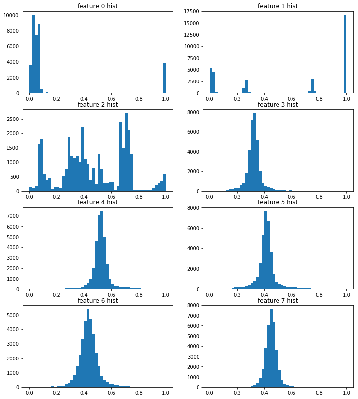
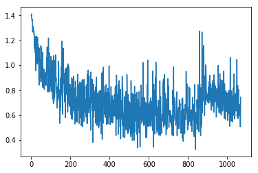
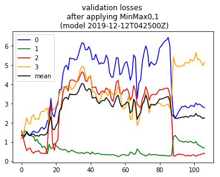
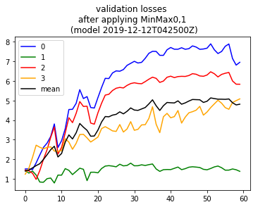

### toc
* [Here](#2019-12-10) , revisiting scaling since [not fully in 0,1 ](#hmm-scaling) for all the features. One note however is that this may indicate a problem with my initial dataset prep because I thought I already applied scaling initially, but perhaps not using whole data so I missed some higher than 1 values? So here, if I'm effectively scaling twice? That might be a problem?

* [Ah dang so](#2019-12-13t1504z) I had not applied scaling when running models on the test data! So redoing that.
* [Second run result](#second-run-result)

### 2019-12-10

```python

from importlib import reload
import os
import pandas as pd
from io import StringIO
import itertools
import ipdb
import datetime
from collections import Counter

import h5py
import json
import tensorflow as tf
from tensorflow import keras

# Helper libraries
import numpy as np
import matplotlib.pyplot as plt
from tqdm import tqdm

print(tf.__version__)

from keras.preprocessing import sequence
from keras.models import Sequential
from keras.layers import Dense, Embedding
from keras.layers import LSTM

from keras.callbacks import EarlyStopping

from sklearn.preprocessing import StandardScaler
from sklearn.preprocessing import MinMaxScaler
import mytf.s3utils as msu
import mytf.utils as mu
import mytf.plot as mp
```

    1.14.0


    Using TensorFlow backend.


```python
tf.enable_eager_execution()
```


```python
# Out of curiosity, which cols are not scaled between 0 and 1,
# remove those for training
# Grab and randomize since it's not huge...
vecs = [mu.read_h5_two(source_location='data/2019-12-07-train-balanced.h5', 
                    Xdataset=f'X_{i}',
                    Ydataset=f'Ylabels_{i}')
                 for i in [0, 1, 2, 3]]

X_train = np.concatenate([x[0] for x in vecs])
Ylabels_train = np.concatenate([x[1] for x in vecs])

# shuffle...
size = X_train.shape[0]
print(size)
indices = np.random.choice(range(size), size=size, replace=False)
X_train_shfl = X_train[indices]
Ylabels_train_shfl = Ylabels_train[indices].astype('int64')
```

    34205


```python
X_train_shfl.shape, Ylabels_train_shfl.shape
```


    ((34205, 64, 8), (34205,))


```python
Counter(Ylabels_train_shfl)
```


    Counter({0: 9455, 1: 7625, 2: 8286, 3: 8839})


#### hmm scaling

```python
X = X_train_shfl
fig = plt.figure(figsize=(12,14))
for i in range(8):
    ax = fig.add_subplot(int('42' + str(i+1)))
    ax.hist(X[:,0,i], bins=50)
    ax.set(title=f'feature {i} hist')
    
    
```


```python
# Hmm, per above, data for sure not nicely in same range.
from sklearn.preprocessing import MinMaxScaler
# Doing a quick look at post processed..
```


```python
fig = plt.figure(figsize=(12,14))
scalers = {i: MinMaxScaler(feature_range=(0, 1))
          for i in range(8)}

for i in range(8):
    Xscaled = scalers[i].fit_transform(X[:,:,i])
    ax = fig.add_subplot(int('42' + str(i+1)))
    ax.hist(Xscaled[:,0], bins=50)
    ax.set(title=f'feature {i} hist')
    
```





```python
# Try fit on that ...

X2 = np.concatenate([scalers[0].fit_transform(X[:,:,0]),
scalers[1].fit_transform(X[:,:,1])])
print(Xscaled.shape)
print(X2.shape)
```

    (34205, 64)
    (68410, 64)


```python
#np.dstack([scalers[0].fit_transform(X[:,:,0]),
#            scalers[1].fit_transform(X[:,:,1]),
#             scalers[1].fit_transform(X[:,:,2]),
#          ]).shape

scalers = {i: MinMaxScaler(feature_range=(0, 1))
          for i in range(8)}

Xscaled = np.dstack([
            scalers[i].fit_transform(X[:,:,i])
            for i in range(8)])

print(X.shape)
print(Xscaled.shape)
    
```

    (34205, 64, 8)
    (34205, 64, 8)


```python
%%time 
# Ok cool... now try it out...
# Did I shuffle? Yes.

X = Xscaled
Ylabels = Ylabels_train_shfl


loss_history = []
validation_loss_history = []
save_dir = 'history'
BATCH_SIZE = 32
ts = mu.quickts(); print('starting,', ts)

size = X_train_shfl.shape[0]
workdir = f'{save_dir}/{ts}'
os.mkdir(workdir)
#Counter(Ylabels_train), Counter(Ylabels_train_shfl)

model = tf.keras.Sequential([
    tf.keras.layers.LSTM(64,   dropout=0.2, recurrent_dropout=0.2,
                batch_input_shape=(None, 64, 8), 
              ),
    # 4 because 'A', 'B', 'C', 'D'.
    tf.keras.layers.Dense(4)])

class_weights = {0: 1., 1: 1., 2: 1., 3: 1.}
# parts = get_partitions(range(size), slice_size=BATCH_SIZE)
# training_indices = np.arange(0, X.shape[0], 1)
dataset_batches = mu.build_dataset_weighty_v3(
        {'x_train': X,
         'ylabels_train': Ylabels},  # 'ylabels_train'  if i have labels
        list(range(size)), 
        class_weights,
        batch_size=BATCH_SIZE)
    
with ipdb.launch_ipdb_on_exception():
    mu.do_train(
        model,
        dataset_batches,
        k=size,
        saveloc=workdir)
#    loss_history_this = [float(x) for x in loss_history_this]
#    loss_history.extend(loss_history_this)
#    #save_loss(loss_history, save_dir)
```

    starting, 2019-12-12T042500Z
    num slices 1068
    size_remainder,  29


    /home/ec2-user/SageMaker/aviation-pilot-physiology-hmm/mytf/utils.py:185: RuntimeWarning: divide by zero encountered in true_divide
      )/class_counts
    WARNING: Logging before flag parsing goes to stderr.
    W1212 04:25:02.915521 140011702228800 deprecation_wrapper.py:119] From /home/ec2-user/SageMaker/aviation-pilot-physiology-hmm/mytf/utils.py:238: The name tf.train.AdamOptimizer is deprecated. Please use tf.compat.v1.train.AdamOptimizer instead.
    
    0it [00:00, ?it/s]W1212 04:25:03.433110 140011702228800 deprecation_wrapper.py:119] From /home/ec2-user/SageMaker/aviation-pilot-physiology-hmm/mytf/utils.py:246: The name tf.losses.sparse_softmax_cross_entropy is deprecated. Please use tf.compat.v1.losses.sparse_softmax_cross_entropy instead.
    
    W1212 04:25:03.465257 140011702228800 deprecation.py:323] From /home/ec2-user/anaconda3/envs/tensorflow_p36/lib/python3.6/site-packages/tensorflow/python/ops/losses/losses_impl.py:121: add_dispatch_support.<locals>.wrapper (from tensorflow.python.ops.array_ops) is deprecated and will be removed in a future version.
    Instructions for updating:
    Use tf.where in 2.0, which has the same broadcast rule as np.where
    1069it [08:03,  2.21it/s]

    CPU times: user 8min 3s, sys: 796 ms, total: 8min 4s
    Wall time: 8min 6s


    


```python
ts
```


    '2019-12-12T042500Z'


```python
#01068_train_loss_history.json
historydir = 'history'
with open(f'{historydir}/{ts}/01068_train_loss_history.json') as fd:
    losshistory = json.load(fd)
    
plt.plot(losshistory) 
```


    [<matplotlib.lines.Line2D at 0x7f569c6adf60>]





```python
# Hmm, slightly different at the end compared to non scaled. hmm.
os.getpid()
```


    3530


```python
#tf.compat.v1.disable_eager_execution
tf.disable_eager_execution()
```


```python
# restarted kernel to free up memory... 
# going to proceed to try predict on validation..
```


```python

from importlib import reload
import os
import pandas as pd
from io import StringIO
import itertools
import ipdb
import datetime
from collections import Counter

import h5py
import json
import tensorflow as tf
from tensorflow import keras

# Helper libraries
import numpy as np
import matplotlib.pyplot as plt
from tqdm import tqdm

print(tf.__version__)

from keras.preprocessing import sequence
from keras.models import Sequential
from keras.layers import Dense, Embedding
from keras.layers import LSTM

from keras.callbacks import EarlyStopping

from sklearn.preprocessing import StandardScaler
from sklearn.preprocessing import MinMaxScaler
import mytf.s3utils as msu
import mytf.utils as mu
import mytf.plot as mp
```

    1.14.0


    Using TensorFlow backend.


```python
tf.enable_eager_execution()
```


```python
%%time
dataloc='data/2019-12-07-test-balanced.h5'

X, Ylabels = mu.read_h5_two(dataloc, 'X_0', 'Ylabels_0') 
```

    CPU times: user 21 ms, sys: 21.4 ms, total: 42.4 ms
    Wall time: 350 ms


```python
def get_performance_parts(model, dataloc, dataset_names, eager):
    # dataloc contains the test data..
    lossvec = []
    for Xdataset, Ydataset in tqdm(dataset_names):

        X, Ylabels = mu.read_h5_two(dataloc, Xdataset, Ydataset) 
        parts = mu.get_partitions(range(X.shape[0]), 100)
        batchlosses = []
        for part in parts:
            preds = model(X[part].astype('float32'))
            
            if eager:
                tensor = tf.losses.sparse_softmax_cross_entropy(
                        labels=Ylabels[part].astype('int64'),
                        logits=preds.numpy())
                loss = tensor.numpy()
            else:
                tensor = tf.losses.sparse_softmax_cross_entropy(
                        labels=Ylabels[part].astype('int64'),
                        logits=preds)
                loss = tensor.eval()
            batchlosses.append(loss)

        lossvec.append(np.mean(batchlosses))
    return lossvec


# mu.get_performance(model, dataloc, dataset_names)
def perf_wrapper(modelloc, eager):
    model = mu.load_model(modelloc)
    #mu.get_performance(model=model, 
    return get_performance_parts(
                    model=model,
                    dataloc='data/2019-12-07-test-balanced.h5',
                    dataset_names=[['X_0', 'Ylabels_0'],
                                  ['X_1', 'Ylabels_1'],
                                  ['X_2', 'Ylabels_2'],
                                  ['X_3', 'Ylabels_3']],
                    eager=eager)

def json_save(x, loc):
    with open(loc, 'w') as fd:
        json.dump(x, fd)
```


```python
%%time
ts = '2019-12-12T042500Z'
batch_losses_vec = []
#sess = tf.Session()
#with sess.as_default():
for step in np.arange(0, 1068, 10):
    print(step)
    modelname = f'history/{ts}/{str(step).zfill(5)}_model.h5'
    print(modelname)
    steploss = perf_wrapper(modelname, eager=True)
    print('steploss, ', steploss)
    batch_losses_vec.append([float(x) for x in steploss])
    json_save(batch_losses_vec, 
              f'history/{ts}/validation_losses.json')

```

    0
    history/2019-12-12T042500Z/00000_model.h5


    W1212 05:30:05.260590 139865851942720 hdf5_format.py:221] No training configuration found in save file: the model was *not* compiled. Compile it manually.
      0%|          | 0/4 [00:00<?, ?it/s]
    .....
    ..... (annotating: removed output but still in original notebook)

    steploss,  [2.7945762, 0.6863285, 0.4026295, 5.1538343]
    CPU times: user 3h 58min 36s, sys: 27 s, total: 3h 59min 3s
    Wall time: 3h 58min 9s


    


```python
type(batch_losses_vec[0][0])
```


    numpy.float32


```python
lossesarr = np.array(batch_losses_vec)
meanlossesarr = np.mean(lossesarr, axis=1)

batch_losses_vec[:5]
#batch_losses_vec = []
#for step in np.arange(0, 1068, 10):
# [2.8359528, 0.45356295, 1.7049086, 4.099845]

plt.plot([x[0] for x in batch_losses_vec], color='blue', label='0')
plt.plot([x[1] for x in batch_losses_vec], color='green', label='1')
plt.plot([x[2] for x in batch_losses_vec], color='red', label='2')
plt.plot([x[3] for x in batch_losses_vec], color='orange', label='3')
plt.plot(meanlossesarr, color='black', label='mean')
plt.title(f'validation losses \n after applying MinMax0,1 \n (model {ts})')
plt.legend()
#plt.plot
```


    <matplotlib.legend.Legend at 0x7f345bbab3c8>





### 2019-12-13T1504Z
Ahh crap. I forgot to actually use the scalers ... doh hhh
Going to go again


```python
# resurrecting kernel..
```


```python

from importlib import reload
import os
import pandas as pd
from io import StringIO
import itertools
import ipdb
import datetime
from collections import Counter

import h5py
import json
import tensorflow as tf
from tensorflow import keras

# Helper libraries
import numpy as np
import matplotlib.pyplot as plt
from tqdm import tqdm

print(tf.__version__)

from keras.preprocessing import sequence
from keras.models import Sequential
from keras.layers import Dense, Embedding
from keras.layers import LSTM

from keras.callbacks import EarlyStopping

from sklearn.preprocessing import StandardScaler
from sklearn.preprocessing import MinMaxScaler
import mytf.s3utils as msu
import mytf.utils as mu
import mytf.plot as mp
```

    1.14.0


    Using TensorFlow backend.


```python
tf.enable_eager_execution()
```


```python
# Out of curiosity, which cols are not scaled between 0 and 1,
# remove those for training
# Grab and randomize since it's not huge...
vecs = [mu.read_h5_two(source_location='data/2019-12-07-train-balanced.h5', 
                    Xdataset=f'X_{i}',
                    Ydataset=f'Ylabels_{i}')
                 for i in [0, 1, 2, 3]]

X_train = np.concatenate([x[0] for x in vecs])
Ylabels_train = np.concatenate([x[1] for x in vecs])

# shuffle...
size = X_train.shape[0]
print(size)
indices = np.random.choice(range(size), size=size, replace=False)
X_train_shfl = X_train[indices]
Ylabels_train_shfl = Ylabels_train[indices].astype('int64')
```

    34205


```python
X = X_train_shfl
scalers = {i: MinMaxScaler(feature_range=(0, 1))
          for i in range(8)}

Xscaled = np.dstack([
            scalers[i].fit_transform(X[:,:,i])
            for i in range(8)])

print(X.shape)
print(Xscaled.shape)
    
```

    (34205, 64, 8)
    (34205, 64, 8)


```python
vars(scalers[0])
```


    {'feature_range': (0, 1),
     'copy': True,
     'n_samples_seen_': 34205,
     'scale_': array([0.46447695, 0.46447695, 0.46447695, 0.46447695, 0.46447695,
            0.46447695, 0.46447695, 0.46447695, 0.46447695, 0.46447695,
            0.46447695, 0.46447695, 0.46447695, 0.46447695, 0.46447695,
            0.46447695, 0.46447695, 0.46447695, 0.46447695, 0.46447695,
            0.46447695, 0.46447695, 0.46447695, 0.46447695, 0.46447695,
            0.46447695, 0.46447695, 0.46447695, 0.46447695, 0.46447695,
            0.46447695, 0.46447695, 0.46447695, 0.46447695, 0.46447695,
            0.46447695, 0.46447695, 0.46447695, 0.46447695, 0.46447695,
            0.46447695, 0.46447695, 0.46447695, 0.46447695, 0.46447695,
            0.46447695, 0.46447695, 0.46447695, 0.46447695, 0.46447695,
            0.46447695, 0.46447695, 0.46447695, 0.46447695, 0.46447695,
            0.46447695, 0.46447695, 0.46447695, 0.46447695, 0.46447695,
            0.46447695, 0.46447695, 0.46447695, 0.46447695]),
     'min_': array([0.51845477, 0.51845477, 0.51845477, 0.51845477, 0.51845477,
            0.51845477, 0.51845477, 0.51845477, 0.51845477, 0.51845477,
            0.51845477, 0.51845477, 0.51845477, 0.51845477, 0.51845477,
            0.51845477, 0.51845477, 0.51845477, 0.51845477, 0.51845477,
            0.51845477, 0.51845477, 0.51845477, 0.51845477, 0.51845477,
            0.51845477, 0.51845477, 0.51845477, 0.51845477, 0.51845477,
            0.51845477, 0.51845477, 0.51845477, 0.51845477, 0.51845477,
            0.51845477, 0.51845477, 0.51845477, 0.51845477, 0.51845477,
            0.51845477, 0.51845477, 0.51845477, 0.51845477, 0.51845477,
            0.51845477, 0.51845477, 0.51845477, 0.51845477, 0.51845477,
            0.51845477, 0.51845477, 0.51845477, 0.51845477, 0.51845477,
            0.51845477, 0.51845477, 0.51845477, 0.51845477, 0.51845477,
            0.51845477, 0.51845477, 0.51845477, 0.51845477]),
     'data_min_': array([-1.11621205, -1.11621205, -1.11621205, -1.11621205, -1.11621205,
            -1.11621205, -1.11621205, -1.11621205, -1.11621205, -1.11621205,
            -1.11621205, -1.11621205, -1.11621205, -1.11621205, -1.11621205,
            -1.11621205, -1.11621205, -1.11621205, -1.11621205, -1.11621205,
            -1.11621205, -1.11621205, -1.11621205, -1.11621205, -1.11621205,
            -1.11621205, -1.11621205, -1.11621205, -1.11621205, -1.11621205,
            -1.11621205, -1.11621205, -1.11621205, -1.11621205, -1.11621205,
            -1.11621205, -1.11621205, -1.11621205, -1.11621205, -1.11621205,
            -1.11621205, -1.11621205, -1.11621205, -1.11621205, -1.11621205,
            -1.11621205, -1.11621205, -1.11621205, -1.11621205, -1.11621205,
            -1.11621205, -1.11621205, -1.11621205, -1.11621205, -1.11621205,
            -1.11621205, -1.11621205, -1.11621205, -1.11621205, -1.11621205,
            -1.11621205, -1.11621205, -1.11621205, -1.11621205]),
     'data_max_': array([1.03674731, 1.03674731, 1.03674731, 1.03674731, 1.03674731,
            1.03674731, 1.03674731, 1.03674731, 1.03674731, 1.03674731,
            1.03674731, 1.03674731, 1.03674731, 1.03674731, 1.03674731,
            1.03674731, 1.03674731, 1.03674731, 1.03674731, 1.03674731,
            1.03674731, 1.03674731, 1.03674731, 1.03674731, 1.03674731,
            1.03674731, 1.03674731, 1.03674731, 1.03674731, 1.03674731,
            1.03674731, 1.03674731, 1.03674731, 1.03674731, 1.03674731,
            1.03674731, 1.03674731, 1.03674731, 1.03674731, 1.03674731,
            1.03674731, 1.03674731, 1.03674731, 1.03674731, 1.03674731,
            1.03674731, 1.03674731, 1.03674731, 1.03674731, 1.03674731,
            1.03674731, 1.03674731, 1.03674731, 1.03674731, 1.03674731,
            1.03674731, 1.03674731, 1.03674731, 1.03674731, 1.03674731,
            1.03674731, 1.03674731, 1.03674731, 1.03674731]),
     'data_range_': array([2.15295936, 2.15295936, 2.15295936, 2.15295936, 2.15295936,
            2.15295936, 2.15295936, 2.15295936, 2.15295936, 2.15295936,
            2.15295936, 2.15295936, 2.15295936, 2.15295936, 2.15295936,
            2.15295936, 2.15295936, 2.15295936, 2.15295936, 2.15295936,
            2.15295936, 2.15295936, 2.15295936, 2.15295936, 2.15295936,
            2.15295936, 2.15295936, 2.15295936, 2.15295936, 2.15295936,
            2.15295936, 2.15295936, 2.15295936, 2.15295936, 2.15295936,
            2.15295936, 2.15295936, 2.15295936, 2.15295936, 2.15295936,
            2.15295936, 2.15295936, 2.15295936, 2.15295936, 2.15295936,
            2.15295936, 2.15295936, 2.15295936, 2.15295936, 2.15295936,
            2.15295936, 2.15295936, 2.15295936, 2.15295936, 2.15295936,
            2.15295936, 2.15295936, 2.15295936, 2.15295936, 2.15295936,
            2.15295936, 2.15295936, 2.15295936, 2.15295936])}


```python
def scale_multidim(X, scalers):
    # note, hard-coded 8..
    return np.dstack([
            scalers[i].fit_transform(X[:,:,i])
            for i in range(8)])

def get_performance_parts(model, dataloc, dataset_names, 
                          scalers, eager):
    # dataloc contains the test data..
    lossvec = []
    for Xdataset, Ydataset in tqdm(dataset_names):

        X, Ylabels = mu.read_h5_two(dataloc, Xdataset, Ydataset) 
        X = scale_multidim(X, scalers)
        parts = mu.get_partitions(range(X.shape[0]), 100)
        batchlosses = []
        for part in parts:
            preds = model(X[part].astype('float32'))
            
            if eager:
                tensor = tf.losses.sparse_softmax_cross_entropy(
                        labels=Ylabels[part].astype('int64'),
                        logits=preds.numpy())
                loss = tensor.numpy()
            else:
                tensor = tf.losses.sparse_softmax_cross_entropy(
                        labels=Ylabels[part].astype('int64'),
                        logits=preds)
                loss = tensor.eval()
            batchlosses.append(loss)

        lossvec.append(np.mean(batchlosses))
    return lossvec


# mu.get_performance(model, dataloc, dataset_names)
def perf_wrapper(modelloc, scalers, eager):
    model = mu.load_model(modelloc)
    #mu.get_performance(model=model, 
    return get_performance_parts(
                    model=model,
                    dataloc='data/2019-12-07-test-balanced.h5',
                    dataset_names=[['X_0', 'Ylabels_0'],
                                  ['X_1', 'Ylabels_1'],
                                  ['X_2', 'Ylabels_2'],
                                  ['X_3', 'Ylabels_3']],
                    scalers=scalers,
                    eager=eager)

def json_save(x, loc):
    with open(loc, 'w') as fd:
        json.dump(x, fd)
```


```python
%%time
ts = '2019-12-12T042500Z'
batch_losses_vec = []
#sess = tf.Session()
#with sess.as_default():
for step in np.arange(0, 1068, 10):
    print(step)
    modelname = f'history/{ts}/{str(step).zfill(5)}_model.h5'
    print(modelname)
    steploss = perf_wrapper(modelname, scalers=scalers, eager=True)
    print('steploss, ', steploss)
    batch_losses_vec.append([float(x) for x in steploss])
    json_save(batch_losses_vec, 
              f'history/{ts}/validation_losses_take2.json')

    
    
```

    0
    history/2019-12-12T042500Z/00000_model.h5


    WARNING: Logging before flag parsing goes to stderr.
    W1213 15:34:13.758446 139925391107904 hdf5_format.py:221] No training configuration found in save file: the model was *not* compiled. Compile it manually.
      0%|          | 0/4 [00:00<?, ?it/s]

    num slices 160
    size_remainder,  80
    ......
    ...... 
    ......
    W1213 16:52:07.322741 139925391107904 hdf5_format.py:221] No training configuration found in save file: the model was *not* compiled. Compile it manually.
      0%|          | 0/4 [00:00<?, ?it/s]

    num slices 160
    size_remainder,  80


     25%|██▌       | 1/4 [00:33<01:40, 33.47s/it]

    num slices 153
    size_remainder,  71


     50%|█████     | 2/4 [01:04<01:05, 32.68s/it]

    num slices 197
    size_remainder,  55

#### Second run result

```python
# kernel died in meantime hmm , 
import json
import matplotlib.pyplot as plt
import numpy as np
ts = '2019-12-12T042500Z'

with open(f'history/{ts}/validation_losses_take2.json') as fd:
    batch_losses_vec = json.load(fd)
    
lossesarr = np.array(batch_losses_vec)
meanlossesarr = np.mean(lossesarr, axis=1)

batch_losses_vec[:5]
#batch_losses_vec = []
#for step in np.arange(0, 1068, 10):
# [2.8359528, 0.45356295, 1.7049086, 4.099845]

plt.plot([x[0] for x in batch_losses_vec], color='blue', label='0')
plt.plot([x[1] for x in batch_losses_vec], color='green', label='1')
plt.plot([x[2] for x in batch_losses_vec], color='red', label='2')
plt.plot([x[3] for x in batch_losses_vec], color='orange', label='3')
plt.plot(meanlossesarr, color='black', label='mean')
plt.title(f'validation losses \n after applying MinMax0,1 \n (model {ts})')
plt.legend()
#plt.plot

```


    <matplotlib.legend.Legend at 0x7f6bcc49b710>





```python
# ok even though I applied that scaling bit to test set this time,
# this is still deteriorating validation loss.
```


```python

```
