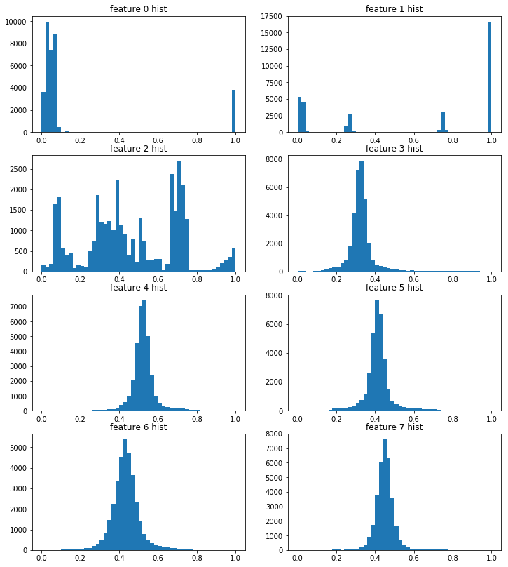
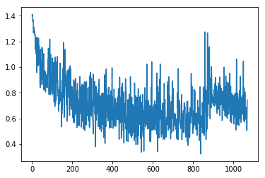
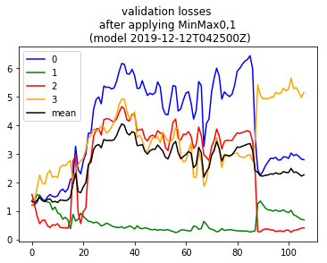

```python

from importlib import reload
import os
import pandas as pd
from io import StringIO
import itertools
import ipdb
import datetime
from collections import Counter

import h5py
import json
import tensorflow as tf
from tensorflow import keras

# Helper libraries
import numpy as np
import matplotlib.pyplot as plt
from tqdm import tqdm

print(tf.__version__)

from keras.preprocessing import sequence
from keras.models import Sequential
from keras.layers import Dense, Embedding
from keras.layers import LSTM

from keras.callbacks import EarlyStopping

from sklearn.preprocessing import StandardScaler
from sklearn.preprocessing import MinMaxScaler
import mytf.s3utils as msu
import mytf.utils as mu
import mytf.plot as mp
```

    1.14.0


    Using TensorFlow backend.


```python
tf.enable_eager_execution()
```


```python
# Out of curiosity, which cols are not scaled between 0 and 1,
# remove those for training
# Grab and randomize since it's not huge...
vecs = [mu.read_h5_two(source_location='data/2019-12-07-train-balanced.h5', 
                    Xdataset=f'X_{i}',
                    Ydataset=f'Ylabels_{i}')
                 for i in [0, 1, 2, 3]]

X_train = np.concatenate([x[0] for x in vecs])
Ylabels_train = np.concatenate([x[1] for x in vecs])

# shuffle...
size = X_train.shape[0]
print(size)
indices = np.random.choice(range(size), size=size, replace=False)
X_train_shfl = X_train[indices]
Ylabels_train_shfl = Ylabels_train[indices].astype('int64')
```

    34205


```python
X_train_shfl.shape, Ylabels_train_shfl.shape
```


    ((34205, 64, 8), (34205,))


```python
Counter(Ylabels_train_shfl)
```


    Counter({0: 9455, 1: 7625, 2: 8286, 3: 8839})


```python
X = X_train_shfl
fig = plt.figure(figsize=(12,14))
for i in range(8):
    ax = fig.add_subplot(int('42' + str(i+1)))
    ax.hist(X[:,0,i], bins=50)
    ax.set(title=f'feature {i} hist')
    
    
```


```python
# Hmm, per above, data for sure not nicely in same range.
from sklearn.preprocessing import MinMaxScaler
# Doing a quick look at post processed..
```


```python
fig = plt.figure(figsize=(12,14))
scalers = {i: MinMaxScaler(feature_range=(0, 1))
          for i in range(8)}

for i in range(8):
    Xscaled = scalers[i].fit_transform(X[:,:,i])
    ax = fig.add_subplot(int('42' + str(i+1)))
    ax.hist(Xscaled[:,0], bins=50)
    ax.set(title=f'feature {i} hist')
    
```





```python
# Try fit on that ...

X2 = np.concatenate([scalers[0].fit_transform(X[:,:,0]),
scalers[1].fit_transform(X[:,:,1])])
print(Xscaled.shape)
print(X2.shape)
```

    (34205, 64)
    (68410, 64)


```python
#np.dstack([scalers[0].fit_transform(X[:,:,0]),
#            scalers[1].fit_transform(X[:,:,1]),
#             scalers[1].fit_transform(X[:,:,2]),
#          ]).shape

scalers = {i: MinMaxScaler(feature_range=(0, 1))
          for i in range(8)}

Xscaled = np.dstack([
            scalers[i].fit_transform(X[:,:,i])
            for i in range(8)])

print(X.shape)
print(Xscaled.shape)
    
```

    (34205, 64, 8)
    (34205, 64, 8)


```python
%%time 
# Ok cool... now try it out...
# Did I shuffle? Yes.

X = Xscaled
Ylabels = Ylabels_train_shfl


loss_history = []
validation_loss_history = []
save_dir = 'history'
BATCH_SIZE = 32
ts = mu.quickts(); print('starting,', ts)

size = X_train_shfl.shape[0]
workdir = f'{save_dir}/{ts}'
os.mkdir(workdir)
#Counter(Ylabels_train), Counter(Ylabels_train_shfl)

model = tf.keras.Sequential([
    tf.keras.layers.LSTM(64,   dropout=0.2, recurrent_dropout=0.2,
                batch_input_shape=(None, 64, 8), 
              ),
    # 4 because 'A', 'B', 'C', 'D'.
    tf.keras.layers.Dense(4)])

class_weights = {0: 1., 1: 1., 2: 1., 3: 1.}
# parts = get_partitions(range(size), slice_size=BATCH_SIZE)
# training_indices = np.arange(0, X.shape[0], 1)
dataset_batches = mu.build_dataset_weighty_v3(
        {'x_train': X,
         'ylabels_train': Ylabels},  # 'ylabels_train'  if i have labels
        list(range(size)), 
        class_weights,
        batch_size=BATCH_SIZE)
    
with ipdb.launch_ipdb_on_exception():
    mu.do_train(
        model,
        dataset_batches,
        k=size,
        saveloc=workdir)
#    loss_history_this = [float(x) for x in loss_history_this]
#    loss_history.extend(loss_history_this)
#    #save_loss(loss_history, save_dir)
```

    starting, 2019-12-12T042500Z
    num slices 1068
    size_remainder,  29


    /home/ec2-user/SageMaker/aviation-pilot-physiology-hmm/mytf/utils.py:185: RuntimeWarning: divide by zero encountered in true_divide
      )/class_counts
    WARNING: Logging before flag parsing goes to stderr.
    W1212 04:25:02.915521 140011702228800 deprecation_wrapper.py:119] From /home/ec2-user/SageMaker/aviation-pilot-physiology-hmm/mytf/utils.py:238: The name tf.train.AdamOptimizer is deprecated. Please use tf.compat.v1.train.AdamOptimizer instead.
    
    0it [00:00, ?it/s]W1212 04:25:03.433110 140011702228800 deprecation_wrapper.py:119] From /home/ec2-user/SageMaker/aviation-pilot-physiology-hmm/mytf/utils.py:246: The name tf.losses.sparse_softmax_cross_entropy is deprecated. Please use tf.compat.v1.losses.sparse_softmax_cross_entropy instead.
    
    W1212 04:25:03.465257 140011702228800 deprecation.py:323] From /home/ec2-user/anaconda3/envs/tensorflow_p36/lib/python3.6/site-packages/tensorflow/python/ops/losses/losses_impl.py:121: add_dispatch_support.<locals>.wrapper (from tensorflow.python.ops.array_ops) is deprecated and will be removed in a future version.
    Instructions for updating:
    Use tf.where in 2.0, which has the same broadcast rule as np.where
    1069it [08:03,  2.21it/s]

    CPU times: user 8min 3s, sys: 796 ms, total: 8min 4s
    Wall time: 8min 6s


    


```python
ts
```


    '2019-12-12T042500Z'


```python
#01068_train_loss_history.json
historydir = 'history'
with open(f'{historydir}/{ts}/01068_train_loss_history.json') as fd:
    losshistory = json.load(fd)
    
plt.plot(losshistory) 
```


    [<matplotlib.lines.Line2D at 0x7f569c6adf60>]





```python
# Hmm, slightly different at the end compared to non scaled. hmm.
os.getpid()
```


    3530


```python
#tf.compat.v1.disable_eager_execution
tf.disable_eager_execution()
```


```python
# restarted kernel to free up memory... 
# going to proceed to try predict on validation..
```


```python

from importlib import reload
import os
import pandas as pd
from io import StringIO
import itertools
import ipdb
import datetime
from collections import Counter

import h5py
import json
import tensorflow as tf
from tensorflow import keras

# Helper libraries
import numpy as np
import matplotlib.pyplot as plt
from tqdm import tqdm

print(tf.__version__)

from keras.preprocessing import sequence
from keras.models import Sequential
from keras.layers import Dense, Embedding
from keras.layers import LSTM

from keras.callbacks import EarlyStopping

from sklearn.preprocessing import StandardScaler
from sklearn.preprocessing import MinMaxScaler
import mytf.s3utils as msu
import mytf.utils as mu
import mytf.plot as mp
```

    1.14.0


    Using TensorFlow backend.


```python
tf.enable_eager_execution()
```


```python
%%time
dataloc='data/2019-12-07-test-balanced.h5'

X, Ylabels = mu.read_h5_two(dataloc, 'X_0', 'Ylabels_0') 
```

    CPU times: user 21 ms, sys: 21.4 ms, total: 42.4 ms
    Wall time: 350 ms


```python
def get_performance_parts(model, dataloc, dataset_names, eager):
    # dataloc contains the test data..
    lossvec = []
    for Xdataset, Ydataset in tqdm(dataset_names):

        X, Ylabels = mu.read_h5_two(dataloc, Xdataset, Ydataset) 
        parts = mu.get_partitions(range(X.shape[0]), 100)
        batchlosses = []
        for part in parts:
            preds = model(X[part].astype('float32'))
            
            if eager:
                tensor = tf.losses.sparse_softmax_cross_entropy(
                        labels=Ylabels[part].astype('int64'),
                        logits=preds.numpy())
                loss = tensor.numpy()
            else:
                tensor = tf.losses.sparse_softmax_cross_entropy(
                        labels=Ylabels[part].astype('int64'),
                        logits=preds)
                loss = tensor.eval()
            batchlosses.append(loss)

        lossvec.append(np.mean(batchlosses))
    return lossvec


# mu.get_performance(model, dataloc, dataset_names)
def perf_wrapper(modelloc, eager):
    model = mu.load_model(modelloc)
    #mu.get_performance(model=model, 
    return get_performance_parts(
                    model=model,
                    dataloc='data/2019-12-07-test-balanced.h5',
                    dataset_names=[['X_0', 'Ylabels_0'],
                                  ['X_1', 'Ylabels_1'],
                                  ['X_2', 'Ylabels_2'],
                                  ['X_3', 'Ylabels_3']],
                    eager=eager)

def json_save(x, loc):
    with open(loc, 'w') as fd:
        json.dump(x, fd)
```


```python
%%time
ts = '2019-12-12T042500Z'
batch_losses_vec = []
#sess = tf.Session()
#with sess.as_default():
for step in np.arange(0, 1068, 10):
    print(step)
    modelname = f'history/{ts}/{str(step).zfill(5)}_model.h5'
    print(modelname)
    steploss = perf_wrapper(modelname, eager=True)
    print('steploss, ', steploss)
    batch_losses_vec.append([float(x) for x in steploss])
    json_save(batch_losses_vec, 
              f'history/{ts}/validation_losses.json')

```

    0
    history/2019-12-12T042500Z/00000_model.h5


    W1212 05:30:05.260590 139865851942720 hdf5_format.py:221] No training configuration found in save file: the model was *not* compiled. Compile it manually.
      0%|          | 0/4 [00:00<?, ?it/s]

    num slices 160
    size_remainder,  80


     25%|██▌       | 1/4 [00:31<01:34, 31.64s/it]

    num slices 153
    size_remainder,  71


     50%|█████     | 2/4 [01:01<01:02, 31.05s/it]

    num slices 197
    size_remainder,  55


     75%|███████▌  | 3/4 [01:40<00:33, 33.60s/it]

    num slices 155
    size_remainder,  42


    100%|██████████| 4/4 [02:11<00:00, 32.80s/it]


    steploss,  [1.198019, 1.364346, 1.5728412, 1.1728513]
    10
    history/2019-12-12T042500Z/00010_model.h5


    W1212 05:32:16.816555 139865851942720 hdf5_format.py:221] No training configuration found in save file: the model was *not* compiled. Compile it manually.
      0%|          | 0/4 [00:00<?, ?it/s]

    num slices 160
    size_remainder,  80


     25%|██▌       | 1/4 [00:31<01:33, 31.17s/it]

    num slices 153
    size_remainder,  71


     50%|█████     | 2/4 [01:01<01:01, 30.84s/it]

    num slices 197
    size_remainder,  55


     75%|███████▌  | 3/4 [01:39<00:32, 32.99s/it]

    num slices 155
    size_remainder,  42


    100%|██████████| 4/4 [02:11<00:00, 32.76s/it]


    steploss,  [1.2170653, 1.3855424, 1.2089025, 1.3909141]
    20
    history/2019-12-12T042500Z/00020_model.h5


    W1212 05:34:28.211450 139865851942720 hdf5_format.py:221] No training configuration found in save file: the model was *not* compiled. Compile it manually.
      0%|          | 0/4 [00:00<?, ?it/s]

    num slices 160
    size_remainder,  80


     25%|██▌       | 1/4 [00:30<01:32, 30.90s/it]

    num slices 153
    size_remainder,  71


     50%|█████     | 2/4 [01:01<01:01, 30.75s/it]

    num slices 197
    size_remainder,  55


     75%|███████▌  | 3/4 [01:39<00:33, 33.02s/it]

    num slices 155
    size_remainder,  42


    100%|██████████| 4/4 [02:10<00:00, 32.51s/it]


    steploss,  [1.3024874, 1.5648806, 0.8183322, 1.8052372]
    30
    history/2019-12-12T042500Z/00030_model.h5


    W1212 05:36:38.704816 139865851942720 hdf5_format.py:221] No training configuration found in save file: the model was *not* compiled. Compile it manually.
      0%|          | 0/4 [00:00<?, ?it/s]

    num slices 160
    size_remainder,  80


     25%|██▌       | 1/4 [00:31<01:34, 31.43s/it]

    num slices 153
    size_remainder,  71


     50%|█████     | 2/4 [01:02<01:02, 31.42s/it]

    num slices 197
    size_remainder,  55


     75%|███████▌  | 3/4 [01:41<00:33, 33.51s/it]

    num slices 155
    size_remainder,  42


    100%|██████████| 4/4 [02:11<00:00, 32.79s/it]


    steploss,  [1.5464047, 1.5345755, 0.5503707, 2.2543929]
    40
    history/2019-12-12T042500Z/00040_model.h5


    W1212 05:38:50.211646 139865851942720 hdf5_format.py:221] No training configuration found in save file: the model was *not* compiled. Compile it manually.
      0%|          | 0/4 [00:00<?, ?it/s]

    num slices 160
    size_remainder,  80


     25%|██▌       | 1/4 [00:31<01:34, 31.58s/it]

    num slices 153
    size_remainder,  71


     50%|█████     | 2/4 [01:01<01:02, 31.02s/it]

    num slices 197
    size_remainder,  55


     75%|███████▌  | 3/4 [01:41<00:33, 33.78s/it]

    num slices 155
    size_remainder,  42


    100%|██████████| 4/4 [02:11<00:00, 32.87s/it]


    steploss,  [1.4195832, 1.3850589, 0.6617284, 1.9703403]
    50
    history/2019-12-12T042500Z/00050_model.h5


    W1212 05:41:02.041283 139865851942720 hdf5_format.py:221] No training configuration found in save file: the model was *not* compiled. Compile it manually.
      0%|          | 0/4 [00:00<?, ?it/s]

    num slices 160
    size_remainder,  80


     25%|██▌       | 1/4 [00:31<01:33, 31.30s/it]

    num slices 153
    size_remainder,  71


     50%|█████     | 2/4 [01:00<01:01, 30.80s/it]

    num slices 197
    size_remainder,  55


     75%|███████▌  | 3/4 [01:39<00:33, 33.08s/it]

    num slices 155
    size_remainder,  42


    100%|██████████| 4/4 [02:10<00:00, 32.53s/it]


    steploss,  [1.3390648, 1.3401526, 0.6749802, 1.9338074]
    60
    history/2019-12-12T042500Z/00060_model.h5


    W1212 05:43:12.791888 139865851942720 hdf5_format.py:221] No training configuration found in save file: the model was *not* compiled. Compile it manually.
      0%|          | 0/4 [00:00<?, ?it/s]

    num slices 160
    size_remainder,  80


     25%|██▌       | 1/4 [00:31<01:33, 31.32s/it]

    num slices 153
    size_remainder,  71


     50%|█████     | 2/4 [01:00<01:01, 30.82s/it]

    num slices 197
    size_remainder,  55


     75%|███████▌  | 3/4 [01:39<00:33, 33.04s/it]

    num slices 155
    size_remainder,  42


    100%|██████████| 4/4 [02:10<00:00, 32.55s/it]


    steploss,  [1.4793999, 1.3103298, 0.48072273, 2.302918]
    70
    history/2019-12-12T042500Z/00070_model.h5


    W1212 05:45:23.332774 139865851942720 hdf5_format.py:221] No training configuration found in save file: the model was *not* compiled. Compile it manually.
      0%|          | 0/4 [00:00<?, ?it/s]

    num slices 160
    size_remainder,  80


     25%|██▌       | 1/4 [00:31<01:33, 31.24s/it]

    num slices 153
    size_remainder,  71


     50%|█████     | 2/4 [01:02<01:02, 31.26s/it]

    num slices 197
    size_remainder,  55


     75%|███████▌  | 3/4 [01:41<00:33, 33.43s/it]

    num slices 155
    size_remainder,  42


    100%|██████████| 4/4 [02:11<00:00, 32.93s/it]


    steploss,  [1.5687792, 1.2839825, 0.41108334, 2.4201863]
    80
    history/2019-12-12T042500Z/00080_model.h5


    W1212 05:47:35.394158 139865851942720 hdf5_format.py:221] No training configuration found in save file: the model was *not* compiled. Compile it manually.
      0%|          | 0/4 [00:00<?, ?it/s]

    num slices 160
    size_remainder,  80


     25%|██▌       | 1/4 [00:31<01:34, 31.37s/it]

    num slices 153
    size_remainder,  71


     50%|█████     | 2/4 [01:01<01:01, 30.99s/it]

    num slices 197
    size_remainder,  55


     75%|███████▌  | 3/4 [01:41<00:33, 33.64s/it]

    num slices 155
    size_remainder,  42


    100%|██████████| 4/4 [02:11<00:00, 32.92s/it]


    steploss,  [1.5088748, 1.0383815, 0.5079243, 2.1762583]
    90
    history/2019-12-12T042500Z/00090_model.h5


    W1212 05:49:47.425726 139865851942720 hdf5_format.py:221] No training configuration found in save file: the model was *not* compiled. Compile it manually.
      0%|          | 0/4 [00:00<?, ?it/s]

    num slices 160
    size_remainder,  80


     25%|██▌       | 1/4 [00:31<01:34, 31.65s/it]

    num slices 153
    size_remainder,  71


     50%|█████     | 2/4 [01:01<01:02, 31.22s/it]

    num slices 197
    size_remainder,  55


     75%|███████▌  | 3/4 [01:41<00:33, 33.76s/it]

    num slices 155
    size_remainder,  42


    100%|██████████| 4/4 [02:11<00:00, 32.97s/it]


    steploss,  [1.4859294, 1.1325045, 0.49086893, 2.2111018]
    100
    history/2019-12-12T042500Z/00100_model.h5


    W1212 05:51:59.645600 139865851942720 hdf5_format.py:221] No training configuration found in save file: the model was *not* compiled. Compile it manually.
      0%|          | 0/4 [00:00<?, ?it/s]

    num slices 160
    size_remainder,  80


     25%|██▌       | 1/4 [00:33<01:40, 33.34s/it]

    num slices 153
    size_remainder,  71


     50%|█████     | 2/4 [01:03<01:04, 32.35s/it]

    num slices 197
    size_remainder,  55


     75%|███████▌  | 3/4 [01:42<00:34, 34.32s/it]

    num slices 155
    size_remainder,  42


    100%|██████████| 4/4 [02:13<00:00, 33.26s/it]


    steploss,  [1.5233594, 0.92984116, 0.54910433, 2.1689637]
    110
    history/2019-12-12T042500Z/00110_model.h5


    W1212 05:54:13.018904 139865851942720 hdf5_format.py:221] No training configuration found in save file: the model was *not* compiled. Compile it manually.
      0%|          | 0/4 [00:00<?, ?it/s]

    num slices 160
    size_remainder,  80


     25%|██▌       | 1/4 [00:31<01:34, 31.56s/it]

    num slices 153
    size_remainder,  71


     50%|█████     | 2/4 [01:03<01:03, 31.70s/it]

    num slices 197
    size_remainder,  55


     75%|███████▌  | 3/4 [01:42<00:33, 33.84s/it]

    num slices 155
    size_remainder,  42


    100%|██████████| 4/4 [02:13<00:00, 33.32s/it]


    steploss,  [1.6958634, 0.8796158, 0.4178429, 2.5304844]
    120
    history/2019-12-12T042500Z/00120_model.h5


    W1212 05:56:26.642980 139865851942720 hdf5_format.py:221] No training configuration found in save file: the model was *not* compiled. Compile it manually.
      0%|          | 0/4 [00:00<?, ?it/s]

    num slices 160
    size_remainder,  80


     25%|██▌       | 1/4 [00:31<01:33, 31.33s/it]

    num slices 153
    size_remainder,  71


     50%|█████     | 2/4 [01:01<01:02, 31.05s/it]

    num slices 197
    size_remainder,  55


     75%|███████▌  | 3/4 [01:40<00:33, 33.32s/it]

    num slices 155
    size_remainder,  42


    100%|██████████| 4/4 [02:11<00:00, 32.98s/it]


    steploss,  [1.7624614, 0.7046031, 0.40632737, 2.6065297]
    130
    history/2019-12-12T042500Z/00130_model.h5


    W1212 05:58:38.896432 139865851942720 hdf5_format.py:221] No training configuration found in save file: the model was *not* compiled. Compile it manually.
      0%|          | 0/4 [00:00<?, ?it/s]

    num slices 160
    size_remainder,  80


     25%|██▌       | 1/4 [00:31<01:33, 31.25s/it]

    num slices 153
    size_remainder,  71


     50%|█████     | 2/4 [01:01<01:01, 30.89s/it]

    num slices 197
    size_remainder,  55


     75%|███████▌  | 3/4 [01:39<00:33, 33.21s/it]

    num slices 155
    size_remainder,  42


    100%|██████████| 4/4 [02:10<00:00, 32.73s/it]


    steploss,  [1.6574184, 0.7721295, 0.40491316, 2.5797954]
    140
    history/2019-12-12T042500Z/00140_model.h5


    W1212 06:00:50.360059 139865851942720 hdf5_format.py:221] No training configuration found in save file: the model was *not* compiled. Compile it manually.
      0%|          | 0/4 [00:00<?, ?it/s]

    num slices 160
    size_remainder,  80


     25%|██▌       | 1/4 [00:33<01:39, 33.29s/it]

    num slices 153
    size_remainder,  71


     50%|█████     | 2/4 [01:03<01:04, 32.33s/it]

    num slices 197
    size_remainder,  55


     75%|███████▌  | 3/4 [01:42<00:34, 34.36s/it]

    num slices 155
    size_remainder,  42


    100%|██████████| 4/4 [02:12<00:00, 33.24s/it]


    steploss,  [1.7690488, 0.67916834, 0.38780057, 2.7002683]
    150
    history/2019-12-12T042500Z/00150_model.h5


    W1212 06:03:03.693491 139865851942720 hdf5_format.py:221] No training configuration found in save file: the model was *not* compiled. Compile it manually.
      0%|          | 0/4 [00:00<?, ?it/s]

    num slices 160
    size_remainder,  80


     25%|██▌       | 1/4 [00:31<01:34, 31.64s/it]

    num slices 153
    size_remainder,  71


     50%|█████     | 2/4 [01:01<01:02, 31.18s/it]

    num slices 197
    size_remainder,  55


     75%|███████▌  | 3/4 [01:41<00:33, 33.83s/it]

    num slices 155
    size_remainder,  42


    100%|██████████| 4/4 [02:12<00:00, 33.13s/it]


    steploss,  [2.102237, 0.37317473, 0.70572644, 2.7675836]
    160
    history/2019-12-12T042500Z/00160_model.h5


    W1212 06:05:16.556186 139865851942720 hdf5_format.py:221] No training configuration found in save file: the model was *not* compiled. Compile it manually.
      0%|          | 0/4 [00:00<?, ?it/s]

    num slices 160
    size_remainder,  80


     25%|██▌       | 1/4 [00:31<01:35, 31.67s/it]

    num slices 153
    size_remainder,  71


     50%|█████     | 2/4 [01:02<01:02, 31.30s/it]

    num slices 197
    size_remainder,  55


     75%|███████▌  | 3/4 [01:40<00:33, 33.46s/it]

    num slices 155
    size_remainder,  42


    100%|██████████| 4/4 [02:12<00:00, 33.15s/it]


    steploss,  [2.1675005, 0.8740491, 2.7525475, 1.9691565]
    170
    history/2019-12-12T042500Z/00170_model.h5


    W1212 06:07:29.493498 139865851942720 hdf5_format.py:221] No training configuration found in save file: the model was *not* compiled. Compile it manually.
      0%|          | 0/4 [00:00<?, ?it/s]

    num slices 160
    size_remainder,  80


     25%|██▌       | 1/4 [00:31<01:33, 31.05s/it]

    num slices 153
    size_remainder,  71


     50%|█████     | 2/4 [01:01<01:01, 30.84s/it]

    num slices 197
    size_remainder,  55


     75%|███████▌  | 3/4 [01:39<00:33, 33.15s/it]

    num slices 155
    size_remainder,  42


    100%|██████████| 4/4 [02:10<00:00, 32.62s/it]


    steploss,  [3.2643895, 0.64530975, 2.908679, 2.4323695]
    180
    history/2019-12-12T042500Z/00180_model.h5


    W1212 06:09:40.328324 139865851942720 hdf5_format.py:221] No training configuration found in save file: the model was *not* compiled. Compile it manually.
      0%|          | 0/4 [00:00<?, ?it/s]

    num slices 160
    size_remainder,  80


     25%|██▌       | 1/4 [00:32<01:36, 32.21s/it]

    num slices 153
    size_remainder,  71


     50%|█████     | 2/4 [01:02<01:03, 31.67s/it]

    num slices 197
    size_remainder,  55


     75%|███████▌  | 3/4 [01:41<00:33, 33.76s/it]

    num slices 155
    size_remainder,  42


    100%|██████████| 4/4 [02:11<00:00, 32.85s/it]


    steploss,  [2.445687, 0.6991801, 0.93385994, 2.6181958]
    190
    history/2019-12-12T042500Z/00190_model.h5


    W1212 06:11:52.080411 139865851942720 hdf5_format.py:221] No training configuration found in save file: the model was *not* compiled. Compile it manually.
      0%|          | 0/4 [00:00<?, ?it/s]

    num slices 160
    size_remainder,  80


     25%|██▌       | 1/4 [00:31<01:34, 31.59s/it]

    num slices 153
    size_remainder,  71


     50%|█████     | 2/4 [01:01<01:02, 31.13s/it]

    num slices 197
    size_remainder,  55


     75%|███████▌  | 3/4 [01:41<00:33, 33.79s/it]

    num slices 155
    size_remainder,  42


    100%|██████████| 4/4 [02:12<00:00, 33.01s/it]


    steploss,  [2.2975516, 0.92020404, 0.55620366, 2.756735]
    200
    history/2019-12-12T042500Z/00200_model.h5


    W1212 06:14:04.451736 139865851942720 hdf5_format.py:221] No training configuration found in save file: the model was *not* compiled. Compile it manually.
      0%|          | 0/4 [00:00<?, ?it/s]

    num slices 160
    size_remainder,  80


     25%|██▌       | 1/4 [00:31<01:34, 31.59s/it]

    num slices 153
    size_remainder,  71


     50%|█████     | 2/4 [01:01<01:02, 31.19s/it]

    num slices 197
    size_remainder,  55


     75%|███████▌  | 3/4 [01:40<00:33, 33.44s/it]

    num slices 155
    size_remainder,  42


    100%|██████████| 4/4 [02:12<00:00, 33.07s/it]


    steploss,  [2.7468452, 0.80424696, 0.9704542, 2.8450682]
    210
    history/2019-12-12T042500Z/00210_model.h5


    W1212 06:16:17.070736 139865851942720 hdf5_format.py:221] No training configuration found in save file: the model was *not* compiled. Compile it manually.
      0%|          | 0/4 [00:00<?, ?it/s]

    num slices 160
    size_remainder,  80


     25%|██▌       | 1/4 [00:31<01:33, 31.25s/it]

    num slices 153
    size_remainder,  71


     50%|█████     | 2/4 [01:01<01:02, 31.03s/it]

    num slices 197
    size_remainder,  55


     75%|███████▌  | 3/4 [01:40<00:33, 33.29s/it]

    num slices 155
    size_remainder,  42


    100%|██████████| 4/4 [02:11<00:00, 32.80s/it]


    steploss,  [2.9947948, 0.7217949, 1.1037825, 3.1464543]
    220
    history/2019-12-12T042500Z/00220_model.h5


    W1212 06:18:28.629104 139865851942720 hdf5_format.py:221] No training configuration found in save file: the model was *not* compiled. Compile it manually.
      0%|          | 0/4 [00:00<?, ?it/s]

    num slices 160
    size_remainder,  80


     25%|██▌       | 1/4 [00:31<01:33, 31.08s/it]

    num slices 153
    size_remainder,  71


     50%|█████     | 2/4 [01:02<01:02, 31.21s/it]

    num slices 197
    size_remainder,  55


     75%|███████▌  | 3/4 [01:41<00:33, 33.49s/it]

    num slices 155
    size_remainder,  42


    100%|██████████| 4/4 [02:12<00:00, 33.05s/it]


    steploss,  [3.7193623, 0.63418037, 2.581578, 3.5419152]
    230
    history/2019-12-12T042500Z/00230_model.h5


    W1212 06:20:41.182470 139865851942720 hdf5_format.py:221] No training configuration found in save file: the model was *not* compiled. Compile it manually.
      0%|          | 0/4 [00:00<?, ?it/s]

    num slices 160
    size_remainder,  80


     25%|██▌       | 1/4 [00:31<01:34, 31.36s/it]

    num slices 153
    size_remainder,  71


     50%|█████     | 2/4 [01:01<01:02, 31.03s/it]

    num slices 197
    size_remainder,  55


     75%|███████▌  | 3/4 [01:41<00:33, 33.73s/it]

    num slices 155
    size_remainder,  42


    100%|██████████| 4/4 [02:11<00:00, 32.99s/it]


    steploss,  [3.7337666, 0.6200397, 2.8475912, 3.6446745]
    240
    history/2019-12-12T042500Z/00240_model.h5


    W1212 06:22:53.497838 139865851942720 hdf5_format.py:221] No training configuration found in save file: the model was *not* compiled. Compile it manually.
      0%|          | 0/4 [00:00<?, ?it/s]

    num slices 160
    size_remainder,  80


     25%|██▌       | 1/4 [00:31<01:35, 31.81s/it]

    num slices 153
    size_remainder,  71


     50%|█████     | 2/4 [01:01<01:02, 31.24s/it]

    num slices 197
    size_remainder,  55


     75%|███████▌  | 3/4 [01:40<00:33, 33.49s/it]

    num slices 155
    size_remainder,  42


    100%|██████████| 4/4 [02:10<00:00, 32.72s/it]


    steploss,  [4.5539494, 0.5744964, 3.5978074, 3.8793123]
    250
    history/2019-12-12T042500Z/00250_model.h5


    W1212 06:25:04.703762 139865851942720 hdf5_format.py:221] No training configuration found in save file: the model was *not* compiled. Compile it manually.
      0%|          | 0/4 [00:00<?, ?it/s]

    num slices 160
    size_remainder,  80


     25%|██▌       | 1/4 [00:32<01:38, 32.76s/it]

    num slices 153
    size_remainder,  71


     50%|█████     | 2/4 [01:03<01:04, 32.02s/it]

    num slices 197
    size_remainder,  55


     75%|███████▌  | 3/4 [01:41<00:33, 33.94s/it]

    num slices 155
    size_remainder,  42


    100%|██████████| 4/4 [02:12<00:00, 33.08s/it]


    steploss,  [4.90741, 0.60671043, 3.8736823, 3.7747889]
    260
    history/2019-12-12T042500Z/00260_model.h5


    W1212 06:27:17.366720 139865851942720 hdf5_format.py:221] No training configuration found in save file: the model was *not* compiled. Compile it manually.
      0%|          | 0/4 [00:00<?, ?it/s]

    num slices 160
    size_remainder,  80


     25%|██▌       | 1/4 [00:31<01:35, 32.00s/it]

    num slices 153
    size_remainder,  71


     50%|█████     | 2/4 [01:04<01:04, 32.01s/it]

    num slices 197
    size_remainder,  55


     75%|███████▌  | 3/4 [01:42<00:33, 33.97s/it]

    num slices 155
    size_remainder,  42


    100%|██████████| 4/4 [02:13<00:00, 33.48s/it]


    steploss,  [4.993663, 0.561847, 3.8905573, 3.8515022]
    270
    history/2019-12-12T042500Z/00270_model.h5


    W1212 06:29:31.644643 139865851942720 hdf5_format.py:221] No training configuration found in save file: the model was *not* compiled. Compile it manually.
      0%|          | 0/4 [00:00<?, ?it/s]

    num slices 160
    size_remainder,  80


     25%|██▌       | 1/4 [00:31<01:34, 31.36s/it]

    num slices 153
    size_remainder,  71


     50%|█████     | 2/4 [01:01<01:02, 31.12s/it]

    num slices 197
    size_remainder,  55


     75%|███████▌  | 3/4 [01:41<00:33, 33.79s/it]

    num slices 155
    size_remainder,  42


    100%|██████████| 4/4 [02:12<00:00, 33.10s/it]


    steploss,  [4.7547655, 0.4695277, 3.655513, 3.9686382]
    280
    history/2019-12-12T042500Z/00280_model.h5


    W1212 06:31:44.408406 139865851942720 hdf5_format.py:221] No training configuration found in save file: the model was *not* compiled. Compile it manually.
      0%|          | 0/4 [00:00<?, ?it/s]

    num slices 160
    size_remainder,  80


     25%|██▌       | 1/4 [00:31<01:34, 31.63s/it]

    num slices 153
    size_remainder,  71


     50%|█████     | 2/4 [01:01<01:02, 31.08s/it]

    num slices 197
    size_remainder,  55


     75%|███████▌  | 3/4 [01:40<00:33, 33.38s/it]

    num slices 155
    size_remainder,  42


    100%|██████████| 4/4 [02:10<00:00, 32.56s/it]


    steploss,  [5.3804255, 0.5032767, 4.197588, 3.9230778]
    290
    history/2019-12-12T042500Z/00290_model.h5


    W1212 06:33:55.002245 139865851942720 hdf5_format.py:221] No training configuration found in save file: the model was *not* compiled. Compile it manually.
      0%|          | 0/4 [00:00<?, ?it/s]

    num slices 160
    size_remainder,  80


     25%|██▌       | 1/4 [00:32<01:38, 32.87s/it]

    num slices 153
    size_remainder,  71


     50%|█████     | 2/4 [01:02<01:04, 32.00s/it]

    num slices 197
    size_remainder,  55


     75%|███████▌  | 3/4 [01:42<00:34, 34.28s/it]

    num slices 155
    size_remainder,  42


    100%|██████████| 4/4 [02:13<00:00, 33.36s/it]


    steploss,  [5.3296547, 0.5672444, 4.2301574, 3.7292676]
    300
    history/2019-12-12T042500Z/00300_model.h5


    W1212 06:36:08.809096 139865851942720 hdf5_format.py:221] No training configuration found in save file: the model was *not* compiled. Compile it manually.
      0%|          | 0/4 [00:00<?, ?it/s]

    num slices 160
    size_remainder,  80


     25%|██▌       | 1/4 [00:31<01:34, 31.58s/it]

    num slices 153
    size_remainder,  71


     50%|█████     | 2/4 [01:02<01:02, 31.38s/it]

    num slices 197
    size_remainder,  55


     75%|███████▌  | 3/4 [01:42<00:33, 33.99s/it]

    num slices 155
    size_remainder,  42


    100%|██████████| 4/4 [02:13<00:00, 33.44s/it]


    steploss,  [5.3423524, 0.5319524, 4.2224536, 3.792785]
    310
    history/2019-12-12T042500Z/00310_model.h5


    W1212 06:38:22.922771 139865851942720 hdf5_format.py:221] No training configuration found in save file: the model was *not* compiled. Compile it manually.
      0%|          | 0/4 [00:00<?, ?it/s]

    num slices 160
    size_remainder,  80


     25%|██▌       | 1/4 [00:31<01:34, 31.41s/it]

    num slices 153
    size_remainder,  71


     50%|█████     | 2/4 [01:01<01:02, 31.16s/it]

    num slices 197
    size_remainder,  55


     75%|███████▌  | 3/4 [01:41<00:33, 33.52s/it]

    num slices 155
    size_remainder,  42


    100%|██████████| 4/4 [02:13<00:00, 33.27s/it]


    steploss,  [5.2740808, 0.4736564, 4.1603546, 3.9422176]
    320
    history/2019-12-12T042500Z/00320_model.h5


    W1212 06:40:36.368865 139865851942720 hdf5_format.py:221] No training configuration found in save file: the model was *not* compiled. Compile it manually.
      0%|          | 0/4 [00:00<?, ?it/s]

    num slices 160
    size_remainder,  80


     25%|██▌       | 1/4 [00:31<01:34, 31.37s/it]

    num slices 153
    size_remainder,  71


    100%|██████████| 4/4 [02:12<00:00, 33.05s/it]


    steploss,  [3.5784936, 0.30184078, 2.3301523, 3.4620733]
    880
    history/2019-12-12T042500Z/00880_model.h5


    W1212 08:45:49.289150 139865851942720 hdf5_format.py:221] No training configuration found in save file: the model was *not* compiled. Compile it manually.
      0%|          | 0/4 [00:00<?, ?it/s]

    num slices 160
    size_remainder,  80


     25%|██▌       | 1/4 [00:33<01:40, 33.55s/it]

    num slices 153
    size_remainder,  71


     50%|█████     | 2/4 [01:03<01:05, 32.53s/it]

    num slices 197
    size_remainder,  55


     75%|███████▌  | 3/4 [01:42<00:34, 34.54s/it]

    num slices 155
    size_remainder,  42


    100%|██████████| 4/4 [02:13<00:00, 33.41s/it]


    steploss,  [2.448061, 1.250543, 0.2711832, 5.4226465]
    890
    history/2019-12-12T042500Z/00890_model.h5


    W1212 08:48:03.299982 139865851942720 hdf5_format.py:221] No training configuration found in save file: the model was *not* compiled. Compile it manually.
      0%|          | 0/4 [00:00<?, ?it/s]

    num slices 160
    size_remainder,  80


     25%|██▌       | 1/4 [00:31<01:35, 31.74s/it]

    num slices 153
    size_remainder,  71


     50%|█████     | 2/4 [01:02<01:02, 31.31s/it]

    num slices 197
    size_remainder,  55


     75%|███████▌  | 3/4 [01:42<00:34, 34.03s/it]

    num slices 155
    size_remainder,  42


    100%|██████████| 4/4 [02:13<00:00, 33.46s/it]


    steploss,  [2.2418659, 1.3439867, 0.26024523, 5.069991]
    900
    history/2019-12-12T042500Z/00900_model.h5


    W1212 08:50:17.475387 139865851942720 hdf5_format.py:221] No training configuration found in save file: the model was *not* compiled. Compile it manually.
      0%|          | 0/4 [00:00<?, ?it/s]

    num slices 160
    size_remainder,  80


     25%|██▌       | 1/4 [00:31<01:35, 31.95s/it]

    num slices 153
    size_remainder,  71


     50%|█████     | 2/4 [01:02<01:03, 31.61s/it]

    num slices 197
    size_remainder,  55


     75%|███████▌  | 3/4 [01:41<00:33, 33.82s/it]

    num slices 155
    size_remainder,  42


    100%|██████████| 4/4 [02:14<00:00, 33.66s/it]


    steploss,  [2.3895657, 1.2188742, 0.3338912, 4.9289536]
    910
    history/2019-12-12T042500Z/00910_model.h5


    W1212 08:52:32.452236 139865851942720 hdf5_format.py:221] No training configuration found in save file: the model was *not* compiled. Compile it manually.
      0%|          | 0/4 [00:00<?, ?it/s]

    num slices 160
    size_remainder,  80


     25%|██▌       | 1/4 [00:31<01:35, 31.86s/it]

    num slices 153
    size_remainder,  71


     50%|█████     | 2/4 [01:02<01:03, 31.50s/it]

    num slices 197
    size_remainder,  55


     75%|███████▌  | 3/4 [01:41<00:33, 33.77s/it]

    num slices 155
    size_remainder,  42


    100%|██████████| 4/4 [02:12<00:00, 33.11s/it]


    steploss,  [2.5756335, 1.0975627, 0.36390516, 4.9508038]
    920
    history/2019-12-12T042500Z/00920_model.h5


    W1212 08:54:45.253152 139865851942720 hdf5_format.py:221] No training configuration found in save file: the model was *not* compiled. Compile it manually.
      0%|          | 0/4 [00:00<?, ?it/s]

    num slices 160
    size_remainder,  80


     25%|██▌       | 1/4 [00:33<01:39, 33.22s/it]

    num slices 153
    size_remainder,  71


     50%|█████     | 2/4 [01:03<01:04, 32.44s/it]

    num slices 197
    size_remainder,  55


     75%|███████▌  | 3/4 [01:42<00:34, 34.44s/it]

    num slices 155
    size_remainder,  42


    100%|██████████| 4/4 [02:13<00:00, 33.29s/it]


    steploss,  [2.715047, 1.0323261, 0.3578203, 4.921516]
    930
    history/2019-12-12T042500Z/00930_model.h5


    W1212 08:56:58.761287 139865851942720 hdf5_format.py:221] No training configuration found in save file: the model was *not* compiled. Compile it manually.
      0%|          | 0/4 [00:00<?, ?it/s]

    num slices 160
    size_remainder,  80


     25%|██▌       | 1/4 [00:31<01:35, 31.76s/it]

    num slices 153
    size_remainder,  71


     50%|█████     | 2/4 [01:01<01:02, 31.23s/it]

    num slices 197
    size_remainder,  55


     75%|███████▌  | 3/4 [01:42<00:33, 33.98s/it]

    num slices 155
    size_remainder,  42


    100%|██████████| 4/4 [02:12<00:00, 33.23s/it]


    steploss,  [2.8431818, 1.0229403, 0.33000484, 4.9906716]
    940
    history/2019-12-12T042500Z/00940_model.h5


    W1212 08:59:12.019496 139865851942720 hdf5_format.py:221] No training configuration found in save file: the model was *not* compiled. Compile it manually.
      0%|          | 0/4 [00:00<?, ?it/s]

    num slices 160
    size_remainder,  80


     25%|██▌       | 1/4 [00:31<01:35, 31.76s/it]

    num slices 153
    size_remainder,  71


     50%|█████     | 2/4 [01:01<01:02, 31.28s/it]

    num slices 197
    size_remainder,  55


     75%|███████▌  | 3/4 [01:41<00:33, 33.70s/it]

    num slices 155
    size_remainder,  42


    100%|██████████| 4/4 [02:13<00:00, 33.45s/it]


    steploss,  [2.8315437, 0.9875213, 0.32631665, 4.9856443]
    950
    history/2019-12-12T042500Z/00950_model.h5


    W1212 09:01:26.151828 139865851942720 hdf5_format.py:221] No training configuration found in save file: the model was *not* compiled. Compile it manually.
      0%|          | 0/4 [00:00<?, ?it/s]

    num slices 160
    size_remainder,  80


     25%|██▌       | 1/4 [00:32<01:36, 32.01s/it]

    num slices 153
    size_remainder,  71


     50%|█████     | 2/4 [01:02<01:03, 31.62s/it]

    num slices 197
    size_remainder,  55


     75%|███████▌  | 3/4 [01:41<00:33, 33.88s/it]

    num slices 155
    size_remainder,  42


    100%|██████████| 4/4 [02:13<00:00, 33.26s/it]


    steploss,  [2.8783114, 1.0301887, 0.2755303, 5.1582055]
    960
    history/2019-12-12T042500Z/00960_model.h5


    W1212 09:03:39.548226 139865851942720 hdf5_format.py:221] No training configuration found in save file: the model was *not* compiled. Compile it manually.
      0%|          | 0/4 [00:00<?, ?it/s]

    num slices 160
    size_remainder,  80


     25%|██▌       | 1/4 [00:32<01:37, 32.58s/it]

    num slices 153
    size_remainder,  71


     50%|█████     | 2/4 [01:03<01:04, 32.07s/it]

    num slices 197
    size_remainder,  55


     75%|███████▌  | 3/4 [01:42<00:34, 34.31s/it]

    num slices 155
    size_remainder,  42


    100%|██████████| 4/4 [02:13<00:00, 33.50s/it]


    steploss,  [2.7783153, 0.98680353, 0.29159403, 5.1146817]
    970
    history/2019-12-12T042500Z/00970_model.h5


    W1212 09:05:53.884588 139865851942720 hdf5_format.py:221] No training configuration found in save file: the model was *not* compiled. Compile it manually.
      0%|          | 0/4 [00:00<?, ?it/s]

    num slices 160
    size_remainder,  80


     25%|██▌       | 1/4 [00:32<01:36, 32.17s/it]

    num slices 153
    size_remainder,  71


     50%|█████     | 2/4 [01:02<01:03, 31.62s/it]

    num slices 197
    size_remainder,  55


     75%|███████▌  | 3/4 [01:43<00:34, 34.38s/it]

    num slices 155
    size_remainder,  42


    100%|██████████| 4/4 [02:14<00:00, 33.59s/it]


    steploss,  [2.7892756, 0.99015373, 0.29589275, 5.128487]
    980
    history/2019-12-12T042500Z/00980_model.h5


    W1212 09:08:08.601918 139865851942720 hdf5_format.py:221] No training configuration found in save file: the model was *not* compiled. Compile it manually.
      0%|          | 0/4 [00:00<?, ?it/s]

    num slices 160
    size_remainder,  80


     25%|██▌       | 1/4 [00:31<01:35, 31.95s/it]

    num slices 153
    size_remainder,  71


     50%|█████     | 2/4 [01:02<01:02, 31.49s/it]

    num slices 197
    size_remainder,  55


     75%|███████▌  | 3/4 [01:41<00:33, 33.80s/it]

    num slices 155
    size_remainder,  42


    100%|██████████| 4/4 [02:13<00:00, 33.46s/it]


    steploss,  [2.8927352, 1.0316741, 0.27328026, 5.3048363]
    990
    history/2019-12-12T042500Z/00990_model.h5


    W1212 09:10:22.781208 139865851942720 hdf5_format.py:221] No training configuration found in save file: the model was *not* compiled. Compile it manually.
      0%|          | 0/4 [00:00<?, ?it/s]

    num slices 160
    size_remainder,  80


     25%|██▌       | 1/4 [00:31<01:34, 31.58s/it]

    num slices 153
    size_remainder,  71


     50%|█████     | 2/4 [01:02<01:02, 31.29s/it]

    num slices 197
    size_remainder,  55


     75%|███████▌  | 3/4 [01:41<00:33, 33.64s/it]

    num slices 155
    size_remainder,  42


    100%|██████████| 4/4 [02:12<00:00, 33.06s/it]


    steploss,  [2.8891196, 0.97261065, 0.31990266, 5.2066917]
    1000
    history/2019-12-12T042500Z/01000_model.h5


    W1212 09:12:36.062784 139865851942720 hdf5_format.py:221] No training configuration found in save file: the model was *not* compiled. Compile it manually.
      0%|          | 0/4 [00:00<?, ?it/s]

    num slices 160
    size_remainder,  80


     25%|██▌       | 1/4 [00:31<01:35, 31.71s/it]

    num slices 153
    size_remainder,  71


     50%|█████     | 2/4 [01:03<01:03, 31.66s/it]

    num slices 197
    size_remainder,  55


     75%|███████▌  | 3/4 [01:42<00:33, 33.97s/it]

    num slices 155
    size_remainder,  42


    100%|██████████| 4/4 [02:13<00:00, 33.35s/it]


    steploss,  [2.8377628, 0.9373925, 0.31949943, 5.273577]
    1010
    history/2019-12-12T042500Z/01010_model.h5


    W1212 09:14:49.804447 139865851942720 hdf5_format.py:221] No training configuration found in save file: the model was *not* compiled. Compile it manually.
      0%|          | 0/4 [00:00<?, ?it/s]

    num slices 160
    size_remainder,  80


     25%|██▌       | 1/4 [00:32<01:36, 32.05s/it]

    num slices 153
    size_remainder,  71


     50%|█████     | 2/4 [01:02<01:03, 31.56s/it]

    num slices 197
    size_remainder,  55


     75%|███████▌  | 3/4 [01:42<00:34, 34.24s/it]

    num slices 155
    size_remainder,  42


    100%|██████████| 4/4 [02:13<00:00, 33.41s/it]


    steploss,  [3.027526, 1.0185802, 0.24564831, 5.65989]
    1020
    history/2019-12-12T042500Z/01020_model.h5


    W1212 09:17:03.797455 139865851942720 hdf5_format.py:221] No training configuration found in save file: the model was *not* compiled. Compile it manually.
      0%|          | 0/4 [00:00<?, ?it/s]

    num slices 160
    size_remainder,  80


     25%|██▌       | 1/4 [00:32<01:36, 32.08s/it]

    num slices 153
    size_remainder,  71


     50%|█████     | 2/4 [01:02<01:03, 31.54s/it]

    num slices 197
    size_remainder,  55


     75%|███████▌  | 3/4 [01:41<00:33, 33.79s/it]

    num slices 155
    size_remainder,  42


    100%|██████████| 4/4 [02:13<00:00, 33.38s/it]


    steploss,  [2.9363906, 0.8639914, 0.3106141, 5.285081]
    1030
    history/2019-12-12T042500Z/01030_model.h5


    W1212 09:19:17.657518 139865851942720 hdf5_format.py:221] No training configuration found in save file: the model was *not* compiled. Compile it manually.
      0%|          | 0/4 [00:00<?, ?it/s]

    num slices 160
    size_remainder,  80


     25%|██▌       | 1/4 [00:31<01:35, 31.80s/it]

    num slices 153
    size_remainder,  71


     50%|█████     | 2/4 [01:02<01:02, 31.48s/it]

    num slices 197
    size_remainder,  55


     75%|███████▌  | 3/4 [01:41<00:33, 33.73s/it]

    num slices 155
    size_remainder,  42


    100%|██████████| 4/4 [02:12<00:00, 33.13s/it]


    steploss,  [2.975898, 0.81748825, 0.3250686, 5.324405]
    1040
    history/2019-12-12T042500Z/01040_model.h5


    W1212 09:21:30.545310 139865851942720 hdf5_format.py:221] No training configuration found in save file: the model was *not* compiled. Compile it manually.
      0%|          | 0/4 [00:00<?, ?it/s]

    num slices 160
    size_remainder,  80


     25%|██▌       | 1/4 [00:32<01:36, 32.07s/it]

    num slices 153
    size_remainder,  71


     50%|█████     | 2/4 [01:04<01:04, 32.04s/it]

    num slices 197
    size_remainder,  55


     75%|███████▌  | 3/4 [01:43<00:34, 34.18s/it]

    num slices 155
    size_remainder,  42


    100%|██████████| 4/4 [02:14<00:00, 33.59s/it]


    steploss,  [2.913098, 0.75930834, 0.3528932, 5.1637435]
    1050
    history/2019-12-12T042500Z/01050_model.h5


    W1212 09:23:45.276722 139865851942720 hdf5_format.py:221] No training configuration found in save file: the model was *not* compiled. Compile it manually.
      0%|          | 0/4 [00:00<?, ?it/s]

    num slices 160
    size_remainder,  80


     25%|██▌       | 1/4 [00:31<01:35, 31.95s/it]

    num slices 153
    size_remainder,  71


     50%|█████     | 2/4 [01:02<01:02, 31.49s/it]

    num slices 197
    size_remainder,  55


     75%|███████▌  | 3/4 [01:43<00:34, 34.30s/it]

    num slices 155
    size_remainder,  42


    100%|██████████| 4/4 [02:14<00:00, 33.50s/it]


    steploss,  [2.8153307, 0.6963977, 0.38806453, 4.9756002]
    1060
    history/2019-12-12T042500Z/01060_model.h5


    W1212 09:25:59.643022 139865851942720 hdf5_format.py:221] No training configuration found in save file: the model was *not* compiled. Compile it manually.
      0%|          | 0/4 [00:00<?, ?it/s]

    num slices 160
    size_remainder,  80


     25%|██▌       | 1/4 [00:32<01:36, 32.16s/it]

    num slices 153
    size_remainder,  71


     50%|█████     | 2/4 [01:02<01:03, 31.57s/it]

    num slices 197
    size_remainder,  55


     75%|███████▌  | 3/4 [01:42<00:34, 34.15s/it]

    num slices 155
    size_remainder,  42


    100%|██████████| 4/4 [02:14<00:00, 33.75s/it]

    steploss,  [2.7945762, 0.6863285, 0.4026295, 5.1538343]
    CPU times: user 3h 58min 36s, sys: 27 s, total: 3h 59min 3s
    Wall time: 3h 58min 9s


    


```python
type(batch_losses_vec[0][0])
```


    numpy.float32


```python
lossesarr = np.array(batch_losses_vec)
meanlossesarr = np.mean(lossesarr, axis=1)

batch_losses_vec[:5]
#batch_losses_vec = []
#for step in np.arange(0, 1068, 10):
# [2.8359528, 0.45356295, 1.7049086, 4.099845]

plt.plot([x[0] for x in batch_losses_vec], color='blue', label='0')
plt.plot([x[1] for x in batch_losses_vec], color='green', label='1')
plt.plot([x[2] for x in batch_losses_vec], color='red', label='2')
plt.plot([x[3] for x in batch_losses_vec], color='orange', label='3')
plt.plot(meanlossesarr, color='black', label='mean')
plt.title(f'validation losses \n after applying MinMax0,1 \n (model {ts})')
plt.legend()
#plt.plot
```


    <matplotlib.legend.Legend at 0x7f345bbab3c8>





```python

```
