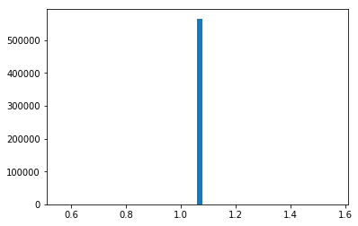

#### toc
* [2019-12-14](#2019-12-14)
* [plot-four-func](#plot-four-func)
* [plot-all-histograms](#plot-all-histograms)
* [another-time-series-look](#another-time-series-look)
* [more-feature-plots](#more-feature-plots)


### 2019-12-14
Here I took another look at my training data, `'data/2019-12-07-train-balanced.h5` , in a different way. 


```python

from importlib import reload
import os
import pandas as pd
from io import StringIO
import itertools
import ipdb
import datetime
from collections import Counter

import h5py
import json
import tensorflow as tf
from tensorflow import keras

# Helper libraries
import numpy as np
import matplotlib.pyplot as plt
from tqdm import tqdm

print(tf.__version__)

from keras.preprocessing import sequence
from keras.models import Sequential
from keras.layers import Dense, Embedding
from keras.layers import LSTM

from keras.callbacks import EarlyStopping

from sklearn.preprocessing import StandardScaler
from sklearn.preprocessing import MinMaxScaler
import mytf.s3utils as msu
import mytf.utils as mu
import mytf.plot as mp
```

    1.14.0


    Using TensorFlow backend.


```python
tf.enable_eager_execution()
```


```python

vecs = [mu.read_h5_two(source_location='data/2019-12-07-train-balanced.h5', 
                    Xdataset=f'X_{i}',
                    Ydataset=f'Ylabels_{i}')
                 for i in [0, 1, 2, 3]]

X_train = np.concatenate([x[0] for x in vecs])
Ylabels_train = np.concatenate([x[1] for x in vecs])

# shuffle...
size = X_train.shape[0]
print(size)
indices = np.random.choice(range(size), size=size, replace=False)
X_train_shfl = X_train[indices]
Ylabels_train_shfl = Ylabels_train[indices].astype('int64')
```

    34205


```python
X = X_train_shfl
Ylabels = Ylabels_train_shfl
X.shape, Ylabels.shape
```


    ((34205, 64, 8), (34205,))


```python
# np.random.randint(1,100)
size = 100
#indices = 
vecs[0][0].shape,vecs[1][0].shape#vecs[0][1].shape

```


    ((9455, 64, 8), (7625, 64, 8))


#### plot four func
For a given feature, display the `64 length` sequences of four randomly selected windows, for data of `label=0`, `label=1`, `label=2` and `label=3`.

But looking at the below it was pretty strange to see why there are a few sections of flatlines, for labels `0`, `1` and `3` except not `2`. Perhaps this is some sort of feature that indeed is only active for the state of `label=2` . 


```python
#vecs[0][0][0],vecs[0][1][0]
def plot_four(vecs, col):
    # Plot one col, at random indices, 
    fig = plt.figure(figsize=(12,8))
    for i, _ in enumerate(vecs):
        #Y = make_series_from_cols(df, col, indices)
        ax = fig.add_subplot(int('41' + str(i+1)))
        i1, i2, i3, i4 = np.random.choice(
                                range(vecs[i][0].shape[0]),
                                size=4, replace=False)
        ax.plot(vecs[i][0][i1][:,col], color='red')
        ax.plot(vecs[i][0][i2][:,col], color='green')
        ax.plot(vecs[i][0][i3][:,col], color='blue')
        ax.plot(vecs[i][0][i4][:,col], color='cyan')
        ax.set(ylabel=f'label={i}, col={col}',) #ax.show() # title
        #ax.legend()
        print([i1, i2, i3, i4])
    plt.show()

```


```python
plot_four(vecs, 1)
```

    [5486, 3364, 4329, 1324]
    [1237, 4563, 4952, 3676]
    [1254, 6325, 7832, 2187]
    [261, 4870, 151, 6779]


```python
#[5486, 3364, 4329, 1324]
label=3
print(vecs[label][0].shape)
A = vecs[label][0][5486][:,1]
print(A.shape)
print(vecs[label][0][:,:,1].shape)
B = np.reshape(vecs[label][0][:,:,1], (8839*64,))
print(B.shape)
#Aall = np.concatenate([])
plt.plot(B)
```

    (8839, 64, 8)
    (64,)
    (8839, 64)
    (565696,)


    [<matplotlib.lines.Line2D at 0x7f524c55f470>]


```python
# print hists per label  against each other..
print((lambda x,y:x*y)(*vecs[0][0][:,:,3].shape))
print(vecs[0][0][:,:,3].ravel().shape)
print(vecs[0][0][:,:,3].shape)
print(np.reshape(vecs[0][0][:,:,3], (605120,)).shape)
print(np.allclose(
            vecs[0][0][:,:,3].ravel(),
            np.reshape(vecs[0][0][:,:,3], (605120,))
            ))
```

    605120
    (605120,)
    (9455, 64)
    (605120,)
    True


#### Plot all histograms
Okay so a previous day I had plotted histograms of only the first sequence of the datas. 

So here, how about concatenating them. Actually using `.ravel()` instead as a super nice technique I picked up from [this course](https://end-to-end-machine-learning.teachable.com/courses/612528/)

So although overlaying 4 histograms wasnt always really clear to look at, using a decently good transparency (`alpha=0.4`) helped to tell if there was a problem. 

Indeed the yellow (`label=3`) of feature1, looks like it has one value.


```python
# Hmm... perhaps plot all the hists...
# I previously had 

#B = np.reshape(vecs[label][0][:,:,1], (8839*64,))
#vecs[label][0]shape[0]
COLORS = ['red', 'cyan', 'green', 'yellow']
#X = X_train_shfl
fig = plt.figure(figsize=(12,14))
for col in range(8):
    ax = fig.add_subplot(int('42' + str(col+1)))
    ax.set(title=f'feature {col} hist')    
    for label in range(4):
    
        ax.hist(vecs[label][0][:,:,col].ravel(),
                bins=50, color=COLORS[label],
                alpha=0.4, density=True)


```


```python
# hmm but the above figure .. does not match with that strange flat line...
label=3; col=1
#B = np.reshape(, (8839*64,))
#print(B.shape)
#Aall = np.concatenate([])
#plt.plot(vecs[label][0][:,:,col].ravel())
plt.hist(vecs[label][0][:,:,col].ravel(), bins=50)

plt.show()
```





```python
# ok nevermind i guess it is there. but the other labels are fine 
# for that column and all other columns.
# Upon visual inspection looks like, label=3, col=1 ,
# are simply stuck like that, but not for the other labels...
```

#### Another time series look
Look at all of the training set data per label.

But of course I need to keep in mind that my training data is not continguous. I am basically forcefully concatenating it here to get some sort of interesting picture.

So okay I understand there are some crazy jumps, but perhaps that means that yes even for a particular label, featres can have variation. Not sure if I can do anything about that.


```python
# Ok so for col=1 , how do all the labels look...
col = 1
COLORS = ['red', 'cyan', 'green', 'yellow']
for i in range(4):
    plt.plot(vecs[i][0][:,:,col].ravel(), color=COLORS[i])

plt.show()
```


#### more feature plots
I tried to plot all the data but I think my kernel mysteriously died. I forget. But feature 0 , I see label=1 doing a jump again..


```python
COLORS = ['red', 'cyan', 'green', 'yellow']
for col in range(8):

    for i in range(4):
        plt.plot(vecs[i][0][:,:,col].ravel(),
                 color=COLORS[i], label=f'{i}')
        plt.title(f'feature {col}')

    plt.show()
```


```python
# something pretty weird about this jump. 
# maybe i can better select what data to use, 
# starting from the raw un-normalized form.
# And then use that for a whole new train data.
```
