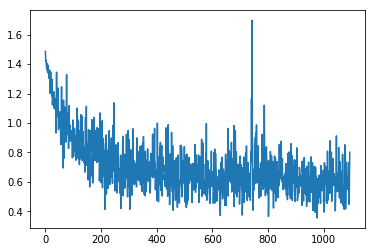

```python

from importlib import reload
import os
import pandas as pd
from io import StringIO
import itertools
import ipdb
import datetime
from collections import Counter

import h5py
import json
import tensorflow as tf
from tensorflow import keras

# Helper libraries
import numpy as np
import matplotlib.pyplot as plt
from tqdm import tqdm
import joblib
print(tf.__version__)

from keras.preprocessing import sequence
from keras.models import Sequential
from keras.layers import Dense, Embedding
from keras.layers import LSTM

from keras.callbacks import EarlyStopping

from sklearn.preprocessing import StandardScaler
from sklearn.preprocessing import MinMaxScaler
import mytf.s3utils as msu
import mytf.utils as mu
import mytf.plot as mp
```

    1.14.0


    Using TensorFlow backend.


```python
tf.enable_eager_execution()
```


```python
# train ... new datasets, ...
outdir = 'history/2019-12-22T174803Z'
train_loc = f'{outdir}/train_balanced.h5'
test_loc = f'{outdir}/test_balanced.h5'

print(mu.h5_keys(train_loc))
print(mu.h5_keys(test_loc))
```

    ['X_0', 'X_1', 'X_2', 'X_3', 'Ylabels_0', 'Ylabels_1', 'Ylabels_2', 'Ylabels_3']
    ['X_0', 'X_1', 'X_2', 'X_3', 'Ylabels_0', 'Ylabels_1', 'Ylabels_2', 'Ylabels_3']


```python
# Grab and randomize since it's not huge...
vecs = [mu.read_h5_two(
                source_location=train_loc, 
                Xdataset=f'X_{i}',
                Ydataset=f'Ylabels_{i}')
                 for i in [0, 1, 2, 3]]

X_train = np.concatenate([x[0] for x in vecs])
Ylabels_train = np.concatenate([x[1] for x in vecs])

# Shuffle...
size = X_train.shape[0]
print(size)
indices = np.random.choice(range(size), size=size, replace=False)
X_train_shfl = X_train[indices]
Ylabels_train_shfl = Ylabels_train[indices].astype('int64')

X = X_train_shfl
Ylabels = Ylabels_train_shfl

```

    34980


```python
%%time 
# Train..

loss_history = []
validation_loss_history = []
save_dir = 'history'
BATCH_SIZE = 32
ts = mu.quickts(); print('starting,', ts)

size = X.shape[0]
workdir = f'{save_dir}/{ts}'
os.mkdir(workdir)
print(f'Made new workdir, {workdir}')
print('Ylabels, :', Counter(Ylabels))

model = tf.keras.Sequential([
    tf.keras.layers.LSTM(64,   dropout=0.2, recurrent_dropout=0.2,
                batch_input_shape=(None, 64, 8), 
              ),
    # 4 because 'A', 'B', 'C', 'D'.
    tf.keras.layers.Dense(4)])

class_weights = {0: 1., 1: 1., 2: 1., 3: 1.}
dataset_batches = mu.build_dataset_weighty_v3(
        {'x_train': X,
         'ylabels_train': Ylabels},
        list(range(size)), 
        class_weights,
        batch_size=BATCH_SIZE)
    
with ipdb.launch_ipdb_on_exception():
    mu.do_train(
        model,
        dataset_batches,
        k=size,
        saveloc=workdir)
    
    
```

    starting, 2019-12-22T234352Z
    Made new workdir, history/2019-12-22T234352Z
    Ylabels, : Counter({0: 10230, 3: 8839, 2: 8286, 1: 7625})
    num slices 1093
    size_remainder,  4


    /home/ec2-user/SageMaker/aviation-pilot-physiology-hmm/mytf/utils.py:185: RuntimeWarning: divide by zero encountered in true_divide
      )/class_counts
    WARNING: Logging before flag parsing goes to stderr.
    W1222 23:43:53.064705 139892131759936 deprecation_wrapper.py:119] From /home/ec2-user/SageMaker/aviation-pilot-physiology-hmm/mytf/utils.py:238: The name tf.train.AdamOptimizer is deprecated. Please use tf.compat.v1.train.AdamOptimizer instead.
    
    0it [00:00, ?it/s]W1222 23:43:53.500033 139892131759936 deprecation_wrapper.py:119] From /home/ec2-user/SageMaker/aviation-pilot-physiology-hmm/mytf/utils.py:246: The name tf.losses.sparse_softmax_cross_entropy is deprecated. Please use tf.compat.v1.losses.sparse_softmax_cross_entropy instead.
    
    W1222 23:43:53.516241 139892131759936 deprecation.py:323] From /home/ec2-user/anaconda3/envs/tensorflow_p36/lib/python3.6/site-packages/tensorflow/python/ops/losses/losses_impl.py:121: add_dispatch_support.<locals>.wrapper (from tensorflow.python.ops.array_ops) is deprecated and will be removed in a future version.
    Instructions for updating:
    Use tf.where in 2.0, which has the same broadcast rule as np.where
    1094it [07:43,  2.36it/s]

    CPU times: user 7min 43s, sys: 883 ms, total: 7min 44s
    Wall time: 7min 44s


    


```python
# history/2019-12-22T234352Z/00455_train_loss_history.json
#01068_train_loss_history.json
historydir = 'history'
with open(f'{historydir}/{ts}/01093_train_loss_history.json') as fd:
    losshistory = json.load(fd)
    
plt.plot(losshistory) 
```


    [<matplotlib.lines.Line2D at 0x7f3a9a22b6d8>]





```python
# And just to get some quick results I can look at test loss, 
# for just one or two models.. maybe like 25% perhaps.
reload(mu)
import mytf.validation as mv
```


```python
ts
```


    '2019-12-22T234352Z'


```python
%%time

batch_losses_vec = []
#sess = tf.Session()
#with sess.as_default():
for step in tqdm(np.arange(0, 1094, 10)):
    #print(step)
    modelname = f'history/{ts}/{str(step).zfill(5)}_model.h5'
    #print(modelname)
    steploss = mv.perf_wrapper(modelname,
                               dataloc=test_loc,
                               eager=True)
    #print('steploss, ', steploss)
    batch_losses_vec.append([float(x) for x in steploss])
    mv.json_save({'batch_losses_vec': batch_losses_vec,
                  'step': int(step)
              }, 
              f'history/{ts}/{str(step).zfill(5)}_validation_losses.json')
```

    
      0%|          | 0/110 [00:00<?, ?it/s]W1223 00:20:03.461598 139892131759936 hdf5_format.py:221] No training configuration found in save file: the model was *not* compiled. Compile it manually.
    
      1%|          | 1/110 [02:12<4:01:22, 132.86s/it]W1223 00:22:16.242340 139892131759936 hdf5_format.py:221] No training configuration found in save file: the model was *not* compiled. Compile it manually.
    
      2%|▏         | 2/110 [04:25<3:59:00, 132.78s/it]W1223 00:24:28.833395 139892131759936 hdf5_format.py:221] No training configuration found in save file: the model was *not* compiled. Compile it manually.
    
      3%|▎         | 3/110 [06:38<3:56:49, 132.80s/it]W1223 00:26:41.550740 139892131759936 hdf5_format.py:221] No training configuration found in save file: the model was *not* compiled. Compile it manually.
    
      4%|▎         | 4/110 [08:52<3:55:10, 133.12s/it]W1223 00:28:55.412047 139892131759936 hdf5_format.py:221] No training configuration found in save file: the model was *not* compiled. Compile it manually.
    
      5%|▍         | 5/110 [11:02<3:51:33, 132.32s/it]W1223 00:31:06.005215 139892131759936 hdf5_format.py:221] No training configuration found in save file: the model was *not* compiled. Compile it manually.
    
      5%|▌         | 6/110 [13:14<3:49:04, 132.16s/it]W1223 00:33:17.659362 139892131759936 hdf5_format.py:221] No training configuration found in save file: the model was *not* compiled. Compile it manually.
    
      6%|▋         | 7/110 [15:25<3:46:27, 131.92s/it]W1223 00:35:29.171303 139892131759936 hdf5_format.py:221] No training configuration found in save file: the model was *not* compiled. Compile it manually.
    
      7%|▋         | 8/110 [17:37<3:44:05, 131.81s/it]W1223 00:37:40.589338 139892131759936 hdf5_format.py:221] No training configuration found in save file: the model was *not* compiled. Compile it manually.
    
      8%|▊         | 9/110 [19:47<3:40:56, 131.25s/it]W1223 00:39:50.541056 139892131759936 hdf5_format.py:221] No training configuration found in save file: the model was *not* compiled. Compile it manually.
    
      9%|▉         | 10/110 [22:00<3:39:33, 131.73s/it]W1223 00:42:03.380349 139892131759936 hdf5_format.py:221] No training configuration found in save file: the model was *not* compiled. Compile it manually.
    
     10%|█         | 11/110 [24:10<3:36:53, 131.45s/it]W1223 00:44:14.345908 139892131759936 hdf5_format.py:221] No training configuration found in save file: the model was *not* compiled. Compile it manually.
    
     11%|█         | 12/110 [26:21<3:34:18, 131.20s/it]W1223 00:46:24.797396 139892131759936 hdf5_format.py:221] No training configuration found in save file: the model was *not* compiled. Compile it manually.
    
     12%|█▏        | 13/110 [28:31<3:31:18, 130.70s/it]W1223 00:48:34.329407 139892131759936 hdf5_format.py:221] No training configuration found in save file: the model was *not* compiled. Compile it manually.
    
     13%|█▎        | 14/110 [30:42<3:29:23, 130.87s/it]W1223 00:50:45.604370 139892131759936 hdf5_format.py:221] No training configuration found in save file: the model was *not* compiled. Compile it manually.
    
     14%|█▎        | 15/110 [32:53<3:27:30, 131.06s/it]W1223 00:52:57.088065 139892131759936 hdf5_format.py:221] No training configuration found in save file: the model was *not* compiled. Compile it manually.
    
     15%|█▍        | 16/110 [35:03<3:24:44, 130.68s/it]W1223 00:55:07.105223 139892131759936 hdf5_format.py:221] No training configuration found in save file: the model was *not* compiled. Compile it manually.
    
     15%|█▌        | 17/110 [37:14<3:22:46, 130.82s/it]W1223 00:57:18.048866 139892131759936 hdf5_format.py:221] No training configuration found in save file: the model was *not* compiled. Compile it manually.
    
     16%|█▋        | 18/110 [39:25<3:20:30, 130.77s/it]W1223 00:59:28.694748 139892131759936 hdf5_format.py:221] No training configuration found in save file: the model was *not* compiled. Compile it manually.
    
     17%|█▋        | 19/110 [41:37<3:18:45, 131.05s/it]W1223 01:01:40.600356 139892131759936 hdf5_format.py:221] No training configuration found in save file: the model was *not* compiled. Compile it manually.
    
     18%|█▊        | 20/110 [43:47<3:16:11, 130.80s/it]W1223 01:03:50.607681 139892131759936 hdf5_format.py:221] No training configuration found in save file: the model was *not* compiled. Compile it manually.
    
     19%|█▉        | 21/110 [45:58<3:14:09, 130.89s/it]W1223 01:06:01.763936 139892131759936 hdf5_format.py:221] No training configuration found in save file: the model was *not* compiled. Compile it manually.
    
     20%|██        | 22/110 [48:09<3:12:04, 130.96s/it]W1223 01:08:12.847074 139892131759936 hdf5_format.py:221] No training configuration found in save file: the model was *not* compiled. Compile it manually.
    
     21%|██        | 23/110 [50:21<3:10:05, 131.10s/it]W1223 01:10:24.274317 139892131759936 hdf5_format.py:221] No training configuration found in save file: the model was *not* compiled. Compile it manually.
    
     22%|██▏       | 24/110 [52:30<3:07:21, 130.72s/it]W1223 01:12:34.097663 139892131759936 hdf5_format.py:221] No training configuration found in save file: the model was *not* compiled. Compile it manually.
    
     23%|██▎       | 25/110 [54:41<3:05:06, 130.67s/it]W1223 01:14:44.654529 139892131759936 hdf5_format.py:221] No training configuration found in save file: the model was *not* compiled. Compile it manually.
    
     24%|██▎       | 26/110 [56:52<3:02:58, 130.69s/it]W1223 01:16:55.409348 139892131759936 hdf5_format.py:221] No training configuration found in save file: the model was *not* compiled. Compile it manually.
    
     25%|██▍       | 27/110 [59:02<3:00:40, 130.61s/it]W1223 01:19:05.825870 139892131759936 hdf5_format.py:221] No training configuration found in save file: the model was *not* compiled. Compile it manually.
    
     25%|██▌       | 28/110 [1:01:13<2:58:33, 130.65s/it]W1223 01:21:16.563803 139892131759936 hdf5_format.py:221] No training configuration found in save file: the model was *not* compiled. Compile it manually.
    
     26%|██▋       | 29/110 [1:03:24<2:56:42, 130.89s/it]W1223 01:23:28.013748 139892131759936 hdf5_format.py:221] No training configuration found in save file: the model was *not* compiled. Compile it manually.
    
     27%|██▋       | 30/110 [1:05:35<2:54:30, 130.88s/it]W1223 01:25:38.875652 139892131759936 hdf5_format.py:221] No training configuration found in save file: the model was *not* compiled. Compile it manually.
    
     28%|██▊       | 31/110 [1:07:46<2:52:21, 130.90s/it]W1223 01:27:49.834224 139892131759936 hdf5_format.py:221] No training configuration found in save file: the model was *not* compiled. Compile it manually.
    
     29%|██▉       | 32/110 [1:09:58<2:50:25, 131.09s/it]W1223 01:30:01.381384 139892131759936 hdf5_format.py:221] No training configuration found in save file: the model was *not* compiled. Compile it manually.
    
     30%|███       | 33/110 [1:12:12<2:49:37, 132.18s/it]W1223 01:32:16.069734 139892131759936 hdf5_format.py:221] No training configuration found in save file: the model was *not* compiled. Compile it manually.
    
     31%|███       | 34/110 [1:14:23<2:46:56, 131.80s/it]W1223 01:34:26.992713 139892131759936 hdf5_format.py:221] No training configuration found in save file: the model was *not* compiled. Compile it manually.
    
     32%|███▏      | 35/110 [1:16:34<2:44:13, 131.37s/it]W1223 01:36:37.393057 139892131759936 hdf5_format.py:221] No training configuration found in save file: the model was *not* compiled. Compile it manually.
    
     33%|███▎      | 36/110 [1:18:45<2:42:11, 131.50s/it]W1223 01:38:49.179991 139892131759936 hdf5_format.py:221] No training configuration found in save file: the model was *not* compiled. Compile it manually.


```python
len(batch_losses_vec)
```


    110


```python
# ^^ started at 2019-12-23T00:14:40UTC
# (false start)
#  new start 2019-12-23T00:20:03 ..
#
# also what does this mean ? .. is that why this is so slow?
# No training configuration found in save file: the model was *not* compiled. 
#        Compile it manually.
```


```python
# .... hopefully if some of that stuff finishes ..
# I can run this ... 
lossesarr = np.array(batch_losses_vec)
meanlossesarr = np.mean(lossesarr, axis=1)

batch_losses_vec[:5]
#batch_losses_vec = []
#for step in np.arange(0, 1068, 10):
# [2.8359528, 0.45356295, 1.7049086, 4.099845]

plt.plot([x[0] for x in batch_losses_vec], color='blue', label='0')
plt.plot([x[1] for x in batch_losses_vec], color='green', label='1')
plt.plot([x[2] for x in batch_losses_vec], color='red', label='2')
plt.plot([x[3] for x in batch_losses_vec], color='orange', label='3')
plt.plot(meanlossesarr, color='black', label='mean')
plt.title(f'validation losses \n after applying MinMax0,1 \n (model {ts})')
plt.legend()
#plt.plot

```


    <matplotlib.legend.Legend at 0x7f3a59abaa90>


