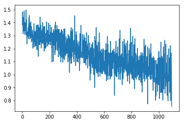

#### Summary
Here, changed basically the lstm dropout from `0.2` to `0.7` , seeing quite different behavior in the validation loss.
Although it doesnt improve, validation loss looks like it takes many more batches before that model overfits to accommodate `label=1` dramatically. As opposed to previous models which appears to overfit in much earlier batches.

```python

from importlib import reload
import os
import pandas as pd
from io import StringIO
import itertools
import ipdb
import datetime
from collections import Counter

import h5py
import json
import tensorflow as tf
from tensorflow import keras

# Helper libraries
import numpy as np
import matplotlib.pyplot as plt
from tqdm import tqdm
import joblib
print(tf.__version__)

from keras.preprocessing import sequence
from keras.models import Sequential
from keras.layers import Dense, Embedding
from keras.layers import LSTM

from keras.callbacks import EarlyStopping

from sklearn.preprocessing import StandardScaler
from sklearn.preprocessing import MinMaxScaler
import mytf.s3utils as msu
import mytf.utils as mu
import mytf.plot as mp
```

    1.14.0


    Using TensorFlow backend.


```python
tf.enable_eager_execution()
```

#### Do a shuffle

```python
# train ... new datasets, ...
outdir = 'history/2019-12-22T174803Z'
train_loc = f'{outdir}/train_balanced.h5'
test_loc = f'{outdir}/test_balanced.h5'

print(mu.h5_keys(train_loc))
print(mu.h5_keys(test_loc))
```

    ['X_0', 'X_1', 'X_2', 'X_3', 'Ylabels_0', 'Ylabels_1', 'Ylabels_2', 'Ylabels_3']
    ['X_0', 'X_1', 'X_2', 'X_3', 'Ylabels_0', 'Ylabels_1', 'Ylabels_2', 'Ylabels_3']


```python
# ok save the shuffled dataset too for repeatability...
# Grab and randomize since it's not huge...
vecs = [mu.read_h5_two(
                source_location=train_loc, 
                Xdataset=f'X_{i}',
                Ydataset=f'Ylabels_{i}')
                 for i in [0, 1, 2, 3]]

X_train = np.concatenate([x[0] for x in vecs])
Ylabels_train = np.concatenate([x[1] for x in vecs])

# Shuffle...
size = X_train.shape[0]
print(size)
indices = np.random.choice(range(size), size=size, replace=False)
X_train_shfl = X_train[indices]
Ylabels_train_shfl = Ylabels_train[indices].astype('int64')

X = X_train_shfl
Ylabels = Ylabels_train_shfl


# SAVE ...


mu.save_that(save_location=f'{outdir}/train_scaled_balanced_shuffled.h5', 
             name='X', X=X)

```

    34980


```python
# Parameters..

# Working dir... 
save_dir = 'history'
BATCH_SIZE = 32
ts = mu.quickts(); print('starting,', ts)

size = X.shape[0]
workdir = f'{save_dir}/{ts}'
os.mkdir(workdir)
print(f'Made new workdir, {workdir}')

#learning_rate = 
# 'batch_size'
lstm_params = {
    'units': 64,
    'dropout': 0.7,
    'recurrent_dropout': 0.7,
    'batch_input_shape': (None, 64, 8),
    }

model = tf.keras.Sequential([
    tf.keras.layers.LSTM(**lstm_params),
    # 4 because 'A', 'B', 'C', 'D'.
    tf.keras.layers.Dense(4)])

# save base unfitted model.
mu.save_model(model=model, 
              loc=f'{workdir}/00000__unfitted_model.h5')

```

    starting, 2019-12-25T181637Z
    Made new workdir, history/2019-12-25T181637Z


```python


model = mu.load_model(f'{workdir}/00000__unfitted_model.h5')

class_weights = {0: 1., 1: 1., 2: 1., 3: 1.}
dataset_batches = mu.build_dataset_weighty_v3(
        {'x_train': X,
         'ylabels_train': Ylabels},
        list(range(size)), 
        class_weights,
        batch_size=BATCH_SIZE)
    
with ipdb.launch_ipdb_on_exception():
    mu.do_train(
        model,
        dataset_batches,
        k=size,
        saveloc=workdir)
```

    W1225 18:17:57.218597 140461759739712 hdf5_format.py:221] No training configuration found in save file: the model was *not* compiled. Compile it manually.
    /home/ec2-user/SageMaker/aviation-pilot-physiology-hmm/mytf/utils.py:185: RuntimeWarning: divide by zero encountered in true_divide
      )/class_counts
    W1225 18:17:57.573302 140461759739712 deprecation_wrapper.py:119] From /home/ec2-user/SageMaker/aviation-pilot-physiology-hmm/mytf/utils.py:238: The name tf.train.AdamOptimizer is deprecated. Please use tf.compat.v1.train.AdamOptimizer instead.
    
    0it [00:00, ?it/s]W1225 18:17:57.873211 140461759739712 deprecation_wrapper.py:119] From /home/ec2-user/SageMaker/aviation-pilot-physiology-hmm/mytf/utils.py:246: The name tf.losses.sparse_softmax_cross_entropy is deprecated. Please use tf.compat.v1.losses.sparse_softmax_cross_entropy instead.
    
    W1225 18:17:57.876062 140461759739712 deprecation.py:323] From /home/ec2-user/anaconda3/envs/tensorflow_p36/lib/python3.6/site-packages/tensorflow/python/ops/losses/losses_impl.py:121: add_dispatch_support.<locals>.wrapper (from tensorflow.python.ops.array_ops) is deprecated and will be removed in a future version.
    Instructions for updating:
    Use tf.where in 2.0, which has the same broadcast rule as np.where
    1094it [07:43,  2.36it/s]


```python
historydir = 'history'
with open(f'{workdir}/01093_train_loss_history.json') as fd:
    losshistory = json.load(fd)
    
plt.plot(losshistory) 
```


    [<matplotlib.lines.Line2D at 0x7fbf40b13be0>]





```python
import mytf.validation as mv
print(ts)
```

    2019-12-25T181637Z


```python
%%time
batch_losses_vec = []
#sess = tf.Session()
#with sess.as_default():
for step in tqdm(np.arange(0, 1094, 10)):
    #print(step)
    modelname = f'history/{ts}/{str(step).zfill(5)}_model.h5'
    #print(modelname)
    steploss = mv.perf_wrapper(modelname,
                               dataloc=test_loc,
                               eager=True)
    #print('steploss, ', steploss)
    batch_losses_vec.append([float(x) for x in steploss])
    mv.json_save({'batch_losses_vec': batch_losses_vec,
                  'step': int(step)
              }, 
              f'history/{ts}/{str(step).zfill(5)}_validation_losses.json')
```

      0%|          | 0/110 [00:00<?, ?it/s]W1226 14:34:19.522549 140461759739712 hdf5_format.py:221] No training configuration found in save file: the model was *not* compiled. Compile it manually.
      1%|          | 1/110 [02:10<3:56:46, 130.34s/it]W1226 14:36:29.861780 140461759739712 hdf5_format.py:221] No training configuration found in save file: the model was *not* compiled. Compile it manually.
      2%|▏         | 2/110 [04:21<3:54:50, 130.47s/it]W1226 14:38:40.647291 140461759739712 hdf5_format.py:221] No training configuration found in save file: the model was *not* compiled. Compile it manually.
      3%|▎         | 3/110 [06:32<3:52:54, 130.60s/it]W1226 14:40:51.449493 140461759739712 hdf5_format.py:221] No training configuration found in save file: the model was *not* compiled. Compile it manually.
      4%|▎         | 4/110 [08:41<3:49:59, 130.18s/it]W1226 14:43:00.647146 140461759739712 hdf5_format.py:221] No training configuration found in save file: the model was *not* compiled. Compile it manually.
      5%|▍         | 5/110 [10:52<3:48:10, 130.39s/it]W1226 14:45:11.507648 140461759739712 hdf5_format.py:221] No training configuration found in save file: the model was *not* compiled. Compile it manually.
      5%|▌         | 6/110 [13:03<3:46:32, 130.70s/it]W1226 14:47:22.933815 140461759739712 hdf5_format.py:221] No training configuration found in save file: the model was *not* compiled. Compile it manually.
      6%|▋         | 7/110 [15:14<3:44:32, 130.80s/it]W1226 14:49:34.140855 140461759739712 hdf5_format.py:221] No training configuration found in save file: the model was *not* compiled. Compile it manually.
      7%|▋         | 8/110 [17:27<3:43:38, 131.56s/it]W1226 14:51:47.293497 140461759739712 hdf5_format.py:221] No training configuration found in save file: the model was *not* compiled. Compile it manually.
      8%|▊         | 9/110 [19:38<3:41:07, 131.36s/it]W1226 14:53:58.189683 140461759739712 hdf5_format.py:221] No training configuration found in save file: the model was *not* compiled. Compile it manually.
      9%|▉         | 10/110 [21:49<3:38:50, 131.30s/it]W1226 14:56:09.372905 140461759739712 hdf5_format.py:221] No training configuration found in save file: the model was *not* compiled. Compile it manually.
     10%|█         | 11/110 [24:00<3:36:12, 131.04s/it]W1226 14:58:19.804935 140461759739712 hdf5_format.py:221] No training configuration found in save file: the model was *not* compiled. Compile it manually.
     11%|█         | 12/110 [26:10<3:33:27, 130.69s/it]W1226 15:00:29.667920 140461759739712 hdf5_format.py:221] No training configuration found in save file: the model was *not* compiled. Compile it manually.
     12%|█▏        | 13/110 [28:22<3:31:50, 131.04s/it]W1226 15:02:41.509492 140461759739712 hdf5_format.py:221] No training configuration found in save file: the model was *not* compiled. Compile it manually.
     13%|█▎        | 14/110 [30:33<3:29:45, 131.10s/it]W1226 15:04:52.739221 140461759739712 hdf5_format.py:221] No training configuration found in save file: the model was *not* compiled. Compile it manually.
     14%|█▎        | 15/110 [32:44<3:27:47, 131.23s/it]W1226 15:07:04.307413 140461759739712 hdf5_format.py:221] No training configuration found in save file: the model was *not* compiled. Compile it manually.
     15%|█▍        | 16/110 [34:56<3:25:49, 131.38s/it]W1226 15:09:16.027548 140461759739712 hdf5_format.py:221] No training configuration found in save file: the model was *not* compiled. Compile it manually.
     15%|█▌        | 17/110 [37:07<3:23:36, 131.36s/it]W1226 15:11:27.347650 140461759739712 hdf5_format.py:221] No training configuration found in save file: the model was *not* compiled. Compile it manually.
     16%|█▋        | 18/110 [39:20<3:21:51, 131.64s/it]W1226 15:13:39.648931 140461759739712 hdf5_format.py:221] No training configuration found in save file: the model was *not* compiled. Compile it manually.
     17%|█▋        | 19/110 [41:30<3:19:10, 131.32s/it]W1226 15:15:50.226087 140461759739712 hdf5_format.py:221] No training configuration found in save file: the model was *not* compiled. Compile it manually.
     18%|█▊        | 20/110 [43:42<3:17:03, 131.38s/it]W1226 15:18:01.734383 140461759739712 hdf5_format.py:221] No training configuration found in save file: the model was *not* compiled. Compile it manually.
     19%|█▉        | 21/110 [45:55<3:15:50, 132.03s/it]W1226 15:20:15.267008 140461759739712 hdf5_format.py:221] No training configuration found in save file: the model was *not* compiled. Compile it manually.
     20%|██        | 22/110 [48:08<3:13:46, 132.11s/it]W1226 15:22:27.584050 140461759739712 hdf5_format.py:221] No training configuration found in save file: the model was *not* compiled. Compile it manually.
     21%|██        | 23/110 [50:19<3:11:25, 132.01s/it]W1226 15:24:39.366992 140461759739712 hdf5_format.py:221] No training configuration found in save file: the model was *not* compiled. Compile it manually.
     22%|██▏       | 24/110 [52:31<3:09:10, 131.99s/it]W1226 15:26:51.564683 140461759739712 hdf5_format.py:221] No training configuration found in save file: the model was *not* compiled. Compile it manually.
     23%|██▎       | 25/110 [54:45<3:07:32, 132.38s/it]W1226 15:29:04.587636 140461759739712 hdf5_format.py:221] No training configuration found in save file: the model was *not* compiled. Compile it manually.
     24%|██▎       | 26/110 [56:56<3:04:52, 132.06s/it]W1226 15:31:15.878966 140461759739712 hdf5_format.py:221] No training configuration found in save file: the model was *not* compiled. Compile it manually.
     25%|██▍       | 27/110 [59:05<3:01:14, 131.02s/it]W1226 15:33:24.476180 140461759739712 hdf5_format.py:221] No training configuration found in save file: the model was *not* compiled. Compile it manually.
     25%|██▌       | 28/110 [1:01:15<2:58:46, 130.81s/it]W1226 15:35:34.823628 140461759739712 hdf5_format.py:221] No training configuration found in save file: the model was *not* compiled. Compile it manually.
     26%|██▋       | 29/110 [1:03:26<2:56:38, 130.84s/it]W1226 15:37:45.731816 140461759739712 hdf5_format.py:221] No training configuration found in save file: the model was *not* compiled. Compile it manually.
     27%|██▋       | 30/110 [1:05:35<2:53:53, 130.42s/it]W1226 15:39:55.147736 140461759739712 hdf5_format.py:221] No training configuration found in save file: the model was *not* compiled. Compile it manually.
     28%|██▊       | 31/110 [1:07:47<2:52:11, 130.78s/it]W1226 15:42:06.789149 140461759739712 hdf5_format.py:221] No training configuration found in save file: the model was *not* compiled. Compile it manually.
     29%|██▉       | 32/110 [1:09:58<2:50:16, 130.98s/it]W1226 15:44:18.227240 140461759739712 hdf5_format.py:221] No training configuration found in save file: the model was *not* compiled. Compile it manually.
     30%|███       | 33/110 [1:12:10<2:48:12, 131.08s/it]W1226 15:46:29.830424 140461759739712 hdf5_format.py:221] No training configuration found in save file: the model was *not* compiled. Compile it manually.
     31%|███       | 34/110 [1:14:19<2:45:28, 130.64s/it]W1226 15:48:39.158029 140461759739712 hdf5_format.py:221] No training configuration found in save file: the model was *not* compiled. Compile it manually.
     32%|███▏      | 35/110 [1:16:31<2:43:35, 130.88s/it]W1226 15:50:50.585200 140461759739712 hdf5_format.py:221] No training configuration found in save file: the model was *not* compiled. Compile it manually.
     33%|███▎      | 36/110 [1:18:43<2:41:48, 131.20s/it]W1226 15:53:02.553674 140461759739712 hdf5_format.py:221] No training configuration found in save file: the model was *not* compiled. Compile it manually.
     34%|███▎      | 37/110 [1:20:54<2:39:32, 131.13s/it]W1226 15:55:13.634235 140461759739712 hdf5_format.py:221] No training configuration found in save file: the model was *not* compiled. Compile it manually.
     35%|███▍      | 38/110 [1:23:03<2:36:42, 130.59s/it]W1226 15:57:23.147924 140461759739712 hdf5_format.py:221] No training configuration found in save file: the model was *not* compiled. Compile it manually.
     99%|█████████▉| 109/110 [3:57:52<02:11, 131.23s/it]W1226 18:32:12.019807 140461759739712 hdf5_format.py:221] No training configuration found in save file: the model was *not* compiled. Compile it manually.
    100%|██████████| 110/110 [4:00:03<00:00, 130.94s/it]

    CPU times: user 3h 59min 24s, sys: 19.6 s, total: 3h 59min 44s
    Wall time: 4h 3s


    


```python
# Hmm interesting information about this compile warning, 
# in https://stackoverflow.com/questions/53295570/userwarning-no-training-configuration-found-in-save-file-the-model-was-not-c  
# I have not used this model.compile() recently.
```


```python
# crap I forgot to save the shuffled ylabels..


mu.save_that(save_location=f'{outdir}/train_scaled_balanced_shuffled.h5', 
             name='Ylabels', X=Ylabels)
```


```python
mu.h5_keys(f'{outdir}/train_scaled_balanced_shuffled.h5')
```


    ['X', 'Ylabels']


```python
len(batch_losses_vec)
```


    110


```python
# .... hopefully if some of that stuff finishes ..
# I can run this ... 
lossesarr = np.array(batch_losses_vec)
meanlossesarr = np.mean(lossesarr, axis=1)

batch_losses_vec[:5]
#batch_losses_vec = []
#for step in np.arange(0, 1068, 10):
# [2.8359528, 0.45356295, 1.7049086, 4.099845]

plt.plot([x[0] for x in batch_losses_vec], color='blue', label='0')
plt.plot([x[1] for x in batch_losses_vec], color='green', label='1')
plt.plot([x[2] for x in batch_losses_vec], color='red', label='2')
plt.plot([x[3] for x in batch_losses_vec], color='orange', label='3')
plt.plot(meanlossesarr, color='black', label='mean')
plt.title(f'validation losses  (model {ts})')
plt.legend()
#plt.plot

```


    <matplotlib.legend.Legend at 0x7fbf018dacf8>

##### Validation loss


```python

```
