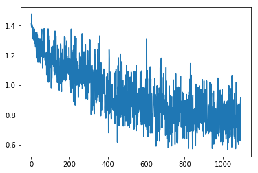
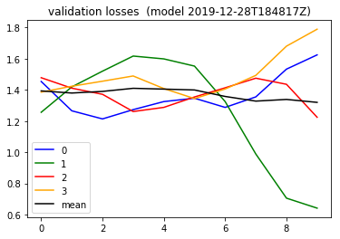
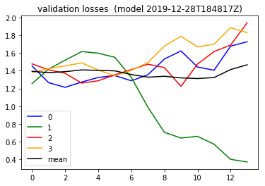

```python

from importlib import reload
import os
import pandas as pd
from io import StringIO
import itertools
import ipdb
import datetime
from collections import Counter

import h5py
import json
import tensorflow as tf
from tensorflow import keras

# Helper libraries
import numpy as np
import matplotlib.pyplot as plt
from tqdm import tqdm
import joblib
print(tf.__version__)

from keras.preprocessing import sequence
from keras.models import Sequential
from keras.layers import Dense, Embedding
from keras.layers import LSTM

from keras.callbacks import EarlyStopping

from sklearn.preprocessing import StandardScaler
from sklearn.preprocessing import MinMaxScaler
import mytf.s3utils as msu
import mytf.utils as mu
import mytf.validation as mv
import mytf.plot as mp
```

    1.14.0


    Using TensorFlow backend.


```python
tf.enable_eager_execution()
```


```python
# Try different learning rates...?
# Hmmm try the stacked lstm architecture from the machine learning mastery DL book.

```


```python
# Use datasets from 
# 2019-12-25.ipynb
# 
# train ... new datasets, ...
outdir = 'history/2019-12-22T174803Z'
train_loc = f'{outdir}/train_balanced.h5'
test_loc = f'{outdir}/test_balanced.h5'
train_shuff_loc = f'{outdir}/train_scaled_balanced_shuffled.h5'
print(mu.h5_keys(train_shuff_loc))
print(mu.h5_keys(test_loc))

X, Ylabels = mu.read_h5_two(
                source_location=train_shuff_loc, 
                Xdataset=f'X',
                Ydataset=f'Ylabels')
```

    ['X', 'Ylabels']
    ['X_0', 'X_1', 'X_2', 'X_3', 'Ylabels_0', 'Ylabels_1', 'Ylabels_2', 'Ylabels_3']


```python
class_weights = {0: 1., 1: 1., 2: 1., 3: 1.}
size = X.shape[0]
train_vec, label_vec, weights_vec = \
            mu.helper_build_dataset_weighty_v3(
    arrays={'x_train': X,
         'ylabels_train': Ylabels}, 
    target_indices=list(range(size)), 
    class_weights=class_weights,
    batch_size=32)


# dataset_batches = mu.build_dataset_weighty_v3(
#        {'x_train': X,
#         'ylabels_train': Ylabels},
#        list(range(size)), 
#        class_weights=class_weights,
#        batch_size=BATCH_SIZE)
```

    /home/ec2-user/SageMaker/aviation-pilot-physiology-hmm/mytf/utils.py:185: RuntimeWarning: divide by zero encountered in true_divide
      )/class_counts


```python
print(X.shape, Ylabels.shape)
print(len(train_vec), size/32)
print(train_vec[0].shape)
#print(type(label_vec[0]))
print(train_vec[0].shape, label_vec[0].shape)
print(weights_vec[200])
print(Counter(Ylabels))
print((label_vec[2]))
```

    (34980, 64, 8) (34980,)
    1094 1093.125
    (32, 64, 8)
    (32, 64, 8) (32,)
    [1.0, 1.0, 1.0, 1.0, 1.0, 1.0, 1.0, 1.0, 1.0, 1.0, 1.0, 1.0, 1.0, 1.0, 1.0, 1.0, 1.0, 1.0, 1.0, 1.0, 1.0, 1.0, 1.0, 1.0, 1.0, 1.0, 1.0, 1.0, 1.0, 1.0, 1.0, 1.0]
    Counter({0.0: 10230, 3.0: 8839, 2.0: 8286, 1.0: 7625})
    [0. 1. 1. 3. 2. 2. 2. 3. 1. 0. 1. 3. 2. 0. 1. 2. 2. 0. 0. 3. 0. 1. 3. 0.
     3. 0. 2. 2. 3. 3. 1. 1.]


```python
# Working dir... for new model
save_dir = 'history'
ts = mu.quickts(); print('starting,', ts)

size = X.shape[0]
workdir = f'{save_dir}/{ts}'
os.mkdir(workdir)
print(f'Made new workdir, {workdir}')
```

    starting, 2019-12-28T184817Z
    Made new workdir, history/2019-12-28T184817Z


```python
type(Ylabels[0]), type(X[0][0][0])
```


    (numpy.float64, numpy.float64)


##### InternalError
I think since this time I had loaded a previously saved shuffled balanced data, 
I'm seeing it is float64. maybe thats why I'm getting this `InternalError` about the types.. 

```
type(Ylabels[0]), type(X[0][0][0])
(numpy.float64, numpy.float64)

InternalError: Could not find valid device for node.
Node: {{node SparseSoftmaxCrossEntropyWithLogits}}
All kernels registered for op SparseSoftmaxCrossEntropyWithLogits :
  device='XLA_CPU'; Tlabels in [DT_INT32, DT_INT64]; T in [DT_FLOAT, DT_DOUBLE, DT_BFLOAT16, DT_HALF]
  device='CPU'; T in [DT_HALF]; Tlabels in [DT_INT64]
  device='CPU'; T in [DT_HALF]; Tlabels in [DT_INT32]
  device='CPU'; T in [DT_DOUBLE]; Tlabels in [DT_INT64]
  device='CPU'; T in [DT_DOUBLE]; Tlabels in [DT_INT32]
  device='CPU'; T in [DT_FLOAT]; Tlabels in [DT_INT64]
  device='CPU'; T in [DT_FLOAT]; Tlabels in [DT_INT32]
  device='XLA_CPU_JIT'; Tlabels in [DT_INT32, DT_INT64]; T in [DT_FLOAT, DT_DOUBLE, DT_BFLOAT16, DT_HALF]
 [Op:SparseSoftmaxCrossEntropyWithLogits] name: xentropy
```

##### instead...
```
type(Ylabels[0].astype('int64')), type(X[0][0][0])
```
Okay.. when I passed that, this worked now.


```python
# Parameters..

# 'batch_size'
BATCH_SIZE = 32
# 
# ValueError: If a RNN is stateful, it needs to know its batch size. Specify the batch size of your input tensors: 
# - If using a Sequential model, specify the batch size by passing a `batch_input_shape` argument to your first layer.
# - If using the functional API, specify the batch size by passing a `batch_shape` argument to your Input layer.

lstm_params = [{
    'units': 64,
    'dropout': 0.5,
    'recurrent_dropout': 0.5,
    'batch_input_shape': (BATCH_SIZE, 64, 8),
    'stateful': True,
    'return_sequences': True,
    },
    {'units': 64,
    'dropout': 0.5,
    'recurrent_dropout': 0.5,
    'batch_input_shape': (BATCH_SIZE, 64, 8),
    'stateful': True,
    },

]

optimizer_params = {
    'learning_rate': 0.001,  
    'beta1': 0.9, 
    'beta2': 0.999, 
    'epsilon': 1e-08
}

model = tf.keras.Sequential([
    tf.keras.layers.LSTM(**lstm_params[0]),
    tf.keras.layers.LSTM(**lstm_params[1]),
    # 4 because 'A', 'B', 'C', 'D'.
    tf.keras.layers.Dense(4)])

# save base unfitted model.
mu.save_model(model=model, 
              loc=f'{workdir}/00000__unfitted_model.h5')
```


```python


model = mu.load_model(f'{workdir}/00000__unfitted_model.h5')

class_weights = {0: 1., 1: 1., 2: 1., 3: 1.}
dataset_batches = mu.build_dataset_weighty_v3(
        {'x_train': X,
         'ylabels_train': Ylabels.astype('int64')},
        list(range(size)), 
        class_weights,
        batch_size=BATCH_SIZE)
    
#with ipdb.launch_ipdb_on_exception():
mu.do_train(
        model,
        dataset_batches,
        k=size,
        saveloc=workdir)
```

    W1228 19:02:40.161912 139664612869952 hdf5_format.py:221] No training configuration found in save file: the model was *not* compiled. Compile it manually.
    /home/ec2-user/SageMaker/aviation-pilot-physiology-hmm/mytf/utils.py:185: RuntimeWarning: divide by zero encountered in true_divide
      )/class_counts
    0it [00:00, ?it/s]W1228 19:02:40.976063 139664612869952 deprecation.py:323] From /home/ec2-user/anaconda3/envs/tensorflow_p36/lib/python3.6/site-packages/tensorflow/python/ops/losses/losses_impl.py:121: add_dispatch_support.<locals>.wrapper (from tensorflow.python.ops.array_ops) is deprecated and will be removed in a future version.
    Instructions for updating:
    Use tf.where in 2.0, which has the same broadcast rule as np.where
    1093it [15:51,  1.14it/s]


    ---------------------------------------------------------------------------

    InvalidArgumentError                      Traceback (most recent call last)

    <ipython-input-59-ec2bbfc60df0> in <module>()
         16         dataset_batches,
         17         k=size,
    ---> 18         saveloc=workdir)
    

    ~/SageMaker/aviation-pilot-physiology-hmm/mytf/utils.py in do_train(model, dataset_batches, k, saveloc)
        243 
        244         with tf.GradientTape() as tape:
    --> 245             logits = model(invec, training=True)
        246             loss_value = tf.losses.sparse_softmax_cross_entropy(labels, logits, weights=weights)
        247 


    ~/anaconda3/envs/tensorflow_p36/lib/python3.6/site-packages/tensorflow/python/keras/engine/base_layer.py in __call__(self, inputs, *args, **kwargs)
        679           with base_layer_utils.autocast_context_manager(
        680               input_list, self._mixed_precision_policy.should_cast_variables):
    --> 681             outputs = self.call(inputs, *args, **kwargs)
        682           self._handle_activity_regularization(inputs, outputs)
        683           self._set_mask_metadata(inputs, outputs, previous_mask)


    ~/anaconda3/envs/tensorflow_p36/lib/python3.6/site-packages/tensorflow/python/keras/engine/sequential.py in call(self, inputs, training, mask)
        245       if not self.built:
        246         self._init_graph_network(self.inputs, self.outputs, name=self.name)
    --> 247       return super(Sequential, self).call(inputs, training=training, mask=mask)
        248 
        249     outputs = inputs  # handle the corner case where self.layers is empty


    ~/anaconda3/envs/tensorflow_p36/lib/python3.6/site-packages/tensorflow/python/keras/engine/network.py in call(self, inputs, training, mask)
        749                                 ' implement a `call` method.')
        750 
    --> 751     return self._run_internal_graph(inputs, training=training, mask=mask)
        752 
        753   def compute_output_shape(self, input_shape):


    ~/anaconda3/envs/tensorflow_p36/lib/python3.6/site-packages/tensorflow/python/keras/engine/network.py in _run_internal_graph(self, inputs, training, mask)
        891 
        892           # Compute outputs.
    --> 893           output_tensors = layer(computed_tensors, **kwargs)
        894 
        895           # Update tensor_dict.


    ~/anaconda3/envs/tensorflow_p36/lib/python3.6/site-packages/tensorflow/python/keras/layers/recurrent.py in __call__(self, inputs, initial_state, constants, **kwargs)
        617 
        618     if initial_state is None and constants is None:
    --> 619       return super(RNN, self).__call__(inputs, **kwargs)
        620 
        621     # If any of `initial_state` or `constants` are specified and are Keras


    ~/anaconda3/envs/tensorflow_p36/lib/python3.6/site-packages/tensorflow/python/keras/engine/base_layer.py in __call__(self, inputs, *args, **kwargs)
        679           with base_layer_utils.autocast_context_manager(
        680               input_list, self._mixed_precision_policy.should_cast_variables):
    --> 681             outputs = self.call(inputs, *args, **kwargs)
        682           self._handle_activity_regularization(inputs, outputs)
        683           self._set_mask_metadata(inputs, outputs, previous_mask)


    ~/anaconda3/envs/tensorflow_p36/lib/python3.6/site-packages/tensorflow/python/keras/layers/recurrent.py in call(self, inputs, mask, training, initial_state)
       2531     self.cell.reset_recurrent_dropout_mask()
       2532     return super(LSTM, self).call(
    -> 2533         inputs, mask=mask, training=training, initial_state=initial_state)
       2534 
       2535   @property


    ~/anaconda3/envs/tensorflow_p36/lib/python3.6/site-packages/tensorflow/python/keras/layers/recurrent.py in call(self, inputs, mask, training, initial_state, constants)
        741         input_length=timesteps,
        742         time_major=self.time_major,
    --> 743         zero_output_for_mask=self.zero_output_for_mask)
        744     if self.stateful:
        745       updates = []


    ~/anaconda3/envs/tensorflow_p36/lib/python3.6/site-packages/tensorflow/python/keras/backend.py in rnn(step_function, inputs, initial_states, go_backwards, mask, constants, unroll, input_length, time_major, zero_output_for_mask)
       3730     # the value is discarded.
       3731     output_time_zero, _ = step_function(
    -> 3732         input_time_zero, tuple(initial_states) + tuple(constants))
       3733     output_ta = tuple(
       3734         tensor_array_ops.TensorArray(


    ~/anaconda3/envs/tensorflow_p36/lib/python3.6/site-packages/tensorflow/python/keras/layers/recurrent.py in step(inputs, states)
        726       def step(inputs, states):
        727         states = states[0] if len(states) == 1 and is_tf_rnn_cell else states
    --> 728         output, new_states = self.cell.call(inputs, states, **kwargs)
        729         if not nest.is_sequence(new_states):
        730           new_states = [new_states]


    ~/anaconda3/envs/tensorflow_p36/lib/python3.6/site-packages/tensorflow/python/keras/layers/recurrent.py in call(self, inputs, states, training)
       2238       x = (x_i, x_f, x_c, x_o)
       2239       h_tm1 = (h_tm1_i, h_tm1_f, h_tm1_c, h_tm1_o)
    -> 2240       c, o = self._compute_carry_and_output(x, h_tm1, c_tm1)
       2241     else:
       2242       if 0. < self.dropout < 1.:


    ~/anaconda3/envs/tensorflow_p36/lib/python3.6/site-packages/tensorflow/python/keras/layers/recurrent.py in _compute_carry_and_output(self, x, h_tm1, c_tm1)
       2175     h_tm1_i, h_tm1_f, h_tm1_c, h_tm1_o = h_tm1
       2176     i = self.recurrent_activation(
    -> 2177         x_i + K.dot(h_tm1_i, self.recurrent_kernel[:, :self.units]))
       2178     f = self.recurrent_activation(x_f + K.dot(
       2179         h_tm1_f, self.recurrent_kernel[:, self.units:self.units * 2]))


    ~/anaconda3/envs/tensorflow_p36/lib/python3.6/site-packages/tensorflow/python/ops/math_ops.py in binary_op_wrapper(x, y)
        882     with ops.name_scope(None, op_name, [x, y]) as name:
        883       if isinstance(x, ops.Tensor) and isinstance(y, ops.Tensor):
    --> 884         return func(x, y, name=name)
        885       elif not isinstance(y, sparse_tensor.SparseTensor):
        886         try:


    ~/anaconda3/envs/tensorflow_p36/lib/python3.6/site-packages/tensorflow/python/ops/gen_math_ops.py in add(x, y, name)
        381       else:
        382         message = e.message
    --> 383       _six.raise_from(_core._status_to_exception(e.code, message), None)
        384   # Add nodes to the TensorFlow graph.
        385   try:


    ~/anaconda3/envs/tensorflow_p36/lib/python3.6/site-packages/six.py in raise_from(value, from_value)


    InvalidArgumentError: Incompatible shapes: [4,64] vs. [32,64] [Op:Add] name: sequential_2/lstm_11/add/


#### Crashed last batch but thats okay
So this time around since I did a stacked lstm, the very last batch failed because it was not 
the same size as the batch size I specified. It is luckily okay though, because
I save my models and train losses to a file these days . So literally 99.9% of the models were saved. =)


```python
historydir = 'history'
with open(f'{workdir}/01092_train_loss_history.json') as fd:
    losshistory = json.load(fd)
    
plt.plot(losshistory) 
```


    [<matplotlib.lines.Line2D at 0x7f0595cb6198>]





```python
import mytf.validation as mv
print(ts)
```

    2019-12-28T184817Z


#### Similarly, evaluation, got this 
```
InvalidArgumentError: Incompatible shapes: [100,64] vs. [32,64] [Op:Add] name: sequential_2/lstm_11/add/
```

#### Dang also validation failed at the end..
```
InvalidArgumentError: Incompatible shapes: [7,64] vs. [32,64] [Op:Add] name: sequential_2/lstm_11/add/
```
The very last chunk of validation, I have to not include that one... grr..


```python
reload(mv)
```


    <module 'mytf.validation' from '/home/ec2-user/SageMaker/aviation-pilot-physiology-hmm/mytf/validation.py'>


```python
print('starting validation', mu.quickts())
#def wrapwrap():
batch_losses_vec = []

for step in tqdm(np.arange(0, 100, 10)):
    modelname = f'history/{ts}/{str(step).zfill(5)}_model.h5'
    steploss = mv.perf_wrapper(modelname,
                               dataloc=test_loc,
                               eager=True,
                              batch_size=32)
    batch_losses_vec.append([float(x) for x in steploss])
    mv.json_save({'batch_losses_vec': batch_losses_vec,
                  'step': int(step)
              }, 
              f'history/{ts}/{str(step).zfill(5)}_validation_losses.json')
    
print('done validation', mu.quickts())
#####
lossesarr = np.array(batch_losses_vec)
meanlossesarr = np.mean(lossesarr, axis=1)

batch_losses_vec[:5]
#batch_losses_vec = []
#for step in np.arange(0, 1068, 10):
# [2.8359528, 0.45356295, 1.7049086, 4.099845]

plt.plot([x[0] for x in batch_losses_vec], color='blue', label='0')
plt.plot([x[1] for x in batch_losses_vec], color='green', label='1')
plt.plot([x[2] for x in batch_losses_vec], color='red', label='2')
plt.plot([x[3] for x in batch_losses_vec], color='orange', label='3')
plt.plot(meanlossesarr, color='black', label='mean')
plt.title(f'validation losses  (model {ts})')
plt.legend()

```

    
    
      0%|          | 0/10 [00:00<?, ?it/s]

    starting validation 2019-12-28T202107Z


    W1228 20:21:08.731440 139664612869952 hdf5_format.py:221] No training configuration found in save file: the model was *not* compiled. Compile it manually.
    
    
     10%|█         | 1/10 [12:54<1:56:14, 774.89s/it]W1228 20:34:03.588593 139664612869952 hdf5_format.py:221] No training configuration found in save file: the model was *not* compiled. Compile it manually.
    
    
     20%|██        | 2/10 [25:47<1:43:12, 774.07s/it]W1228 20:46:55.499610 139664612869952 hdf5_format.py:221] No training configuration found in save file: the model was *not* compiled. Compile it manually.
    
    
     30%|███       | 3/10 [38:39<1:30:15, 773.61s/it]W1228 20:59:48.038667 139664612869952 hdf5_format.py:221] No training configuration found in save file: the model was *not* compiled. Compile it manually.
    
    
     40%|████      | 4/10 [51:40<1:17:35, 775.94s/it]W1228 21:12:49.424139 139664612869952 hdf5_format.py:221] No training configuration found in save file: the model was *not* compiled. Compile it manually.
    
    
     50%|█████     | 5/10 [1:04:51<1:05:00, 780.18s/it]W1228 21:25:59.740381 139664612869952 hdf5_format.py:221] No training configuration found in save file: the model was *not* compiled. Compile it manually.
    
    
     60%|██████    | 6/10 [1:18:07<52:20, 785.14s/it]  W1228 21:39:16.488294 139664612869952 hdf5_format.py:221] No training configuration found in save file: the model was *not* compiled. Compile it manually.
    
    
     70%|███████   | 7/10 [1:31:17<39:19, 786.40s/it]W1228 21:52:25.839690 139664612869952 hdf5_format.py:221] No training configuration found in save file: the model was *not* compiled. Compile it manually.
    
    
     80%|████████  | 8/10 [1:44:10<26:05, 782.58s/it]W1228 22:05:19.512105 139664612869952 hdf5_format.py:221] No training configuration found in save file: the model was *not* compiled. Compile it manually.
    
    
     90%|█████████ | 9/10 [1:57:00<12:58, 778.73s/it]W1228 22:18:08.995194 139664612869952 hdf5_format.py:221] No training configuration found in save file: the model was *not* compiled. Compile it manually.
    
    
    100%|██████████| 10/10 [2:09:56<00:00, 779.67s/it]

    done validation 2019-12-28T223104Z


    


    <matplotlib.legend.Legend at 0x7f0595d22978>





```python
print('starting validation', mu.quickts())
#def wrapwrap():
print('len batch_losses_vec', len(batch_losses_vec))
# batch_losses_vec = []

for step in tqdm(np.arange(100, 200, 10)):
    modelname = f'history/{ts}/{str(step).zfill(5)}_model.h5'
    steploss = mv.perf_wrapper(modelname,
                               dataloc=test_loc,
                               eager=True,
                              batch_size=32)
    batch_losses_vec.append([float(x) for x in steploss])
    mv.json_save({'batch_losses_vec': batch_losses_vec,
                  'step': int(step)
              }, 
              f'history/{ts}/{str(step).zfill(5)}_validation_losses.json')
    
print('done validation', mu.quickts())
#####
lossesarr = np.array(batch_losses_vec)
meanlossesarr = np.mean(lossesarr, axis=1)

batch_losses_vec[:5]
#batch_losses_vec = []
#for step in np.arange(0, 1068, 10):
# [2.8359528, 0.45356295, 1.7049086, 4.099845]

plt.plot([x[0] for x in batch_losses_vec], color='blue', label='0')
plt.plot([x[1] for x in batch_losses_vec], color='green', label='1')
plt.plot([x[2] for x in batch_losses_vec], color='red', label='2')
plt.plot([x[3] for x in batch_losses_vec], color='orange', label='3')
plt.plot(meanlossesarr, color='black', label='mean')
plt.title(f'validation losses  (model {ts})')
plt.legend()


```

    
    
      0%|          | 0/10 [00:00<?, ?it/s]

    starting validation 2019-12-28T225036Z
    len batch_losses_vec 10


    W1228 22:50:37.497003 139664612869952 hdf5_format.py:221] No training configuration found in save file: the model was *not* compiled. Compile it manually.
    
    
     10%|█         | 1/10 [12:56<1:56:24, 776.01s/it]W1228 23:03:33.501674 139664612869952 hdf5_format.py:221] No training configuration found in save file: the model was *not* compiled. Compile it manually.
    
    
     20%|██        | 2/10 [25:55<1:43:36, 777.10s/it]W1228 23:16:33.146059 139664612869952 hdf5_format.py:221] No training configuration found in save file: the model was *not* compiled. Compile it manually.
    
    
     30%|███       | 3/10 [39:06<1:31:08, 781.22s/it]W1228 23:29:43.982626 139664612869952 hdf5_format.py:221] No training configuration found in save file: the model was *not* compiled. Compile it manually.
    
    
     40%|████      | 4/10 [52:08<1:18:09, 781.60s/it]W1228 23:42:46.800872 139664612869952 hdf5_format.py:221] No training configuration found in save file: the model was *not* compiled. Compile it manually.


    ---------------------------------------------------------------------------

    KeyboardInterrupt                         Traceback (most recent call last)

    <ipython-input-80-8f899bf909e9> in <module>()
          9                                dataloc=test_loc,
         10                                eager=True,
    ---> 11                               batch_size=32)
         12     batch_losses_vec.append([float(x) for x in steploss])
         13     mv.json_save({'batch_losses_vec': batch_losses_vec,


    ~/SageMaker/aviation-pilot-physiology-hmm/mytf/validation.py in perf_wrapper(modelloc, dataloc, eager, batch_size)
         52                                   ['X_3', 'Ylabels_3']],
         53                     eager=eager,
    ---> 54                     batch_size=batch_size)
         55 
         56 def json_save(x, loc):


    ~/SageMaker/aviation-pilot-physiology-hmm/mytf/validation.py in get_performance_parts(model, dataloc, dataset_names, eager, batch_size)
         18         batchlosses = []
         19         for part in parts:
    ---> 20             preds = model(X[part].astype('float32'))
         21 
         22             if eager:


    ~/anaconda3/envs/tensorflow_p36/lib/python3.6/site-packages/tensorflow/python/keras/engine/base_layer.py in __call__(self, inputs, *args, **kwargs)
        679           with base_layer_utils.autocast_context_manager(
        680               input_list, self._mixed_precision_policy.should_cast_variables):
    --> 681             outputs = self.call(inputs, *args, **kwargs)
        682           self._handle_activity_regularization(inputs, outputs)
        683           self._set_mask_metadata(inputs, outputs, previous_mask)


    ~/anaconda3/envs/tensorflow_p36/lib/python3.6/site-packages/tensorflow/python/keras/engine/sequential.py in call(self, inputs, training, mask)
        245       if not self.built:
        246         self._init_graph_network(self.inputs, self.outputs, name=self.name)
    --> 247       return super(Sequential, self).call(inputs, training=training, mask=mask)
        248 
        249     outputs = inputs  # handle the corner case where self.layers is empty


    ~/anaconda3/envs/tensorflow_p36/lib/python3.6/site-packages/tensorflow/python/keras/engine/network.py in call(self, inputs, training, mask)
        749                                 ' implement a `call` method.')
        750 
    --> 751     return self._run_internal_graph(inputs, training=training, mask=mask)
        752 
        753   def compute_output_shape(self, input_shape):


    ~/anaconda3/envs/tensorflow_p36/lib/python3.6/site-packages/tensorflow/python/keras/engine/network.py in _run_internal_graph(self, inputs, training, mask)
        891 
        892           # Compute outputs.
    --> 893           output_tensors = layer(computed_tensors, **kwargs)
        894 
        895           # Update tensor_dict.


    ~/anaconda3/envs/tensorflow_p36/lib/python3.6/site-packages/tensorflow/python/keras/layers/recurrent.py in __call__(self, inputs, initial_state, constants, **kwargs)
        617 
        618     if initial_state is None and constants is None:
    --> 619       return super(RNN, self).__call__(inputs, **kwargs)
        620 
        621     # If any of `initial_state` or `constants` are specified and are Keras


    ~/anaconda3/envs/tensorflow_p36/lib/python3.6/site-packages/tensorflow/python/keras/engine/base_layer.py in __call__(self, inputs, *args, **kwargs)
        679           with base_layer_utils.autocast_context_manager(
        680               input_list, self._mixed_precision_policy.should_cast_variables):
    --> 681             outputs = self.call(inputs, *args, **kwargs)
        682           self._handle_activity_regularization(inputs, outputs)
        683           self._set_mask_metadata(inputs, outputs, previous_mask)


    ~/anaconda3/envs/tensorflow_p36/lib/python3.6/site-packages/tensorflow/python/keras/layers/recurrent.py in call(self, inputs, mask, training, initial_state)
       2531     self.cell.reset_recurrent_dropout_mask()
       2532     return super(LSTM, self).call(
    -> 2533         inputs, mask=mask, training=training, initial_state=initial_state)
       2534 
       2535   @property


    ~/anaconda3/envs/tensorflow_p36/lib/python3.6/site-packages/tensorflow/python/keras/layers/recurrent.py in call(self, inputs, mask, training, initial_state, constants)
        741         input_length=timesteps,
        742         time_major=self.time_major,
    --> 743         zero_output_for_mask=self.zero_output_for_mask)
        744     if self.stateful:
        745       updates = []


    ~/anaconda3/envs/tensorflow_p36/lib/python3.6/site-packages/tensorflow/python/keras/backend.py in rnn(step_function, inputs, initial_states, go_backwards, mask, constants, unroll, input_length, time_major, zero_output_for_mask)
       3850           body=_step,
       3851           loop_vars=(time, output_ta) + states,
    -> 3852           **while_loop_kwargs)
       3853       new_states = final_outputs[2:]
       3854 


    ~/anaconda3/envs/tensorflow_p36/lib/python3.6/site-packages/tensorflow/python/ops/control_flow_ops.py in while_loop(cond, body, loop_vars, shape_invariants, parallel_iterations, back_prop, swap_memory, name, maximum_iterations, return_same_structure)
       3461 
       3462       while cond(*loop_vars):
    -> 3463         loop_vars = body(*loop_vars)
       3464         if try_to_pack and not isinstance(loop_vars, (list, _basetuple)):
       3465           packed = True


    ~/anaconda3/envs/tensorflow_p36/lib/python3.6/site-packages/tensorflow/python/ops/control_flow_ops.py in <lambda>(i, lv)
       3454         cond = lambda i, lv: (  # pylint: disable=g-long-lambda
       3455             math_ops.logical_and(i < maximum_iterations, orig_cond(*lv)))
    -> 3456         body = lambda i, lv: (i + 1, orig_body(*lv))
       3457 
       3458     if executing_eagerly:


    ~/anaconda3/envs/tensorflow_p36/lib/python3.6/site-packages/tensorflow/python/keras/backend.py in _step(time, output_ta_t, *states)
       3834         current_input = nest.pack_sequence_as(inputs, current_input)
       3835         output, new_states = step_function(current_input,
    -> 3836                                            tuple(states) + tuple(constants))
       3837         flat_state = nest.flatten(states)
       3838         flat_new_state = nest.flatten(new_states)


    ~/anaconda3/envs/tensorflow_p36/lib/python3.6/site-packages/tensorflow/python/keras/layers/recurrent.py in step(inputs, states)
        726       def step(inputs, states):
        727         states = states[0] if len(states) == 1 and is_tf_rnn_cell else states
    --> 728         output, new_states = self.cell.call(inputs, states, **kwargs)
        729         if not nest.is_sequence(new_states):
        730           new_states = [new_states]


    ~/anaconda3/envs/tensorflow_p36/lib/python3.6/site-packages/tensorflow/python/keras/layers/recurrent.py in call(self, inputs, states, training)
       2203     if self.implementation == 1:
       2204       if 0 < self.dropout < 1.:
    -> 2205         inputs_i = inputs * dp_mask[0]
       2206         inputs_f = inputs * dp_mask[1]
       2207         inputs_c = inputs * dp_mask[2]


    ~/anaconda3/envs/tensorflow_p36/lib/python3.6/site-packages/tensorflow/python/ops/math_ops.py in binary_op_wrapper(x, y)
        882     with ops.name_scope(None, op_name, [x, y]) as name:
        883       if isinstance(x, ops.Tensor) and isinstance(y, ops.Tensor):
    --> 884         return func(x, y, name=name)
        885       elif not isinstance(y, sparse_tensor.SparseTensor):
        886         try:


    ~/anaconda3/envs/tensorflow_p36/lib/python3.6/site-packages/tensorflow/python/ops/math_ops.py in _mul_dispatch(x, y, name)
       1178   is_tensor_y = isinstance(y, ops.Tensor)
       1179   if is_tensor_y:
    -> 1180     return gen_math_ops.mul(x, y, name=name)
       1181   else:
       1182     assert isinstance(y, sparse_tensor.SparseTensor)  # Case: Dense * Sparse.


    ~/anaconda3/envs/tensorflow_p36/lib/python3.6/site-packages/tensorflow/python/ops/gen_math_ops.py in mul(x, y, name)
       6472       _result = _pywrap_tensorflow.TFE_Py_FastPathExecute(
       6473         _ctx._context_handle, _ctx._thread_local_data.device_name, "Mul",
    -> 6474         name, _ctx._post_execution_callbacks, x, y)
       6475       return _result
       6476     except _core._FallbackException:


    KeyboardInterrupt: 


```python
lossesarr = np.array(batch_losses_vec)
meanlossesarr = np.mean(lossesarr, axis=1)

#batch_losses_vec[:5]
#batch_losses_vec = []
#for step in np.arange(0, 1068, 10):
# [2.8359528, 0.45356295, 1.7049086, 4.099845]

plt.plot([x[0] for x in batch_losses_vec], color='blue', label='0')
plt.plot([x[1] for x in batch_losses_vec], color='green', label='1')
plt.plot([x[2] for x in batch_losses_vec], color='red', label='2')
plt.plot([x[3] for x in batch_losses_vec], color='orange', label='3')
plt.plot(meanlossesarr, color='black', label='mean')
plt.title(f'validation losses  (model {ts})')
plt.legend()

```


    <matplotlib.legend.Legend at 0x7f0581201e10>





```python
model = tf.keras.layers.LSTM(units=10)
vars(model._layers[0])
#  'activation': <function tensorflow.python.keras.activations.tanh(x)>,
# 'recurrent_activation': <function tensorflow.python.keras.activations.hard_sigmoid(x)>,
```


    {'_obj_reference_counts_dict': <tensorflow.python.training.tracking.object_identity.ObjectIdentityDictionary at 0x7f05ca96ca90>,
     '_dropout_mask': None,
     '_recurrent_dropout_mask': None,
     '_eager_dropout_mask': None,
     '_eager_recurrent_dropout_mask': None,
     '_self_setattr_tracking': True,
     '_trainable': True,
     'stateful': False,
     'built': False,
     'input_spec': None,
     'supports_masking': False,
     '_name': 'lstm_cell_6',
     '_activity_regularizer': None,
     '_trainable_weights': [],
     '_non_trainable_weights': [],
     '_updates': [],
     '_callable_losses': [],
     '_losses': [],
     '_eager_losses': [],
     '_metrics': [],
     '_metrics_tensors': {},
     '_mixed_precision_policy': <tensorflow.python.keras.mixed_precision.experimental.policy.Policy at 0x7f05da9248d0>,
     '_dtype': None,
     '_call_convention': <CallConvention.EXPLICIT_INPUTS_ARGUMENT: 1>,
     '_layers': [],
     '_inbound_nodes': [],
     '_outbound_nodes': [],
     '_expects_training_arg': True,
     '_dynamic': False,
     '_initial_weights': None,
     'units': 10,
     'activation': <function tensorflow.python.keras.activations.tanh(x)>,
     'recurrent_activation': <function tensorflow.python.keras.activations.hard_sigmoid(x)>,
     'use_bias': True,
     'kernel_initializer': <tensorflow.python.ops.init_ops.GlorotUniform at 0x7f05ca96c4e0>,
     'recurrent_initializer': <tensorflow.python.ops.init_ops.Orthogonal at 0x7f05ca96c320>,
     'bias_initializer': <tensorflow.python.ops.init_ops.Zeros at 0x7f05ca96c2b0>,
     'unit_forget_bias': True,
     'kernel_regularizer': None,
     'recurrent_regularizer': None,
     'bias_regularizer': None,
     'kernel_constraint': None,
     'recurrent_constraint': None,
     'bias_constraint': None,
     'dropout': 0.0,
     'recurrent_dropout': 0.0,
     'implementation': 1,
     'state_size': [10, 10],
     'output_size': 10,
     '_self_unconditional_checkpoint_dependencies': [],
     '_self_unconditional_dependency_names': {},
     '_self_unconditional_deferred_dependencies': {},
     '_self_update_uid': -1,
     '_self_name_based_restores': set()}


