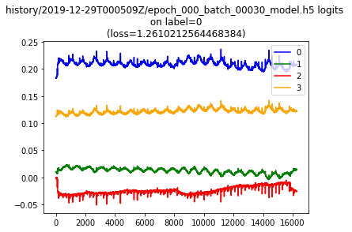
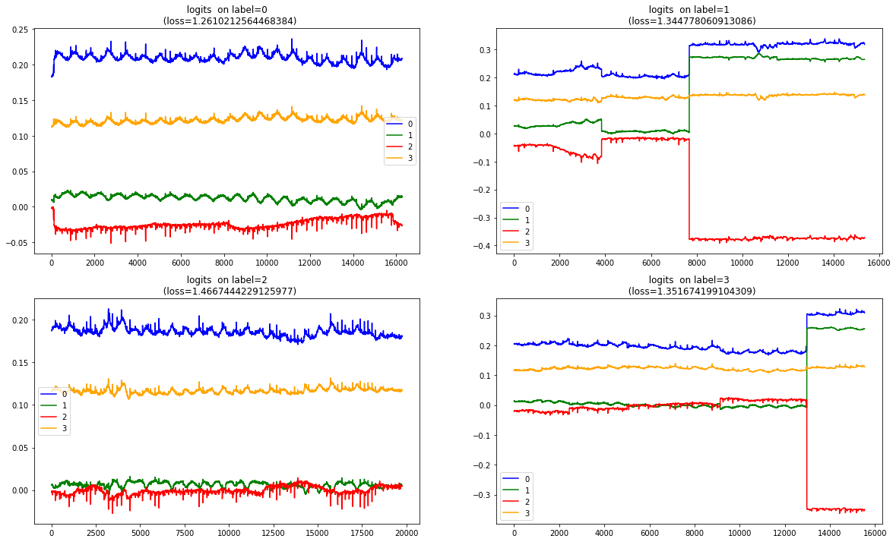

#### Summary
* Here, just took an immature model from earlier sessions and my balanced test data sets, and plotted all the logits as I had started doing [here earlier](https://github.com/namoopsoo/aviation-pilot-physiology-hmm/blob/master/notes/2019-12-01-loglossbook--update.md)
* This feels like another way, other than logloss, for measuring model learning progress. It is way more expressive than logloss.
* I have a feeling my logloss calculation is not properly helping to steer the back prop properly. Not sure yet. 
* Maybe if the logloss calculation is better than this raw logit plotting will no longer be necessary
* [final plot](#final-plot)


#### Blah

```python

from importlib import reload
import os
import pandas as pd
from io import StringIO
import itertools
import ipdb
import datetime
from collections import Counter

import h5py
import json
import tensorflow as tf
from tensorflow import keras

# Helper libraries
import numpy as np
import matplotlib.pyplot as plt
from tqdm import tqdm
import joblib
print(tf.__version__)

from keras.preprocessing import sequence
from keras.models import Sequential
from keras.layers import Dense, Embedding
from keras.layers import LSTM

from keras.callbacks import EarlyStopping

from sklearn.preprocessing import StandardScaler
from sklearn.preprocessing import MinMaxScaler
import mytf.s3utils as msu
import mytf.utils as mu
import mytf.validation as mv
import mytf.plot as mp
```

    1.14.0


```python
tf.enable_eager_execution()

```


```python
# So for a model thats roughly just starting out... what do its logits look like...
detail = {
 'model_loc': 'history/2019-12-29T000509Z/epoch_000_batch_00030_model.h5', 
    'test_loc': 'history/2019-12-22T174803Z/test_balanced.h5', 
 'batch_size': '32', 
 #'work_dir': 'history/2020-01-04T1945Z'
}

```


```python
# Borrowing from earlier notebook...
# https://github.com/namoopsoo/aviation-pilot-physiology-hmm/blob/master/notes/2019-12-01-loglossbook--update.md

def get_raw_preds(model, dataloc, dataset_names):
    # dataloc contains the test data..
    lossvec = []
    predsvec = []
    for Xdataset, Ydataset in tqdm(dataset_names):

        X, Ylabels = mu.read_h5_two(dataloc, Xdataset, Ydataset) 
        parts = mu.get_partitions(range(X.shape[0]), 100)
        batchlosses = []
        for part in parts:
            preds = model(X[part].astype('float32'))
            loss = tf.losses.sparse_softmax_cross_entropy(
                        labels=Ylabels[part].astype('int64'),
                        logits=preds.numpy()).numpy()
            batchlosses.append(loss)
            predsvec.extend(preds)

        lossvec.append(np.mean(batchlosses))
    return lossvec, predsvec

def plot_logits(vec, title=''):
    plt.plot([x[0] for x in vec], color='blue', label='0')
    plt.plot([x[1] for x in vec], color='green', label='1')
    plt.plot([x[2] for x in vec], color='red', label='2')
    plt.plot([x[3] for x in vec], color='orange', label='3')
    plt.title(title)
    plt.legend()
    
# modelloc = f'history/2019-12-08T220612Z/{modeln}'
model = mu.load_model(detail['model_loc'])

lossvec, predsvec = get_raw_preds(
                    model=model,
                    dataloc=detail['test_loc'],
                    dataset_names=[['X_0', 'Ylabels_0'],
                                  ])
predarr = np.vstack([x.numpy() for x in predsvec])
```


```python
plot_logits(predarr, f'{detail["model_loc"]} logits \n on label=0 \n (loss={lossvec[0]}) ')
```





```python
%%time
label_logits_vec = {}

for label in tqdm(range(4)):
    print(f'label {label}')
    lossvec, predsvec = get_raw_preds(
                        model=model,
                        dataloc=detail['test_loc'],
                        dataset_names=[[f'X_{label}', f'Ylabels_{label}'],
                                      ])
    predarr = np.vstack([x.numpy() for x in predsvec])
    label_logits_vec[label] = [lossvec, predarr]
```

      0%|          | 0/4 [00:00<?, ?it/s]
      0%|          | 0/1 [00:00<?, ?it/s]

    label 0


    
    100%|██████████| 1/1 [00:29<00:00, 29.78s/it]
     25%|██▌       | 1/4 [00:29<01:29, 29.93s/it]
      0%|          | 0/1 [00:00<?, ?it/s]

    label 1


    
    100%|██████████| 1/1 [00:27<00:00, 27.99s/it]
     50%|█████     | 2/4 [00:58<00:58, 29.40s/it]
      0%|          | 0/1 [00:00<?, ?it/s]

    label 2


    
    100%|██████████| 1/1 [00:36<00:00, 36.43s/it]
     75%|███████▌  | 3/4 [01:34<00:31, 31.57s/it]
      0%|          | 0/1 [00:00<?, ?it/s]

    label 3


    
    100%|██████████| 1/1 [00:29<00:00, 29.69s/it]
    100%|██████████| 4/4 [02:04<00:00, 31.18s/it]

    CPU times: user 2min 3s, sys: 389 ms, total: 2min 4s
    Wall time: 2min 4s


    


```python

def plot_logits_ax(vec, ax, title=''):
    ax.plot([x[0] for x in vec], color='blue', label='0')
    ax.plot([x[1] for x in vec], color='green', label='1')
    ax.plot([x[2] for x in vec], color='red', label='2')
    ax.plot([x[3] for x in vec], color='orange', label='3')
    ax.set(title=title)
    #ylabel=col,
    #xlabel='time')

    ax.legend()

fig = plt.figure(figsize=(20,12))


for i in range(4):
    ax = fig.add_subplot(int('22' + str(i+1)))
    plot_logits_ax(vec=label_logits_vec[i][1], 
                   ax=ax, 
                   title=(f'  logits '
                          f' on label={i}  \n '
                          f' (loss={label_logits_vec[i][0][0]})'))

                   

print(f'using detail["model_loc"]')

```

    using detail["model_loc"]

#### Final plot




```python

```
