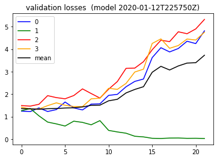

#### Summary
- Tried a different initializer today . Hmm Not super help ful though.
- Looks like the default initializer, ( which is aka Xavier Uniform), among what is there ,  https://www.tensorflow.org/api_docs/python/tf/keras/initializers  , per what I am seeing below, is indeed still ranom. 
- But here, I tried the Xavier Normal instead for fun..

- So for sure it seems its worth considering this as another hyper parameter
, https://adventuresinmachinelearning.com/weight-initialization-tutorial-tensorflow/


```python

from importlib import reload
import os
import pandas as pd
from io import StringIO
import itertools
import ipdb
import datetime
from collections import Counter

import h5py
import json
import tensorflow as tf
from tensorflow import keras

# Helper libraries
import numpy as np
import matplotlib.pyplot as plt
from tqdm import tqdm
import joblib
print(tf.__version__)

from keras.preprocessing import sequence
from keras.models import Sequential
from keras.layers import Dense, Embedding
from keras.layers import LSTM

from keras.callbacks import EarlyStopping

from sklearn.preprocessing import StandardScaler
from sklearn.preprocessing import MinMaxScaler
import mytf.s3utils as msu
import mytf.utils as mu
import mytf.validation as mv
import mytf.plot as mp
```

    1.14.0


    Using TensorFlow backend.


```python
tf.enable_eager_execution()

```


```python
def bake_model():
    lstm_params = [{
        'units': 64,
        'dropout': 0.6,
        'recurrent_dropout': 0.6,
        'batch_input_shape': (None, 64, 8),
        },

    ]

    optimizer_params = {
        'learning_rate': 0.001,  
        'beta1': 0.9, 
        'beta2': 0.999, 
        'epsilon': 1e-08
    }

    model = tf.keras.Sequential([
        tf.keras.layers.LSTM(**lstm_params[0]),
        # 4 because 'A', 'B', 'C', 'D'.
        tf.keras.layers.Dense(4)])
    return model
```


```python
def weights(obj, ):
    return [x for x in vars(obj).keys() if   'weight' in x]
# LSTM weights...
# ['_trainable_weights', '_non_trainable_weights', '_initial_weights']

#print(model._layers[1]._initial_weights) # <- None
# print([weights(x) for x in
#    model._layers[1]._layers])
# [['_trainable_weights', '_non_trainable_weights', '_initial_weights'], [], []]

#[x.shape for x in model._layers[1]._layers[0]._trainable_weights]
# [TensorShape([Dimension(8), Dimension(256)]),
# TensorShape([Dimension(64), Dimension(256)]),
# TensorShape([Dimension(256)])]

# model._layers[1]._layers[0]._initial_weights  # <--None, hmm..

for i in range(3):
    model = bake_model()
    print([x[0, :5]  for x in model._layers[1]._layers[0]._trainable_weights[:2]])
    print(model._layers[1]._layers[0]._trainable_weights[2])
```

    [<tf.Tensor: id=1324, shape=(5,), dtype=float32, numpy=
    array([-0.03004508,  0.14491767,  0.04427765,  0.08059219,  0.03595215],
          dtype=float32)>, <tf.Tensor: id=1329, shape=(5,), dtype=float32, numpy=
    array([ 0.11298072,  0.0676304 ,  0.02081808,  0.02089654, -0.01962803],
          dtype=float32)>]
    <tf.Variable 'lstm_1/bias:0' shape=(256,) dtype=float32, numpy=
    array([0., 0., 0., 0., 0., 0., 0., 0., 0., 0., 0., 0., 0., 0., 0., 0., 0.,
           0., 0., 0., 0., 0., 0., 0., 0., 0., 0., 0., 0., 0., 0., 0., 0., 0.,
           0., 0., 0., 0., 0., 0., 0., 0., 0., 0., 0., 0., 0., 0., 0., 0., 0.,
           0., 0., 0., 0., 0., 0., 0., 0., 0., 0., 0., 0., 0., 1., 1., 1., 1.,
           1., 1., 1., 1., 1., 1., 1., 1., 1., 1., 1., 1., 1., 1., 1., 1., 1.,
           1., 1., 1., 1., 1., 1., 1., 1., 1., 1., 1., 1., 1., 1., 1., 1., 1.,
           1., 1., 1., 1., 1., 1., 1., 1., 1., 1., 1., 1., 1., 1., 1., 1., 1.,
           1., 1., 1., 1., 1., 1., 1., 1., 1., 0., 0., 0., 0., 0., 0., 0., 0.,
           0., 0., 0., 0., 0., 0., 0., 0., 0., 0., 0., 0., 0., 0., 0., 0., 0.,
           0., 0., 0., 0., 0., 0., 0., 0., 0., 0., 0., 0., 0., 0., 0., 0., 0.,
           0., 0., 0., 0., 0., 0., 0., 0., 0., 0., 0., 0., 0., 0., 0., 0., 0.,
           0., 0., 0., 0., 0., 0., 0., 0., 0., 0., 0., 0., 0., 0., 0., 0., 0.,
           0., 0., 0., 0., 0., 0., 0., 0., 0., 0., 0., 0., 0., 0., 0., 0., 0.,
           0., 0., 0., 0., 0., 0., 0., 0., 0., 0., 0., 0., 0., 0., 0., 0., 0.,
           0., 0., 0., 0., 0., 0., 0., 0., 0., 0., 0., 0., 0., 0., 0., 0., 0.,
           0.], dtype=float32)>
    [<tf.Tensor: id=1964, shape=(5,), dtype=float32, numpy=
    array([0.11387375, 0.01473439, 0.06241684, 0.02221012, 0.04531623],
          dtype=float32)>, <tf.Tensor: id=1969, shape=(5,), dtype=float32, numpy=
    array([-0.04654741, -0.03044676, -0.00881757,  0.05438439,  0.01528069],
          dtype=float32)>]
    <tf.Variable 'lstm_2/bias:0' shape=(256,) dtype=float32, numpy=
    array([0., 0., 0., 0., 0., 0., 0., 0., 0., 0., 0., 0., 0., 0., 0., 0., 0.,
           0., 0., 0., 0., 0., 0., 0., 0., 0., 0., 0., 0., 0., 0., 0., 0., 0.,
           0., 0., 0., 0., 0., 0., 0., 0., 0., 0., 0., 0., 0., 0., 0., 0., 0.,
           0., 0., 0., 0., 0., 0., 0., 0., 0., 0., 0., 0., 0., 1., 1., 1., 1.,
           1., 1., 1., 1., 1., 1., 1., 1., 1., 1., 1., 1., 1., 1., 1., 1., 1.,
           1., 1., 1., 1., 1., 1., 1., 1., 1., 1., 1., 1., 1., 1., 1., 1., 1.,
           1., 1., 1., 1., 1., 1., 1., 1., 1., 1., 1., 1., 1., 1., 1., 1., 1.,
           1., 1., 1., 1., 1., 1., 1., 1., 1., 0., 0., 0., 0., 0., 0., 0., 0.,
           0., 0., 0., 0., 0., 0., 0., 0., 0., 0., 0., 0., 0., 0., 0., 0., 0.,
           0., 0., 0., 0., 0., 0., 0., 0., 0., 0., 0., 0., 0., 0., 0., 0., 0.,
           0., 0., 0., 0., 0., 0., 0., 0., 0., 0., 0., 0., 0., 0., 0., 0., 0.,
           0., 0., 0., 0., 0., 0., 0., 0., 0., 0., 0., 0., 0., 0., 0., 0., 0.,
           0., 0., 0., 0., 0., 0., 0., 0., 0., 0., 0., 0., 0., 0., 0., 0., 0.,
           0., 0., 0., 0., 0., 0., 0., 0., 0., 0., 0., 0., 0., 0., 0., 0., 0.,
           0., 0., 0., 0., 0., 0., 0., 0., 0., 0., 0., 0., 0., 0., 0., 0., 0.,
           0.], dtype=float32)>
    [<tf.Tensor: id=2604, shape=(5,), dtype=float32, numpy=
    array([ 0.11252353, -0.07627354,  0.12438098, -0.09523362,  0.14129129],
          dtype=float32)>, <tf.Tensor: id=2609, shape=(5,), dtype=float32, numpy=
    array([ 0.00222719,  0.06134533, -0.0226919 , -0.0752966 ,  0.11333336],
          dtype=float32)>]
    <tf.Variable 'lstm_3/bias:0' shape=(256,) dtype=float32, numpy=
    array([0., 0., 0., 0., 0., 0., 0., 0., 0., 0., 0., 0., 0., 0., 0., 0., 0.,
           0., 0., 0., 0., 0., 0., 0., 0., 0., 0., 0., 0., 0., 0., 0., 0., 0.,
           0., 0., 0., 0., 0., 0., 0., 0., 0., 0., 0., 0., 0., 0., 0., 0., 0.,
           0., 0., 0., 0., 0., 0., 0., 0., 0., 0., 0., 0., 0., 1., 1., 1., 1.,
           1., 1., 1., 1., 1., 1., 1., 1., 1., 1., 1., 1., 1., 1., 1., 1., 1.,
           1., 1., 1., 1., 1., 1., 1., 1., 1., 1., 1., 1., 1., 1., 1., 1., 1.,
           1., 1., 1., 1., 1., 1., 1., 1., 1., 1., 1., 1., 1., 1., 1., 1., 1.,
           1., 1., 1., 1., 1., 1., 1., 1., 1., 0., 0., 0., 0., 0., 0., 0., 0.,
           0., 0., 0., 0., 0., 0., 0., 0., 0., 0., 0., 0., 0., 0., 0., 0., 0.,
           0., 0., 0., 0., 0., 0., 0., 0., 0., 0., 0., 0., 0., 0., 0., 0., 0.,
           0., 0., 0., 0., 0., 0., 0., 0., 0., 0., 0., 0., 0., 0., 0., 0., 0.,
           0., 0., 0., 0., 0., 0., 0., 0., 0., 0., 0., 0., 0., 0., 0., 0., 0.,
           0., 0., 0., 0., 0., 0., 0., 0., 0., 0., 0., 0., 0., 0., 0., 0., 0.,
           0., 0., 0., 0., 0., 0., 0., 0., 0., 0., 0., 0., 0., 0., 0., 0., 0.,
           0., 0., 0., 0., 0., 0., 0., 0., 0., 0., 0., 0., 0., 0., 0., 0., 0.,
           0.], dtype=float32)>


```python
# Hmm so part of that looks random each time ^^ 
# but that third element doesnt look random.
```


```python
vars(model._layers[1]._layers[2])
```


    {'_non_append_mutation': False,
     '_external_modification': False,
     '_self_trainable': True,
     '_self_extra_variables': [],
     '_storage': [InputSpec(shape=[None, 64], ndim=2),
      InputSpec(shape=[None, 64], ndim=2)],
     '_last_wrapped_list_snapshot': [InputSpec(shape=[None, 64], ndim=2),
      InputSpec(shape=[None, 64], ndim=2)],
     '_self_setattr_tracking': True,
     '_self_unconditional_checkpoint_dependencies': [],
     '_self_unconditional_dependency_names': {},
     '_self_unconditional_deferred_dependencies': {},
     '_self_update_uid': -1,
     '_self_name_based_restores': set()}


```python
model._layers[1].kernel_initializer
```


    <tensorflow.python.ops.init_ops.GlorotUniform at 0x7f75a09b73c8>


```python
# Ok. so I see this ^ GlorotUniform at 
# https://www.tensorflow.org/api_docs/python/tf/keras/initializers
#  ( which is aka Xavier Uniform)
# So for sure it seems its worth considering this as another hyper parameter
# So since I've been using this default ^, I want to try the 
# Xavier Normal option noted here, https://adventuresinmachinelearning.com/weight-initialization-tutorial-tensorflow/
# 

```


```python


```


```python
# Working dir... for new model
save_dir = 'history'
ts = mu.quickts(); print('starting,', ts)

workdir = f'{save_dir}/{ts}'
os.mkdir(workdir)
print(f'Made new workdir, {workdir}')
```

    starting, 2020-01-12T225750Z
    Made new workdir, history/2020-01-12T225750Z


```python
def bake_model():
    lstm_params = [{
        'units': 64,
        'dropout': 0.6,
        'recurrent_dropout': 0.6,
        'batch_input_shape': (None, 64, 8),
        'kernel_initializer': tf.initializers.glorot_normal() # GlorotNormal()
                               #tf.initializers.he_normal()
        },

    ]

    optimizer_params = {
        'learning_rate': 0.001,  
        'beta1': 0.9, 
        'beta2': 0.999, 
        'epsilon': 1e-08
    }

    model = tf.keras.Sequential([
        tf.keras.layers.LSTM(**lstm_params[0]),
        # 4 because 'A', 'B', 'C', 'D'.
        tf.keras.layers.Dense(4)])
    return model
```


```python
model = bake_model()
```


```python
BATCH_SIZE = 32
EPOCHS = 1
# Use datasets from 
# 2019-12-25.ipynb
# 
# train ... new datasets, ...
datadir = 'history/2019-12-22T174803Z'
# train_loc = f'{datadir}/train_balanced.h5'
test_loc = f'{datadir}/test_balanced.h5'
train_shuff_loc = f'{datadir}/train_scaled_balanced_shuffled.h5'
print(mu.h5_keys(train_shuff_loc))
print(mu.h5_keys(test_loc))

X, Ylabels = mu.read_h5_two(
                source_location=train_shuff_loc, 
                Xdataset=f'X',
                Ydataset=f'Ylabels')
size = X.shape[0]

# save base unfitted model.
mu.save_model(model=model, 
              loc=f'{workdir}/00000__unfitted_model.h5')

```

    ['X', 'Ylabels']
    ['X_0', 'X_1', 'X_2', 'X_3', 'Ylabels_0', 'Ylabels_1', 'Ylabels_2', 'Ylabels_3']


```python
%%time

model = mu.load_model(f'{workdir}/00000__unfitted_model.h5')

class_weights = {0: 1., 1: 1., 2: 1., 3: 1.}
dataset_batches = mu.build_dataset_weighty_v3(
        {'x_train': X,
         'ylabels_train': Ylabels.astype('int64')},
        list(range(size)), 
        class_weights,
        batch_size=BATCH_SIZE)
    
#with ipdb.launch_ipdb_on_exception():
mu.do_train( 
        model,
        dataset_batches,
        k=size,
        epochs=EPOCHS,
        optimizer_params=optimizer_params,
        saveloc=workdir)
```

    WARNING:tensorflow:No training configuration found in save file: the model was *not* compiled. Compile it manually.


    
    0it [00:00, ?it/s]
    1it [00:00,  2.00it/s]
    2it [00:00,  2.18it/s]
    3it [00:01,  2.32it/s]
    4it [00:01,  2.44it/s]
    5it [00:01,  2.56it/s]
    6it [00:02,  2.64it/s]
    7it [00:02,  2.71it/s]
    8it [00:02,  2.74it/s]
    9it [00:03,  2.47it/s]
    10it [00:03,  2.59it/s]
    11it [00:04,  2.67it/s]
    12it [00:04,  2.74it/s]
    13it [00:04,  2.76it/s]
    14it [00:05,  2.78it/s]
    15it [00:05,  2.80it/s]
    16it [00:05,  2.83it/s]
    17it [00:06,  2.83it/s]
    18it [00:06,  2.54it/s]
    19it [00:07,  2.63it/s]
    20it [00:07,  2.71it/s]
    21it [00:07,  2.75it/s]
    22it [00:08,  2.77it/s]
    23it [00:08,  2.78it/s]
    24it [00:08,  2.80it/s]
    25it [00:09,  2.80it/s]
    26it [00:09,  2.80it/s]
    27it [00:10,  2.52it/s]
    28it [00:10,  2.61it/s]
    29it [00:10,  2.68it/s]
    30it [00:11,  2.72it/s]
    31it [00:11,  2.72it/s]
    32it [00:11,  2.78it/s]
    33it [00:12,  2.80it/s]
    34it [00:12,  2.80it/s]
    35it [00:13,  2.51it/s]
    36it [00:13,  2.59it/s]
    37it [00:13,  2.65it/s]
    38it [00:14,  2.69it/s]
    39it [00:14,  2.73it/s]
    40it [00:14,  2.75it/s]
    41it [00:15,  2.76it/s]
    42it [00:15,  2.77it/s]
    43it [00:15,  2.77it/s]
    44it [00:16,  2.51it/s]
    45it [00:16,  2.59it/s]
    46it [00:17,  2.66it/s]
    47it [00:17,  2.72it/s]
    48it [00:17,  2.77it/s]
    49it [00:18,  2.80it/s]
    50it [00:18,  2.83it/s]
    51it [00:18,  2.83it/s]
    52it [00:19,  2.51it/s]
    53it [00:19,  2.59it/s]
    54it [00:20,  2.66it/s]
    55it [00:20,  2.71it/s]
    56it [00:20,  2.72it/s]
    57it [00:21,  2.66it/s]
    58it [00:21,  2.60it/s]
    59it [00:21,  2.56it/s]
    60it [00:22,  2.20it/s]
    61it [00:23,  1.90it/s]
    62it [00:23,  2.11it/s]
    63it [00:23,  2.26it/s]
    64it [00:24,  2.37it/s]
    65it [00:24,  2.49it/s]
    66it [00:25,  2.58it/s]
    67it [00:25,  2.62it/s]
    68it [00:25,  2.67it/s]
    69it [00:26,  2.69it/s]
    70it [00:26,  2.44it/s]
    71it [00:27,  2.50it/s]
    72it [00:27,  2.54it/s]
    73it [00:27,  2.59it/s]
    74it [00:28,  2.60it/s]
    75it [00:28,  2.62it/s]
    76it [00:28,  2.64it/s]
    77it [00:29,  2.66it/s]
    78it [00:29,  2.43it/s]
    79it [00:30,  2.51it/s]
    80it [00:30,  2.57it/s]
    81it [00:30,  2.61it/s]
    82it [00:31,  2.65it/s]
    83it [00:31,  2.72it/s]
    84it [00:31,  2.74it/s]
    85it [00:32,  2.76it/s]
    86it [00:32,  2.49it/s]
    87it [00:33,  2.57it/s]
    88it [00:33,  2.62it/s]
    89it [00:33,  2.69it/s]
    90it [00:34,  2.74it/s]
    91it [00:34,  2.75it/s]
    92it [00:34,  2.76it/s]
    93it [00:35,  2.77it/s]
    94it [00:35,  2.80it/s]
    95it [00:36,  2.51it/s]
    96it [00:36,  2.59it/s]
    97it [00:36,  2.64it/s]
    98it [00:37,  2.67it/s]
    99it [00:37,  2.72it/s]
    100it [00:37,  2.76it/s]
    101it [00:38,  2.77it/s]
    102it [00:38,  2.80it/s]
    103it [00:39,  2.50it/s]
    104it [00:39,  2.57it/s]
    105it [00:39,  2.62it/s]
    106it [00:40,  2.67it/s]
    107it [00:40,  2.74it/s]
    108it [00:40,  2.77it/s]
    109it [00:41,  2.75it/s]
    110it [00:41,  2.78it/s]
    111it [00:41,  2.79it/s]
    112it [00:42,  2.50it/s]
    113it [00:42,  2.59it/s]
    114it [00:43,  2.63it/s]
    115it [00:43,  2.67it/s]
    116it [00:43,  2.71it/s]
    117it [00:44,  2.75it/s]
    118it [00:44,  2.79it/s]
    119it [00:44,  2.83it/s]
    120it [00:45,  2.52it/s]
    121it [00:45,  2.60it/s]
    122it [00:46,  2.64it/s]
    123it [00:46,  2.69it/s]
    124it [00:46,  2.73it/s]
    125it [00:47,  2.74it/s]
    126it [00:47,  2.75it/s]
    127it [00:47,  2.79it/s]
    128it [00:48,  2.81it/s]
    129it [00:48,  2.53it/s]
    130it [00:49,  2.62it/s]
    131it [00:49,  2.66it/s]
    132it [00:49,  2.69it/s]
    133it [00:50,  2.74it/s]
    134it [00:50,  2.77it/s]
    135it [00:50,  2.78it/s]
    136it [00:51,  2.76it/s]
    137it [00:51,  2.47it/s]
    138it [00:52,  2.56it/s]
    139it [00:52,  2.65it/s]
    140it [00:52,  2.70it/s]
    141it [00:53,  2.71it/s]
    142it [00:53,  2.74it/s]
    143it [00:53,  2.78it/s]
    144it [00:54,  2.78it/s]
    145it [00:54,  2.78it/s]
    146it [00:55,  2.48it/s]
    147it [00:55,  2.57it/s]
    148it [00:55,  2.63it/s]
    149it [00:56,  2.66it/s]
    150it [00:56,  2.70it/s]
    151it [00:56,  2.72it/s]
    152it [00:57,  2.76it/s]
    153it [00:57,  2.79it/s]
    154it [00:57,  2.81it/s]
    155it [00:58,  2.54it/s]
    156it [00:58,  2.65it/s]
    157it [00:59,  2.71it/s]
    158it [00:59,  2.75it/s]
    159it [00:59,  2.79it/s]
    160it [01:00,  2.83it/s]
    161it [01:00,  2.86it/s]
    162it [01:00,  2.89it/s]
    163it [01:01,  2.57it/s]
    164it [01:01,  2.65it/s]
    165it [01:02,  2.72it/s]
    166it [01:02,  2.76it/s]
    167it [01:02,  2.79it/s]
    168it [01:03,  2.80it/s]
    169it [01:03,  2.82it/s]
    170it [01:03,  2.78it/s]
    171it [01:04,  2.78it/s]
    172it [01:04,  2.55it/s]
    173it [01:05,  2.65it/s]
    174it [01:05,  2.71it/s]
    175it [01:05,  2.76it/s]
    176it [01:06,  2.80it/s]
    177it [01:06,  2.80it/s]
    178it [01:06,  2.80it/s]
    179it [01:07,  2.80it/s]
    180it [01:07,  2.53it/s]
    181it [01:07,  2.59it/s]
    182it [01:08,  2.64it/s]
    183it [01:08,  2.68it/s]
    184it [01:09,  2.71it/s]
    185it [01:09,  2.71it/s]
    186it [01:09,  2.75it/s]
    187it [01:10,  2.76it/s]
    188it [01:10,  2.49it/s]
    189it [01:10,  2.57it/s]
    190it [01:11,  2.65it/s]
    191it [01:11,  2.71it/s]
    192it [01:12,  2.76it/s]
    193it [01:12,  2.79it/s]
    194it [01:12,  2.83it/s]
    195it [01:13,  2.83it/s]
    196it [01:13,  2.84it/s]
    197it [01:13,  2.56it/s]
    198it [01:14,  2.65it/s]
    199it [01:14,  2.73it/s]
    200it [01:14,  2.77it/s]
    201it [01:15,  2.76it/s]
    202it [01:15,  2.78it/s]
    203it [01:16,  2.79it/s]
    204it [01:16,  2.81it/s]
    205it [01:16,  2.84it/s]
    206it [01:17,  2.55it/s]
    207it [01:17,  2.63it/s]
    208it [01:17,  2.70it/s]
    209it [01:18,  2.73it/s]
    210it [01:18,  2.75it/s]
    211it [01:18,  2.75it/s]
    212it [01:19,  2.75it/s]
    213it [01:19,  2.74it/s]
    214it [01:20,  2.44it/s]
    215it [01:20,  2.53it/s]
    216it [01:20,  2.58it/s]
    217it [01:21,  2.53it/s]
    218it [01:21,  2.52it/s]
    219it [01:22,  2.42it/s]
    220it [01:22,  2.30it/s]
    221it [01:23,  2.38it/s]
    222it [01:23,  2.50it/s]
    223it [01:23,  2.36it/s]
    224it [01:24,  2.47it/s]
    225it [01:24,  2.56it/s]
    226it [01:25,  2.62it/s]
    227it [01:25,  2.64it/s]
    228it [01:25,  2.69it/s]
    229it [01:26,  2.72it/s]
    230it [01:26,  2.74it/s]
    231it [01:26,  2.46it/s]
    232it [01:27,  2.52it/s]
    233it [01:27,  2.57it/s]
    234it [01:28,  2.59it/s]
    235it [01:28,  2.62it/s]
    236it [01:28,  2.67it/s]
    237it [01:29,  2.70it/s]
    238it [01:29,  2.71it/s]
    239it [01:29,  2.72it/s]
    240it [01:30,  2.46it/s]
    241it [01:30,  2.54it/s]
    242it [01:31,  2.59it/s]
    243it [01:31,  2.62it/s]
    244it [01:31,  2.65it/s]
    245it [01:32,  2.68it/s]
    246it [01:32,  2.70it/s]
    247it [01:32,  2.72it/s]
    248it [01:33,  2.44it/s]
    249it [01:33,  2.52it/s]
    250it [01:34,  2.57it/s]
    251it [01:34,  2.59it/s]
    252it [01:34,  2.62it/s]
    253it [01:35,  2.63it/s]
    254it [01:35,  2.64it/s]
    255it [01:36,  2.66it/s]
    256it [01:36,  2.66it/s]
    257it [01:36,  2.38it/s]
    258it [01:37,  2.49it/s]
    259it [01:37,  2.58it/s]
    260it [01:38,  2.66it/s]
    261it [01:38,  2.68it/s]
    262it [01:38,  2.72it/s]
    263it [01:39,  2.75it/s]
    264it [01:39,  2.72it/s]
    265it [01:39,  2.73it/s]
    266it [01:40,  2.45it/s]
    267it [01:40,  2.53it/s]
    268it [01:41,  2.59it/s]
    269it [01:41,  2.63it/s]
    270it [01:41,  2.64it/s]
    271it [01:42,  2.68it/s]
    272it [01:42,  2.72it/s]
    273it [01:42,  2.73it/s]
    274it [01:43,  2.75it/s]
    275it [01:43,  2.46it/s]
    276it [01:44,  2.53it/s]
    277it [01:44,  2.60it/s]
    278it [01:44,  2.66it/s]
    279it [01:45,  2.71it/s]
    280it [01:45,  2.75it/s]
    281it [01:45,  2.74it/s]
    282it [01:46,  2.76it/s]
    283it [01:46,  2.48it/s]
    284it [01:47,  2.57it/s]
    285it [01:47,  2.64it/s]
    286it [01:47,  2.69it/s]
    287it [01:48,  2.72it/s]
    288it [01:48,  2.73it/s]
    289it [01:48,  2.75it/s]
    290it [01:49,  2.77it/s]
    291it [01:49,  2.75it/s]
    292it [01:50,  2.49it/s]
    293it [01:50,  2.48it/s]
    294it [01:51,  2.16it/s]
    295it [01:51,  1.99it/s]
    296it [01:52,  1.90it/s]
    297it [01:52,  1.84it/s]
    298it [01:53,  1.83it/s]
    299it [01:54,  1.80it/s]
    300it [01:54,  1.80it/s]
    301it [01:54,  2.01it/s]
    302it [01:55,  2.19it/s]
    303it [01:55,  2.34it/s]
    304it [01:56,  2.47it/s]
    305it [01:56,  2.57it/s]
    306it [01:56,  2.63it/s]
    307it [01:57,  2.67it/s]
    308it [01:57,  2.71it/s]
    309it [01:57,  2.46it/s]
    310it [01:58,  2.56it/s]
    311it [01:58,  2.64it/s]
    312it [01:59,  2.70it/s]
    313it [01:59,  2.74it/s]
    314it [01:59,  2.76it/s]
    315it [02:00,  2.78it/s]
    316it [02:00,  2.81it/s]
    317it [02:00,  2.52it/s]
    318it [02:01,  2.59it/s]
    319it [02:01,  2.66it/s]
    320it [02:01,  2.71it/s]
    321it [02:02,  2.74it/s]
    322it [02:02,  2.77it/s]
    323it [02:03,  2.77it/s]
    324it [02:03,  2.76it/s]
    325it [02:03,  2.48it/s]
    326it [02:04,  2.55it/s]
    327it [02:04,  2.61it/s]
    328it [02:04,  2.68it/s]
    329it [02:05,  2.72it/s]
    330it [02:05,  2.73it/s]
    331it [02:06,  2.73it/s]
    332it [02:06,  2.73it/s]
    333it [02:06,  2.75it/s]
    334it [02:07,  2.48it/s]
    335it [02:07,  2.57it/s]
    336it [02:07,  2.66it/s]
    337it [02:08,  2.72it/s]
    338it [02:08,  2.77it/s]
    339it [02:09,  2.82it/s]
    340it [02:09,  2.80it/s]
    341it [02:09,  2.79it/s]
    342it [02:10,  2.50it/s]
    343it [02:10,  2.58it/s]
    344it [02:10,  2.64it/s]
    345it [02:11,  2.68it/s]
    346it [02:11,  2.72it/s]
    347it [02:12,  2.75it/s]
    348it [02:12,  2.76it/s]
    349it [02:12,  2.82it/s]
    350it [02:13,  2.53it/s]
    351it [02:13,  2.60it/s]
    352it [02:13,  2.69it/s]
    353it [02:14,  2.74it/s]
    354it [02:14,  2.76it/s]
    355it [02:14,  2.80it/s]
    356it [02:15,  2.81it/s]
    357it [02:15,  2.82it/s]
    358it [02:16,  2.82it/s]
    359it [02:16,  2.52it/s]
    360it [02:16,  2.58it/s]
    361it [02:17,  2.62it/s]
    362it [02:17,  2.67it/s]
    363it [02:17,  2.72it/s]
    364it [02:18,  2.76it/s]
    365it [02:18,  2.78it/s]
    366it [02:19,  2.80it/s]
    367it [02:19,  2.81it/s]
    368it [02:19,  2.53it/s]
    369it [02:20,  2.62it/s]
    370it [02:20,  2.67it/s]
    371it [02:20,  2.69it/s]
    372it [02:21,  2.61it/s]
    373it [02:21,  2.61it/s]
    374it [02:22,  2.57it/s]
    375it [02:22,  2.58it/s]
    376it [02:22,  2.59it/s]
    377it [02:23,  2.37it/s]
    378it [02:23,  2.49it/s]
    379it [02:24,  2.58it/s]
    380it [02:24,  2.63it/s]
    381it [02:24,  2.66it/s]
    382it [02:25,  2.69it/s]
    383it [02:25,  2.69it/s]
    384it [02:25,  2.71it/s]
    385it [02:26,  2.73it/s]
    386it [02:26,  2.45it/s]
    387it [02:27,  2.53it/s]
    388it [02:27,  2.59it/s]
    389it [02:27,  2.62it/s]
    390it [02:28,  2.63it/s]
    391it [02:28,  2.65it/s]
    392it [02:29,  2.67it/s]
    393it [02:29,  2.70it/s]
    394it [02:29,  2.45it/s]
    395it [02:30,  2.55it/s]
    396it [02:30,  2.61it/s]
    397it [02:30,  2.63it/s]
    398it [02:31,  2.66it/s]
    399it [02:31,  2.71it/s]
    400it [02:32,  2.74it/s]
    401it [02:32,  2.74it/s]
    402it [02:32,  2.75it/s]
    403it [02:33,  2.49it/s]
    404it [02:33,  2.57it/s]
    405it [02:33,  2.61it/s]
    406it [02:34,  2.65it/s]
    407it [02:34,  2.68it/s]
    408it [02:35,  2.70it/s]
    409it [02:35,  2.71it/s]
    410it [02:35,  2.71it/s]
    411it [02:36,  2.43it/s]
    412it [02:36,  2.52it/s]
    413it [02:37,  2.58it/s]
    414it [02:37,  2.66it/s]
    415it [02:37,  2.72it/s]
    416it [02:38,  2.75it/s]
    417it [02:38,  2.77it/s]
    418it [02:38,  2.76it/s]
    419it [02:39,  2.76it/s]
    420it [02:39,  2.46it/s]
    421it [02:40,  2.53it/s]
    422it [02:40,  2.59it/s]
    423it [02:40,  2.63it/s]
    424it [02:41,  2.64it/s]
    425it [02:41,  2.69it/s]
    426it [02:41,  2.75it/s]
    427it [02:42,  2.79it/s]
    428it [02:42,  2.55it/s]
    429it [02:43,  2.64it/s]
    430it [02:43,  2.69it/s]
    431it [02:43,  2.72it/s]
    432it [02:44,  2.76it/s]
    433it [02:44,  2.77it/s]
    434it [02:44,  2.79it/s]
    435it [02:45,  2.81it/s]
    436it [02:45,  2.83it/s]
    437it [02:45,  2.54it/s]
    438it [02:46,  2.62it/s]
    439it [02:46,  2.68it/s]
    440it [02:47,  2.71it/s]
    441it [02:47,  2.73it/s]
    442it [02:47,  2.75it/s]
    443it [02:48,  2.77it/s]
    444it [02:48,  2.77it/s]
    445it [02:48,  2.80it/s]
    446it [02:49,  2.52it/s]
    447it [02:49,  2.60it/s]
    448it [02:50,  2.68it/s]
    449it [02:50,  2.70it/s]
    450it [02:50,  2.72it/s]
    451it [02:51,  2.69it/s]
    452it [02:51,  2.69it/s]
    453it [02:51,  2.72it/s]
    454it [02:52,  2.72it/s]
    455it [02:52,  2.48it/s]
    456it [02:53,  2.58it/s]
    457it [02:53,  2.64it/s]
    458it [02:53,  2.69it/s]
    459it [02:54,  2.72it/s]
    460it [02:54,  2.74it/s]
    461it [02:54,  2.75it/s]
    462it [02:55,  2.74it/s]
    463it [02:55,  2.45it/s]
    464it [02:56,  2.54it/s]
    465it [02:56,  2.63it/s]
    466it [02:56,  2.70it/s]
    467it [02:57,  2.75it/s]
    468it [02:57,  2.78it/s]
    469it [02:57,  2.80it/s]
    470it [02:58,  2.82it/s]
    471it [02:58,  2.80it/s]
    472it [02:59,  2.53it/s]
    473it [02:59,  2.62it/s]
    474it [02:59,  2.69it/s]
    475it [03:00,  2.74it/s]
    476it [03:00,  2.77it/s]
    477it [03:00,  2.80it/s]
    478it [03:01,  2.81it/s]
    479it [03:01,  2.81it/s]
    480it [03:01,  2.51it/s]
    481it [03:02,  2.59it/s]
    482it [03:02,  2.67it/s]
    483it [03:03,  2.73it/s]
    484it [03:03,  2.75it/s]
    485it [03:03,  2.73it/s]
    486it [03:04,  2.73it/s]
    487it [03:04,  2.73it/s]
    488it [03:04,  2.75it/s]
    489it [03:05,  2.48it/s]
    490it [03:05,  2.58it/s]
    491it [03:06,  2.63it/s]
    492it [03:06,  2.67it/s]
    493it [03:06,  2.70it/s]
    494it [03:07,  2.74it/s]
    495it [03:07,  2.76it/s]
    496it [03:07,  2.79it/s]
    497it [03:08,  2.52it/s]
    498it [03:08,  2.60it/s]
    499it [03:09,  2.67it/s]
    500it [03:09,  2.71it/s]
    501it [03:09,  2.71it/s]
    502it [03:10,  2.77it/s]
    503it [03:10,  2.80it/s]
    504it [03:10,  2.82it/s]
    505it [03:11,  2.51it/s]
    506it [03:11,  2.59it/s]
    507it [03:12,  2.65it/s]
    508it [03:12,  2.71it/s]
    509it [03:12,  2.76it/s]
    510it [03:13,  2.80it/s]
    511it [03:13,  2.80it/s]
    512it [03:13,  2.81it/s]
    513it [03:14,  2.84it/s]
    514it [03:14,  2.56it/s]
    515it [03:14,  2.65it/s]
    516it [03:15,  2.71it/s]
    517it [03:15,  2.76it/s]
    518it [03:15,  2.80it/s]
    519it [03:16,  2.83it/s]
    520it [03:16,  2.84it/s]
    521it [03:17,  2.80it/s]
    522it [03:17,  2.50it/s]
    523it [03:17,  2.55it/s]
    524it [03:18,  2.59it/s]
    525it [03:18,  2.63it/s]
    526it [03:19,  2.65it/s]
    527it [03:19,  2.67it/s]
    528it [03:19,  2.68it/s]
    529it [03:20,  2.69it/s]
    530it [03:20,  2.39it/s]
    531it [03:21,  2.45it/s]
    532it [03:21,  2.44it/s]
    533it [03:21,  2.44it/s]
    534it [03:22,  2.44it/s]
    535it [03:22,  2.48it/s]
    536it [03:23,  2.49it/s]
    537it [03:23,  2.56it/s]
    538it [03:23,  2.64it/s]
    539it [03:24,  2.40it/s]
    540it [03:24,  2.50it/s]
    541it [03:25,  2.55it/s]
    542it [03:25,  2.57it/s]
    543it [03:25,  2.62it/s]
    544it [03:26,  2.65it/s]
    545it [03:26,  2.69it/s]
    546it [03:26,  2.70it/s]
    547it [03:27,  2.41it/s]
    548it [03:27,  2.50it/s]
    549it [03:28,  2.54it/s]
    550it [03:28,  2.58it/s]
    551it [03:28,  2.61it/s]
    552it [03:29,  2.66it/s]
    553it [03:29,  2.70it/s]
    554it [03:29,  2.72it/s]
    555it [03:30,  2.71it/s]
    556it [03:30,  2.42it/s]
    557it [03:31,  2.48it/s]
    558it [03:31,  2.54it/s]
    559it [03:31,  2.56it/s]
    560it [03:32,  2.61it/s]
    561it [03:32,  2.63it/s]
    562it [03:33,  2.64it/s]
    563it [03:33,  2.64it/s]
    564it [03:33,  2.38it/s]
    565it [03:34,  2.48it/s]
    566it [03:34,  2.54it/s]
    567it [03:35,  2.57it/s]
    568it [03:35,  2.58it/s]
    569it [03:35,  2.61it/s]
    570it [03:36,  2.67it/s]
    571it [03:36,  2.70it/s]
    572it [03:37,  2.43it/s]
    573it [03:37,  2.51it/s]
    574it [03:37,  2.55it/s]
    575it [03:38,  2.59it/s]
    576it [03:38,  2.64it/s]
    577it [03:38,  2.70it/s]
    578it [03:39,  2.72it/s]
    579it [03:39,  2.74it/s]
    580it [03:39,  2.73it/s]
    581it [03:40,  2.42it/s]
    582it [03:40,  2.52it/s]
    583it [03:41,  2.59it/s]
    584it [03:41,  2.64it/s]
    585it [03:41,  2.66it/s]
    586it [03:42,  2.68it/s]
    587it [03:42,  2.70it/s]
    588it [03:43,  2.73it/s]
    589it [03:43,  2.75it/s]
    590it [03:43,  2.46it/s]
    591it [03:44,  2.53it/s]
    592it [03:44,  2.57it/s]
    593it [03:45,  2.61it/s]
    594it [03:45,  2.65it/s]
    595it [03:45,  2.70it/s]
    596it [03:46,  2.70it/s]
    597it [03:46,  2.73it/s]
    598it [03:46,  2.73it/s]
    599it [03:47,  2.48it/s]
    600it [03:47,  2.58it/s]
    601it [03:48,  2.62it/s]
    602it [03:48,  2.67it/s]
    603it [03:48,  2.69it/s]
    604it [03:49,  2.68it/s]
    605it [03:49,  2.70it/s]
    606it [03:49,  2.72it/s]
    607it [03:50,  2.46it/s]
    608it [03:50,  2.55it/s]
    609it [03:51,  2.57it/s]
    610it [03:51,  2.61it/s]
    611it [03:51,  2.64it/s]
    612it [03:52,  2.67it/s]
    613it [03:52,  2.70it/s]
    614it [03:52,  2.72it/s]
    615it [03:53,  2.46it/s]
    616it [03:53,  2.56it/s]
    617it [03:54,  2.60it/s]
    618it [03:54,  2.67it/s]
    619it [03:54,  2.72it/s]
    620it [03:55,  2.75it/s]
    621it [03:55,  2.75it/s]
    622it [03:55,  2.78it/s]
    623it [03:56,  2.80it/s]
    624it [03:56,  2.52it/s]
    625it [03:57,  2.58it/s]
    626it [03:57,  2.66it/s]
    627it [03:57,  2.72it/s]
    628it [03:58,  2.77it/s]
    629it [03:58,  2.80it/s]
    630it [03:58,  2.82it/s]
    631it [03:59,  2.80it/s]
    632it [03:59,  2.53it/s]
    633it [04:00,  2.62it/s]
    634it [04:00,  2.69it/s]
    635it [04:00,  2.75it/s]
    636it [04:01,  2.77it/s]
    637it [04:01,  2.78it/s]
    638it [04:01,  2.80it/s]
    639it [04:02,  2.80it/s]
    640it [04:02,  2.54it/s]
    641it [04:03,  2.61it/s]
    642it [04:03,  2.66it/s]
    643it [04:03,  2.72it/s]
    644it [04:04,  2.75it/s]
    645it [04:04,  2.79it/s]
    646it [04:04,  2.83it/s]
    647it [04:05,  2.83it/s]
    648it [04:05,  2.82it/s]
    649it [04:05,  2.50it/s]
    650it [04:06,  2.59it/s]
    651it [04:06,  2.65it/s]
    652it [04:07,  2.69it/s]
    653it [04:07,  2.71it/s]
    654it [04:07,  2.78it/s]
    655it [04:08,  2.82it/s]
    656it [04:08,  2.85it/s]
    657it [04:08,  2.88it/s]
    658it [04:09,  2.56it/s]
    659it [04:09,  2.65it/s]
    660it [04:09,  2.71it/s]
    661it [04:10,  2.73it/s]
    662it [04:10,  2.77it/s]
    663it [04:11,  2.79it/s]
    664it [04:11,  2.77it/s]
    665it [04:11,  2.78it/s]
    666it [04:12,  2.75it/s]
    667it [04:12,  2.47it/s]
    668it [04:12,  2.57it/s]
    669it [04:13,  2.63it/s]
    670it [04:13,  2.69it/s]
    671it [04:14,  2.71it/s]
    672it [04:14,  2.73it/s]
    673it [04:14,  2.75it/s]
    674it [04:15,  2.76it/s]
    675it [04:15,  2.79it/s]
    676it [04:15,  2.52it/s]
    677it [04:16,  2.60it/s]
    678it [04:16,  2.69it/s]
    679it [04:17,  2.72it/s]
    680it [04:17,  2.74it/s]
    681it [04:17,  2.75it/s]
    682it [04:18,  2.78it/s]
    683it [04:18,  2.82it/s]
    684it [04:18,  2.53it/s]
    685it [04:19,  2.59it/s]
    686it [04:19,  2.64it/s]
    687it [04:19,  2.71it/s]
    688it [04:20,  2.74it/s]
    689it [04:20,  2.76it/s]
    690it [04:21,  2.74it/s]
    691it [04:21,  2.62it/s]
    692it [04:21,  2.59it/s]
    693it [04:22,  2.32it/s]
    694it [04:22,  2.43it/s]
    695it [04:23,  2.51it/s]
    696it [04:23,  2.56it/s]
    697it [04:23,  2.62it/s]
    698it [04:24,  2.65it/s]
    699it [04:24,  2.68it/s]
    700it [04:24,  2.69it/s]
    701it [04:25,  2.40it/s]
    702it [04:25,  2.48it/s]
    703it [04:26,  2.54it/s]
    704it [04:26,  2.60it/s]
    705it [04:26,  2.64it/s]
    706it [04:27,  2.64it/s]
    707it [04:27,  2.65it/s]
    708it [04:28,  2.66it/s]
    709it [04:28,  2.65it/s]
    710it [04:29,  2.40it/s]
    711it [04:29,  2.47it/s]
    712it [04:29,  2.54it/s]
    713it [04:30,  2.60it/s]
    714it [04:30,  2.64it/s]
    715it [04:30,  2.68it/s]
    716it [04:31,  2.70it/s]
    717it [04:31,  2.70it/s]
    718it [04:31,  2.72it/s]
    719it [04:32,  2.42it/s]
    720it [04:32,  2.52it/s]
    721it [04:33,  2.57it/s]
    722it [04:33,  2.62it/s]
    723it [04:33,  2.66it/s]
    724it [04:34,  2.67it/s]
    725it [04:34,  2.71it/s]
    726it [04:34,  2.75it/s]
    727it [04:35,  2.47it/s]
    728it [04:35,  2.58it/s]
    729it [04:36,  2.64it/s]
    730it [04:36,  2.68it/s]
    731it [04:36,  2.70it/s]
    732it [04:37,  2.73it/s]
    733it [04:37,  2.75it/s]
    734it [04:37,  2.76it/s]
    735it [04:38,  2.77it/s]
    736it [04:38,  2.47it/s]
    737it [04:39,  2.53it/s]
    738it [04:39,  2.59it/s]
    739it [04:39,  2.62it/s]
    740it [04:40,  2.66it/s]
    741it [04:40,  2.68it/s]
    742it [04:41,  2.72it/s]
    743it [04:41,  2.72it/s]
    744it [04:41,  2.72it/s]
    745it [04:42,  2.42it/s]
    746it [04:42,  2.52it/s]
    747it [04:43,  2.61it/s]
    748it [04:43,  2.69it/s]
    749it [04:43,  2.74it/s]
    750it [04:44,  2.76it/s]
    751it [04:44,  2.76it/s]
    752it [04:44,  2.78it/s]
    753it [04:45,  2.79it/s]
    754it [04:45,  2.50it/s]
    755it [04:45,  2.60it/s]
    756it [04:46,  2.65it/s]
    757it [04:46,  2.71it/s]
    758it [04:47,  2.74it/s]
    759it [04:47,  2.77it/s]
    760it [04:47,  2.79it/s]
    761it [04:48,  2.77it/s]
    762it [04:48,  2.48it/s]
    763it [04:48,  2.55it/s]
    764it [04:49,  2.59it/s]
    765it [04:49,  2.62it/s]
    766it [04:50,  2.69it/s]
    767it [04:50,  2.67it/s]
    768it [04:51,  2.26it/s]
    769it [04:51,  2.04it/s]
    770it [04:52,  1.93it/s]
    771it [04:53,  1.68it/s]
    772it [04:53,  1.71it/s]
    773it [04:54,  1.75it/s]
    774it [04:54,  1.97it/s]
    775it [04:54,  2.17it/s]
    776it [04:55,  2.33it/s]
    777it [04:55,  2.43it/s]
    778it [04:55,  2.53it/s]
    779it [04:56,  2.60it/s]
    780it [04:56,  2.40it/s]
    781it [04:57,  2.50it/s]
    782it [04:57,  2.59it/s]
    783it [04:57,  2.68it/s]
    784it [04:58,  2.75it/s]
    785it [04:58,  2.77it/s]
    786it [04:58,  2.79it/s]
    787it [04:59,  2.80it/s]
    788it [04:59,  2.79it/s]
    789it [05:00,  2.50it/s]
    790it [05:00,  2.59it/s]
    791it [05:00,  2.64it/s]
    792it [05:01,  2.71it/s]
    793it [05:01,  2.73it/s]
    794it [05:01,  2.78it/s]
    795it [05:02,  2.79it/s]
    796it [05:02,  2.80it/s]
    797it [05:02,  2.82it/s]
    798it [05:03,  2.53it/s]
    799it [05:03,  2.59it/s]
    800it [05:04,  2.67it/s]
    801it [05:04,  2.71it/s]
    802it [05:04,  2.74it/s]
    803it [05:05,  2.77it/s]
    804it [05:05,  2.77it/s]
    805it [05:05,  2.78it/s]
    806it [05:06,  2.77it/s]
    807it [05:06,  2.49it/s]
    808it [05:07,  2.61it/s]
    809it [05:07,  2.68it/s]
    810it [05:07,  2.73it/s]
    811it [05:08,  2.76it/s]
    812it [05:08,  2.77it/s]
    813it [05:08,  2.78it/s]
    814it [05:09,  2.79it/s]
    815it [05:09,  2.49it/s]
    816it [05:10,  2.56it/s]
    817it [05:10,  2.62it/s]
    818it [05:10,  2.67it/s]
    819it [05:11,  2.72it/s]
    820it [05:11,  2.74it/s]
    821it [05:11,  2.75it/s]
    822it [05:12,  2.77it/s]
    823it [05:12,  2.48it/s]
    824it [05:13,  2.58it/s]
    825it [05:13,  2.66it/s]
    826it [05:13,  2.69it/s]
    827it [05:14,  2.74it/s]
    828it [05:14,  2.76it/s]
    829it [05:14,  2.77it/s]
    830it [05:15,  2.78it/s]
    831it [05:15,  2.76it/s]
    832it [05:16,  2.49it/s]
    833it [05:16,  2.60it/s]
    834it [05:16,  2.68it/s]
    835it [05:17,  2.72it/s]
    836it [05:17,  2.73it/s]
    837it [05:17,  2.76it/s]
    838it [05:18,  2.78it/s]
    839it [05:18,  2.81it/s]
    840it [05:19,  2.53it/s]
    841it [05:19,  2.61it/s]
    842it [05:19,  2.68it/s]
    843it [05:20,  2.73it/s]
    844it [05:20,  2.75it/s]
    845it [05:20,  2.76it/s]
    846it [05:21,  2.72it/s]
    847it [05:21,  2.60it/s]
    848it [05:22,  2.31it/s]
    849it [05:22,  2.42it/s]
    850it [05:22,  2.54it/s]
    851it [05:23,  2.61it/s]
    852it [05:23,  2.68it/s]
    853it [05:23,  2.73it/s]
    854it [05:24,  2.78it/s]
    855it [05:24,  2.78it/s]
    856it [05:24,  2.75it/s]
    857it [05:25,  2.43it/s]
    858it [05:25,  2.50it/s]
    859it [05:26,  2.58it/s]
    860it [05:26,  2.63it/s]
    861it [05:26,  2.62it/s]
    862it [05:27,  2.63it/s]
    863it [05:27,  2.65it/s]
    864it [05:28,  2.67it/s]
    865it [05:28,  2.69it/s]
    866it [05:28,  2.42it/s]
    867it [05:29,  2.51it/s]
    868it [05:29,  2.60it/s]
    869it [05:30,  2.65it/s]
    870it [05:30,  2.70it/s]
    871it [05:30,  2.74it/s]
    872it [05:31,  2.78it/s]
    873it [05:31,  2.81it/s]
    874it [05:31,  2.79it/s]
    875it [05:32,  2.49it/s]
    876it [05:32,  2.57it/s]
    877it [05:33,  2.63it/s]
    878it [05:33,  2.65it/s]
    879it [05:33,  2.66it/s]
    880it [05:34,  2.69it/s]
    881it [05:34,  2.71it/s]
    882it [05:34,  2.73it/s]
    883it [05:35,  2.46it/s]
    884it [05:35,  2.54it/s]
    885it [05:36,  2.59it/s]
    886it [05:36,  2.64it/s]
    887it [05:36,  2.67it/s]
    888it [05:37,  2.70it/s]
    889it [05:37,  2.72it/s]
    890it [05:37,  2.73it/s]
    891it [05:38,  2.71it/s]
    892it [05:38,  2.42it/s]
    893it [05:39,  2.49it/s]
    894it [05:39,  2.54it/s]
    895it [05:39,  2.58it/s]
    896it [05:40,  2.61it/s]
    897it [05:40,  2.62it/s]
    898it [05:41,  2.63it/s]
    899it [05:41,  2.64it/s]
    900it [05:41,  2.39it/s]
    901it [05:42,  2.45it/s]
    902it [05:42,  2.52it/s]
    903it [05:43,  2.59it/s]
    904it [05:43,  2.65it/s]
    905it [05:43,  2.67it/s]
    906it [05:44,  2.70it/s]
    907it [05:44,  2.71it/s]
    908it [05:45,  2.42it/s]
    909it [05:45,  2.49it/s]
    910it [05:45,  2.54it/s]
    911it [05:46,  2.59it/s]
    912it [05:46,  2.61it/s]
    913it [05:46,  2.64it/s]
    914it [05:47,  2.66it/s]
    915it [05:47,  2.67it/s]
    916it [05:47,  2.72it/s]
    917it [05:48,  2.46it/s]
    918it [05:48,  2.55it/s]
    919it [05:49,  2.62it/s]
    920it [05:49,  2.66it/s]
    921it [05:49,  2.65it/s]
    922it [05:50,  2.68it/s]
    923it [05:50,  2.70it/s]
    924it [05:51,  2.71it/s]
    925it [05:51,  2.72it/s]
    926it [05:51,  2.47it/s]
    927it [05:52,  2.56it/s]
    928it [05:52,  2.63it/s]
    929it [05:52,  2.70it/s]
    930it [05:53,  2.74it/s]
    931it [05:53,  2.71it/s]
    932it [05:54,  2.74it/s]
    933it [05:54,  2.75it/s]
    934it [05:54,  2.47it/s]
    935it [05:55,  2.56it/s]
    936it [05:55,  2.60it/s]
    937it [05:55,  2.69it/s]
    938it [05:56,  2.74it/s]
    939it [05:56,  2.76it/s]
    940it [05:57,  2.77it/s]
    941it [05:57,  2.78it/s]
    942it [05:57,  2.81it/s]
    943it [05:58,  2.54it/s]
    944it [05:58,  2.64it/s]
    945it [05:58,  2.70it/s]
    946it [05:59,  2.76it/s]
    947it [05:59,  2.79it/s]
    948it [05:59,  2.80it/s]
    949it [06:00,  2.80it/s]
    950it [06:00,  2.80it/s]
    951it [06:01,  2.48it/s]
    952it [06:01,  2.57it/s]
    953it [06:01,  2.61it/s]
    954it [06:02,  2.68it/s]
    955it [06:02,  2.73it/s]
    956it [06:02,  2.76it/s]
    957it [06:03,  2.79it/s]
    958it [06:03,  2.82it/s]
    959it [06:04,  2.81it/s]
    960it [06:04,  2.54it/s]
    961it [06:04,  2.61it/s]
    962it [06:05,  2.69it/s]
    963it [06:05,  2.73it/s]
    964it [06:05,  2.76it/s]
    965it [06:06,  2.77it/s]
    966it [06:06,  2.76it/s]
    967it [06:07,  2.75it/s]
    968it [06:07,  2.47it/s]
    969it [06:07,  2.55it/s]
    970it [06:08,  2.62it/s]
    971it [06:08,  2.66it/s]
    972it [06:08,  2.70it/s]
    973it [06:09,  2.71it/s]
    974it [06:09,  2.73it/s]
    975it [06:10,  2.73it/s]
    976it [06:10,  2.73it/s]
    977it [06:10,  2.45it/s]
    978it [06:11,  2.55it/s]
    979it [06:11,  2.63it/s]
    980it [06:11,  2.67it/s]
    981it [06:12,  2.68it/s]
    982it [06:12,  2.72it/s]
    983it [06:13,  2.74it/s]
    984it [06:13,  2.77it/s]
    985it [06:13,  2.79it/s]
    986it [06:14,  2.51it/s]
    987it [06:14,  2.63it/s]
    988it [06:14,  2.70it/s]
    989it [06:15,  2.76it/s]
    990it [06:15,  2.79it/s]
    991it [06:15,  2.80it/s]
    992it [06:16,  2.83it/s]
    993it [06:16,  2.83it/s]
    994it [06:17,  2.81it/s]
    995it [06:17,  2.52it/s]
    996it [06:17,  2.62it/s]
    997it [06:18,  2.68it/s]
    998it [06:18,  2.72it/s]
    999it [06:18,  2.77it/s]
    1000it [06:19,  2.78it/s]
    1001it [06:19,  2.79it/s]
    1002it [06:20,  2.81it/s]
    1003it [06:20,  2.51it/s]
    1004it [06:20,  2.58it/s]
    1005it [06:21,  2.56it/s]
    1006it [06:21,  2.51it/s]
    1007it [06:22,  2.51it/s]
    1008it [06:22,  2.56it/s]
    1009it [06:22,  2.62it/s]
    1010it [06:23,  2.68it/s]
    1011it [06:23,  2.70it/s]
    1012it [06:24,  2.46it/s]
    1013it [06:24,  2.52it/s]
    1014it [06:24,  2.61it/s]
    1015it [06:25,  2.66it/s]
    1016it [06:25,  2.68it/s]
    1017it [06:25,  2.71it/s]
    1018it [06:26,  2.72it/s]
    1019it [06:26,  2.72it/s]
    1020it [06:27,  2.45it/s]
    1021it [06:27,  2.48it/s]
    1022it [06:27,  2.53it/s]
    1023it [06:28,  2.56it/s]
    1024it [06:28,  2.58it/s]
    1025it [06:28,  2.59it/s]
    1026it [06:29,  2.62it/s]
    1027it [06:29,  2.64it/s]
    1028it [06:30,  2.66it/s]
    1029it [06:30,  2.39it/s]
    1030it [06:30,  2.47it/s]
    1031it [06:31,  2.52it/s]
    1032it [06:31,  2.59it/s]
    1033it [06:32,  2.66it/s]
    1034it [06:32,  2.69it/s]
    1035it [06:32,  2.71it/s]
    1036it [06:33,  2.73it/s]
    1037it [06:33,  2.46it/s]
    1038it [06:34,  2.54it/s]
    1039it [06:34,  2.58it/s]
    1040it [06:34,  2.62it/s]
    1041it [06:35,  2.65it/s]
    1042it [06:35,  2.70it/s]
    1043it [06:35,  2.74it/s]
    1044it [06:36,  2.77it/s]
    1045it [06:36,  2.48it/s]
    1046it [06:37,  2.57it/s]
    1047it [06:37,  2.62it/s]
    1048it [06:37,  2.66it/s]
    1049it [06:38,  2.70it/s]
    1050it [06:38,  2.72it/s]
    1051it [06:38,  2.71it/s]
    1052it [06:39,  2.71it/s]
    1053it [06:39,  2.69it/s]
    1054it [06:40,  2.41it/s]
    1055it [06:40,  2.48it/s]
    1056it [06:40,  2.54it/s]
    1057it [06:41,  2.59it/s]
    1058it [06:41,  2.62it/s]
    1059it [06:41,  2.63it/s]
    1060it [06:42,  2.66it/s]
    1061it [06:42,  2.67it/s]
    1062it [06:43,  2.42it/s]
    1063it [06:43,  2.52it/s]
    1064it [06:43,  2.60it/s]
    1065it [06:44,  2.65it/s]
    1066it [06:44,  2.70it/s]
    1067it [06:45,  2.73it/s]
    1068it [06:45,  2.76it/s]
    1069it [06:45,  2.75it/s]
    1070it [06:46,  2.46it/s]
    1071it [06:46,  2.52it/s]
    1072it [06:46,  2.60it/s]
    1073it [06:47,  2.67it/s]
    1074it [06:47,  2.73it/s]
    1075it [06:48,  2.76it/s]
    1076it [06:48,  2.78it/s]
    1077it [06:48,  2.79it/s]
    1078it [06:49,  2.79it/s]
    1079it [06:49,  2.51it/s]
    1080it [06:49,  2.58it/s]
    1081it [06:50,  2.62it/s]
    1082it [06:50,  2.64it/s]
    1083it [06:51,  2.64it/s]
    1084it [06:51,  2.67it/s]
    1085it [06:51,  2.72it/s]
    1086it [06:52,  2.74it/s]
    1087it [06:52,  2.49it/s]
    1088it [06:52,  2.57it/s]
    1089it [06:53,  2.64it/s]
    1090it [06:53,  2.67it/s]
    1091it [06:54,  2.68it/s]
    1092it [06:54,  2.69it/s]
    1093it [06:54,  2.73it/s]
    1094it [06:55,  2.64it/s]

    CPU times: user 6min 53s, sys: 986 ms, total: 6min 54s
    Wall time: 6min 55s


    


```python
print(list(np.arange(0, 1100, 50)))
```

    [0, 50, 100, 150, 200, 250, 300, 350, 400, 450, 500, 550, 600, 650, 700, 750, 800, 850, 900, 950, 1000, 1050]


```python
epoch = 0
for batch in tqdm(list(np.arange(0, 1100, 50))):
    step = batch
    prefix = (f'{workdir}/epoch_{str(epoch).zfill(3)}'
                           f'_batch_{str(batch).zfill(5)}')

    modelname = f'{prefix}_model.h5'
    print(modelname, os.path.exists(modelname))
```

    
    100%|██████████| 22/22 [00:00<00:00, 14902.24it/s]

    history/2020-01-12T225750Z/epoch_000_batch_00000_model.h5 True
    history/2020-01-12T225750Z/epoch_000_batch_00050_model.h5 True
    history/2020-01-12T225750Z/epoch_000_batch_00100_model.h5 True
    history/2020-01-12T225750Z/epoch_000_batch_00150_model.h5 True
    history/2020-01-12T225750Z/epoch_000_batch_00200_model.h5 True
    history/2020-01-12T225750Z/epoch_000_batch_00250_model.h5 True
    history/2020-01-12T225750Z/epoch_000_batch_00300_model.h5 True
    history/2020-01-12T225750Z/epoch_000_batch_00350_model.h5 True
    history/2020-01-12T225750Z/epoch_000_batch_00400_model.h5 True
    history/2020-01-12T225750Z/epoch_000_batch_00450_model.h5 True
    history/2020-01-12T225750Z/epoch_000_batch_00500_model.h5 True
    history/2020-01-12T225750Z/epoch_000_batch_00550_model.h5 True
    history/2020-01-12T225750Z/epoch_000_batch_00600_model.h5 True
    history/2020-01-12T225750Z/epoch_000_batch_00650_model.h5 True
    history/2020-01-12T225750Z/epoch_000_batch_00700_model.h5 True
    history/2020-01-12T225750Z/epoch_000_batch_00750_model.h5 True
    history/2020-01-12T225750Z/epoch_000_batch_00800_model.h5 True
    history/2020-01-12T225750Z/epoch_000_batch_00850_model.h5 True
    history/2020-01-12T225750Z/epoch_000_batch_00900_model.h5 True
    history/2020-01-12T225750Z/epoch_000_batch_00950_model.h5 True
    history/2020-01-12T225750Z/epoch_000_batch_01000_model.h5 True
    history/2020-01-12T225750Z/epoch_000_batch_01050_model.h5 True


    


```python
print('starting validation', mu.quickts())
batch_losses_vec = []

epoch = 0
for batch in tqdm(list(np.arange(0, 1100, 50))):
    step = batch
    prefix = (f'{workdir}/epoch_{str(epoch).zfill(3)}'
                           f'_batch_{str(batch).zfill(5)}')

    modelname = f'{prefix}_model.h5'
    print(modelname, os.path.exists(modelname))

    steploss = mv.perf_wrapper(modelname,
                               dataloc=test_loc,
                               eager=True,
                              batch_size=32)
    batch_losses_vec.append([float(x) for x in steploss])
    mv.json_save({'batch_losses_vec': batch_losses_vec,
                  'step': int(step)
              }, 
              f'{prefix}_validation_losses.json')
    
print('done validation', mu.quickts())
#####
lossesarr = np.array(batch_losses_vec)
meanlossesarr = np.mean(lossesarr, axis=1)

batch_losses_vec[:5]
#batch_losses_vec = []
#for step in np.arange(0, 1068, 10):
# [2.8359528, 0.45356295, 1.7049086, 4.099845]

plt.plot([x[0] for x in batch_losses_vec], color='blue', label='0')
plt.plot([x[1] for x in batch_losses_vec], color='green', label='1')
plt.plot([x[2] for x in batch_losses_vec], color='red', label='2')
plt.plot([x[3] for x in batch_losses_vec], color='orange', label='3')
plt.plot(meanlossesarr, color='black', label='mean')
plt.title(f'validation losses  (model {ts})')
plt.legend()     
        
```

    
      0%|          | 0/22 [00:00<?, ?it/s]

    starting validation 2020-01-12T233154Z
    history/2020-01-12T225750Z/epoch_000_batch_00000_model.h5 True
    WARNING:tensorflow:No training configuration found in save file: the model was *not* compiled. Compile it manually.


    
      5%|▍         | 1/22 [05:42<1:59:52, 342.52s/it]

    history/2020-01-12T225750Z/epoch_000_batch_00050_model.h5 True
    WARNING:tensorflow:No training configuration found in save file: the model was *not* compiled. Compile it manually.


    
      9%|▉         | 2/22 [11:22<1:53:55, 341.79s/it]

    history/2020-01-12T225750Z/epoch_000_batch_00100_model.h5 True
    WARNING:tensorflow:No training configuration found in save file: the model was *not* compiled. Compile it manually.


    
     14%|█▎        | 3/22 [17:03<1:48:06, 341.40s/it]

    history/2020-01-12T225750Z/epoch_000_batch_00150_model.h5 True
    WARNING:tensorflow:No training configuration found in save file: the model was *not* compiled. Compile it manually.


    
     18%|█▊        | 4/22 [22:47<1:42:43, 342.41s/it]

    history/2020-01-12T225750Z/epoch_000_batch_00200_model.h5 True
    WARNING:tensorflow:No training configuration found in save file: the model was *not* compiled. Compile it manually.


    
     23%|██▎       | 5/22 [28:32<1:37:12, 343.06s/it]

    history/2020-01-12T225750Z/epoch_000_batch_00250_model.h5 True
    WARNING:tensorflow:No training configuration found in save file: the model was *not* compiled. Compile it manually.


    
     27%|██▋       | 6/22 [34:33<1:32:56, 348.54s/it]

    history/2020-01-12T225750Z/epoch_000_batch_00300_model.h5 True
    WARNING:tensorflow:No training configuration found in save file: the model was *not* compiled. Compile it manually.


    
     32%|███▏      | 7/22 [40:20<1:27:01, 348.09s/it]

    history/2020-01-12T225750Z/epoch_000_batch_00350_model.h5 True
    WARNING:tensorflow:No training configuration found in save file: the model was *not* compiled. Compile it manually.


    
     36%|███▋      | 8/22 [46:01<1:20:42, 345.87s/it]

    history/2020-01-12T225750Z/epoch_000_batch_00400_model.h5 True
    WARNING:tensorflow:No training configuration found in save file: the model was *not* compiled. Compile it manually.


    
     41%|████      | 9/22 [51:46<1:14:51, 345.52s/it]

    history/2020-01-12T225750Z/epoch_000_batch_00450_model.h5 True
    WARNING:tensorflow:No training configuration found in save file: the model was *not* compiled. Compile it manually.


    
     45%|████▌     | 10/22 [57:32<1:09:08, 345.69s/it]

    history/2020-01-12T225750Z/epoch_000_batch_00500_model.h5 True
    WARNING:tensorflow:No training configuration found in save file: the model was *not* compiled. Compile it manually.


    
     50%|█████     | 11/22 [1:03:13<1:03:08, 344.43s/it]

    history/2020-01-12T225750Z/epoch_000_batch_00550_model.h5 True
    WARNING:tensorflow:No training configuration found in save file: the model was *not* compiled. Compile it manually.


    
     55%|█████▍    | 12/22 [1:08:56<57:18, 343.86s/it]  

    history/2020-01-12T225750Z/epoch_000_batch_00600_model.h5 True
    WARNING:tensorflow:No training configuration found in save file: the model was *not* compiled. Compile it manually.


    
     59%|█████▉    | 13/22 [1:14:40<51:34, 343.88s/it]

    history/2020-01-12T225750Z/epoch_000_batch_00650_model.h5 True
    WARNING:tensorflow:No training configuration found in save file: the model was *not* compiled. Compile it manually.


    
     64%|██████▎   | 14/22 [1:20:25<45:53, 344.19s/it]

    history/2020-01-12T225750Z/epoch_000_batch_00700_model.h5 True
    WARNING:tensorflow:No training configuration found in save file: the model was *not* compiled. Compile it manually.


    
     68%|██████▊   | 15/22 [1:26:10<40:12, 344.59s/it]

    history/2020-01-12T225750Z/epoch_000_batch_00750_model.h5 True
    WARNING:tensorflow:No training configuration found in save file: the model was *not* compiled. Compile it manually.


    
     73%|███████▎  | 16/22 [1:31:51<34:21, 343.58s/it]

    history/2020-01-12T225750Z/epoch_000_batch_00800_model.h5 True
    WARNING:tensorflow:No training configuration found in save file: the model was *not* compiled. Compile it manually.


    
     77%|███████▋  | 17/22 [1:37:32<28:34, 342.81s/it]

    history/2020-01-12T225750Z/epoch_000_batch_00850_model.h5 True
    WARNING:tensorflow:No training configuration found in save file: the model was *not* compiled. Compile it manually.


    
     82%|████████▏ | 18/22 [1:43:14<22:50, 342.55s/it]

    history/2020-01-12T225750Z/epoch_000_batch_00900_model.h5 True
    WARNING:tensorflow:No training configuration found in save file: the model was *not* compiled. Compile it manually.


    
     86%|████████▋ | 19/22 [1:48:54<17:05, 341.72s/it]

    history/2020-01-12T225750Z/epoch_000_batch_00950_model.h5 True
    WARNING:tensorflow:No training configuration found in save file: the model was *not* compiled. Compile it manually.


    
     91%|█████████ | 20/22 [1:54:35<11:23, 341.53s/it]

    history/2020-01-12T225750Z/epoch_000_batch_01000_model.h5 True
    WARNING:tensorflow:No training configuration found in save file: the model was *not* compiled. Compile it manually.


    
     95%|█████████▌| 21/22 [2:00:17<05:41, 341.72s/it]

    history/2020-01-12T225750Z/epoch_000_batch_01050_model.h5 True
    WARNING:tensorflow:No training configuration found in save file: the model was *not* compiled. Compile it manually.


    
    100%|██████████| 22/22 [2:06:00<00:00, 343.64s/it]

    done validation 2020-01-13T013754Z


    


    <matplotlib.legend.Legend at 0x7f75709c09e8>




