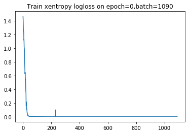

```python

from importlib import reload
import os
import pandas as pd
from io import StringIO
import itertools
import ipdb
import datetime
from collections import Counter

import h5py
import json
import tensorflow as tf
from tensorflow import keras

# Helper libraries
import numpy as np
import matplotlib.pyplot as plt
from tqdm import tqdm
import joblib
print(tf.__version__)

from keras.preprocessing import sequence
from keras.models import Sequential
from keras.layers import Dense, Embedding
from keras.layers import LSTM

from keras.callbacks import EarlyStopping

from sklearn.preprocessing import StandardScaler
from sklearn.preprocessing import MinMaxScaler
import mytf.s3utils as msu
import mytf.utils as mu
import mytf.validation as mv
import mytf.plot as mp
```

    1.14.0


    Using TensorFlow backend.


```python
tf.enable_eager_execution()

```

#### Mess around with the example weights of cross entropy
Borrow some of the mess code from [earlier book](https://github.com/namoopsoo/aviation-pilot-physiology-hmm/blob/master/notes/2020-01-10-confidence--update.md#play-with-sparse_softmax_cross_entropy-a-little-here)


```python
preds = np.array([[ 1.83809385e-01,  1.00108096e-02, -1.75332371e-03,
         1.12673618e-01],
       [ 1.83426142e-01,  9.55305714e-03, -1.38717750e-03,
         1.12821095e-01],
       [ 1.83396950e-01,  9.47616715e-03, -1.38786808e-03,
         1.12689503e-01],])

for preds, ylabels, weights in [[np.array([[0, 0, 0, 0],
                                 [0, 0, 0, 0],
                                 [0, 0, 0, 0],
                                 [0, 0, 0, 0],
                                 [0, 0, 0, 0],]), np.array([0, 0, 0, 0, 0]),
                                None],
                      [np.array([[1, 0, 0, 0],
                                 [1, 0, 0, 0],
                                 [1, 0, 0, 0],
                                 [1, 0, 0, 0],
                                 [1, 0, 0, 0],]), np.array([0, 0, 0, 0, 0]),
                                  None],
                      [np.array([[1, 0, 0, 1],
                                 [1, 0, 0, 1],
                                 [1, 0, 0, 1],
                                 [1, 0, 0, 1],
                                 [1, 0, 0, 1],]), np.array([0, 0, 0, 0, 0]),
                                  None],
                      [np.array([[2, 0, 0, 0],
                                 [2, 0, 0, 0],
                                 [2, 0, 0, 0],
                                 [2, 0, 0, 0],
                                 [2, 0, 0, 0],]), np.array([0, 0, 0, 0, 0]),
                                  None],
                      [np.array([[9, 0, 0, 0],
                                 [9, 0, 0, 0],
                                 [9, 0, 0, 0],
                                 [9, 0, 0, 0],
                                 [9, 0, 0, 0],]), np.array([0, 0, 0, 0, 0]),
                                  None],
                      [np.array([[ 1.83809385e-01,  1.00108096e-02, -1.75332371e-03,
                         1.12673618e-01],
                       [ 1.83426142e-01,  9.55305714e-03, -1.38717750e-03,
                         1.12821095e-01],
                       [ 1.83396950e-01,  9.47616715e-03, -1.38786808e-03,
                         1.12689503e-01],]), np.array([0, 0, 0]),
                                  None],
                      [np.array([[9, 0, 0, 0],
                                 [9, 0, 0, 0],
                                 [9, 0, 0, 0],
                                 [9, 0, 0, 0],
                                 [9, 0, 0, 0],]), np.array([0, 0, 0, 0, 0]),
                                  np.array([1, 1, 1, 1, 1])],
                      [np.array([[9, 0, 0, 0],
                                 [9, 0, 0, 0]]), 
                                 np.array([0, 1]),
                                np.array([1, 0])],
                      [np.array([[9, 0, 0, 0],
                                 [9, 0, 0, 0]]), 
                                 np.array([0, 1]),
                                np.array([0, 1])]
                       
                      ]:
    kwargs = {**{'labels': ylabels.astype('int64'),
                 'logits': preds.astype('float64'),},
             **({'weights': weights} if weights is not None else {})}
    loss = tf.losses.sparse_softmax_cross_entropy(**kwargs).numpy()
    print({'ylabels': ylabels, 'preds': preds, 'weights': weights, 'loss': loss})
    print()
```

    {'ylabels': array([0, 0, 0, 0, 0]), 'preds': array([[0, 0, 0, 0],
           [0, 0, 0, 0],
           [0, 0, 0, 0],
           [0, 0, 0, 0],
           [0, 0, 0, 0]]), 'weights': None, 'loss': 1.3862943649291992}
    
    {'ylabels': array([0, 0, 0, 0, 0]), 'preds': array([[1, 0, 0, 0],
           [1, 0, 0, 0],
           [1, 0, 0, 0],
           [1, 0, 0, 0],
           [1, 0, 0, 0]]), 'weights': None, 'loss': 0.7436683773994446}
    
    {'ylabels': array([0, 0, 0, 0, 0]), 'preds': array([[1, 0, 0, 1],
           [1, 0, 0, 1],
           [1, 0, 0, 1],
           [1, 0, 0, 1],
           [1, 0, 0, 1]]), 'weights': None, 'loss': 1.0064088106155396}
    
    {'ylabels': array([0, 0, 0, 0, 0]), 'preds': array([[2, 0, 0, 0],
           [2, 0, 0, 0],
           [2, 0, 0, 0],
           [2, 0, 0, 0],
           [2, 0, 0, 0]]), 'weights': None, 'loss': 0.3407529592514038}
    
    {'ylabels': array([0, 0, 0, 0, 0]), 'preds': array([[9, 0, 0, 0],
           [9, 0, 0, 0],
           [9, 0, 0, 0],
           [9, 0, 0, 0],
           [9, 0, 0, 0]]), 'weights': None, 'loss': 0.00037016088026575744}
    
    {'ylabels': array([0, 0, 0]), 'preds': array([[ 0.18380938,  0.01001081, -0.00175332,  0.11267362],
           [ 0.18342614,  0.00955306, -0.00138718,  0.11282109],
           [ 0.18339695,  0.00947617, -0.00138787,  0.1126895 ]]), 'weights': None, 'loss': 1.281795859336853}
    
    WARNING:tensorflow:From /home/ec2-user/anaconda3/envs/tensorflow_p36/lib/python3.6/site-packages/tensorflow/python/ops/losses/losses_impl.py:121: add_dispatch_support.<locals>.wrapper (from tensorflow.python.ops.array_ops) is deprecated and will be removed in a future version.
    Instructions for updating:
    Use tf.where in 2.0, which has the same broadcast rule as np.where
    {'ylabels': array([0, 0, 0, 0, 0]), 'preds': array([[9, 0, 0, 0],
           [9, 0, 0, 0],
           [9, 0, 0, 0],
           [9, 0, 0, 0],
           [9, 0, 0, 0]]), 'weights': array([1, 1, 1, 1, 1]), 'loss': 0.00037016088026575744}
    
    {'ylabels': array([0, 1]), 'preds': array([[9, 0, 0, 0],
           [9, 0, 0, 0]]), 'weights': array([1, 0]), 'loss': 0.00037016088026575744}
    
    {'ylabels': array([0, 1]), 'preds': array([[9, 0, 0, 0],
           [9, 0, 0, 0]]), 'weights': array([0, 1]), 'loss': 9.000370025634766}
    


Ok then I suppose for sake of argument, since the `label=1` loss is the only one getting 
minimized, I want to set that weight to always a low weight and just see what happens...


```python
# Working dir... for new model
save_dir = 'history'
ts = mu.quickts(); print('starting,', ts)

workdir = f'{save_dir}/{ts}'
os.mkdir(workdir)
print(f'Made new workdir, {workdir}')
```

    starting, 2020-01-18T200155Z
    Made new workdir, history/2020-01-18T200155Z


```python
lstm_params = [{
    'units': 64,
    'dropout': 0.5,
    'recurrent_dropout': 0.5,
    'batch_input_shape': (None, 64, 8),
    'kernel_initializer': tf.initializers.glorot_normal() # GlorotNormal()
                           #tf.initializers.he_normal()
    },

]

optimizer_params = {
    'learning_rate': 0.001,  
    'beta1': 0.9, 
    'beta2': 0.999, 
    'epsilon': 1e-08
}

def bake_model(lstm_params):

    model = tf.keras.Sequential([
        tf.keras.layers.LSTM(**lstm_params[0]),
        # 4 because 'A', 'B', 'C', 'D'.
        tf.keras.layers.Dense(4)])
    return model
```


```python

BATCH_SIZE = 32
EPOCHS = 1
# Use datasets from 
# 2019-12-25.ipynb
# 
# train ... new datasets, ...
datadir = 'history/2019-12-22T174803Z'
# train_loc = f'{datadir}/train_balanced.h5'
test_loc = f'{datadir}/test_balanced.h5'
train_shuff_loc = f'{datadir}/train_scaled_balanced_shuffled.h5'
print(mu.h5_keys(train_shuff_loc))
print(mu.h5_keys(test_loc))

X, Ylabels = mu.read_h5_two(
                source_location=train_shuff_loc, 
                Xdataset=f'X',
                Ydataset=f'Ylabels')
size = X.shape[0]

# save base unfitted model.
model = bake_model(lstm_params)
mu.save_model(model=model, 
              loc=f'{workdir}/00000__unfitted_model.h5')


```

    ['X', 'Ylabels']
    ['X_0', 'X_1', 'X_2', 'X_3', 'Ylabels_0', 'Ylabels_1', 'Ylabels_2', 'Ylabels_3']


```python
%%time
modelloc = f'{workdir}/00000__unfitted_model.h5'
print(f'Start train with {modelloc}')
model = mu.load_model(modelloc)

class_weights = {0: 1., 1: 0., 2: 0., 3: 0.}
dataset_batches = mu.build_dataset_weighty_v3(
        {'x_train': X,
         'ylabels_train': Ylabels.astype('int64')},
        list(range(size)), 
        class_weights,
        batch_size=BATCH_SIZE)
    
mu.do_train( 
        model,
        dataset_batches,
        k=size,
        epochs=EPOCHS,
        optimizer_params=optimizer_params,
        saveloc=workdir)
```

    Start train with history/2020-01-18T200155Z/00000__unfitted_model.h5
    WARNING:tensorflow:No training configuration found in save file: the model was *not* compiled. Compile it manually.


    
    
    
    0it [00:00, ?it/s]
    
    
    1it [00:00,  1.59it/s]
    
    
    2it [00:00,  1.82it/s]
    
    
    3it [00:01,  2.04it/s]
    
    
    4it [00:01,  2.21it/s]
    
    
    5it [00:02,  2.35it/s]
    
    
    6it [00:02,  2.46it/s]
    
    
    7it [00:02,  2.32it/s]
    
    
    8it [00:03,  2.44it/s]
    
    
    9it [00:03,  2.54it/s]
    
    
    10it [00:03,  2.61it/s]
    
    
    11it [00:04,  2.66it/s]
    
    
    12it [00:04,  2.71it/s]
    
    
    13it [00:05,  2.52it/s]
    
    
    14it [00:05,  2.61it/s]
    
    
    15it [00:05,  2.68it/s]
    
    
    16it [00:06,  2.75it/s]
    
    
    17it [00:06,  2.80it/s]
    
    
    18it [00:07,  2.58it/s]
    
    
    19it [00:07,  2.65it/s]
    
    
    20it [00:07,  2.71it/s]
    
    
    21it [00:08,  2.72it/s]
    
    
    22it [00:08,  2.73it/s]
    
    
    23it [00:08,  2.73it/s]
    
    
    24it [00:09,  2.71it/s]
    
    
    25it [00:09,  2.48it/s]
    
    
    26it [00:10,  2.58it/s]
    
    
    27it [00:10,  2.65it/s]
    
    
    28it [00:10,  2.72it/s]
    
    
    29it [00:11,  2.76it/s]
    
    
    30it [00:11,  2.54it/s]
    
    
    31it [00:11,  2.59it/s]
    
    
    32it [00:12,  2.63it/s]
    
    
    33it [00:12,  2.66it/s]
    
    
    34it [00:13,  2.67it/s]
    
    
    35it [00:13,  2.69it/s]
    
    
    36it [00:13,  2.51it/s]
    
    
    37it [00:14,  2.59it/s]
    
    
    38it [00:14,  2.65it/s]
    
    
    39it [00:14,  2.70it/s]
    
    
    40it [00:15,  2.74it/s]
    
    
    41it [00:15,  2.74it/s]
    
    
    42it [00:16,  2.52it/s]
    
    
    43it [00:16,  2.58it/s]
    
    
    44it [00:16,  2.64it/s]
    
    
    45it [00:17,  2.68it/s]
    
    
    46it [00:17,  2.69it/s]
    
    
    47it [00:17,  2.69it/s]
    
    
    48it [00:18,  2.68it/s]
    
    
    49it [00:18,  2.46it/s]
    
    
    50it [00:19,  2.52it/s]
    
    
    51it [00:19,  2.56it/s]
    
    
    52it [00:19,  2.58it/s]
    
    
    53it [00:20,  2.60it/s]
    
    
    54it [00:20,  2.62it/s]
    
    
    55it [00:21,  2.43it/s]
    
    
    56it [00:21,  2.49it/s]
    
    
    57it [00:21,  2.55it/s]
    
    
    58it [00:22,  2.62it/s]
    
    
    59it [00:22,  2.65it/s]
    
    
    60it [00:22,  2.64it/s]
    
    
    61it [00:23,  2.40it/s]
    
    
    62it [00:23,  2.47it/s]
    
    
    63it [00:24,  2.52it/s]
    
    
    64it [00:24,  2.57it/s]
    
    
    65it [00:24,  2.63it/s]
    
    
    66it [00:25,  2.68it/s]
    
    
    67it [00:25,  2.47it/s]
    
    
    68it [00:26,  2.56it/s]
    
    
    69it [00:26,  2.63it/s]
    
    
    70it [00:26,  2.68it/s]
    
    
    71it [00:27,  2.72it/s]
    
    
    72it [00:27,  2.42it/s]
    
    
    73it [00:28,  2.43it/s]
    
    
    74it [00:28,  2.33it/s]
    
    
    75it [00:29,  2.32it/s]
    
    
    76it [00:29,  2.20it/s]
    
    
    77it [00:29,  2.36it/s]
    
    
    78it [00:30,  2.50it/s]
    
    
    79it [00:30,  2.37it/s]
    
    
    80it [00:31,  2.47it/s]
    
    
    81it [00:31,  2.54it/s]
    
    
    82it [00:31,  2.58it/s]
    
    
    83it [00:32,  2.61it/s]
    
    
    84it [00:32,  2.40it/s]
    
    
    85it [00:33,  2.49it/s]
    
    
    86it [00:33,  2.55it/s]
    
    
    87it [00:33,  2.58it/s]
    
    
    88it [00:34,  2.59it/s]
    
    
    89it [00:34,  2.60it/s]
    
    
    90it [00:35,  2.40it/s]
    
    
    91it [00:35,  2.49it/s]
    
    
    92it [00:35,  2.58it/s]
    
    
    93it [00:36,  2.65it/s]
    
    
    94it [00:36,  2.69it/s]
    
    
    95it [00:36,  2.72it/s]
    
    
    96it [00:37,  2.49it/s]
    
    
    97it [00:37,  2.54it/s]
    
    
    98it [00:38,  2.57it/s]
    
    
    99it [00:38,  2.61it/s]
    
    
    100it [00:38,  2.64it/s]
    
    
    101it [00:39,  2.66it/s]
    
    
    102it [00:39,  2.69it/s]
    
    
    103it [00:40,  2.48it/s]
    
    
    104it [00:40,  2.52it/s]
    
    
    105it [00:40,  2.55it/s]
    
    
    106it [00:41,  2.58it/s]
    
    
    107it [00:41,  2.62it/s]
    
    
    108it [00:41,  2.64it/s]
    
    
    109it [00:42,  2.45it/s]
    
    
    110it [00:42,  2.53it/s]
    
    
    111it [00:43,  2.56it/s]
    
    
    112it [00:43,  2.60it/s]
    
    
    113it [00:43,  2.64it/s]
    
    
    114it [00:44,  2.66it/s]
    
    
    115it [00:44,  2.47it/s]
    
    
    116it [00:45,  2.54it/s]
    
    
    117it [00:45,  2.57it/s]
    
    
    118it [00:45,  2.61it/s]
    
    
    119it [00:46,  2.64it/s]
    
    
    120it [00:46,  2.66it/s]
    
    
    121it [00:47,  2.46it/s]
    
    
    122it [00:47,  2.52it/s]
    
    
    123it [00:47,  2.57it/s]
    
    
    124it [00:48,  2.63it/s]
    
    
    125it [00:48,  2.69it/s]
    
    
    126it [00:49,  2.49it/s]
    
    
    127it [00:49,  2.57it/s]
    
    
    128it [00:49,  2.60it/s]
    
    
    129it [00:50,  2.62it/s]
    
    
    130it [00:50,  2.65it/s]
    
    
    131it [00:50,  2.67it/s]
    
    
    132it [00:51,  2.71it/s]
    
    
    133it [00:51,  2.50it/s]
    
    
    134it [00:52,  2.57it/s]
    
    
    135it [00:52,  2.62it/s]
    
    
    136it [00:52,  2.65it/s]
    
    
    137it [00:53,  2.67it/s]
    
    
    138it [00:53,  2.45it/s]
    
    
    139it [00:53,  2.53it/s]
    
    
    140it [00:54,  2.58it/s]
    
    
    141it [00:54,  2.60it/s]
    
    
    142it [00:55,  2.63it/s]
    
    
    143it [00:55,  2.66it/s]
    
    
    144it [00:55,  2.44it/s]
    
    
    145it [00:56,  2.52it/s]
    
    
    146it [00:56,  2.57it/s]
    
    
    147it [00:57,  2.63it/s]
    
    
    148it [00:57,  2.66it/s]
    
    
    149it [00:57,  2.68it/s]
    
    
    150it [00:58,  2.47it/s]
    
    
    151it [00:58,  2.51it/s]
    
    
    152it [00:59,  2.56it/s]
    
    
    153it [00:59,  2.58it/s]
    
    
    154it [00:59,  2.62it/s]
    
    
    155it [01:00,  2.67it/s]
    
    
    156it [01:00,  2.70it/s]
    
    
    157it [01:00,  2.49it/s]
    
    
    158it [01:01,  2.59it/s]
    
    
    159it [01:01,  2.65it/s]
    
    
    160it [01:02,  2.69it/s]
    
    
    161it [01:02,  2.69it/s]
    
    
    162it [01:02,  2.72it/s]
    
    
    163it [01:03,  2.49it/s]
    
    
    164it [01:03,  2.56it/s]
    
    
    165it [01:03,  2.63it/s]
    
    
    166it [01:04,  2.68it/s]
    
    
    167it [01:04,  2.71it/s]
    
    
    168it [01:05,  2.73it/s]
    
    
    169it [01:05,  2.53it/s]
    
    
    170it [01:05,  2.61it/s]
    
    
    171it [01:06,  2.65it/s]
    
    
    172it [01:06,  2.69it/s]
    
    
    173it [01:06,  2.72it/s]
    
    
    174it [01:07,  2.75it/s]
    
    
    175it [01:07,  2.53it/s]
    
    
    176it [01:08,  2.61it/s]
    
    
    177it [01:08,  2.64it/s]
    
    
    178it [01:08,  2.66it/s]
    
    
    179it [01:09,  2.68it/s]
    
    
    180it [01:09,  2.49it/s]
    
    
    181it [01:10,  2.56it/s]
    
    
    182it [01:10,  2.63it/s]
    
    
    183it [01:10,  2.67it/s]
    
    
    184it [01:11,  2.69it/s]
    
    
    185it [01:11,  2.71it/s]
    
    
    186it [01:11,  2.74it/s]
    
    
    187it [01:12,  2.53it/s]
    
    
    188it [01:12,  2.59it/s]
    
    
    189it [01:13,  2.63it/s]
    
    
    190it [01:13,  2.66it/s]
    
    
    191it [01:13,  2.67it/s]
    
    
    192it [01:14,  2.46it/s]
    
    
    193it [01:14,  2.54it/s]
    
    
    194it [01:15,  2.57it/s]
    
    
    195it [01:15,  2.61it/s]
    
    
    196it [01:15,  2.61it/s]
    
    
    197it [01:16,  2.65it/s]
    
    
    198it [01:16,  2.44it/s]
    
    
    199it [01:16,  2.52it/s]
    
    
    200it [01:17,  2.59it/s]
    
    
    201it [01:17,  2.62it/s]
    
    
    202it [01:18,  2.65it/s]
    
    
    203it [01:18,  2.69it/s]
    
    
    204it [01:18,  2.49it/s]
    
    
    205it [01:19,  2.58it/s]
    
    
    206it [01:19,  2.66it/s]
    
    
    207it [01:19,  2.69it/s]
    
    
    208it [01:20,  2.73it/s]
    
    
    209it [01:20,  2.75it/s]
    
    
    210it [01:21,  2.74it/s]
    
    
    211it [01:21,  2.51it/s]
    
    
    212it [01:21,  2.59it/s]
    
    
    213it [01:22,  2.64it/s]
    
    
    214it [01:22,  2.67it/s]
    
    
    215it [01:22,  2.69it/s]
    
    
    216it [01:23,  2.70it/s]
    
    
    217it [01:23,  2.50it/s]
    
    
    218it [01:24,  2.57it/s]
    
    
    219it [01:24,  2.62it/s]
    
    
    220it [01:24,  2.67it/s]
    
    
    221it [01:25,  2.69it/s]
    
    
    222it [01:25,  2.72it/s]
    
    
    223it [01:26,  2.52it/s]
    
    
    224it [01:26,  2.60it/s]
    
    
    225it [01:26,  2.66it/s]
    
    
    226it [01:27,  2.70it/s]
    
    
    227it [01:27,  2.65it/s]
    
    
    228it [01:27,  2.60it/s]
    
    
    229it [01:28,  2.36it/s]
    
    
    230it [01:28,  2.46it/s]
    
    
    231it [01:29,  2.43it/s]
    
    
    232it [01:29,  2.44it/s]
    
    
    233it [01:30,  2.53it/s]
    
    
    234it [01:30,  2.41it/s]
    
    
    235it [01:30,  2.49it/s]
    
    
    236it [01:31,  2.54it/s]
    
    
    237it [01:31,  2.58it/s]
    
    
    238it [01:31,  2.60it/s]
    
    
    239it [01:32,  2.59it/s]
    
    
    240it [01:32,  2.62it/s]
    
    
    241it [01:33,  2.44it/s]
    
    
    242it [01:33,  2.51it/s]
    
    
    243it [01:33,  2.54it/s]
    
    
    244it [01:34,  2.56it/s]
    
    
    245it [01:34,  2.59it/s]
    
    
    246it [01:35,  2.37it/s]
    
    
    247it [01:35,  2.44it/s]
    
    
    248it [01:36,  2.51it/s]
    
    
    249it [01:36,  2.57it/s]
    
    
    250it [01:36,  2.63it/s]
    
    
    251it [01:37,  2.65it/s]
    
    
    252it [01:37,  2.46it/s]
    
    
    253it [01:37,  2.50it/s]
    
    
    254it [01:38,  2.53it/s]
    
    
    255it [01:38,  2.57it/s]
    
    
    256it [01:39,  2.55it/s]
    
    
    257it [01:39,  2.61it/s]
    
    
    258it [01:39,  2.42it/s]
    
    
    259it [01:40,  2.48it/s]
    
    
    260it [01:40,  2.53it/s]
    
    
    261it [01:41,  2.58it/s]
    
    
    262it [01:41,  2.62it/s]
    
    
    263it [01:41,  2.65it/s]
    
    
    264it [01:42,  2.66it/s]
    
    
    265it [01:42,  2.44it/s]
    
    
    266it [01:43,  2.50it/s]
    
    
    267it [01:43,  2.57it/s]
    
    
    268it [01:43,  2.63it/s]
    
    
    269it [01:44,  2.67it/s]
    
    
    270it [01:44,  2.70it/s]
    
    
    271it [01:45,  2.45it/s]
    
    
    272it [01:45,  2.52it/s]
    
    
    273it [01:45,  2.56it/s]
    
    
    274it [01:46,  2.59it/s]
    
    
    275it [01:46,  2.61it/s]
    
    
    276it [01:46,  2.61it/s]
    
    
    277it [01:47,  2.40it/s]
    
    
    278it [01:47,  2.49it/s]
    
    
    279it [01:48,  2.57it/s]
    
    
    280it [01:48,  2.63it/s]
    
    
    281it [01:48,  2.63it/s]
    
    
    282it [01:49,  2.65it/s]
    
    
    283it [01:49,  2.43it/s]
    
    
    284it [01:50,  2.51it/s]
    
    
    285it [01:50,  2.58it/s]
    
    
    286it [01:50,  2.63it/s]
    
    
    287it [01:51,  2.66it/s]
    
    
    288it [01:51,  2.47it/s]
    
    
    289it [01:52,  2.54it/s]
    
    
    290it [01:52,  2.60it/s]
    
    
    291it [01:52,  2.61it/s]
    
    
    292it [01:53,  2.62it/s]
    
    
    293it [01:53,  2.62it/s]
    
    
    294it [01:53,  2.63it/s]
    
    
    295it [01:54,  2.44it/s]
    
    
    296it [01:54,  2.52it/s]
    
    
    297it [01:55,  2.57it/s]
    
    
    298it [01:55,  2.62it/s]
    
    
    299it [01:55,  2.65it/s]
    
    
    300it [01:56,  2.43it/s]
    
    
    301it [01:56,  2.48it/s]
    
    
    302it [01:57,  2.22it/s]
    
    
    303it [01:57,  1.99it/s]
    
    
    304it [01:58,  1.89it/s]
    
    
    305it [01:59,  1.84it/s]
    
    
    306it [01:59,  1.68it/s]
    
    
    307it [02:00,  1.68it/s]
    
    
    308it [02:00,  1.79it/s]
    
    
    309it [02:01,  1.99it/s]
    
    
    310it [02:01,  2.16it/s]
    
    
    311it [02:01,  2.30it/s]
    
    
    312it [02:02,  2.23it/s]
    
    
    313it [02:02,  2.36it/s]
    
    
    314it [02:03,  2.45it/s]
    
    
    315it [02:03,  2.52it/s]
    
    
    316it [02:03,  2.59it/s]
    
    
    317it [02:04,  2.62it/s]
    
    
    318it [02:04,  2.67it/s]
    
    
    319it [02:05,  2.47it/s]
    
    
    320it [02:05,  2.56it/s]
    
    
    321it [02:05,  2.62it/s]
    
    
    322it [02:06,  2.69it/s]
    
    
    323it [02:06,  2.72it/s]
    
    
    324it [02:06,  2.72it/s]
    
    
    325it [02:07,  2.50it/s]
    
    
    326it [02:07,  2.58it/s]
    
    
    327it [02:08,  2.64it/s]
    
    
    328it [02:08,  2.67it/s]
    
    
    329it [02:08,  2.70it/s]
    
    
    330it [02:09,  2.71it/s]
    
    
    331it [02:09,  2.48it/s]
    
    
    332it [02:10,  2.56it/s]
    
    
    333it [02:10,  2.62it/s]
    
    
    334it [02:10,  2.67it/s]
    
    
    335it [02:11,  2.69it/s]
    
    
    336it [02:11,  2.71it/s]
    
    
    337it [02:11,  2.49it/s]
    
    
    338it [02:12,  2.56it/s]
    
    
    339it [02:12,  2.61it/s]
    
    
    340it [02:13,  2.66it/s]
    
    
    341it [02:13,  2.68it/s]
    
    
    342it [02:13,  2.47it/s]
    
    
    343it [02:14,  2.55it/s]
    
    
    344it [02:14,  2.61it/s]
    
    
    345it [02:14,  2.68it/s]
    
    
    346it [02:15,  2.71it/s]
    
    
    347it [02:15,  2.74it/s]
    
    
    348it [02:16,  2.77it/s]
    
    
    349it [02:16,  2.55it/s]
    
    
    350it [02:16,  2.62it/s]
    
    
    351it [02:17,  2.66it/s]
    
    
    352it [02:17,  2.69it/s]
    
    
    353it [02:17,  2.74it/s]
    
    
    354it [02:18,  2.52it/s]
    
    
    355it [02:18,  2.59it/s]
    
    
    356it [02:19,  2.65it/s]
    
    
    357it [02:19,  2.69it/s]
    
    
    358it [02:19,  2.72it/s]
    
    
    359it [02:20,  2.75it/s]
    
    
    360it [02:20,  2.49it/s]
    
    
    361it [02:21,  2.56it/s]
    
    
    362it [02:21,  2.61it/s]
    
    
    363it [02:21,  2.67it/s]
    
    
    364it [02:22,  2.71it/s]
    
    
    365it [02:22,  2.74it/s]
    
    
    366it [02:22,  2.52it/s]
    
    
    367it [02:23,  2.60it/s]
    
    
    368it [02:23,  2.64it/s]
    
    
    369it [02:24,  2.68it/s]
    
    
    370it [02:24,  2.71it/s]
    
    
    371it [02:24,  2.69it/s]
    
    
    372it [02:25,  2.72it/s]
    
    
    373it [02:25,  2.50it/s]
    
    
    374it [02:25,  2.59it/s]
    
    
    375it [02:26,  2.65it/s]
    
    
    376it [02:26,  2.68it/s]
    
    
    377it [02:27,  2.70it/s]
    
    
    378it [02:27,  2.67it/s]
    
    
    379it [02:27,  2.39it/s]
    
    
    380it [02:28,  2.42it/s]
    
    
    381it [02:28,  2.47it/s]
    
    
    382it [02:29,  2.55it/s]
    
    
    383it [02:29,  2.59it/s]
    
    
    384it [02:29,  2.61it/s]
    
    
    385it [02:30,  2.45it/s]
    
    
    386it [02:30,  2.52it/s]
    
    
    387it [02:31,  2.62it/s]
    
    
    388it [02:31,  2.66it/s]
    
    
    389it [02:31,  2.68it/s]
    
    
    390it [02:32,  2.69it/s]
    
    
    391it [02:32,  2.44it/s]
    
    
    392it [02:33,  2.50it/s]
    
    
    393it [02:33,  2.53it/s]
    
    
    394it [02:33,  2.56it/s]
    
    
    395it [02:34,  2.59it/s]
    
    
    396it [02:34,  2.38it/s]
    
    
    397it [02:35,  2.45it/s]
    
    
    398it [02:35,  2.49it/s]
    
    
    399it [02:35,  2.53it/s]
    
    
    400it [02:36,  2.59it/s]
    
    
    401it [02:36,  2.59it/s]
    
    
    402it [02:36,  2.59it/s]
    
    
    403it [02:37,  2.39it/s]
    
    
    404it [02:37,  2.46it/s]
    
    
    405it [02:38,  2.51it/s]
    
    
    406it [02:38,  2.55it/s]
    
    
    407it [02:38,  2.56it/s]
    
    
    408it [02:39,  2.37it/s]
    
    
    409it [02:39,  2.45it/s]
    
    
    410it [02:40,  2.53it/s]
    
    
    411it [02:40,  2.58it/s]
    
    
    412it [02:40,  2.60it/s]
    
    
    413it [02:41,  2.62it/s]
    
    
    414it [02:41,  2.40it/s]
    
    
    415it [02:42,  2.46it/s]
    
    
    416it [02:42,  2.51it/s]
    
    
    417it [02:42,  2.54it/s]
    
    
    418it [02:43,  2.57it/s]
    
    
    419it [02:43,  2.59it/s]
    
    
    420it [02:44,  2.39it/s]
    
    
    421it [02:44,  2.44it/s]
    
    
    422it [02:44,  2.51it/s]
    
    
    423it [02:45,  2.56it/s]
    
    
    424it [02:45,  2.59it/s]
    
    
    425it [02:46,  2.63it/s]
    
    
    426it [02:46,  2.67it/s]
    
    
    427it [02:46,  2.46it/s]
    
    
    428it [02:47,  2.53it/s]
    
    
    429it [02:47,  2.58it/s]
    
    
    430it [02:48,  2.62it/s]
    
    
    431it [02:48,  2.64it/s]
    
    
    432it [02:48,  2.66it/s]
    
    
    433it [02:49,  2.45it/s]
    
    
    434it [02:49,  2.52it/s]
    
    
    435it [02:49,  2.56it/s]
    
    
    436it [02:50,  2.60it/s]
    
    
    437it [02:50,  2.61it/s]
    
    
    438it [02:51,  2.61it/s]
    
    
    439it [02:51,  2.41it/s]
    
    
    440it [02:51,  2.47it/s]
    
    
    441it [02:52,  2.53it/s]
    
    
    442it [02:52,  2.60it/s]
    
    
    443it [02:53,  2.63it/s]
    
    
    444it [02:53,  2.66it/s]
    
    
    445it [02:53,  2.44it/s]
    
    
    446it [02:54,  2.50it/s]
    
    
    447it [02:54,  2.56it/s]
    
    
    448it [02:55,  2.61it/s]
    
    
    449it [02:55,  2.63it/s]
    
    
    450it [02:55,  2.44it/s]
    
    
    451it [02:56,  2.49it/s]
    
    
    452it [02:56,  2.53it/s]
    
    
    453it [02:57,  2.57it/s]
    
    
    454it [02:57,  2.59it/s]
    
    
    455it [02:57,  2.61it/s]
    
    
    456it [02:58,  2.66it/s]
    
    
    457it [02:58,  2.45it/s]
    
    
    458it [02:59,  2.52it/s]
    
    
    459it [02:59,  2.56it/s]
    
    
    460it [02:59,  2.59it/s]
    
    
    461it [03:00,  2.62it/s]
    
    
    462it [03:00,  2.41it/s]
    
    
    463it [03:01,  2.48it/s]
    
    
    464it [03:01,  2.53it/s]
    
    
    465it [03:01,  2.58it/s]
    
    
    466it [03:02,  2.62it/s]
    
    
    467it [03:02,  2.64it/s]
    
    
    468it [03:02,  2.45it/s]
    
    
    469it [03:03,  2.53it/s]
    
    
    470it [03:03,  2.59it/s]
    
    
    471it [03:04,  2.60it/s]
    
    
    472it [03:04,  2.64it/s]
    
    
    473it [03:04,  2.66it/s]
    
    
    474it [03:05,  2.45it/s]
    
    
    475it [03:05,  2.52it/s]
    
    
    476it [03:06,  2.59it/s]
    
    
    477it [03:06,  2.65it/s]
    
    
    478it [03:06,  2.68it/s]
    
    
    479it [03:07,  2.70it/s]
    
    
    480it [03:07,  2.71it/s]
    
    
    481it [03:07,  2.47it/s]
    
    
    482it [03:08,  2.54it/s]
    
    
    483it [03:08,  2.61it/s]
    
    
    484it [03:09,  2.66it/s]
    
    
    485it [03:09,  2.69it/s]
    
    
    486it [03:09,  2.73it/s]
    
    
    487it [03:10,  2.54it/s]
    
    
    488it [03:10,  2.61it/s]
    
    
    489it [03:10,  2.65it/s]
    
    
    490it [03:11,  2.71it/s]
    
    
    491it [03:11,  2.71it/s]
    
    
    492it [03:12,  2.73it/s]
    
    
    493it [03:12,  2.51it/s]
    
    
    494it [03:12,  2.57it/s]
    
    
    495it [03:13,  2.64it/s]
    
    
    496it [03:13,  2.67it/s]
    
    
    497it [03:13,  2.69it/s]
    
    
    498it [03:14,  2.72it/s]
    
    
    499it [03:14,  2.52it/s]
    
    
    500it [03:15,  2.61it/s]
    
    
    501it [03:15,  2.64it/s]
    
    
    502it [03:15,  2.68it/s]
    
    
    503it [03:16,  2.70it/s]
    
    
    504it [03:16,  2.49it/s]
    
    
    505it [03:17,  2.58it/s]
    
    
    506it [03:17,  2.66it/s]
    
    
    507it [03:17,  2.68it/s]
    
    
    508it [03:18,  2.71it/s]
    
    
    509it [03:18,  2.74it/s]
    
    
    510it [03:18,  2.75it/s]
    
    
    511it [03:19,  2.53it/s]
    
    
    512it [03:19,  2.60it/s]
    
    
    513it [03:20,  2.65it/s]
    
    
    514it [03:20,  2.70it/s]
    
    
    515it [03:20,  2.72it/s]
    
    
    516it [03:21,  2.53it/s]
    
    
    517it [03:21,  2.61it/s]
    
    
    518it [03:21,  2.65it/s]
    
    
    519it [03:22,  2.68it/s]
    
    
    520it [03:22,  2.68it/s]
    
    
    521it [03:23,  2.66it/s]
    
    
    522it [03:23,  2.44it/s]
    
    
    523it [03:23,  2.50it/s]
    
    
    524it [03:24,  2.56it/s]
    
    
    525it [03:24,  2.60it/s]
    
    
    526it [03:25,  2.61it/s]
    
    
    527it [03:25,  2.63it/s]
    
    
    528it [03:25,  2.42it/s]
    
    
    529it [03:26,  2.52it/s]
    
    
    530it [03:26,  2.57it/s]
    
    
    531it [03:26,  2.61it/s]
    
    
    532it [03:27,  2.63it/s]
    
    
    533it [03:27,  2.57it/s]
    
    
    534it [03:28,  2.55it/s]
    
    
    535it [03:28,  2.32it/s]
    
    
    536it [03:29,  2.40it/s]
    
    
    537it [03:29,  2.47it/s]
    
    
    538it [03:29,  2.53it/s]
    
    
    539it [03:30,  2.59it/s]
    
    
    540it [03:30,  2.63it/s]
    
    
    541it [03:31,  2.42it/s]
    
    
    542it [03:31,  2.51it/s]
    
    
    543it [03:31,  2.55it/s]
    
    
    544it [03:32,  2.58it/s]
    
    
    545it [03:32,  2.61it/s]
    
    
    546it [03:32,  2.64it/s]
    
    
    547it [03:33,  2.43it/s]
    
    
    548it [03:33,  2.48it/s]
    
    
    549it [03:34,  2.53it/s]
    
    
    550it [03:34,  2.57it/s]
    
    
    551it [03:34,  2.58it/s]
    
    
    552it [03:35,  2.60it/s]
    
    
    553it [03:35,  2.42it/s]
    
    
    554it [03:36,  2.50it/s]
    
    
    555it [03:36,  2.55it/s]
    
    
    556it [03:36,  2.60it/s]
    
    
    557it [03:37,  2.63it/s]
    
    
    558it [03:37,  2.44it/s]
    
    
    559it [03:38,  2.52it/s]
    
    
    560it [03:38,  2.58it/s]
    
    
    561it [03:38,  2.61it/s]
    
    
    562it [03:39,  2.65it/s]
    
    
    563it [03:39,  2.69it/s]
    
    
    564it [03:39,  2.70it/s]
    
    
    565it [03:40,  2.47it/s]
    
    
    566it [03:40,  2.53it/s]
    
    
    567it [03:41,  2.60it/s]
    
    
    568it [03:41,  2.64it/s]
    
    
    569it [03:41,  2.68it/s]
    
    
    570it [03:42,  2.48it/s]
    
    
    571it [03:42,  2.55it/s]
    
    
    572it [03:43,  2.63it/s]
    
    
    573it [03:43,  2.66it/s]
    
    
    574it [03:43,  2.69it/s]
    
    
    575it [03:44,  2.73it/s]
    
    
    576it [03:44,  2.49it/s]
    
    
    577it [03:45,  2.56it/s]
    
    
    578it [03:45,  2.60it/s]
    
    
    579it [03:45,  2.61it/s]
    
    
    580it [03:46,  2.65it/s]
    
    
    581it [03:46,  2.68it/s]
    
    
    582it [03:46,  2.45it/s]
    
    
    583it [03:47,  2.52it/s]
    
    
    584it [03:47,  2.58it/s]
    
    
    585it [03:48,  2.62it/s]
    
    
    586it [03:48,  2.67it/s]
    
    
    587it [03:48,  2.70it/s]
    
    
    588it [03:49,  2.72it/s]
    
    
    589it [03:49,  2.52it/s]
    
    
    590it [03:49,  2.58it/s]
    
    
    591it [03:50,  2.62it/s]
    
    
    592it [03:50,  2.65it/s]
    
    
    593it [03:51,  2.69it/s]
    
    
    594it [03:51,  2.72it/s]
    
    
    595it [03:51,  2.52it/s]
    
    
    596it [03:52,  2.61it/s]
    
    
    597it [03:52,  2.67it/s]
    
    
    598it [03:52,  2.70it/s]
    
    
    599it [03:53,  2.72it/s]
    
    
    600it [03:53,  2.72it/s]
    
    
    601it [03:54,  2.49it/s]
    
    
    602it [03:54,  2.57it/s]
    
    
    603it [03:54,  2.63it/s]
    
    
    604it [03:55,  2.66it/s]
    
    
    605it [03:55,  2.68it/s]
    
    
    606it [03:55,  2.71it/s]
    
    
    607it [03:56,  2.50it/s]
    
    
    608it [03:56,  2.57it/s]
    
    
    609it [03:57,  2.62it/s]
    
    
    610it [03:57,  2.64it/s]
    
    
    611it [03:57,  2.64it/s]
    
    
    612it [03:58,  2.47it/s]
    
    
    613it [03:58,  2.55it/s]
    
    
    614it [03:59,  2.61it/s]
    
    
    615it [03:59,  2.64it/s]
    
    
    616it [03:59,  2.64it/s]
    
    
    617it [04:00,  2.69it/s]
    
    
    618it [04:00,  2.72it/s]
    
    
    619it [04:01,  2.51it/s]
    
    
    620it [04:01,  2.58it/s]
    
    
    621it [04:01,  2.62it/s]
    
    
    622it [04:02,  2.64it/s]
    
    
    623it [04:02,  2.68it/s]
    
    
    624it [04:03,  2.46it/s]
    
    
    625it [04:03,  2.55it/s]
    
    
    626it [04:03,  2.65it/s]
    
    
    627it [04:04,  2.70it/s]
    
    
    628it [04:04,  2.74it/s]
    
    
    629it [04:04,  2.76it/s]
    
    
    630it [04:05,  2.52it/s]
    
    
    631it [04:05,  2.58it/s]
    
    
    632it [04:05,  2.63it/s]
    
    
    633it [04:06,  2.69it/s]
    
    
    634it [04:06,  2.75it/s]
    
    
    635it [04:07,  2.76it/s]
    
    
    636it [04:07,  2.55it/s]
    
    
    637it [04:07,  2.62it/s]
    
    
    638it [04:08,  2.67it/s]
    
    
    639it [04:08,  2.70it/s]
    
    
    640it [04:08,  2.72it/s]
    
    
    641it [04:09,  2.74it/s]
    
    
    642it [04:09,  2.76it/s]
    
    
    643it [04:10,  2.53it/s]
    
    
    644it [04:10,  2.62it/s]
    
    
    645it [04:10,  2.66it/s]
    
    
    646it [04:11,  2.68it/s]
    
    
    647it [04:11,  2.70it/s]
    
    
    648it [04:11,  2.72it/s]
    
    
    649it [04:12,  2.49it/s]
    
    
    650it [04:12,  2.57it/s]
    
    
    651it [04:13,  2.61it/s]
    
    
    652it [04:13,  2.67it/s]
    
    
    653it [04:13,  2.72it/s]
    
    
    654it [04:14,  2.74it/s]
    
    
    655it [04:14,  2.52it/s]
    
    
    656it [04:15,  2.58it/s]
    
    
    657it [04:15,  2.63it/s]
    
    
    658it [04:15,  2.68it/s]
    
    
    659it [04:16,  2.71it/s]
    
    
    660it [04:16,  2.75it/s]
    
    
    661it [04:16,  2.51it/s]
    
    
    662it [04:17,  2.59it/s]
    
    
    663it [04:17,  2.63it/s]
    
    
    664it [04:18,  2.66it/s]
    
    
    665it [04:18,  2.69it/s]
    
    
    666it [04:18,  2.49it/s]
    
    
    667it [04:19,  2.56it/s]
    
    
    668it [04:19,  2.62it/s]
    
    
    669it [04:19,  2.65it/s]
    
    
    670it [04:20,  2.66it/s]
    
    
    671it [04:20,  2.68it/s]
    
    
    672it [04:21,  2.70it/s]
    
    
    673it [04:21,  2.48it/s]
    
    
    674it [04:21,  2.55it/s]
    
    
    675it [04:22,  2.59it/s]
    
    
    676it [04:22,  2.63it/s]
    
    
    677it [04:23,  2.65it/s]
    
    
    678it [04:23,  2.44it/s]
    
    
    679it [04:23,  2.52it/s]
    
    
    680it [04:24,  2.55it/s]
    
    
    681it [04:24,  2.58it/s]
    
    
    682it [04:25,  2.62it/s]
    
    
    683it [04:25,  2.64it/s]
    
    
    684it [04:25,  2.41it/s]
    
    
    685it [04:26,  2.48it/s]
    
    
    686it [04:26,  2.51it/s]
    
    
    687it [04:27,  2.56it/s]
    
    
    688it [04:27,  2.56it/s]
    
    
    689it [04:27,  2.50it/s]
    
    
    690it [04:28,  2.27it/s]
    
    
    691it [04:28,  2.23it/s]
    
    
    692it [04:29,  2.23it/s]
    
    
    693it [04:29,  2.35it/s]
    
    
    694it [04:30,  2.45it/s]
    
    
    695it [04:30,  2.55it/s]
    
    
    696it [04:30,  2.62it/s]
    
    
    697it [04:31,  2.47it/s]
    
    
    698it [04:31,  2.55it/s]
    
    
    699it [04:31,  2.61it/s]
    
    
    700it [04:32,  2.65it/s]
    
    
    701it [04:32,  2.66it/s]
    
    
    702it [04:33,  2.70it/s]
    
    
    703it [04:33,  2.49it/s]
    
    
    704it [04:33,  2.54it/s]
    
    
    705it [04:34,  2.55it/s]
    
    
    706it [04:34,  2.58it/s]
    
    
    707it [04:34,  2.62it/s]
    
    
    708it [04:35,  2.65it/s]
    
    
    709it [04:35,  2.45it/s]
    
    
    710it [04:36,  2.53it/s]
    
    
    711it [04:36,  2.58it/s]
    
    
    712it [04:36,  2.60it/s]
    
    
    713it [04:37,  2.62it/s]
    
    
    714it [04:37,  2.64it/s]
    
    
    715it [04:38,  2.44it/s]
    
    
    716it [04:38,  2.51it/s]
    
    
    717it [04:38,  2.56it/s]
    
    
    718it [04:39,  2.61it/s]
    
    
    719it [04:39,  2.66it/s]
    
    
    720it [04:40,  2.46it/s]
    
    
    721it [04:40,  2.52it/s]
    
    
    722it [04:40,  2.57it/s]
    
    
    723it [04:41,  2.64it/s]
    
    
    724it [04:41,  2.70it/s]
    
    
    725it [04:41,  2.73it/s]
    
    
    726it [04:42,  2.73it/s]
    
    
    727it [04:42,  2.51it/s]
    
    
    728it [04:43,  2.56it/s]
    
    
    729it [04:43,  2.61it/s]
    
    
    730it [04:43,  2.64it/s]
    
    
    731it [04:44,  2.68it/s]
    
    
    732it [04:44,  2.50it/s]
    
    
    733it [04:45,  2.58it/s]
    
    
    734it [04:45,  2.64it/s]
    
    
    735it [04:45,  2.63it/s]
    
    
    736it [04:46,  2.67it/s]
    
    
    737it [04:46,  2.71it/s]
    
    
    738it [04:46,  2.50it/s]
    
    
    739it [04:47,  2.59it/s]
    
    
    740it [04:47,  2.63it/s]
    
    
    741it [04:48,  2.65it/s]
    
    
    742it [04:48,  2.71it/s]
    
    
    743it [04:48,  2.74it/s]
    
    
    744it [04:49,  2.51it/s]
    
    
    745it [04:49,  2.56it/s]
    
    
    746it [04:50,  2.60it/s]
    
    
    747it [04:50,  2.64it/s]
    
    
    748it [04:50,  2.70it/s]
    
    
    749it [04:51,  2.73it/s]
    
    
    750it [04:51,  2.77it/s]
    
    
    751it [04:51,  2.53it/s]
    
    
    752it [04:52,  2.59it/s]
    
    
    753it [04:52,  2.66it/s]
    
    
    754it [04:52,  2.69it/s]
    
    
    755it [04:53,  2.73it/s]
    
    
    756it [04:53,  2.75it/s]
    
    
    757it [04:54,  2.52it/s]
    
    
    758it [04:54,  2.59it/s]
    
    
    759it [04:54,  2.65it/s]
    
    
    760it [04:55,  2.69it/s]
    
    
    761it [04:55,  2.71it/s]
    
    
    762it [04:55,  2.72it/s]
    
    
    763it [04:56,  2.50it/s]
    
    
    764it [04:56,  2.56it/s]
    
    
    765it [04:57,  2.17it/s]
    
    
    766it [04:58,  1.98it/s]
    
    
    767it [04:58,  1.88it/s]
    
    
    768it [04:59,  1.83it/s]
    
    
    769it [04:59,  1.68it/s]
    
    
    770it [05:00,  1.69it/s]
    
    
    771it [05:00,  1.86it/s]
    
    
    772it [05:01,  2.06it/s]
    
    
    773it [05:01,  2.22it/s]
    
    
    774it [05:02,  2.18it/s]
    
    
    775it [05:02,  2.32it/s]
    
    
    776it [05:02,  2.43it/s]
    
    
    777it [05:03,  2.52it/s]
    
    
    778it [05:03,  2.58it/s]
    
    
    779it [05:03,  2.63it/s]
    
    
    780it [05:04,  2.67it/s]
    
    
    781it [05:04,  2.48it/s]
    
    
    782it [05:05,  2.58it/s]
    
    
    783it [05:05,  2.63it/s]
    
    
    784it [05:05,  2.67it/s]
    
    
    785it [05:06,  2.72it/s]
    
    
    786it [05:06,  2.52it/s]
    
    
    787it [05:07,  2.61it/s]
    
    
    788it [05:07,  2.67it/s]
    
    
    789it [05:07,  2.72it/s]
    
    
    790it [05:08,  2.77it/s]
    
    
    791it [05:08,  2.78it/s]
    
    
    792it [05:08,  2.56it/s]
    
    
    793it [05:09,  2.63it/s]
    
    
    794it [05:09,  2.69it/s]
    
    
    795it [05:09,  2.72it/s]
    
    
    796it [05:10,  2.74it/s]
    
    
    797it [05:10,  2.76it/s]
    
    
    798it [05:11,  2.56it/s]
    
    
    799it [05:11,  2.63it/s]
    
    
    800it [05:11,  2.70it/s]
    
    
    801it [05:12,  2.71it/s]
    
    
    802it [05:12,  2.74it/s]
    
    
    803it [05:12,  2.76it/s]
    
    
    804it [05:13,  2.77it/s]
    
    
    805it [05:13,  2.53it/s]
    
    
    806it [05:14,  2.59it/s]
    
    
    807it [05:14,  2.64it/s]
    
    
    808it [05:14,  2.69it/s]
    
    
    809it [05:15,  2.71it/s]
    
    
    810it [05:15,  2.71it/s]
    
    
    811it [05:16,  2.48it/s]
    
    
    812it [05:16,  2.56it/s]
    
    
    813it [05:16,  2.63it/s]
    
    
    814it [05:17,  2.69it/s]
    
    
    815it [05:17,  2.72it/s]
    
    
    816it [05:17,  2.73it/s]
    
    
    817it [05:18,  2.53it/s]
    
    
    818it [05:18,  2.60it/s]
    
    
    819it [05:19,  2.65it/s]
    
    
    820it [05:19,  2.69it/s]
    
    
    821it [05:19,  2.68it/s]
    
    
    822it [05:20,  2.70it/s]
    
    
    823it [05:20,  2.50it/s]
    
    
    824it [05:20,  2.56it/s]
    
    
    825it [05:21,  2.61it/s]
    
    
    826it [05:21,  2.65it/s]
    
    
    827it [05:22,  2.69it/s]
    
    
    828it [05:22,  2.48it/s]
    
    
    829it [05:22,  2.55it/s]
    
    
    830it [05:23,  2.61it/s]
    
    
    831it [05:23,  2.62it/s]
    
    
    832it [05:24,  2.64it/s]
    
    
    833it [05:24,  2.68it/s]
    
    
    834it [05:24,  2.70it/s]
    
    
    835it [05:25,  2.50it/s]
    
    
    836it [05:25,  2.58it/s]
    
    
    837it [05:25,  2.63it/s]
    
    
    838it [05:26,  2.68it/s]
    
    
    839it [05:26,  2.71it/s]
    
    
    840it [05:27,  2.51it/s]
    
    
    841it [05:27,  2.51it/s]
    
    
    842it [05:27,  2.52it/s]
    
    
    843it [05:28,  2.51it/s]
    
    
    844it [05:28,  2.45it/s]
    
    
    845it [05:29,  2.43it/s]
    
    
    846it [05:29,  2.31it/s]
    
    
    847it [05:30,  2.43it/s]
    
    
    848it [05:30,  2.53it/s]
    
    
    849it [05:30,  2.60it/s]
    
    
    850it [05:31,  2.66it/s]
    
    
    851it [05:31,  2.70it/s]
    
    
    852it [05:31,  2.49it/s]
    
    
    853it [05:32,  2.57it/s]
    
    
    854it [05:32,  2.64it/s]
    
    
    855it [05:32,  2.66it/s]
    
    
    856it [05:33,  2.68it/s]
    
    
    857it [05:33,  2.68it/s]
    
    
    858it [05:34,  2.68it/s]
    
    
    859it [05:34,  2.44it/s]
    
    
    860it [05:34,  2.52it/s]
    
    
    861it [05:35,  2.57it/s]
    
    
    862it [05:35,  2.63it/s]
    
    
    863it [05:36,  2.66it/s]
    
    
    864it [05:36,  2.70it/s]
    
    
    865it [05:36,  2.49it/s]
    
    
    866it [05:37,  2.57it/s]
    
    
    867it [05:37,  2.62it/s]
    
    
    868it [05:37,  2.66it/s]
    
    
    869it [05:38,  2.69it/s]
    
    
    870it [05:38,  2.73it/s]
    
    
    871it [05:39,  2.49it/s]
    
    
    872it [05:39,  2.57it/s]
    
    
    873it [05:39,  2.64it/s]
    
    
    874it [05:40,  2.68it/s]
    
    
    875it [05:40,  2.70it/s]
    
    
    876it [05:40,  2.71it/s]
    
    
    877it [05:41,  2.48it/s]
    
    
    878it [05:41,  2.55it/s]
    
    
    879it [05:42,  2.60it/s]
    
    
    880it [05:42,  2.63it/s]
    
    
    881it [05:42,  2.65it/s]
    
    
    882it [05:43,  2.48it/s]
    
    
    883it [05:43,  2.55it/s]
    
    
    884it [05:44,  2.60it/s]
    
    
    885it [05:44,  2.64it/s]
    
    
    886it [05:44,  2.68it/s]
    
    
    887it [05:45,  2.72it/s]
    
    
    888it [05:45,  2.72it/s]
    
    
    889it [05:46,  2.49it/s]
    
    
    890it [05:46,  2.56it/s]
    
    
    891it [05:46,  2.59it/s]
    
    
    892it [05:47,  2.64it/s]
    
    
    893it [05:47,  2.66it/s]
    
    
    894it [05:48,  2.47it/s]
    
    
    895it [05:48,  2.57it/s]
    
    
    896it [05:48,  2.63it/s]
    
    
    897it [05:49,  2.65it/s]
    
    
    898it [05:49,  2.67it/s]
    
    
    899it [05:49,  2.70it/s]
    
    
    900it [05:50,  2.52it/s]
    
    
    901it [05:50,  2.58it/s]
    
    
    902it [05:50,  2.65it/s]
    
    
    903it [05:51,  2.68it/s]
    
    
    904it [05:51,  2.70it/s]
    
    
    905it [05:52,  2.74it/s]
    
    
    906it [05:52,  2.51it/s]
    
    
    907it [05:52,  2.59it/s]
    
    
    908it [05:53,  2.65it/s]
    
    
    909it [05:53,  2.66it/s]
    
    
    910it [05:53,  2.69it/s]
    
    
    911it [05:54,  2.67it/s]
    
    
    912it [05:54,  2.68it/s]
    
    
    913it [05:55,  2.49it/s]
    
    
    914it [05:55,  2.55it/s]
    
    
    915it [05:55,  2.59it/s]
    
    
    916it [05:56,  2.64it/s]
    
    
    917it [05:56,  2.66it/s]
    
    
    918it [05:57,  2.69it/s]
    
    
    919it [05:57,  2.45it/s]
    
    
    920it [05:57,  2.53it/s]
    
    
    921it [05:58,  2.58it/s]
    
    
    922it [05:58,  2.61it/s]
    
    
    923it [05:59,  2.63it/s]
    
    
    924it [05:59,  2.67it/s]
    
    
    925it [05:59,  2.44it/s]
    
    
    926it [06:00,  2.50it/s]
    
    
    927it [06:00,  2.53it/s]
    
    
    928it [06:01,  2.58it/s]
    
    
    929it [06:01,  2.63it/s]
    
    
    930it [06:01,  2.65it/s]
    
    
    931it [06:02,  2.42it/s]
    
    
    932it [06:02,  2.48it/s]
    
    
    933it [06:02,  2.55it/s]
    
    
    934it [06:03,  2.63it/s]
    
    
    935it [06:03,  2.67it/s]
    
    
    936it [06:04,  2.46it/s]
    
    
    937it [06:04,  2.54it/s]
    
    
    938it [06:04,  2.62it/s]
    
    
    939it [06:05,  2.68it/s]
    
    
    940it [06:05,  2.69it/s]
    
    
    941it [06:05,  2.67it/s]
    
    
    942it [06:06,  2.69it/s]
    
    
    943it [06:06,  2.49it/s]
    
    
    944it [06:07,  2.57it/s]
    
    
    945it [06:07,  2.62it/s]
    
    
    946it [06:07,  2.66it/s]
    
    
    947it [06:08,  2.69it/s]
    
    
    948it [06:08,  2.47it/s]
    
    
    949it [06:09,  2.56it/s]
    
    
    950it [06:09,  2.63it/s]
    
    
    951it [06:09,  2.66it/s]
    
    
    952it [06:10,  2.71it/s]
    
    
    953it [06:10,  2.74it/s]
    
    
    954it [06:11,  2.51it/s]
    
    
    955it [06:11,  2.59it/s]
    
    
    956it [06:11,  2.65it/s]
    
    
    957it [06:12,  2.69it/s]
    
    
    958it [06:12,  2.73it/s]
    
    
    959it [06:12,  2.72it/s]
    
    
    960it [06:13,  2.49it/s]
    
    
    961it [06:13,  2.55it/s]
    
    
    962it [06:14,  2.62it/s]
    
    
    963it [06:14,  2.68it/s]
    
    
    964it [06:14,  2.71it/s]
    
    
    965it [06:15,  2.72it/s]
    
    
    966it [06:15,  2.74it/s]
    
    
    967it [06:15,  2.51it/s]
    
    
    968it [06:16,  2.59it/s]
    
    
    969it [06:16,  2.64it/s]
    
    
    970it [06:17,  2.66it/s]
    
    
    971it [06:17,  2.67it/s]
    
    
    972it [06:17,  2.70it/s]
    
    
    973it [06:18,  2.50it/s]
    
    
    974it [06:18,  2.58it/s]
    
    
    975it [06:18,  2.65it/s]
    
    
    976it [06:19,  2.69it/s]
    
    
    977it [06:19,  2.73it/s]
    
    
    978it [06:20,  2.73it/s]
    
    
    979it [06:20,  2.47it/s]
    
    
    980it [06:20,  2.55it/s]
    
    
    981it [06:21,  2.62it/s]
    
    
    982it [06:21,  2.68it/s]
    
    
    983it [06:21,  2.73it/s]
    
    
    984it [06:22,  2.76it/s]
    
    
    985it [06:22,  2.55it/s]
    
    
    986it [06:23,  2.61it/s]
    
    
    987it [06:23,  2.66it/s]
    
    
    988it [06:23,  2.69it/s]
    
    
    989it [06:24,  2.72it/s]
    
    
    990it [06:24,  2.50it/s]
    
    
    991it [06:25,  2.57it/s]
    
    
    992it [06:25,  2.64it/s]
    
    
    993it [06:25,  2.69it/s]
    
    
    994it [06:26,  2.72it/s]
    
    
    995it [06:26,  2.74it/s]
    
    
    996it [06:26,  2.74it/s]
    
    
    997it [06:27,  2.50it/s]
    
    
    998it [06:27,  2.44it/s]
    
    
    999it [06:28,  2.45it/s]
    
    
    1000it [06:28,  2.48it/s]
    
    
    1001it [06:28,  2.48it/s]
    
    
    1002it [06:29,  2.29it/s]
    
    
    1003it [06:29,  2.41it/s]
    
    
    1004it [06:30,  2.50it/s]
    
    
    1005it [06:30,  2.55it/s]
    
    
    1006it [06:30,  2.57it/s]
    
    
    1007it [06:31,  2.60it/s]
    
    
    1008it [06:31,  2.38it/s]
    
    
    1009it [06:32,  2.46it/s]
    
    
    1010it [06:32,  2.54it/s]
    
    
    1011it [06:32,  2.59it/s]
    
    
    1012it [06:33,  2.64it/s]
    
    
    1013it [06:33,  2.65it/s]
    
    
    1014it [06:34,  2.42it/s]
    
    
    1015it [06:34,  2.46it/s]
    
    
    1016it [06:34,  2.53it/s]
    
    
    1017it [06:35,  2.60it/s]
    
    
    1018it [06:35,  2.64it/s]
    
    
    1019it [06:36,  2.66it/s]
    
    
    1020it [06:36,  2.70it/s]
    
    
    1021it [06:36,  2.47it/s]
    
    
    1022it [06:37,  2.53it/s]
    
    
    1023it [06:37,  2.56it/s]
    
    
    1024it [06:37,  2.60it/s]
    
    
    1025it [06:38,  2.63it/s]
    
    
    1026it [06:38,  2.66it/s]
    
    
    1027it [06:39,  2.46it/s]
    
    
    1028it [06:39,  2.52it/s]
    
    
    1029it [06:39,  2.56it/s]
    
    
    1030it [06:40,  2.58it/s]
    
    
    1031it [06:40,  2.57it/s]
    
    
    1032it [06:41,  2.61it/s]
    
    
    1033it [06:41,  2.41it/s]
    
    
    1034it [06:41,  2.45it/s]
    
    
    1035it [06:42,  2.50it/s]
    
    
    1036it [06:42,  2.52it/s]
    
    
    1037it [06:43,  2.57it/s]
    
    
    1038it [06:43,  2.62it/s]
    
    
    1039it [06:43,  2.43it/s]
    
    
    1040it [06:44,  2.52it/s]
    
    
    1041it [06:44,  2.54it/s]
    
    
    1042it [06:45,  2.57it/s]
    
    
    1043it [06:45,  2.62it/s]
    
    
    1044it [06:45,  2.42it/s]
    
    
    1045it [06:46,  2.50it/s]
    
    
    1046it [06:46,  2.56it/s]
    
    
    1047it [06:47,  2.59it/s]
    
    
    1048it [06:47,  2.61it/s]
    
    
    1049it [06:47,  2.61it/s]
    
    
    1050it [06:48,  2.64it/s]
    
    
    1051it [06:48,  2.41it/s]
    
    
    1052it [06:49,  2.48it/s]
    
    
    1053it [06:49,  2.53it/s]
    
    
    1054it [06:49,  2.56it/s]
    
    
    1055it [06:50,  2.61it/s]
    
    
    1056it [06:50,  2.44it/s]
    
    
    1057it [06:51,  2.52it/s]
    
    
    1058it [06:51,  2.58it/s]
    
    
    1059it [06:51,  2.62it/s]
    
    
    1060it [06:52,  2.65it/s]
    
    
    1061it [06:52,  2.66it/s]
    
    
    1062it [06:52,  2.45it/s]
    
    
    1063it [06:53,  2.53it/s]
    
    
    1064it [06:53,  2.58it/s]
    
    
    1065it [06:54,  2.64it/s]
    
    
    1066it [06:54,  2.69it/s]
    
    
    1067it [06:54,  2.72it/s]
    
    
    1068it [06:55,  2.51it/s]
    
    
    1069it [06:55,  2.59it/s]
    
    
    1070it [06:55,  2.63it/s]
    
    
    1071it [06:56,  2.65it/s]
    
    
    1072it [06:56,  2.67it/s]
    
    
    1073it [06:57,  2.67it/s]
    
    
    1074it [06:57,  2.67it/s]
    
    
    1075it [06:57,  2.46it/s]
    
    
    1076it [06:58,  2.54it/s]
    
    
    1077it [06:58,  2.58it/s]
    
    
    1078it [06:59,  2.62it/s]
    
    
    1079it [06:59,  2.67it/s]
    
    
    1080it [06:59,  2.71it/s]
    
    
    1081it [07:00,  2.49it/s]
    
    
    1082it [07:00,  2.58it/s]
    
    
    1083it [07:00,  2.63it/s]
    
    
    1084it [07:01,  2.68it/s]
    
    
    1085it [07:01,  2.72it/s]
    
    
    1086it [07:02,  2.74it/s]
    
    
    1087it [07:02,  2.51it/s]
    
    
    1088it [07:02,  2.54it/s]
    
    
    1089it [07:03,  2.58it/s]
    
    
    1090it [07:03,  2.63it/s]
    
    
    1091it [07:04,  2.62it/s]
    
    
    1092it [07:04,  2.64it/s]
    
    
    1093it [07:04,  2.42it/s]
    
    
    1094it [07:05,  2.57it/s]

    CPU times: user 7min 3s, sys: 1.04 s, total: 7min 4s
    Wall time: 7min 5s


    


```python
# Look at a most recent train loss plot
historydir = 'history'
with open(f'{workdir}/epoch_000_batch_01090_train_loss_history.json') as fd:
    losshistory = json.load(fd)
    
plt.plot(losshistory) 
plt.title('Train xentropy logloss on epoch=0,batch=1090')
```


    Text(0.5, 1.0, 'Train xentropy logloss on epoch=0,batch=1090')





```python
epoch = 0
print(len(list(np.arange(0, 1100, 200))))
for batch in tqdm(list(np.arange(0, 1100, 200))):
    step = batch
    prefix = (f'{workdir}/epoch_{str(epoch).zfill(3)}'
                           f'_batch_{str(batch).zfill(5)}')

    modelname = f'{prefix}_model.h5'
    print(modelname, os.path.exists(modelname))
```

    6


    HBox(children=(FloatProgress(value=0.0, max=6.0), HTML(value='')))


    history/2020-01-18T200155Z/epoch_000_batch_00000_model.h5 True
    history/2020-01-18T200155Z/epoch_000_batch_00200_model.h5 True
    history/2020-01-18T200155Z/epoch_000_batch_00400_model.h5 True
    history/2020-01-18T200155Z/epoch_000_batch_00600_model.h5 True
    history/2020-01-18T200155Z/epoch_000_batch_00800_model.h5 True
    history/2020-01-18T200155Z/epoch_000_batch_01000_model.h5 True
    


```python
print('starting validation', mu.quickts())
batch_losses_vec = []

epoch = 0
for batch in tqdm(list(np.arange(0, 1100, 200))):
    step = batch
    prefix = (f'{workdir}/epoch_{str(epoch).zfill(3)}'
                           f'_batch_{str(batch).zfill(5)}')

    modelname = f'{prefix}_model.h5'
    print(modelname, os.path.exists(modelname))

    steploss = mv.perf_wrapper(modelname,
                               dataloc=test_loc,
                               eager=True,
                              batch_size=32)
    batch_losses_vec.append([float(x) for x in steploss])
    mv.json_save({'batch_losses_vec': batch_losses_vec,
                  'step': int(step)
              }, 
              f'{prefix}_validation_losses.json')
    
print('done validation', mu.quickts())
#####
lossesarr = np.array(batch_losses_vec)
meanlossesarr = np.mean(lossesarr, axis=1)

batch_losses_vec[:5]
#batch_losses_vec = []
#for step in np.arange(0, 1068, 10):
# [2.8359528, 0.45356295, 1.7049086, 4.099845]

plt.plot([x[0] for x in batch_losses_vec], color='blue', label='0')
plt.plot([x[1] for x in batch_losses_vec], color='green', label='1')
plt.plot([x[2] for x in batch_losses_vec], color='red', label='2')
plt.plot([x[3] for x in batch_losses_vec], color='orange', label='3')
plt.plot(meanlossesarr, color='black', label='mean')
plt.title(f'validation losses  (model {ts})')
plt.legend()     
        
```

    starting validation 2020-01-18T204828Z


    HBox(children=(FloatProgress(value=0.0, max=6.0), HTML(value='')))


    history/2020-01-18T200155Z/epoch_000_batch_00000_model.h5 True
    WARNING:tensorflow:No training configuration found in save file: the model was *not* compiled. Compile it manually.
    history/2020-01-18T200155Z/epoch_000_batch_00200_model.h5 True
    WARNING:tensorflow:No training configuration found in save file: the model was *not* compiled. Compile it manually.
    history/2020-01-18T200155Z/epoch_000_batch_00400_model.h5 True
    WARNING:tensorflow:No training configuration found in save file: the model was *not* compiled. Compile it manually.
    history/2020-01-18T200155Z/epoch_000_batch_00600_model.h5 True
    WARNING:tensorflow:No training configuration found in save file: the model was *not* compiled. Compile it manually.
    history/2020-01-18T200155Z/epoch_000_batch_00800_model.h5 True
    WARNING:tensorflow:No training configuration found in save file: the model was *not* compiled. Compile it manually.
    history/2020-01-18T200155Z/epoch_000_batch_01000_model.h5 True
    WARNING:tensorflow:No training configuration found in save file: the model was *not* compiled. Compile it manually.
    
    done validation 2020-01-18T212308Z


    <matplotlib.legend.Legend at 0x7f669cb35358>


Nice ok so as hoped, I can control label=0 to be learned instead.

Next what if I can dynamically control this. So, for each batch, 
use the batch losses to calibrate the weights for the next batch somehow.
