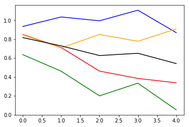

#### Summary 
* Here I was trying to see if I can create another test set to theoretically see if there is just some weird problem with the main test set I have been using. 
* But because the minority class is super low quantity, I actually couldn't create another one . That was the limiting detail
* So instead, I just tried evaluating on the full training set since I hadn't tried that before. 
* Up until now, I had just been plotting the "per Batch" loss. How does one know if the moving average loss is indeed a good approximation  ? 
* But it turned out that looking at the full training set , indeed the result was good looking

#### Some Initial Notes , on my dataset processing
So for some context, in [this notebook](https://github.com/namoopsoo/aviation-pilot-physiology-hmm/blob/master/notes/2019-12-21.md) I baked a dataset using this approach:

```python
out = mu.make_data(df1to2, crews={'training': [1],
                    'test': [2]},
              window_size=64,
               row_batch_size=10000,
         feature_cols=cols,
              save_dir=newdir)
```
- I had used that to build the `train.h5` and `test.h5` . But I looked at the outdir `data/2019-12-21T215926Z` and didn't find the balanced data.
- And this `mu.make_data` func creates smaller datasets of `10k` each , per the `row_batch_size=10000` param.
- That same notebook ^, I also discovered the [partial fit of MinMaxScaler](https://github.com/namoopsoo/aviation-pilot-physiology-hmm/blob/master/notes/2019-12-21.md#oh-wow-partial-fit) , 
- So I ended up writing `build_scaler_from_h5` in there , 
- But also nicely I saw the MinMaxScaler lets you use one scaler for multiple columns like [here](https://github.com/namoopsoo/aviation-pilot-physiology-hmm/blob/master/notes/2019-12-21.md#multi-scaler-instead) , `build_many_scalers_from_h5` . 

```python
# trainloc = 'data/2019-12-21T215926Z/train.h5'
output = build_many_scalers_from_h5(
                        trainloc, 
                        datasets=[x for x in h5_keys(trainloc) 
                               if '_X' in x]
)
```
- Ok but in that notebook ^ I did not seem to wrap up showing producing the data
- I looked at my [2019-12-22 notebook](https://github.com/namoopsoo/aviation-pilot-physiology-hmm/blob/master/notes/2019-12-22.md) , and I'm using 

```
outdir = 'history/2019-12-22T174803Z'
train_loc = f'{outdir}/train_balanced.h5'
test_loc = f'{outdir}/test_balanced.h5'
```
in there but I did not show how I produced this. I wonder if I did this on a shell and forgot to record it.
- Ah ok I had an [updated 2019-12-21 notebook](https://github.com/namoopsoo/aviation-pilot-physiology-hmm/blob/master/notes/2019-12-21--update.md) 

#### and..
```python
trainloc = 'data/2019-12-21T215926Z/train.h5'
apply_scalers(trainloc, 
                   datasets=[x for x in h5_keys(trainloc) 
                               if '_X' in x],
                   scaler=output[0],
                   outloc=f'{outdir}/train_scaled.h5'

                  )
mu.transfer(source_location=trainloc, 
            source_datasets=[x for x in h5_keys(trainloc) 
                               if '_Y' in x], 
            save_location=f'{outdir}/train_scaled.h5')
```

```python
%%time
# ok... make train set...
# max 7625
train_scaled_loc = f'{outdir}/train_scaled.h5'
train_balanced_loc = f'{outdir}/train_balanced.h5'

datasets = list(zip([x for x in mu.h5_keys(train_scaled_loc) 
                               if '_X' in x],
                    [x for x in mu.h5_keys(train_scaled_loc) 
                               if '_Y' in x]))

for k in [0, 1, 2, 3]:
    mu.transfer_data(
        source_location=train_scaled_loc,
        source_datasets=datasets,
        save_location=train_balanced_loc,
        label=k,
        howmany=7625)
    
```

#### next
- ok so to summarize, if I want to create another test set ...
- This one I want to create from the same _Crew=1_ as the train set was created, to test the theory that there is bad scaling possibly in the main test set I have. 

```python

# Let me put the new file into the same dir.
datadir = 'history/2019-12-22T174803Z'

# Load scalers
stored_scaler = joblib.load('history/2019-12-22T174803Z/scalers.joblib')
#print(vars(stored_scaler['scalers'])['n_samples_seen_'])


```


```python

from importlib import reload
import os
import pandas as pd
from io import StringIO
import itertools
import ipdb
import datetime
from collections import Counter

import h5py
import json
import tensorflow as tf
from tensorflow import keras

# Helper libraries
import numpy as np
import matplotlib.pyplot as plt
from tqdm import tqdm
import joblib
print(tf.__version__)

from keras.preprocessing import sequence
from keras.models import Sequential
from keras.layers import Dense, Embedding
from keras.layers import LSTM

from keras.callbacks import EarlyStopping
from tensorflow.compat.v1.losses import sparse_softmax_cross_entropy

from sklearn.preprocessing import StandardScaler
from sklearn.preprocessing import MinMaxScaler
import mytf.s3utils as msu
import mytf.utils as mu
import mytf.validation as mv
import mytf.plot as mp
```

    1.14.0


    Using TensorFlow backend.


```python
tf.enable_eager_execution()

```

### 2020-01-20


```python
# Original train scaled..
# Let me put the new file into the same dir.
datadir = 'history/2019-12-22T174803Z'

train_scaled_loc = f'{datadir}/train_scaled.h5'
train_balanced_loc = f'{datadir}/train_balanced.h5'

# Looking at it, I had truly quite a lot of mini `10k` large datasets in there,
# So there should be plenty to spare to make more data sets.
print(mu.h5_keys(train_scaled_loc))
```

    ['dataset_0_X_scaled', 'dataset_0_Y', 'dataset_10_X_scaled', 'dataset_10_Y', 'dataset_11_X_scaled', 'dataset_11_Y', 'dataset_12_X_scaled', 'dataset_12_Y', 'dataset_13_X_scaled', 'dataset_13_Y', 'dataset_14_X_scaled', 'dataset_14_Y', 'dataset_15_X_scaled', 'dataset_15_Y', 'dataset_16_X_scaled', 'dataset_16_Y', 'dataset_17_X_scaled', 'dataset_17_Y', 'dataset_18_X_scaled', 'dataset_18_Y', 'dataset_19_X_scaled', 'dataset_19_Y', 'dataset_1_X_scaled', 'dataset_1_Y', 'dataset_20_X_scaled', 'dataset_20_Y', 'dataset_21_X_scaled', 'dataset_21_Y', 'dataset_22_X_scaled', 'dataset_22_Y', 'dataset_23_X_scaled', 'dataset_23_Y', 'dataset_24_X_scaled', 'dataset_24_Y', 'dataset_25_X_scaled', 'dataset_25_Y', 'dataset_26_X_scaled', 'dataset_26_Y', 'dataset_27_X_scaled', 'dataset_27_Y', 'dataset_28_X_scaled', 'dataset_28_Y', 'dataset_29_X_scaled', 'dataset_29_Y', 'dataset_2_X_scaled', 'dataset_2_Y', 'dataset_30_X_scaled', 'dataset_30_Y', 'dataset_31_X_scaled', 'dataset_31_Y', 'dataset_32_X_scaled', 'dataset_32_Y', 'dataset_33_X_scaled', 'dataset_33_Y', 'dataset_34_X_scaled', 'dataset_34_Y', 'dataset_35_X_scaled', 'dataset_35_Y', 'dataset_36_X_scaled', 'dataset_36_Y', 'dataset_37_X_scaled', 'dataset_37_Y', 'dataset_38_X_scaled', 'dataset_38_Y', 'dataset_39_X_scaled', 'dataset_39_Y', 'dataset_3_X_scaled', 'dataset_3_Y', 'dataset_40_X_scaled', 'dataset_40_Y', 'dataset_41_X_scaled', 'dataset_41_Y', 'dataset_42_X_scaled', 'dataset_42_Y', 'dataset_43_X_scaled', 'dataset_43_Y', 'dataset_44_X_scaled', 'dataset_44_Y', 'dataset_4_X_scaled', 'dataset_4_Y', 'dataset_5_X_scaled', 'dataset_5_Y', 'dataset_6_X_scaled', 'dataset_6_Y', 'dataset_7_X_scaled', 'dataset_7_Y', 'dataset_8_X_scaled', 'dataset_8_Y', 'dataset_9_X_scaled', 'dataset_9_Y']


```python
mu.count_data_in_location(loc=train_scaled_loc,
                          datasets=[x for x in mu.h5_keys(train_scaled_loc) 
                               if '_Y' in x])
```

    
    0it [00:00, ?it/s]
    45it [00:00, 316.22it/s]


    {0: 234038, 1: 7625, 2: 179699, 3: 23090}


```python
loc = train_scaled_loc
datasets = [x for x in mu.h5_keys(train_scaled_loc) 
                               if '_Y' in x]
    
counters_index = {}
for i, name in tqdm(enumerate(datasets)):
    with h5py.File(loc, 'r+') as fd:
        Y = fd[name].__array__()
        labels = np.argmax(Y, axis=1)
        counters_index[i] = dict(Counter(labels))

total_counts = {k: [x.get(k) for x in counters_index.values() 
                    if x.get(k) is not None]
               for k in [0, 1, 2, 3]}
total_label_sums = {k: sum(total_counts[k]) for k in [0, 1, 2, 3]}
print(total_counts)
print(total_label_sums)

```


    HBox(children=(FloatProgress(value=1.0, bar_style='info', max=1.0), HTML(value='')))


    
    {0: [1650, 8580, 8096, 8136, 8655, 8655, 8655, 8655, 8655, 9328, 9936, 6099, 9936, 5377, 3997, 8655, 8248, 8655, 8655, 9936, 7058, 8655, 8481, 9872, 9936, 9071, 7013, 7588, 7805], 1: [3837, 865, 2923], 2: [8286, 9936, 4495, 9936, 9936, 9936, 9936, 9936, 9936, 9936, 9936, 9936, 5875, 9936, 9936, 9936, 9936, 9936, 9936, 2067], 3: [1356, 1840, 1800, 1281, 1281, 1281, 1281, 1281, 544, 1281, 1688, 1281, 1281, 2878, 1281, 1455]}
    {0: 234038, 1: 7625, 2: 179699, 3: 23090}


```python
from tqdm.auto import tqdm
```

#### Ah crap not enough data so evaluation on train instead 

```python
# Ah crap oops, so there was actually a very small amount of `label=1` in the entirety of this
# `train.h5` , so there is no more to take from . 
#
# Ok but instead, I can actually try running the typical validation I run,
# on that original train data since I had never done that before.
#
# Using yesterdays model dir...
workdir = 'history/2020-01-19T180030Z'

train_shuff_loc = f'{datadir}/train_scaled_balanced_shuffled.h5'

```


```python
## Double check access to model files...

epoch = 0
print(len(list(np.arange(0, 1100, 200))))
for batch in tqdm(list(np.arange(0, 1100, 200))):
    step = batch
    prefix = (f'{workdir}/epoch_{str(epoch).zfill(3)}'
                           f'_batch_{str(batch).zfill(5)}')

    modelname = f'{prefix}_model.h5'
    print(modelname, os.path.exists(modelname))
```

    6


    HBox(children=(FloatProgress(value=0.0, max=6.0), HTML(value='')))


    history/2020-01-19T180030Z/epoch_000_batch_00000_model.h5 True
    history/2020-01-19T180030Z/epoch_000_batch_00200_model.h5 True
    history/2020-01-19T180030Z/epoch_000_batch_00400_model.h5 True
    history/2020-01-19T180030Z/epoch_000_batch_00600_model.h5 True
    history/2020-01-19T180030Z/epoch_000_batch_00800_model.h5 True
    history/2020-01-19T180030Z/epoch_000_batch_01000_model.h5 True
    


```python
# So below, using `train_shuff_loc` instead of `test_loc` , since
# again, I'm measuring performance on full train set ...
print('starting validation of original full training set... ', mu.quickts())

batch_losses_vec = []

epoch = 0
for batch in tqdm(list(np.arange(200, 1100, 200))):
    step = batch
    prefix = (f'{workdir}/epoch_{str(epoch).zfill(3)}'
                           f'_batch_{str(batch).zfill(5)}')

    modelname = f'{prefix}_model.h5'
    print(modelname, os.path.exists(modelname))

    steploss = mv.perf_wrapper(modelname,
                               dataloc=train_shuff_loc,
                               eager=True,
                              batch_size=32)
    batch_losses_vec.append([float(x) for x in steploss])
    mu.to_json_local({'batch_losses_vec': batch_losses_vec,
                  'step': int(step)
              }, 
              f'{prefix}_validation_losses.json')
    
print('done validation', mu.quickts())
#####
lossesarr = np.array(batch_losses_vec)
meanlossesarr = np.mean(lossesarr, axis=1)

batch_losses_vec[:5]
#batch_losses_vec = []
#for step in np.arange(0, 1068, 10):
# [2.8359528, 0.45356295, 1.7049086, 4.099845]

plt.plot([x[0] for x in batch_losses_vec], color='blue', label='0')
plt.plot([x[1] for x in batch_losses_vec], color='green', label='1')
plt.plot([x[2] for x in batch_losses_vec], color='red', label='2')
plt.plot([x[3] for x in batch_losses_vec], color='orange', label='3')
plt.plot(meanlossesarr, color='black', label='mean')
plt.title(f'validation losses  (model {ts})')
plt.legend()     
        
```

    starting validation of original full training set...  2020-01-20T163214Z


    HBox(children=(FloatProgress(value=0.0, max=5.0), HTML(value='')))


    history/2020-01-19T180030Z/epoch_000_batch_00200_model.h5 True
    WARNING:tensorflow:No training configuration found in save file: the model was *not* compiled. Compile it manually.


    ---------------------------------------------------------------------------

    KeyError                                  Traceback (most recent call last)

    <ipython-input-24-581db3c6db0d> in <module>()
         17                                dataloc=train_shuff_loc,
         18                                eager=True,
    ---> 19                               batch_size=32)
         20     batch_losses_vec.append([float(x) for x in steploss])
         21     mu.to_json_local({'batch_losses_vec': batch_losses_vec,


    ~/SageMaker/aviation-pilot-physiology-hmm/mytf/validation.py in perf_wrapper(modelloc, dataloc, eager, batch_size)
         65                                   ['X_3', 'Ylabels_3']],
         66                     eager=eager,
    ---> 67                     batch_size=batch_size)
         68 


    ~/SageMaker/aviation-pilot-physiology-hmm/mytf/validation.py in get_performance_parts(model, dataloc, dataset_names, eager, batch_size)
         25     for Xdataset, Ydataset in dataset_names:
         26 
    ---> 27         X, Ylabels = mu.read_h5_two(dataloc, Xdataset, Ydataset)
         28         parts = mu.get_partitions(range(X.shape[0]), batch_size, keep_remainder=False)
         29         batchlosses = []


    ~/SageMaker/aviation-pilot-physiology-hmm/mytf/utils.py in read_h5_two(source_location, Xdataset, Ydataset)
        665 def read_h5_two(source_location, Xdataset, Ydataset):
        666     with h5py.File(source_location, 'r+') as fd:
    --> 667         X = fd[Xdataset].__array__()
        668         Y = fd[Ydataset].__array__()
        669         #Ylabels = np.argmax(Y, axis=1)


    h5py/_objects.pyx in h5py._objects.with_phil.wrapper()


    h5py/_objects.pyx in h5py._objects.with_phil.wrapper()


    ~/anaconda3/envs/tensorflow_p36/lib/python3.6/site-packages/h5py/_hl/group.py in __getitem__(self, name)
        175                 raise ValueError("Invalid HDF5 object reference")
        176         else:
    --> 177             oid = h5o.open(self.id, self._e(name), lapl=self._lapl)
        178 
        179         otype = h5i.get_type(oid)


    h5py/_objects.pyx in h5py._objects.with_phil.wrapper()


    h5py/_objects.pyx in h5py._objects.with_phil.wrapper()


    h5py/h5o.pyx in h5py.h5o.open()


    KeyError: "Unable to open object (object 'X_0' doesn't exist)"


```python
print(mu.h5_keys(train_shuff_loc))
print(mu.h5_keys(train_scaled_loc))
print(mu.h5_keys(train_balanced_loc))

```

    ['X', 'Ylabels']
    ['dataset_0_X_scaled', 'dataset_0_Y', 'dataset_10_X_scaled', 'dataset_10_Y', 'dataset_11_X_scaled', 'dataset_11_Y', 'dataset_12_X_scaled', 'dataset_12_Y', 'dataset_13_X_scaled', 'dataset_13_Y', 'dataset_14_X_scaled', 'dataset_14_Y', 'dataset_15_X_scaled', 'dataset_15_Y', 'dataset_16_X_scaled', 'dataset_16_Y', 'dataset_17_X_scaled', 'dataset_17_Y', 'dataset_18_X_scaled', 'dataset_18_Y', 'dataset_19_X_scaled', 'dataset_19_Y', 'dataset_1_X_scaled', 'dataset_1_Y', 'dataset_20_X_scaled', 'dataset_20_Y', 'dataset_21_X_scaled', 'dataset_21_Y', 'dataset_22_X_scaled', 'dataset_22_Y', 'dataset_23_X_scaled', 'dataset_23_Y', 'dataset_24_X_scaled', 'dataset_24_Y', 'dataset_25_X_scaled', 'dataset_25_Y', 'dataset_26_X_scaled', 'dataset_26_Y', 'dataset_27_X_scaled', 'dataset_27_Y', 'dataset_28_X_scaled', 'dataset_28_Y', 'dataset_29_X_scaled', 'dataset_29_Y', 'dataset_2_X_scaled', 'dataset_2_Y', 'dataset_30_X_scaled', 'dataset_30_Y', 'dataset_31_X_scaled', 'dataset_31_Y', 'dataset_32_X_scaled', 'dataset_32_Y', 'dataset_33_X_scaled', 'dataset_33_Y', 'dataset_34_X_scaled', 'dataset_34_Y', 'dataset_35_X_scaled', 'dataset_35_Y', 'dataset_36_X_scaled', 'dataset_36_Y', 'dataset_37_X_scaled', 'dataset_37_Y', 'dataset_38_X_scaled', 'dataset_38_Y', 'dataset_39_X_scaled', 'dataset_39_Y', 'dataset_3_X_scaled', 'dataset_3_Y', 'dataset_40_X_scaled', 'dataset_40_Y', 'dataset_41_X_scaled', 'dataset_41_Y', 'dataset_42_X_scaled', 'dataset_42_Y', 'dataset_43_X_scaled', 'dataset_43_Y', 'dataset_44_X_scaled', 'dataset_44_Y', 'dataset_4_X_scaled', 'dataset_4_Y', 'dataset_5_X_scaled', 'dataset_5_Y', 'dataset_6_X_scaled', 'dataset_6_Y', 'dataset_7_X_scaled', 'dataset_7_Y', 'dataset_8_X_scaled', 'dataset_8_Y', 'dataset_9_X_scaled', 'dataset_9_Y']
    ['X_0', 'X_1', 'X_2', 'X_3', 'Ylabels_0', 'Ylabels_1', 'Ylabels_2', 'Ylabels_3']


```python
# ok try one more time... with `train_balanced_loc` instead of the `train_shuff_loc`, 
# since `train_shuff_loc` doesnt have per label data so cant be used for the evaluation
print('starting validation of original full training set... ', mu.quickts())

batch_losses_vec = []

epoch = 0
for batch in tqdm(list(np.arange(200, 1100, 200))):
    step = batch
    prefix = (f'{workdir}/epoch_{str(epoch).zfill(3)}'
                           f'_batch_{str(batch).zfill(5)}')

    modelname = f'{prefix}_model.h5'
    print(modelname, os.path.exists(modelname))

    steploss = mv.perf_wrapper(modelname,
                               dataloc=train_balanced_loc,
                               eager=True,
                              batch_size=32)
    batch_losses_vec.append([float(x) for x in steploss])
    mu.to_json_local({'batch_losses_vec': batch_losses_vec,
                  'step': int(step)
              }, 
              f'{prefix}_validation_losses.json')
    
print('done validation', mu.quickts())
#####
lossesarr = np.array(batch_losses_vec)
meanlossesarr = np.mean(lossesarr, axis=1)

batch_losses_vec[:5]
#batch_losses_vec = []
#for step in np.arange(0, 1068, 10):
# [2.8359528, 0.45356295, 1.7049086, 4.099845]

plt.plot([x[0] for x in batch_losses_vec], color='blue', label='0')
plt.plot([x[1] for x in batch_losses_vec], color='green', label='1')
plt.plot([x[2] for x in batch_losses_vec], color='red', label='2')
plt.plot([x[3] for x in batch_losses_vec], color='orange', label='3')
plt.plot(meanlossesarr, color='black', label='mean')
plt.title(f'validation losses  (model {ts})')
plt.legend()     
        
```

    starting validation of original full training set...  2020-01-20T163436Z


    HBox(children=(FloatProgress(value=0.0, max=5.0), HTML(value='')))


    history/2020-01-19T180030Z/epoch_000_batch_00200_model.h5 True
    WARNING:tensorflow:No training configuration found in save file: the model was *not* compiled. Compile it manually.
    history/2020-01-19T180030Z/epoch_000_batch_00400_model.h5 True
    WARNING:tensorflow:No training configuration found in save file: the model was *not* compiled. Compile it manually.
    history/2020-01-19T180030Z/epoch_000_batch_00600_model.h5 True
    WARNING:tensorflow:No training configuration found in save file: the model was *not* compiled. Compile it manually.
    history/2020-01-19T180030Z/epoch_000_batch_00800_model.h5 True
    WARNING:tensorflow:No training configuration found in save file: the model was *not* compiled. Compile it manually.
    history/2020-01-19T180030Z/epoch_000_batch_01000_model.h5 True
    WARNING:tensorflow:No training configuration found in save file: the model was *not* compiled. Compile it manually.
    
    done validation 2020-01-20T164947Z


    ---------------------------------------------------------------------------

    NameError                                 Traceback (most recent call last)

    <ipython-input-26-81741b0e8faa> in <module>()
         39 plt.plot([x[3] for x in batch_losses_vec], color='orange', label='3')
         40 plt.plot(meanlossesarr, color='black', label='mean')
    ---> 41 plt.title(f'validation losses  (model {ts})')
         42 plt.legend()
         43 


    NameError: name 'ts' is not defined




