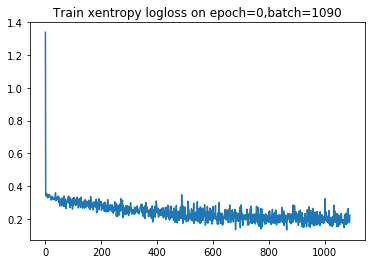
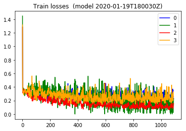
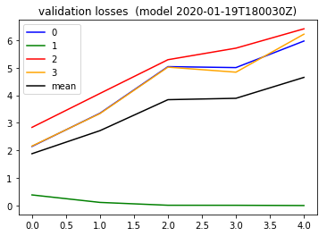

#### Summary
This time around, per commit `352e6fb` , I'm using a training loop, where the weights applied to the loss function calculation, dynamically is set based on which was the previous loss.

The training loss, now I'm plotting the loss of each label in the batch separately, [looks very different](#plotting-train-loss-now-and-per-label-losses-too) Way more stable looking than ever before . 


But the validation still follows the same pattern unfortunately where the `label=1` loss gets favored.


```python

from importlib import reload
import os
import pandas as pd
from io import StringIO
import itertools
import ipdb
import datetime
from collections import Counter

import h5py
import json
import tensorflow as tf
from tensorflow import keras

# Helper libraries
import numpy as np
import matplotlib.pyplot as plt
from tqdm import tqdm
import joblib
print(tf.__version__)

from keras.preprocessing import sequence
from keras.models import Sequential
from keras.layers import Dense, Embedding
from keras.layers import LSTM

from keras.callbacks import EarlyStopping
from tensorflow.compat.v1.losses import sparse_softmax_cross_entropy

from sklearn.preprocessing import StandardScaler
from sklearn.preprocessing import MinMaxScaler
import mytf.s3utils as msu
import mytf.utils as mu
import mytf.validation as mv
import mytf.plot as mp
```

    1.14.0


    Using TensorFlow backend.


```python
tf.enable_eager_execution()

```


```python
# Working dir... for new model
save_dir = 'history'
ts = mu.quickts(); print('starting,', ts)

workdir = f'{save_dir}/{ts}'
os.mkdir(workdir)
print(f'Made new workdir, {workdir}')
```

    starting, 2020-01-19T180030Z
    Made new workdir, history/2020-01-19T180030Z


```python
lstm_params = [{
    'units': 64,
    'dropout': 0.5,
    'recurrent_dropout': 0.5,
    'batch_input_shape': (None, 64, 8),
    'kernel_initializer': tf.initializers.glorot_normal() # GlorotNormal()
                           #tf.initializers.he_normal()
    },

]

optimizer_params = {
    'learning_rate': 0.001,  
    'beta1': 0.9, 
    'beta2': 0.999, 
    'epsilon': 1e-08
}

def bake_model(lstm_params):

    model = tf.keras.Sequential([
        tf.keras.layers.LSTM(**lstm_params[0]),
        # 4 because 'A', 'B', 'C', 'D'.
        tf.keras.layers.Dense(4)])
    return model
```


```python

BATCH_SIZE = 32
EPOCHS = 1
# Use datasets from 
# 2019-12-25.ipynb
# 
# train ... new datasets, ...
datadir = 'history/2019-12-22T174803Z'
# train_loc = f'{datadir}/train_balanced.h5'
test_loc = f'{datadir}/test_balanced.h5'
train_shuff_loc = f'{datadir}/train_scaled_balanced_shuffled.h5'
print(mu.h5_keys(train_shuff_loc))
print(mu.h5_keys(test_loc))

X, Ylabels = mu.read_h5_two(
                source_location=train_shuff_loc, 
                Xdataset=f'X',
                Ydataset=f'Ylabels')
size = X.shape[0]

# save base unfitted model.
model = bake_model(lstm_params)
mu.save_model(model=model, 
              loc=f'{workdir}/00000__unfitted_model.h5')


```

    ['X', 'Ylabels']
    ['X_0', 'X_1', 'X_2', 'X_3', 'Ylabels_0', 'Ylabels_1', 'Ylabels_2', 'Ylabels_3']


```python
reload(mu)
```


    <module 'mytf.utils' from '/home/ec2-user/SageMaker/aviation-pilot-physiology-hmm/mytf/utils.py'>


```python
%%time
modelloc = f'{workdir}/00000__unfitted_model.h5'
print(f'Start train with {modelloc}')
model = mu.load_model(modelloc)

class_weights = {0: 1., 1: 0., 2: 0., 3: 0.}
dataset_batches = mu.build_dataset_weighty_v3(
        {'x_train': X,
         'ylabels_train': Ylabels.astype('int64')},
        list(range(size)), 
        class_weights,
        batch_size=BATCH_SIZE)
    
ipdb.runcall(mu.do_train,
        model,
        dataset_batches,
        k=size,
        epochs=EPOCHS,
        optimizer_params=optimizer_params,
        saveloc=workdir)
```

    Start train with history/2020-01-19T180030Z/00000__unfitted_model.h5
    WARNING:tensorflow:No training configuration found in save file: the model was *not* compiled. Compile it manually.
    > /home/ec2-user/SageMaker/aviation-pilot-physiology-hmm/mytf/utils.py(254)do_train()
        253 def do_train(model, dataset_batches, k, epochs, optimizer_params, saveloc):
    --> 254     optimizer = AdamOptimizer(**optimizer_params)
        255 
    
    ipdb> unt
    > /home/ec2-user/SageMaker/aviation-pilot-physiology-hmm/mytf/utils.py(256)do_train()
        255 
    --> 256     loss_history = []
        257     label_losses_history = []
    
    ipdb> 
    > /home/ec2-user/SageMaker/aviation-pilot-physiology-hmm/mytf/utils.py(257)do_train()
        256     loss_history = []
    --> 257     label_losses_history = []
        258 
    
    ipdb> 
    > /home/ec2-user/SageMaker/aviation-pilot-physiology-hmm/mytf/utils.py(260)do_train()
        259     #weights = tf.constant(np.ones((32, 1)))
    --> 260     weights_dict = {0: 1., 1: 1., 2: 1., 3:1.}
        261     for epoch in range(epochs):
    
    ipdb> 
    > /home/ec2-user/SageMaker/aviation-pilot-physiology-hmm/mytf/utils.py(261)do_train()
        260     weights_dict = {0: 1., 1: 1., 2: 1., 3:1.}
    --> 261     for epoch in range(epochs):
        262 
    
    ipdb> 
    > /home/ec2-user/SageMaker/aviation-pilot-physiology-hmm/mytf/utils.py(263)do_train()
        262 
    --> 263         for (batch, (invec, labels, _)) in enumerate(tqdm(dataset_batches.take(k))):
        264             weights = np.array([weights_dict[labels[i].numpy()] for i in range(32)])
    
    ipdb> 


    
    
    
    
    
    
    
    0it [00:00, ?it/s]

    > /home/ec2-user/SageMaker/aviation-pilot-physiology-hmm/mytf/utils.py(264)do_train()
        263         for (batch, (invec, labels, _)) in enumerate(tqdm(dataset_batches.take(k))):
    --> 264             weights = np.array([weights_dict[labels[i].numpy()] for i in range(32)])
        265 
    
    ipdb> 
    > /home/ec2-user/SageMaker/aviation-pilot-physiology-hmm/mytf/utils.py(268)do_train()
        267             # NOTE: is this tape in the right place?
    --> 268             with tf.GradientTape() as tape:
        269                 logits = model(invec, training=True)
    
    ipdb> 
    > /home/ec2-user/SageMaker/aviation-pilot-physiology-hmm/mytf/utils.py(269)do_train()
        268             with tf.GradientTape() as tape:
    --> 269                 logits = model(invec, training=True)
        270                 loss_value = sparse_softmax_cross_entropy(labels, logits, weights=weights)
    
    ipdb> 
    > /home/ec2-user/SageMaker/aviation-pilot-physiology-hmm/mytf/utils.py(270)do_train()
        269                 logits = model(invec, training=True)
    --> 270                 loss_value = sparse_softmax_cross_entropy(labels, logits, weights=weights)
        271 
    
    ipdb> 
    > /home/ec2-user/SageMaker/aviation-pilot-physiology-hmm/mytf/utils.py(272)do_train()
        271 
    --> 272                 indices_vec = [ [ i for i in range(32) if labels[i].numpy() == label ] 
        273                         for label in [0, 1, 2, 3] ]
    
    ipdb> 
    > /home/ec2-user/SageMaker/aviation-pilot-physiology-hmm/mytf/utils.py(273)do_train()
        272                 indices_vec = [ [ i for i in range(32) if labels[i].numpy() == label ] 
    --> 273                         for label in [0, 1, 2, 3] ]
        274 
    
    ipdb> 
    > /home/ec2-user/SageMaker/aviation-pilot-physiology-hmm/mytf/utils.py(276)do_train()
        275                 losses = [
    --> 276                         sparse_softmax_cross_entropy(labels.numpy()[indices],
        277                             logits.numpy()[indices],
    
    ipdb> 
    > /home/ec2-user/SageMaker/aviation-pilot-physiology-hmm/mytf/utils.py(280)do_train()
        279 
    --> 280                         for indices in indices_vec
        281                         ]
    
    ipdb> 
    > /home/ec2-user/SageMaker/aviation-pilot-physiology-hmm/mytf/utils.py(282)do_train()
        281                         ]
    --> 282                 weights_dict = weights_for_losses(losses)
        283 
    
    ipdb> 
    > /home/ec2-user/SageMaker/aviation-pilot-physiology-hmm/mytf/utils.py(284)do_train()
        283 
    --> 284             loss_history.append(loss_value.numpy())
        285             label_losses_history.append([x.numpy() for x in losses])
    
    ipdb> unt
    > /home/ec2-user/SageMaker/aviation-pilot-physiology-hmm/mytf/utils.py(285)do_train()
        284             loss_history.append(loss_value.numpy())
    --> 285             label_losses_history.append([x.numpy() for x in losses])
        286             grads = tape.gradient(loss_value, model.trainable_variables)
    
    ipdb> 
    > /home/ec2-user/SageMaker/aviation-pilot-physiology-hmm/mytf/utils.py(286)do_train()
        285             label_losses_history.append([x.numpy() for x in losses])
    --> 286             grads = tape.gradient(loss_value, model.trainable_variables)
        287             optimizer.apply_gradients(zip(grads, model.trainable_variables),
    
    ipdb> unt
    > /home/ec2-user/SageMaker/aviation-pilot-physiology-hmm/mytf/utils.py(287)do_train()
        286             grads = tape.gradient(loss_value, model.trainable_variables)
    --> 287             optimizer.apply_gradients(zip(grads, model.trainable_variables),
        288                                     global_step=tf.compat.v1.train.get_or_create_global_step())
    
    ipdb> 
    > /home/ec2-user/SageMaker/aviation-pilot-physiology-hmm/mytf/utils.py(288)do_train()
        287             optimizer.apply_gradients(zip(grads, model.trainable_variables),
    --> 288                                     global_step=tf.compat.v1.train.get_or_create_global_step())
        289 
    
    ipdb> 
    > /home/ec2-user/SageMaker/aviation-pilot-physiology-hmm/mytf/utils.py(290)do_train()
        289 
    --> 290             prefix = (f'{saveloc}/epoch_{str(epoch).zfill(3)}'
        291                                f'_batch_{str(batch).zfill(5)}')
    
    ipdb> 
    > /home/ec2-user/SageMaker/aviation-pilot-physiology-hmm/mytf/utils.py(293)do_train()
        292 
    --> 293             if batch % 10 == 0:
        294                 save_model(model, (f'{prefix}_model.h5'))
    
    ipdb> 
    > /home/ec2-user/SageMaker/aviation-pilot-physiology-hmm/mytf/utils.py(294)do_train()
        293             if batch % 10 == 0:
    --> 294                 save_model(model, (f'{prefix}_model.h5'))
        295 
    
    ipdb> 
    > /home/ec2-user/SageMaker/aviation-pilot-physiology-hmm/mytf/utils.py(296)do_train()
        295 
    --> 296                 to_json_local(loss_history,
        297                             f'{prefix}_train_loss_history.json')
    
    ipdb> 
    > /home/ec2-user/SageMaker/aviation-pilot-physiology-hmm/mytf/utils.py(297)do_train()
        296                 to_json_local(loss_history,
    --> 297                             f'{prefix}_train_loss_history.json')
        298 
    
    ipdb> 
    > /home/ec2-user/SageMaker/aviation-pilot-physiology-hmm/mytf/utils.py(299)do_train()
        298 
    --> 299                 to_json_local(label_losses_history,
        300                             f'{prefix}_train_label_losses_history.json')
    
    ipdb> 
    > /home/ec2-user/SageMaker/aviation-pilot-physiology-hmm/mytf/utils.py(300)do_train()
        299                 to_json_local(label_losses_history,
    --> 300                             f'{prefix}_train_label_losses_history.json')
        301 
    
    ipdb> 


    
    
    
    
    

    --Return--
    None
    > /home/ec2-user/SageMaker/aviation-pilot-physiology-hmm/mytf/utils.py(264)do_train()
        263         for (batch, (invec, labels, _)) in enumerate(tqdm(dataset_batches.take(k))):
    --> 264             weights = np.array([weights_dict[labels[i].numpy()] for i in range(32)])
        265 
    
    ipdb> n


    ---------------------------------------------------------------------------

    InvalidArgumentError                      Traceback (most recent call last)

    <timed exec> in <module>()


    ~/anaconda3/envs/tensorflow_p36/lib/python3.6/site-packages/ipdb/__main__.py in runcall(*args, **kwargs)
         91 
         92 def runcall(*args, **kwargs):
    ---> 93     return _init_pdb().runcall(*args, **kwargs)
         94 
         95 


    ~/anaconda3/envs/tensorflow_p36/lib/python3.6/bdb.py in runcall(self, func, *args, **kwds)
        466         res = None
        467         try:
    --> 468             res = func(*args, **kwds)
        469         except BdbQuit:
        470             pass


    ~/SageMaker/aviation-pilot-physiology-hmm/mytf/utils.py in do_train(model, dataset_batches, k, epochs, optimizer_params, saveloc)
        262 
        263         for (batch, (invec, labels, _)) in enumerate(tqdm(dataset_batches.take(k))):
    --> 264             weights = np.array([weights_dict[labels[i].numpy()] for i in range(32)])
        265 
        266 


    ~/SageMaker/aviation-pilot-physiology-hmm/mytf/utils.py in <listcomp>(.0)
        262 
        263         for (batch, (invec, labels, _)) in enumerate(tqdm(dataset_batches.take(k))):
    --> 264             weights = np.array([weights_dict[labels[i].numpy()] for i in range(32)])
        265 
        266 


    ~/anaconda3/envs/tensorflow_p36/lib/python3.6/site-packages/tensorflow/python/ops/array_ops.py in _slice_helper(tensor, slice_spec, var)
        678         ellipsis_mask=ellipsis_mask,
        679         var=var,
    --> 680         name=name)
        681 
        682 


    ~/anaconda3/envs/tensorflow_p36/lib/python3.6/site-packages/tensorflow/python/ops/array_ops.py in strided_slice(input_, begin, end, strides, begin_mask, end_mask, ellipsis_mask, new_axis_mask, shrink_axis_mask, var, name)
        844       ellipsis_mask=ellipsis_mask,
        845       new_axis_mask=new_axis_mask,
    --> 846       shrink_axis_mask=shrink_axis_mask)
        847 
        848   parent_name = name


    ~/anaconda3/envs/tensorflow_p36/lib/python3.6/site-packages/tensorflow/python/ops/gen_array_ops.py in strided_slice(input, begin, end, strides, begin_mask, end_mask, ellipsis_mask, new_axis_mask, shrink_axis_mask, name)
       9965       else:
       9966         message = e.message
    -> 9967       _six.raise_from(_core._status_to_exception(e.code, message), None)
       9968   # Add nodes to the TensorFlow graph.
       9969   if begin_mask is None:


    ~/anaconda3/envs/tensorflow_p36/lib/python3.6/site-packages/six.py in raise_from(value, from_value)


    InvalidArgumentError: slice index 4 of dimension 0 out of bounds. [Op:StridedSlice] name: strided_slice/


Encountering this kind of error when slicing tensors in the new `do_train` adaptation.
```
InvalidArgumentError                      Traceback (most recent call last)
InvalidArgumentError: Index out of range using input dim 2; input has only 2 dims [Op:StridedSlice] name: strided_slice/

```
Basically got around this using the `tensor.numpy()` to be able to slice.

#### some useful debugging setup..
```python
weights_dict = {0: 1., 1: 1., 2: 1., 3:1.}
k = size
for (batch, (invec, labels, _)) in enumerate(tqdm(dataset_batches.take(k))):
    break
    

weights = np.array([weights_dict[labels[i].numpy()] for i in range(32)])

logits = model(invec, training=True)

indices_vec = [ [ i for i in range(32) if labels[i].numpy() == label ] 
               for label in [0, 1, 2, 3] ]

losses = [
sparse_softmax_cross_entropy(labels.numpy()[indices],
            logits.numpy()[indices],
            weights=weights[indices])

        for indices in indices_vec
        ]
weights_dict = mu.weights_for_losses(losses)
```

#### Plotting train loss now and per label losses too

```python

# Look at a most recent train loss plot
historydir = 'history'
with open(f'{workdir}/epoch_000_batch_01090_train_loss_history.json') as fd:
    losshistory = json.load(fd)
    
plt.plot(losshistory) 
plt.title('Train xentropy logloss on epoch=0,batch=1090')
plt.show()

# Also plot the individual label losses...
with open(f'{workdir}/epoch_000_batch_01090_train_label_losses_history.json') as fd:
    train_batch_losses_vec = json.load(fd)
    
plt.plot([x[0] for x in train_batch_losses_vec], color='blue', label='0')
plt.plot([x[1] for x in train_batch_losses_vec], color='green', label='1')
plt.plot([x[2] for x in train_batch_losses_vec], color='red', label='2')
plt.plot([x[3] for x in train_batch_losses_vec], color='orange', label='3')
#plt.plot(meanlossesarr, color='black', label='mean')
plt.title(f'Train losses  (model {ts})')
plt.legend()     
        
```





    <matplotlib.legend.Legend at 0x7f8ac2a49780>





```python
epoch = 0
print(len(list(np.arange(0, 1100, 200))))
for batch in tqdm(list(np.arange(0, 1100, 200))):
    step = batch
    prefix = (f'{workdir}/epoch_{str(epoch).zfill(3)}'
                           f'_batch_{str(batch).zfill(5)}')

    modelname = f'{prefix}_model.h5'
    print(modelname, os.path.exists(modelname))
```

    
    
    
    
    
    
    
    
    100%|██████████| 6/6 [00:00<00:00, 12912.17it/s]A

    6
    history/2020-01-19T180030Z/epoch_000_batch_00000_model.h5 True
    history/2020-01-19T180030Z/epoch_000_batch_00200_model.h5 True
    history/2020-01-19T180030Z/epoch_000_batch_00400_model.h5 True
    history/2020-01-19T180030Z/epoch_000_batch_00600_model.h5 True
    history/2020-01-19T180030Z/epoch_000_batch_00800_model.h5 True
    history/2020-01-19T180030Z/epoch_000_batch_01000_model.h5 True


    


#### also
* It may help to try the logit plotting technique [from here](https://github.com/namoopsoo/aviation-pilot-physiology-hmm/blob/master/notes/2020-01-10-confidence.md) also


```python
print('starting validation', mu.quickts())
batch_losses_vec = []

epoch = 0
for batch in tqdm(list(np.arange(0, 1100, 200))):
    step = batch
    prefix = (f'{workdir}/epoch_{str(epoch).zfill(3)}'
                           f'_batch_{str(batch).zfill(5)}')

    modelname = f'{prefix}_model.h5'
    print(modelname, os.path.exists(modelname))

    steploss = mv.perf_wrapper(modelname,
                               dataloc=test_loc,
                               eager=True,
                              batch_size=32)
    batch_losses_vec.append([float(x) for x in steploss])
    mu.to_json_local({'batch_losses_vec': batch_losses_vec,
                  'step': int(step)
              }, 
              f'{prefix}_validation_losses.json')
    
print('done validation', mu.quickts())
#####
lossesarr = np.array(batch_losses_vec)
meanlossesarr = np.mean(lossesarr, axis=1)

batch_losses_vec[:5]
#batch_losses_vec = []
#for step in np.arange(0, 1068, 10):
# [2.8359528, 0.45356295, 1.7049086, 4.099845]

plt.plot([x[0] for x in batch_losses_vec], color='blue', label='0')
plt.plot([x[1] for x in batch_losses_vec], color='green', label='1')
plt.plot([x[2] for x in batch_losses_vec], color='red', label='2')
plt.plot([x[3] for x in batch_losses_vec], color='orange', label='3')
plt.plot(meanlossesarr, color='black', label='mean')
plt.title(f'validation losses  (model {ts})')
plt.legend()     
        
```

    
    
    
    
    
    
    
    
      0%|          | 0/6 [00:00<?, ?it/s]

    starting validation 2020-01-19T194804Z
    history/2020-01-19T180030Z/epoch_000_batch_00000_model.h5 True
    WARNING:tensorflow:No training configuration found in save file: the model was *not* compiled. Compile it manually.


    ---------------------------------------------------------------------------

    AttributeError                            Traceback (most recent call last)

    <ipython-input-46-3c84b8fa6365> in <module>()
         16                               batch_size=32)
         17     batch_losses_vec.append([float(x) for x in steploss])
    ---> 18     mv.json_save({'batch_losses_vec': batch_losses_vec,
         19                   'step': int(step)
         20               }, 


    AttributeError: module 'mytf.validation' has no attribute 'json_save'


```python
    mu.to_json_local({'batch_losses_vec': batch_losses_vec,
                  'step': int(step)
              }, 
              f'{prefix}_validation_losses.json')
```


```python
print('saved first one to ',f'{prefix}_validation_losses.json' )
```

    saved first one to  history/2020-01-19T180030Z/epoch_000_batch_00000_validation_losses.json


```python
## ok since that other one crashed at bad file, restarting from iteration 2...

epoch = 0
print(len(list(np.arange(200, 1100, 200))))
for batch in tqdm(list(np.arange(200, 1100, 200))):
    step = batch
    prefix = (f'{workdir}/epoch_{str(epoch).zfill(3)}'
                           f'_batch_{str(batch).zfill(5)}')

    modelname = f'{prefix}_model.h5'
    print(modelname, os.path.exists(modelname))
```

    
    
    
    
    
    
    
    
    
    100%|██████████| 5/5 [00:00<00:00, 11055.10it/s]A

    5
    history/2020-01-19T180030Z/epoch_000_batch_00200_model.h5 True
    history/2020-01-19T180030Z/epoch_000_batch_00400_model.h5 True
    history/2020-01-19T180030Z/epoch_000_batch_00600_model.h5 True
    history/2020-01-19T180030Z/epoch_000_batch_00800_model.h5 True
    history/2020-01-19T180030Z/epoch_000_batch_01000_model.h5 True


    


```python
print('starting validation', mu.quickts())
batch_losses_vec = []

epoch = 0
for batch in tqdm(list(np.arange(200, 1100, 200))):
    step = batch
    prefix = (f'{workdir}/epoch_{str(epoch).zfill(3)}'
                           f'_batch_{str(batch).zfill(5)}')

    modelname = f'{prefix}_model.h5'
    print(modelname, os.path.exists(modelname))

    steploss = mv.perf_wrapper(modelname,
                               dataloc=test_loc,
                               eager=True,
                              batch_size=32)
    batch_losses_vec.append([float(x) for x in steploss])
    mu.to_json_local({'batch_losses_vec': batch_losses_vec,
                  'step': int(step)
              }, 
              f'{prefix}_validation_losses.json')
    
print('done validation', mu.quickts())
#####
lossesarr = np.array(batch_losses_vec)
meanlossesarr = np.mean(lossesarr, axis=1)

batch_losses_vec[:5]
#batch_losses_vec = []
#for step in np.arange(0, 1068, 10):
# [2.8359528, 0.45356295, 1.7049086, 4.099845]

plt.plot([x[0] for x in batch_losses_vec], color='blue', label='0')
plt.plot([x[1] for x in batch_losses_vec], color='green', label='1')
plt.plot([x[2] for x in batch_losses_vec], color='red', label='2')
plt.plot([x[3] for x in batch_losses_vec], color='orange', label='3')
plt.plot(meanlossesarr, color='black', label='mean')
plt.title(f'validation losses  (model {ts})')
plt.legend()     
        
```

    
    
    
    
    
    
    
    
    
      0%|          | 0/5 [00:00<?, ?it/s]

    starting validation 2020-01-19T195905Z
    history/2020-01-19T180030Z/epoch_000_batch_00200_model.h5 True
    WARNING:tensorflow:No training configuration found in save file: the model was *not* compiled. Compile it manually.


    
    
    
    
    
    
    
    
    
     20%|██        | 1/5 [05:49<23:19, 349.85s/it]

    history/2020-01-19T180030Z/epoch_000_batch_00400_model.h5 True
    WARNING:tensorflow:No training configuration found in save file: the model was *not* compiled. Compile it manually.


    
    
    
    
    
    
    
    
    
     40%|████      | 2/5 [11:38<17:28, 349.50s/it]

    history/2020-01-19T180030Z/epoch_000_batch_00600_model.h5 True
    WARNING:tensorflow:No training configuration found in save file: the model was *not* compiled. Compile it manually.


    
    
    
    
    
    
    
    
    
     60%|██████    | 3/5 [17:28<11:39, 349.65s/it]

    history/2020-01-19T180030Z/epoch_000_batch_00800_model.h5 True
    WARNING:tensorflow:No training configuration found in save file: the model was *not* compiled. Compile it manually.


    
    
    
    
    
    
    
    
    
     80%|████████  | 4/5 [23:16<05:49, 349.26s/it]

    history/2020-01-19T180030Z/epoch_000_batch_01000_model.h5 True
    WARNING:tensorflow:No training configuration found in save file: the model was *not* compiled. Compile it manually.


    
    
    
    
    
    
    
    
    
    100%|██████████| 5/5 [29:05<00:00, 349.19s/it]

    done validation 2020-01-19T202811Z


    


    <matplotlib.legend.Legend at 0x7f8ac0430518>





#### hmm
Dang so this new method , still doesnt solve the exploding logloss of labels 0,2,3 compared to good validation for label 1.
