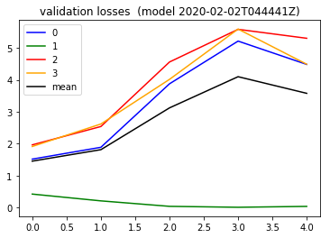

#### Summary
* Trying to apply scaling to train/test data that is aware of the extremes of the test data as well
* This is technically cheating but I knew that the test set I was using had more extremes and I was wondering if this is whether it was blowing up the model.
* Looking at the final plot actually I didn't notice this at first but somehow the validation loss actually took a small dip at the end. So this makes me wonder that since I started taking a different approach with the more _"dynamic loss weighing"_  , and more proper scaling, that next time I can perhaps go from 1 epoch to more epochs. Definitely Curious for next time.

#### toc
* [do](#do)
* [train](#and-train)
* [validation](#okay-try-validation)
* [final output plot](#final-chart)

#### do

```python
from importlib import reload
import os
import pandas as pd
from io import StringIO
import itertools
import ipdb
import datetime
from collections import Counter

import h5py
import json
import tensorflow as tf
from tensorflow import keras

# Helper libraries
import numpy as np
import matplotlib.pyplot as plt
from tqdm import tqdm
import joblib
print(tf.__version__)

from keras.preprocessing import sequence
from keras.models import Sequential
from keras.layers import Dense, Embedding
from keras.layers import LSTM

from keras.callbacks import EarlyStopping
from tensorflow.compat.v1.losses import sparse_softmax_cross_entropy

from sklearn.preprocessing import StandardScaler
from sklearn.preprocessing import MinMaxScaler
import mytf.s3utils as msu
import mytf.utils as mu
import mytf.validation as mv
import mytf.plot as mp
```

    1.14.0


    Using TensorFlow backend.


```python
tf.enable_eager_execution()

```


```python
mu.build_many_scalers_from_h5??
```


```python


# Use both train and test to make the scaler this time...
datadir = 'data/2019-12-21T215926Z'
trainloc = f'{datadir}/train.h5'
scaler, params_vec = mu.build_many_scalers_from_h5(
                        trainloc, 
                        datasets=[x for x in mu.h5_keys(trainloc) 
                               if '_X' in x]
)


```


    HBox(children=(FloatProgress(value=0.0, max=45.0), HTML(value='')))


    


And per [earlier](https://github.com/namoopsoo/aviation-pilot-physiology-hmm/blob/master/notes/2019-12-21--update.md#multi-scaler-instead)  , I can look at the min/max the scaler was building up...


```python
# Ok for the below, looks like this other scaling 
# is working the same way cool..
themin, themax = 0, 1

fig = plt.figure(figsize=(12, 14))
#for i in range(8):


for col in range(8):
    #params_vec = outvec[i][1]
    ax = fig.add_subplot(int('42' + str(col+1)))
    #ax.plot(params_vec)
    ax.set(title=(f'min/max for feature={col}'))

    ax.plot(
        [params_vec[i][themin][col] for i in range(len(params_vec))]
    
    )
    ax.plot(
    [params_vec[i][themax][col] for i in range(len(params_vec))]
    )
```


Ok, and now just keep building on the test set too...
Just to see what happens!!


```python
[scaler.data_min_, scaler.data_max_] #, params_vec
```


    [array([   644.765991, -18585.69922 ,    292.071991,  -1246.959961,
             -1271.77002 ,  -1206.800049,  -1261.699951,  -1220.51001 ]),
     array([820.900024,   0.      , 996.85199 , 939.40802 , 960.846008,
            839.700989, 836.572021, 900.937012])]


```python
testloc = f'{datadir}/test.h5'
scaler, params_vec_2 = mu.build_many_scalers_from_h5(
                        testloc, 
                        datasets=[x for x in mu.h5_keys(testloc) 
                               if '_X' in x],
                        scaler=scaler
)


```


    HBox(children=(FloatProgress(value=0.0, max=56.0), HTML(value='')))


    


```python
print('before:', [([   644.765991, -18585.69922 ,    292.071991,  -1246.959961,
         -1271.77002 ,  -1206.800049,  -1261.699951,  -1220.51001 ]),
 ([820.900024,   0.      , 996.85199 , 939.40802 , 960.846008,
        839.700989, 836.572021, 900.937012])])
print('now...', [scaler.data_min_, scaler.data_max_])

```

    before: [[644.765991, -18585.69922, 292.071991, -1246.959961, -1271.77002, -1206.800049, -1261.699951, -1220.51001], [820.900024, 0.0, 996.85199, 939.40802, 960.846008, 839.700989, 836.572021, 900.937012]]
    now... [array([   644.765991, -18585.69922 ,      0.      ,  -1246.959961,
            -1271.77002 ,  -1206.800049,  -1261.699951,  -1220.51001 ]), array([  828.35199 , 11498.299805,  1999.859985,   939.40802 ,
             960.846008,   839.700989,   836.572021,   900.937012])]


Hmm ok some has changed here.


```python
# Ok for the below, looks like this other scaling 
# is working the same way cool..
themin, themax = 0, 1

fig = plt.figure(figsize=(12, 14))
#for i in range(8):


for col in range(8):
    #params_vec = outvec[i][1]
    ax = fig.add_subplot(int('42' + str(col+1)))
    #ax.plot(params_vec)
    ax.set(title=(f'min/max for feature={col}'))

    ax.plot(
        [params_vec_2[i][themin][col] for i in range(len(params_vec_2))]
    
    )
    ax.plot(
    [params_vec_2[i][themax][col] for i in range(len(params_vec_2))]
    )
```


#### Okay now apply....


```python
# Working dir... for new model
save_dir = 'history'
ts = mu.quickts(); print('starting,', ts)

workdir = f'{save_dir}/{ts}'
os.mkdir(workdir)
print(f'Made new workdir, {workdir}')
```

    starting, 2020-02-02T044441Z
    Made new workdir, history/2020-02-02T044441Z


```python
trainloc, testloc
```


    ('data/2019-12-21T215926Z/train.h5', 'data/2019-12-21T215926Z/test.h5')


```python
reload(mu)
```


    <module 'mytf.utils' from '/home/ec2-user/SageMaker/aviation-pilot-physiology-hmm/mytf/utils.py'>


```python
# new work dir for new data..
mu.apply_scalers(trainloc, 
               datasets=[x for x in mu.h5_keys(trainloc) 
                           if '_X' in x],
               scaler=scaler,
               outloc=f'{workdir}/train_scaled.h5'

                  )
mu.transfer(source_location=trainloc, 
            source_datasets=[x for x in mu.h5_keys(trainloc) 
                               if '_Y' in x], 
            save_location=f'{workdir}/train_scaled.h5')
```


    HBox(children=(FloatProgress(value=0.0, max=45.0), HTML(value='')))


    


#### Ok now make that balanced data next


```python
# ok... make train set...
# max 7625
train_scaled_loc = f'{workdir}/train_scaled.h5'
train_balanced_loc = f'{workdir}/train_balanced.h5'
print(os.listdir(workdir))

datasets = list(zip([x for x in mu.h5_keys(train_scaled_loc) 
                               if '_X' in x],
                    [x for x in mu.h5_keys(train_scaled_loc) 
                               if '_Y' in x]))

for k in [0, 1, 2, 3]:
    mu.transfer_data(
        source_location=train_scaled_loc,
        source_datasets=datasets,
        save_location=train_balanced_loc,
        label=k,
        howmany=7625)
```

    ['train_scaled.h5']
    ok breaking
    Saved with  Counter({0: 10230})
    ok breaking
    Saved with  Counter({1: 7625})
    ok breaking
    Saved with  Counter({2: 8286})
    ok breaking
    Saved with  Counter({3: 8839})


#### Save the scaler for later.


```python

joblib.dump(scaler, f'{workdir}/scalers.joblib')
```


    ['history/2020-02-02T044441Z/scalers.joblib']


```python
os.listdir(workdir)
```


    ['train_balanced.h5', 'scalers.joblib', 'train_scaled.h5']


```python
mu.count_data_in_location(loc=train_scaled_loc,
                          datasets=[x for x in mu.h5_keys(train_scaled_loc) 
                               if '_Y' in x])
```


    HBox(children=(FloatProgress(value=1.0, bar_style='info', max=1.0), HTML(value='')))


    


    {0: 234038, 1: 7625, 2: 179699, 3: 23090}


```python
mu.h5_keys(train_balanced_loc) 
```


    ['X_0',
     'X_1',
     'X_2',
     'X_3',
     'Ylabels_0',
     'Ylabels_1',
     'Ylabels_2',
     'Ylabels_3']


```python
X, Y = mu.read_h5_two(train_balanced_loc, 'X_0', 'Ylabels_0')
```


```python
Y[:5]
```


    array([0., 0., 0., 0., 0.])


#### Shuffle also
As per [earlier](https://github.com/namoopsoo/aviation-pilot-physiology-hmm/blob/master/notes/2019-12-25.md#do-a-shuffle)


```python
# ok save the shuffled dataset too for repeatability...
# Grab and randomize since it's not huge...
vecs = [mu.read_h5_two(
                source_location=train_balanced_loc, 
                Xdataset=f'X_{i}',
                Ydataset=f'Ylabels_{i}')
                 for i in [0, 1, 2, 3]]

X_train = np.concatenate([x[0] for x in vecs])
Ylabels_train = np.concatenate([x[1] for x in vecs])

# Shuffle...
size = X_train.shape[0]
print(size)
indices = np.random.choice(range(size), size=size, replace=False)
X_train_shfl = X_train[indices]
Ylabels_train_shfl = Ylabels_train[indices].astype('int64')

X = X_train_shfl
Ylabels = Ylabels_train_shfl

# SAVE ...
mu.save_that(save_location=f'{workdir}/train_scaled_balanced_shuffled.h5', 
             name='X', X=X)
```

    34980


```python
mu.save_that(save_location=f'{workdir}/train_scaled_balanced_shuffled.h5', 
             name='Ylabels', X=Ylabels)
```


    ---------------------------------------------------------------------------

    RuntimeError                              Traceback (most recent call last)

    <ipython-input-69-34b67608753a> in <module>()
          1 mu.save_that(save_location=f'{workdir}/train_scaled_balanced_shuffled.h5', 
    ----> 2              name='Ylabels', X=Ylabels)
    

    ~/SageMaker/aviation-pilot-physiology-hmm/mytf/utils.py in save_that(save_location, name, X)
        730     # NOTE: Unhandled: RuntimeError: Unable to create link (name already exists)
        731     with h5py.File(save_location, "a") as f:
    --> 732         f.create_dataset(name, data=np.array(X, dtype=float))
        733 
        734 


    ~/anaconda3/envs/tensorflow_p36/lib/python3.6/site-packages/h5py/_hl/group.py in create_dataset(self, name, shape, dtype, data, **kwds)
        117             dset = dataset.Dataset(dsid)
        118             if name is not None:
    --> 119                 self[name] = dset
        120             return dset
        121 


    ~/anaconda3/envs/tensorflow_p36/lib/python3.6/site-packages/h5py/_hl/group.py in __setitem__(self, name, obj)
        285 
        286             if isinstance(obj, HLObject):
    --> 287                 h5o.link(obj.id, self.id, name, lcpl=lcpl, lapl=self._lapl)
        288 
        289             elif isinstance(obj, SoftLink):


    h5py/_objects.pyx in h5py._objects.with_phil.wrapper()


    h5py/_objects.pyx in h5py._objects.with_phil.wrapper()


    h5py/h5o.pyx in h5py.h5o.link()


    RuntimeError: Unable to create link (name already exists)


```python
print(mu.h5_keys('history/2019-12-22T174803Z/train_scaled_balanced_shuffled.h5'))

print(mu.h5_keys(
f'{workdir}/train_scaled_balanced_shuffled.h5'))

```

    ['X', 'Ylabels']
    ['X', 'Ylabels']


#### And train


```python
os.listdir(workdir)
```


    ['train_balanced.h5',
     'scalers.joblib',
     'train_scaled_balanced_shuffled.h5',
     'train_scaled.h5']


```python
lstm_params = [{
    'units': 64,
    'dropout': 0.5,
    'recurrent_dropout': 0.5,
    'batch_input_shape': (None, 64, 8),
    'kernel_initializer': tf.initializers.glorot_normal() # GlorotNormal()
                           #tf.initializers.he_normal()
    },

]

optimizer_params = {
    'learning_rate': 0.001,  
    'beta1': 0.9, 
    'beta2': 0.999, 
    'epsilon': 1e-08
}

def bake_model(lstm_params):

    model = tf.keras.Sequential([
        tf.keras.layers.LSTM(**lstm_params[0]),
        # 4 because 'A', 'B', 'C', 'D'.
        tf.keras.layers.Dense(4)])
    return model
```


```python
BATCH_SIZE = 32
EPOCHS = 1
#
print('workdir', workdir)
train_shuff_loc = f'{workdir}/train_scaled_balanced_shuffled.h5'


X, Ylabels = mu.read_h5_two(
                source_location=train_shuff_loc, 
                Xdataset=f'X',
                Ydataset=f'Ylabels')
size = X.shape[0]

# save base unfitted model.
model = bake_model(lstm_params)
mu.save_model(model=model, 
              loc=f'{workdir}/00000__unfitted_model.h5')
```

    workdir history/2020-02-02T044441Z


```python
%%time
modelloc = f'{workdir}/00000__unfitted_model.h5'
print(f'Start train with {modelloc}')
model = mu.load_model(modelloc)

class_weights = {0: 1., 1: 0., 2: 0., 3: 0.}
dataset_batches = mu.build_dataset_weighty_v3(
        {'x_train': X,
         'ylabels_train': Ylabels.astype('int64')},
        list(range(size)), 
        class_weights,
        batch_size=BATCH_SIZE)
    
ipdb.runcall(mu.do_train,
        model,
        dataset_batches,
        k=size,
        epochs=EPOCHS,
        optimizer_params=optimizer_params,
        saveloc=workdir)
```

    Start train with history/2020-02-02T044441Z/00000__unfitted_model.h5
    WARNING:tensorflow:No training configuration found in save file: the model was *not* compiled. Compile it manually.
    > /home/ec2-user/SageMaker/aviation-pilot-physiology-hmm/mytf/utils.py(254)do_train()
        253 def do_train(model, dataset_batches, k, epochs, optimizer_params, saveloc):
    --> 254     optimizer = AdamOptimizer(**optimizer_params)
        255 
    
    ipdb> c


    HBox(children=(FloatProgress(value=1.0, bar_style='info', max=1.0), HTML(value='')))


    WARNING:tensorflow:From /home/ec2-user/anaconda3/envs/tensorflow_p36/lib/python3.6/site-packages/tensorflow/python/ops/losses/losses_impl.py:121: add_dispatch_support.<locals>.wrapper (from tensorflow.python.ops.array_ops) is deprecated and will be removed in a future version.
    Instructions for updating:
    Use tf.where in 2.0, which has the same broadcast rule as np.where


    ---------------------------------------------------------------------------

    InvalidArgumentError                      Traceback (most recent call last)

    <timed exec> in <module>()


    ~/anaconda3/envs/tensorflow_p36/lib/python3.6/site-packages/ipdb/__main__.py in runcall(*args, **kwargs)
         91 
         92 def runcall(*args, **kwargs):
    ---> 93     return _init_pdb().runcall(*args, **kwargs)
         94 
         95 


    ~/anaconda3/envs/tensorflow_p36/lib/python3.6/bdb.py in runcall(self, func, *args, **kwds)
        466         res = None
        467         try:
    --> 468             res = func(*args, **kwds)
        469         except BdbQuit:
        470             pass


    ~/SageMaker/aviation-pilot-physiology-hmm/mytf/utils.py in do_train(model, dataset_batches, k, epochs, optimizer_params, saveloc)
        252 
        253 def do_train(model, dataset_batches, k, epochs, optimizer_params, saveloc):
    --> 254     optimizer = AdamOptimizer(**optimizer_params)
        255 
        256     loss_history = []


    ~/SageMaker/aviation-pilot-physiology-hmm/mytf/utils.py in <listcomp>(.0)
        262 
        263         for (batch, (invec, labels, _)) in enumerate(tqdm(dataset_batches.take(k))):
    --> 264             weights = np.array([weights_dict[labels[i].numpy()] for i in range(32)])
        265 
        266 


    ~/anaconda3/envs/tensorflow_p36/lib/python3.6/site-packages/tensorflow/python/ops/array_ops.py in _slice_helper(tensor, slice_spec, var)
        678         ellipsis_mask=ellipsis_mask,
        679         var=var,
    --> 680         name=name)
        681 
        682 


    ~/anaconda3/envs/tensorflow_p36/lib/python3.6/site-packages/tensorflow/python/ops/array_ops.py in strided_slice(input_, begin, end, strides, begin_mask, end_mask, ellipsis_mask, new_axis_mask, shrink_axis_mask, var, name)
        844       ellipsis_mask=ellipsis_mask,
        845       new_axis_mask=new_axis_mask,
    --> 846       shrink_axis_mask=shrink_axis_mask)
        847 
        848   parent_name = name


    ~/anaconda3/envs/tensorflow_p36/lib/python3.6/site-packages/tensorflow/python/ops/gen_array_ops.py in strided_slice(input, begin, end, strides, begin_mask, end_mask, ellipsis_mask, new_axis_mask, shrink_axis_mask, name)
       9965       else:
       9966         message = e.message
    -> 9967       _six.raise_from(_core._status_to_exception(e.code, message), None)
       9968   # Add nodes to the TensorFlow graph.
       9969   if begin_mask is None:


    ~/anaconda3/envs/tensorflow_p36/lib/python3.6/site-packages/six.py in raise_from(value, from_value)


    InvalidArgumentError: slice index 4 of dimension 0 out of bounds. [Op:StridedSlice] name: strided_slice/


oh yea and scale test set then


```python
testloc
```


    'data/2019-12-21T215926Z/test.h5'


```python
workdir
```


    'history/2020-02-02T044441Z'


Somehow i ran outof disk space..

```
(tensorflow_p36) [ec2-user@ip-172-16-173-88 aviation-pilot-physiology-hmm]$ df -h
Filesystem      Size  Used Avail Use% Mounted on
devtmpfs        1.9G   64K  1.9G   1% /dev
tmpfs           1.9G  8.0K  1.9G   1% /dev/shm
/dev/nvme0n1p1   99G   67G   32G  69% /
/dev/nvme1n1     20G   19G     0 100% /home/ec2-user/SageMaker

(tensorflow_p36) [ec2-user@ip-172-16-173-88 aviation-pilot-physiology-hmm]$ mkdir /home/ec2-user/blahspace/data
(tensorflow_p36) [ec2-user@ip-172-16-173-88 aviation-pilot-physiology-hmm]$ ls -lah /home/ec2-user/SageMaker/aviation-pilot-physiology-hmm/data
total 4.7G
drwxrwxr-x 3 ec2-user ec2-user 4.0K Dec 21 21:59 .
drwxrwxr-x 8 ec2-user ec2-user 4.0K Feb  2 06:43 ..
-rw-rw-r-- 1 ec2-user ec2-user 262M Dec 13 17:48 2019-12-07-test-balanced.h5
-rw-rw-r-- 1 ec2-user ec2-user 134M Dec 14 18:29 2019-12-07-train-balanced.h5
drwxrwxr-x 2 ec2-user ec2-user 4.0K Dec 21 22:00 2019-12-21T215926Z
-rw-rw-r-- 1 ec2-user ec2-user  94M Nov  2 13:30 crew_1-train.pkl
-rw-rw-r-- 1 ec2-user ec2-user 116M Nov  2 13:40 crew_2-train.pkl
-rw-rw-r-- 1 ec2-user ec2-user 116M Nov  3 23:03 crew_3-train.pkl
-rw-rw-r-- 1 ec2-user ec2-user 117M Nov  3 23:03 crew_4-train.pkl
-rw-rw-r-- 1 ec2-user ec2-user 2.2G Dec  7 23:56 test.h5
-rw-rw-r-- 1 ec2-user ec2-user 1.8G Dec  8 20:07 train.h5

(tensorflow_p36) [ec2-user@ip-172-16-173-88 aviation-pilot-physiology-hmm]$ mv data/*h5
2019-12-07-test-balanced.h5   test.h5
2019-12-07-train-balanced.h5  train.h5
(tensorflow_p36) [ec2-user@ip-172-16-173-88 aviation-pilot-physiology-hmm]$ mv data/*h5 /home/ec2-user/blahspace/data

(tensorflow_p36) [ec2-user@ip-172-16-173-88 aviation-pilot-physiology-hmm]$ df -h
Filesystem      Size  Used Avail Use% Mounted on
devtmpfs        1.9G   64K  1.9G   1% /dev
tmpfs           1.9G  8.0K  1.9G   1% /dev/shm
/dev/nvme0n1p1   99G   72G   28G  73% /
/dev/nvme1n1     20G   15G  4.3G  78% /home/ec2-user/SageMaker

```


```python
# new work dir for new data..
mu.apply_scalers(testloc, 
               datasets=[x for x in mu.h5_keys(testloc) 
                           if '_X' in x],
               scaler=scaler,
               outloc=f'{workdir}/test_scaled.h5'

                  )
mu.transfer(source_location=testloc, 
            source_datasets=[x for x in mu.h5_keys(testloc) 
                               if '_Y' in x], 
            save_location=f'{workdir}/test_scaled.h5')
```


    HBox(children=(FloatProgress(value=0.0, max=56.0), HTML(value='')))


    


And balance


```python
test_scaled_loc = f'{workdir}/test_scaled.h5'
mu.count_data_in_location(loc=test_scaled_loc,
                          datasets=[x for x in mu.h5_keys(test_scaled_loc) 
                               if '_Y' in x])
```


    HBox(children=(FloatProgress(value=1.0, bar_style='info', max=1.0), HTML(value='')))


    


    {0: 323937, 1: 15371, 2: 182734, 3: 26922}


```python
# ok... make train set...
# max 15371
test_scaled_loc = f'{workdir}/test_scaled.h5'
test_balanced_loc = f'{workdir}/test_balanced.h5'

datasets = list(zip([x for x in mu.h5_keys(test_scaled_loc) 
                               if '_X' in x],
                    [x for x in mu.h5_keys(test_scaled_loc) 
                               if '_Y' in x]))

for k in [0, 1, 2, 3]:
    mu.transfer_data(
        source_location=test_scaled_loc,
        source_datasets=datasets,
        save_location=test_balanced_loc,
        label=k,
        howmany=15371)
```

    ok breaking
    Saved with  Counter({0: 16263})
    ok breaking
    Saved with  Counter({1: 15371})
    ok breaking
    Saved with  Counter({2: 19755})
    ok breaking
    Saved with  Counter({3: 15542})


#### Okay try validation


```python
epoch = 0
print(len(list(np.arange(200, 1100, 200))))
for batch in tqdm(list(np.arange(200, 1100, 200))):
    step = batch
    prefix = (f'{workdir}/epoch_{str(epoch).zfill(3)}'
                           f'_batch_{str(batch).zfill(5)}')

    modelname = f'{prefix}_model.h5'
    print(modelname, os.path.exists(modelname))
```

    100%|██████████| 5/5 [00:00<00:00, 2903.44it/s]

    5
    history/2020-02-02T044441Z/epoch_000_batch_00200_model.h5 True
    history/2020-02-02T044441Z/epoch_000_batch_00400_model.h5 True
    history/2020-02-02T044441Z/epoch_000_batch_00600_model.h5 True
    history/2020-02-02T044441Z/epoch_000_batch_00800_model.h5 True
    history/2020-02-02T044441Z/epoch_000_batch_01000_model.h5 True


    


```python
print('starting validation', mu.quickts())
batch_losses_vec = []
test_loc = test_balanced_loc
print('test_loc', test_loc)
epoch = 0
for batch in tqdm(list(np.arange(200, 1100, 200))):
    step = batch
    prefix = (f'{workdir}/epoch_{str(epoch).zfill(3)}'
                           f'_batch_{str(batch).zfill(5)}')

    modelname = f'{prefix}_model.h5'
    print(modelname, os.path.exists(modelname))

    steploss = mv.perf_wrapper(modelname,
                               dataloc=test_loc,
                               eager=True,
                              batch_size=32)
    batch_losses_vec.append([float(x) for x in steploss])
    mu.to_json_local({'batch_losses_vec': batch_losses_vec,
                  'step': int(step)
              }, 
              f'{prefix}_validation_losses.json')
    
print('done validation', mu.quickts())
#####
lossesarr = np.array(batch_losses_vec)
meanlossesarr = np.mean(lossesarr, axis=1)

batch_losses_vec[:5]
#batch_losses_vec = []
#for step in np.arange(0, 1068, 10):

plt.plot([x[0] for x in batch_losses_vec], color='blue', label='0')
plt.plot([x[1] for x in batch_losses_vec], color='green', label='1')
plt.plot([x[2] for x in batch_losses_vec], color='red', label='2')
plt.plot([x[3] for x in batch_losses_vec], color='orange', label='3')
plt.plot(meanlossesarr, color='black', label='mean')
plt.title(f'validation losses  (model {ts})')
plt.legend()     
        
```

      0%|          | 0/5 [00:00<?, ?it/s]

    starting validation 2020-02-02T071946Z
    test_loc history/2020-02-02T044441Z/test_balanced.h5
    history/2020-02-02T044441Z/epoch_000_batch_00200_model.h5 True
    WARNING:tensorflow:No training configuration found in save file: the model was *not* compiled. Compile it manually.


     20%|██        | 1/5 [05:40<22:40, 340.06s/it]

    history/2020-02-02T044441Z/epoch_000_batch_00400_model.h5 True
    WARNING:tensorflow:No training configuration found in save file: the model was *not* compiled. Compile it manually.


     40%|████      | 2/5 [11:21<17:01, 340.55s/it]

    history/2020-02-02T044441Z/epoch_000_batch_00600_model.h5 True
    WARNING:tensorflow:No training configuration found in save file: the model was *not* compiled. Compile it manually.


     60%|██████    | 3/5 [16:59<11:19, 339.85s/it]

    history/2020-02-02T044441Z/epoch_000_batch_00800_model.h5 True
    WARNING:tensorflow:No training configuration found in save file: the model was *not* compiled. Compile it manually.


     80%|████████  | 4/5 [22:38<05:39, 339.31s/it]

    history/2020-02-02T044441Z/epoch_000_batch_01000_model.h5 True
    WARNING:tensorflow:No training configuration found in save file: the model was *not* compiled. Compile it manually.


    100%|██████████| 5/5 [28:14<00:00, 338.94s/it]

    done validation 2020-02-02T074800Z


    


    <matplotlib.legend.Legend at 0x7f3054851320>


#### Final chart



