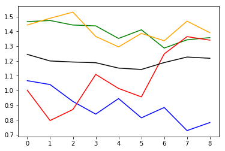

```python
from importlib import reload
import os
import pandas as pd
from io import StringIO
import itertools
import ipdb
import datetime
from collections import Counter

import h5py
import json
import tensorflow as tf
from tensorflow import keras

# Helper libraries
import numpy as np
import matplotlib.pyplot as plt
from tqdm import tqdm
import joblib
print(tf.__version__)

from keras.preprocessing import sequence
from keras.models import Sequential
from keras.layers import Dense, Embedding
from keras.layers import LSTM

from keras.callbacks import EarlyStopping
from tensorflow.compat.v1.losses import sparse_softmax_cross_entropy

from sklearn.preprocessing import StandardScaler
from sklearn.preprocessing import MinMaxScaler
import mytf.s3utils as msu
import mytf.utils as mu
import mytf.validation as mv
import mytf.plot as mp
```

    1.14.0


    Using TensorFlow backend.


```python
tf.enable_eager_execution()
```


```python
workdir = 'history/2020-02-03T000055Z'

os.listdir(workdir)
```


    ['test_balanced.h5',
     'balanced_one.h5',
     'train_balanced.h5',
     'train_scaled_balanced_shuffled.h5',
     'balanced_two.h5']


```python
lstm_params = [{
    'units': 64,
    'dropout': 0.5,
    'recurrent_dropout': 0.5,
    'batch_input_shape': (None, 64, 8),
    'kernel_initializer': tf.initializers.glorot_normal() # GlorotNormal()
                           #tf.initializers.he_normal()
    },]

optimizer_params = {
    'learning_rate': 0.001,  
    'beta1': 0.9, 
    'beta2': 0.999, 
    'epsilon': 1e-08
}

def bake_model(lstm_params):
    model = tf.keras.Sequential([
        tf.keras.layers.LSTM(**lstm_params[0]),
        # 4 because 'A', 'B', 'C', 'D'.
        tf.keras.layers.Dense(4)])
    return model
```


```python
BATCH_SIZE = 32
EPOCHS = 3
#
print('workdir', workdir)
train_shuff_loc = f'{workdir}/train_scaled_balanced_shuffled.h5'


X, Ylabels = mu.read_h5_two(
                source_location=train_shuff_loc, 
                Xdataset=f'X',
                Ydataset=f'Ylabels')
size = X.shape[0]

# save base unfitted model.
model = bake_model(lstm_params)
mu.save_model(model=model, 
              loc=f'{workdir}/00000__unfitted_model.h5')
```

    workdir history/2020-02-03T000055Z


```python
%%time
modelloc = f'{workdir}/00000__unfitted_model.h5'
print(f'Start train with {modelloc}')
model = mu.load_model(modelloc)

class_weights = {0: 1., 1: 0., 2: 0., 3: 0.}
dataset_batches = mu.build_dataset_weighty_v3(
        {'x_train': X,
         'ylabels_train': Ylabels.astype('int64')},
        list(range(size)), 
        class_weights,
        batch_size=BATCH_SIZE)
    
mu.do_train(
        model,
        dataset_batches,
        k=size,
        epochs=EPOCHS,
        optimizer_params=optimizer_params,
        saveloc=workdir)

```

    Start train with history/2020-02-03T000055Z/00000__unfitted_model.h5
    WARNING:tensorflow:No training configuration found in save file: the model was *not* compiled. Compile it manually.


    HBox(children=(FloatProgress(value=1.0, bar_style='info', max=1.0), HTML(value='')))


    WARNING:tensorflow:From /home/ec2-user/anaconda3/envs/tensorflow_p36/lib/python3.6/site-packages/tensorflow/python/ops/losses/losses_impl.py:121: add_dispatch_support.<locals>.wrapper (from tensorflow.python.ops.array_ops) is deprecated and will be removed in a future version.
    Instructions for updating:
    Use tf.where in 2.0, which has the same broadcast rule as np.where


    ---------------------------------------------------------------------------

    InvalidArgumentError                      Traceback (most recent call last)

    <timed exec> in <module>()


    ~/SageMaker/aviation-pilot-physiology-hmm/mytf/utils.py in do_train(model, dataset_batches, k, epochs, optimizer_params, saveloc)
        262 
        263         for (batch, (invec, labels, _)) in enumerate(tqdm(dataset_batches.take(k))):
    --> 264             weights = np.array([weights_dict[labels[i].numpy()] for i in range(32)])
        265 
        266 


    ~/SageMaker/aviation-pilot-physiology-hmm/mytf/utils.py in <listcomp>(.0)
        262 
        263         for (batch, (invec, labels, _)) in enumerate(tqdm(dataset_batches.take(k))):
    --> 264             weights = np.array([weights_dict[labels[i].numpy()] for i in range(32)])
        265 
        266 


    ~/anaconda3/envs/tensorflow_p36/lib/python3.6/site-packages/tensorflow/python/ops/array_ops.py in _slice_helper(tensor, slice_spec, var)
        678         ellipsis_mask=ellipsis_mask,
        679         var=var,
    --> 680         name=name)
        681 
        682 


    ~/anaconda3/envs/tensorflow_p36/lib/python3.6/site-packages/tensorflow/python/ops/array_ops.py in strided_slice(input_, begin, end, strides, begin_mask, end_mask, ellipsis_mask, new_axis_mask, shrink_axis_mask, var, name)
        844       ellipsis_mask=ellipsis_mask,
        845       new_axis_mask=new_axis_mask,
    --> 846       shrink_axis_mask=shrink_axis_mask)
        847 
        848   parent_name = name


    ~/anaconda3/envs/tensorflow_p36/lib/python3.6/site-packages/tensorflow/python/ops/gen_array_ops.py in strided_slice(input, begin, end, strides, begin_mask, end_mask, ellipsis_mask, new_axis_mask, shrink_axis_mask, name)
       9965       else:
       9966         message = e.message
    -> 9967       _six.raise_from(_core._status_to_exception(e.code, message), None)
       9968   # Add nodes to the TensorFlow graph.
       9969   if begin_mask is None:


    ~/anaconda3/envs/tensorflow_p36/lib/python3.6/site-packages/six.py in raise_from(value, from_value)


    InvalidArgumentError: slice index 10 of dimension 0 out of bounds. [Op:StridedSlice] name: strided_slice/


### Validation


```python
test_loc = f'{workdir}/test_balanced.h5'
print('test_loc', mu.h5_keys(test_loc))
```

    test_loc ['X_0', 'X_1', 'X_2', 'X_3', 'Ylabels_0', 'Ylabels_1', 'Ylabels_2', 'Ylabels_3']


```python
epoch = 0
modelnames_vec = []
for epoch in [0]:
    for batch in tqdm(list(np.arange(200, 1760, 200)) + [1760]):
        step = batch
        prefix = (f'{workdir}/epoch_{str(epoch).zfill(3)}'
                               f'_batch_{str(batch).zfill(5)}')

        modelname = f'{prefix}_model.h5'
        print(modelname, os.path.exists(modelname))
        modelnames_vec.append(prefix)
print('modelnames_vec', modelnames_vec)
```

    100%|██████████| 9/9 [00:00<00:00, 3650.40it/s]

    history/2020-02-03T000055Z/epoch_000_batch_00200_model.h5 True
    history/2020-02-03T000055Z/epoch_000_batch_00400_model.h5 True
    history/2020-02-03T000055Z/epoch_000_batch_00600_model.h5 True
    history/2020-02-03T000055Z/epoch_000_batch_00800_model.h5 True
    history/2020-02-03T000055Z/epoch_000_batch_01000_model.h5 True
    history/2020-02-03T000055Z/epoch_000_batch_01200_model.h5 True
    history/2020-02-03T000055Z/epoch_000_batch_01400_model.h5 True
    history/2020-02-03T000055Z/epoch_000_batch_01600_model.h5 True
    history/2020-02-03T000055Z/epoch_000_batch_01760_model.h5 True
    modelnames_vec ['history/2020-02-03T000055Z/epoch_000_batch_00200', 'history/2020-02-03T000055Z/epoch_000_batch_00400', 'history/2020-02-03T000055Z/epoch_000_batch_00600', 'history/2020-02-03T000055Z/epoch_000_batch_00800', 'history/2020-02-03T000055Z/epoch_000_batch_01000', 'history/2020-02-03T000055Z/epoch_000_batch_01200', 'history/2020-02-03T000055Z/epoch_000_batch_01400', 'history/2020-02-03T000055Z/epoch_000_batch_01600', 'history/2020-02-03T000055Z/epoch_000_batch_01760']


    


```python
print('starting validation', mu.quickts())
batch_losses_vec = []
print('test_loc', test_loc)
epoch = 0
for step, prefix in enumerate(tqdm(modelnames_vec)):
    # prefix = (f'{workdir}/epoch_{str(epoch).zfill(3)}'
    #                        f'_batch_{str(batch).zfill(5)}')

    modelname = f'{prefix}_model.h5'
    print(modelname, os.path.exists(modelname))

    steploss = mv.perf_wrapper(modelname,
                               dataloc=test_loc,
                               eager=True,
                              batch_size=32)
    batch_losses_vec.append([float(x) for x in steploss])
    mu.to_json_local({'batch_losses_vec': batch_losses_vec,
                  'step': int(step)
              }, 
              f'{prefix}_validation_losses.json')
    
print('done validation', mu.quickts())
#####
lossesarr = np.array(batch_losses_vec)
meanlossesarr = np.mean(lossesarr, axis=1)

batch_losses_vec[:5]
#batch_losses_vec = []

plt.plot([x[0] for x in batch_losses_vec], color='blue', label='0')
plt.plot([x[1] for x in batch_losses_vec], color='green', label='1')
plt.plot([x[2] for x in batch_losses_vec], color='red', label='2')
plt.plot([x[3] for x in batch_losses_vec], color='orange', label='3')
plt.plot(meanlossesarr, color='black', label='mean')
plt.title(f'validation losses  (model {ts})')
plt.legend()     
        
```

      0%|          | 0/9 [00:00<?, ?it/s]

    starting validation 2020-02-08T233119Z
    test_loc history/2020-02-03T000055Z/test_balanced.h5
    history/2020-02-03T000055Z/epoch_000_batch_00200_model.h5 True
    WARNING:tensorflow:No training configuration found in save file: the model was *not* compiled. Compile it manually.


     11%|█         | 1/9 [04:38<37:11, 278.91s/it]

    history/2020-02-03T000055Z/epoch_000_batch_00400_model.h5 True
    WARNING:tensorflow:No training configuration found in save file: the model was *not* compiled. Compile it manually.


     22%|██▏       | 2/9 [09:21<32:40, 280.03s/it]

    history/2020-02-03T000055Z/epoch_000_batch_00600_model.h5 True
    WARNING:tensorflow:No training configuration found in save file: the model was *not* compiled. Compile it manually.


     33%|███▎      | 3/9 [14:01<28:00, 280.02s/it]

    history/2020-02-03T000055Z/epoch_000_batch_00800_model.h5 True
    WARNING:tensorflow:No training configuration found in save file: the model was *not* compiled. Compile it manually.


     44%|████▍     | 4/9 [18:40<23:19, 279.81s/it]

    history/2020-02-03T000055Z/epoch_000_batch_01000_model.h5 True
    WARNING:tensorflow:No training configuration found in save file: the model was *not* compiled. Compile it manually.


     56%|█████▌    | 5/9 [23:21<18:40, 280.10s/it]

    history/2020-02-03T000055Z/epoch_000_batch_01200_model.h5 True
    WARNING:tensorflow:No training configuration found in save file: the model was *not* compiled. Compile it manually.


     67%|██████▋   | 6/9 [28:00<13:59, 279.70s/it]

    history/2020-02-03T000055Z/epoch_000_batch_01400_model.h5 True
    WARNING:tensorflow:No training configuration found in save file: the model was *not* compiled. Compile it manually.


     78%|███████▊  | 7/9 [32:52<09:26, 283.45s/it]

    history/2020-02-03T000055Z/epoch_000_batch_01600_model.h5 True
    WARNING:tensorflow:No training configuration found in save file: the model was *not* compiled. Compile it manually.


     89%|████████▉ | 8/9 [37:40<04:44, 284.74s/it]

    history/2020-02-03T000055Z/epoch_000_batch_01760_model.h5 True
    WARNING:tensorflow:No training configuration found in save file: the model was *not* compiled. Compile it manually.


    100%|██████████| 9/9 [42:22<00:00, 282.48s/it]

    done validation 2020-02-09T001342Z


    


    ---------------------------------------------------------------------------

    NameError                                 Traceback (most recent call last)

    <ipython-input-14-147ae3e842db> in <module>()
         33 plt.plot([x[3] for x in batch_losses_vec], color='orange', label='3')
         34 plt.plot(meanlossesarr, color='black', label='mean')
    ---> 35 plt.title(f'validation losses  (model {ts})')
         36 plt.legend()
         37 


    NameError: name 'ts' is not defined





```python
from tensorflow.compat.v1.train import AdamOptimizer

optimizer = AdamOptimizer(**optimizer_params)
```


```python
dataset_batches
```


    <DatasetV1Adapter shapes: ((?, 64, 8), (?,), (?,)), types: (tf.float32, tf.int64, tf.float64)>


```python
weights_dict = {0: 1., 1: 1., 2: 1., 3:1.}
# for epoch in epochs:
k = size
print('size', size)
with ipdb.launch_ipdb_on_exception():
    for (batch, (invec, labels, _)) in enumerate(tqdm(dataset_batches.take(k))):
        print('batch', batch)
        if labels.shape[0] < 32:
            print('continue')
            continue

        weights = np.array([weights_dict[labels[i].numpy()] for i in range(32)])

```

    1it [00:00,  6.79it/s]

    size 56586
    batch 0
    batch 1
    batch 2
    batch 3
    batch 4
    batch 5
    batch 6
    batch 7
    batch 8
    batch 9
    batch 10
    batch 11
    batch 12
    batch 13
    batch 14
    batch 15
    batch 16


    65it [00:00, 13.55it/s]

    batch 17
    batch 18
    batch 19
    batch 20
    batch 21
    batch 22
    batch 23
    batch 24
    batch 25
    batch 26
    batch 27
    batch 28
    batch 29
    batch 30
    batch 31
    batch 32
    batch 33
    batch 34
    batch 35
    batch 36
    batch 37
    batch 38
    batch 39
    batch 40
    batch 41
    batch 42
    batch 43
    batch 44
    batch 45
    batch 46
    batch 47
    batch 48
    batch 49
    batch 50
    batch 51
    batch 52
    batch 53
    batch 54
    batch 55
    batch 56
    batch 57
    batch 58
    batch 59
    batch 60
    batch 61
    batch 62
    batch 63
    batch 64
    batch 65
    batch 66
    batch 67
    batch 68
    batch 69
    batch 70
    batch 71
    batch 72
    batch 73
    batch 74
    batch 75
    batch 76
    batch 77
    batch 78
    batch 79
    batch 80
    batch 81


    117it [00:00, 26.16it/s]

    batch 82
    batch 83
    batch 84
    batch 85
    batch 86
    batch 87
    batch 88
    batch 89
    batch 90
    batch 91
    batch 92
    batch 93
    batch 94
    batch 95
    batch 96
    batch 97
    batch 98
    batch 99
    batch 100
    batch 101
    batch 102
    batch 103
    batch 104
    batch 105
    batch 106
    batch 107
    batch 108
    batch 109
    batch 110
    batch 111
    batch 112
    batch 113
    batch 114
    batch 115
    batch 116
    batch 117
    batch 118
    batch 119
    batch 120
    batch 121
    batch 122
    batch 123
    batch 124
    batch 125
    batch 126
    batch 127
    batch 128
    batch 129
    batch 130
    batch 131


    181it [00:00, 49.16it/s]

    batch 132
    batch 133
    batch 134
    batch 135
    batch 136
    batch 137
    batch 138
    batch 139
    batch 140
    batch 141
    batch 142
    batch 143
    batch 144
    batch 145
    batch 146
    batch 147
    batch 148
    batch 149
    batch 150
    batch 151
    batch 152
    batch 153
    batch 154
    batch 155
    batch 156
    batch 157
    batch 158
    batch 159
    batch 160
    batch 161
    batch 162
    batch 163
    batch 164
    batch 165
    batch 166
    batch 167
    batch 168
    batch 169
    batch 170
    batch 171
    batch 172
    batch 173
    batch 174
    batch 175
    batch 176
    batch 177
    batch 178
    batch 179
    batch 180
    batch 181
    batch 182
    batch 183
    batch 184
    batch 185
    batch 186
    batch 187
    batch 188
    batch 189
    batch 190
    batch 191
    batch 192
    batch 193
    batch 194
    batch 195
    batch 196
    batch 197


    247it [00:00, 86.74it/s]

    batch 198
    batch 199
    batch 200
    batch 201
    batch 202
    batch 203
    batch 204
    batch 205
    batch 206
    batch 207
    batch 208
    batch 209
    batch 210
    batch 211
    batch 212
    batch 213
    batch 214
    batch 215
    batch 216
    batch 217
    batch 218
    batch 219
    batch 220
    batch 221
    batch 222
    batch 223
    batch 224
    batch 225
    batch 226
    batch 227
    batch 228
    batch 229
    batch 230
    batch 231
    batch 232
    batch 233
    batch 234
    batch 235
    batch 236
    batch 237
    batch 238
    batch 239
    batch 240
    batch 241
    batch 242
    batch 243
    batch 244
    batch 245
    batch 246
    batch 247
    batch 248
    batch 249
    batch 250
    batch 251
    batch 252
    batch 253
    batch 254
    batch 255
    batch 256
    batch 257
    batch 258
    batch 259
    batch 260
    batch 261
    batch 262
    batch 263


    313it [00:01, 138.53it/s]

    batch 264
    batch 265
    batch 266
    batch 267
    batch 268
    batch 269
    batch 270
    batch 271
    batch 272
    batch 273
    batch 274
    batch 275
    batch 276
    batch 277
    batch 278
    batch 279
    batch 280
    batch 281
    batch 282
    batch 283
    batch 284
    batch 285
    batch 286
    batch 287
    batch 288
    batch 289
    batch 290
    batch 291
    batch 292
    batch 293
    batch 294
    batch 295
    batch 296
    batch 297
    batch 298
    batch 299
    batch 300
    batch 301
    batch 302
    batch 303
    batch 304
    batch 305
    batch 306
    batch 307
    batch 308
    batch 309
    batch 310
    batch 311
    batch 312
    batch 313
    batch 314
    batch 315
    batch 316
    batch 317
    batch 318
    batch 319
    batch 320
    batch 321
    batch 322
    batch 323
    batch 324
    batch 325
    batch 326
    batch 327
    batch 328


    378it [00:01, 194.81it/s]

    batch 329
    batch 330
    batch 331
    batch 332
    batch 333
    batch 334
    batch 335
    batch 336
    batch 337
    batch 338
    batch 339
    batch 340
    batch 341
    batch 342
    batch 343
    batch 344
    batch 345
    batch 346
    batch 347
    batch 348
    batch 349
    batch 350
    batch 351
    batch 352
    batch 353
    batch 354
    batch 355
    batch 356
    batch 357
    batch 358
    batch 359
    batch 360
    batch 361
    batch 362
    batch 363
    batch 364
    batch 365
    batch 366
    batch 367
    batch 368
    batch 369
    batch 370
    batch 371
    batch 372
    batch 373
    batch 374
    batch 375
    batch 376
    batch 377
    batch 378
    batch 379
    batch 380
    batch 381
    batch 382
    batch 383
    batch 384
    batch 385
    batch 386
    batch 387
    batch 388
    batch 389
    batch 390
    batch 391
    batch 392
    batch 393
    batch 394


    444it [00:01, 245.33it/s]

    batch 395
    batch 396
    batch 397
    batch 398
    batch 399
    batch 400
    batch 401
    batch 402
    batch 403
    batch 404
    batch 405
    batch 406
    batch 407
    batch 408
    batch 409
    batch 410
    batch 411
    batch 412
    batch 413
    batch 414
    batch 415
    batch 416
    batch 417
    batch 418
    batch 419
    batch 420
    batch 421
    batch 422
    batch 423
    batch 424
    batch 425
    batch 426
    batch 427
    batch 428
    batch 429
    batch 430
    batch 431
    batch 432
    batch 433
    batch 434
    batch 435
    batch 436
    batch 437
    batch 438
    batch 439
    batch 440
    batch 441
    batch 442
    batch 443
    batch 444
    batch 445
    batch 446
    batch 447
    batch 448
    batch 449
    batch 450
    batch 451
    batch 452
    batch 453
    batch 454
    batch 455
    batch 456
    batch 457
    batch 458
    batch 459
    batch 460
    batch 461


    511it [00:01, 281.49it/s]

    batch 462
    batch 463
    batch 464
    batch 465
    batch 466
    batch 467
    batch 468
    batch 469
    batch 470
    batch 471
    batch 472
    batch 473
    batch 474
    batch 475
    batch 476
    batch 477
    batch 478
    batch 479
    batch 480
    batch 481
    batch 482
    batch 483
    batch 484
    batch 485
    batch 486
    batch 487
    batch 488
    batch 489
    batch 490
    batch 491
    batch 492
    batch 493
    batch 494
    batch 495
    batch 496
    batch 497
    batch 498
    batch 499
    batch 500
    batch 501
    batch 502
    batch 503
    batch 504
    batch 505
    batch 506
    batch 507
    batch 508
    batch 509
    batch 510
    batch 511
    batch 512
    batch 513
    batch 514
    batch 515
    batch 516
    batch 517
    batch 518
    batch 519
    batch 520
    batch 521
    batch 522
    batch 523
    batch 524
    batch 525
    batch 526
    batch 527
    batch 528


    577it [00:01, 302.51it/s]

    batch 529
    batch 530
    batch 531
    batch 532
    batch 533
    batch 534
    batch 535
    batch 536
    batch 537
    batch 538
    batch 539
    batch 540
    batch 541
    batch 542
    batch 543
    batch 544
    batch 545
    batch 546
    batch 547
    batch 548
    batch 549
    batch 550
    batch 551
    batch 552
    batch 553
    batch 554
    batch 555
    batch 556
    batch 557
    batch 558
    batch 559
    batch 560
    batch 561
    batch 562
    batch 563
    batch 564
    batch 565
    batch 566
    batch 567
    batch 568
    batch 569
    batch 570
    batch 571
    batch 572
    batch 573
    batch 574
    batch 575
    batch 576
    batch 577
    batch 578
    batch 579
    batch 580
    batch 581
    batch 582
    batch 583
    batch 584
    batch 585
    batch 586
    batch 587
    batch 588
    batch 589
    batch 590
    batch 591
    batch 592
    batch 593
    batch 594


    644it [00:02, 314.05it/s]

    batch 595
    batch 596
    batch 597
    batch 598
    batch 599
    batch 600
    batch 601
    batch 602
    batch 603
    batch 604
    batch 605
    batch 606
    batch 607
    batch 608
    batch 609
    batch 610
    batch 611
    batch 612
    batch 613
    batch 614
    batch 615
    batch 616
    batch 617
    batch 618
    batch 619
    batch 620
    batch 621
    batch 622
    batch 623
    batch 624
    batch 625
    batch 626
    batch 627
    batch 628
    batch 629
    batch 630
    batch 631
    batch 632
    batch 633
    batch 634
    batch 635
    batch 636
    batch 637
    batch 638
    batch 639
    batch 640
    batch 641
    batch 642
    batch 643
    batch 644
    batch 645
    batch 646
    batch 647
    batch 648
    batch 649
    batch 650
    batch 651
    batch 652
    batch 653
    batch 654
    batch 655
    batch 656
    batch 657
    batch 658
    batch 659
    batch 660
    batch 661


    710it [00:02, 320.11it/s]

    batch 662
    batch 663
    batch 664
    batch 665
    batch 666
    batch 667
    batch 668
    batch 669
    batch 670
    batch 671
    batch 672
    batch 673
    batch 674
    batch 675
    batch 676
    batch 677
    batch 678
    batch 679
    batch 680
    batch 681
    batch 682
    batch 683
    batch 684
    batch 685
    batch 686
    batch 687
    batch 688
    batch 689
    batch 690
    batch 691
    batch 692
    batch 693
    batch 694
    batch 695
    batch 696
    batch 697
    batch 698
    batch 699
    batch 700
    batch 701
    batch 702
    batch 703
    batch 704
    batch 705
    batch 706
    batch 707
    batch 708
    batch 709
    batch 710
    batch 711
    batch 712
    batch 713
    batch 714
    batch 715
    batch 716
    batch 717
    batch 718
    batch 719
    batch 720
    batch 721
    batch 722
    batch 723
    batch 724
    batch 725
    batch 726
    batch 727


    776it [00:02, 323.19it/s]

    batch 728
    batch 729
    batch 730
    batch 731
    batch 732
    batch 733
    batch 734
    batch 735
    batch 736
    batch 737
    batch 738
    batch 739
    batch 740
    batch 741
    batch 742
    batch 743
    batch 744
    batch 745
    batch 746
    batch 747
    batch 748
    batch 749
    batch 750
    batch 751
    batch 752
    batch 753
    batch 754
    batch 755
    batch 756
    batch 757
    batch 758
    batch 759
    batch 760
    batch 761
    batch 762
    batch 763
    batch 764
    batch 765
    batch 766
    batch 767
    batch 768
    batch 769
    batch 770
    batch 771
    batch 772
    batch 773
    batch 774
    batch 775
    batch 776
    batch 777
    batch 778
    batch 779
    batch 780
    batch 781
    batch 782
    batch 783
    batch 784
    batch 785
    batch 786
    batch 787
    batch 788
    batch 789
    batch 790
    batch 791
    batch 792
    batch 793
    batch 794


    842it [00:02, 325.59it/s]

    batch 795
    batch 796
    batch 797
    batch 798
    batch 799
    batch 800
    batch 801
    batch 802
    batch 803
    batch 804
    batch 805
    batch 806
    batch 807
    batch 808
    batch 809
    batch 810
    batch 811
    batch 812
    batch 813
    batch 814
    batch 815
    batch 816
    batch 817
    batch 818
    batch 819
    batch 820
    batch 821
    batch 822
    batch 823
    batch 824
    batch 825
    batch 826
    batch 827
    batch 828
    batch 829
    batch 830
    batch 831
    batch 832
    batch 833
    batch 834
    batch 835
    batch 836
    batch 837
    batch 838
    batch 839
    batch 840
    batch 841
    batch 842
    batch 843
    batch 844
    batch 845
    batch 846
    batch 847
    batch 848
    batch 849
    batch 850
    batch 851
    batch 852
    batch 853
    batch 854
    batch 855
    batch 856
    batch 857
    batch 858
    batch 859
    batch 860
    batch 861


    908it [00:02, 325.94it/s]

    batch 862
    batch 863
    batch 864
    batch 865
    batch 866
    batch 867
    batch 868
    batch 869
    batch 870
    batch 871
    batch 872
    batch 873
    batch 874
    batch 875
    batch 876
    batch 877
    batch 878
    batch 879
    batch 880
    batch 881
    batch 882
    batch 883
    batch 884
    batch 885
    batch 886
    batch 887
    batch 888
    batch 889
    batch 890
    batch 891
    batch 892
    batch 893
    batch 894
    batch 895
    batch 896
    batch 897
    batch 898
    batch 899
    batch 900
    batch 901
    batch 902
    batch 903
    batch 904
    batch 905
    batch 906
    batch 907
    batch 908
    batch 909
    batch 910
    batch 911
    batch 912
    batch 913
    batch 914
    batch 915
    batch 916
    batch 917
    batch 918
    batch 919
    batch 920
    batch 921
    batch 922
    batch 923
    batch 924
    batch 925
    batch 926
    batch 927


    974it [00:03, 324.62it/s]

    batch 928
    batch 929
    batch 930
    batch 931
    batch 932
    batch 933
    batch 934
    batch 935
    batch 936
    batch 937
    batch 938
    batch 939
    batch 940
    batch 941
    batch 942
    batch 943
    batch 944
    batch 945
    batch 946
    batch 947
    batch 948
    batch 949
    batch 950
    batch 951
    batch 952
    batch 953
    batch 954
    batch 955
    batch 956
    batch 957
    batch 958
    batch 959
    batch 960
    batch 961
    batch 962
    batch 963
    batch 964
    batch 965
    batch 966
    batch 967
    batch 968
    batch 969
    batch 970
    batch 971
    batch 972
    batch 973
    batch 974
    batch 975
    batch 976
    batch 977
    batch 978
    batch 979
    batch 980
    batch 981
    batch 982
    batch 983
    batch 984
    batch 985
    batch 986
    batch 987
    batch 988
    batch 989
    batch 990
    batch 991
    batch 992
    batch 993


    1041it [00:03, 325.89it/s]

    batch 994
    batch 995
    batch 996
    batch 997
    batch 998
    batch 999
    batch 1000
    batch 1001
    batch 1002
    batch 1003
    batch 1004
    batch 1005
    batch 1006
    batch 1007
    batch 1008
    batch 1009
    batch 1010
    batch 1011
    batch 1012
    batch 1013
    batch 1014
    batch 1015
    batch 1016
    batch 1017
    batch 1018
    batch 1019
    batch 1020
    batch 1021
    batch 1022
    batch 1023
    batch 1024
    batch 1025
    batch 1026
    batch 1027
    batch 1028
    batch 1029
    batch 1030
    batch 1031
    batch 1032
    batch 1033
    batch 1034
    batch 1035
    batch 1036
    batch 1037
    batch 1038
    batch 1039
    batch 1040
    batch 1041
    batch 1042
    batch 1043
    batch 1044
    batch 1045
    batch 1046
    batch 1047
    batch 1048
    batch 1049
    batch 1050
    batch 1051
    batch 1052
    batch 1053
    batch 1054
    batch 1055
    batch 1056
    batch 1057
    batch 1058
    batch 1059


    1107it [00:03, 325.37it/s]

    batch 1060
    batch 1061
    batch 1062
    batch 1063
    batch 1064
    batch 1065
    batch 1066
    batch 1067
    batch 1068
    batch 1069
    batch 1070
    batch 1071
    batch 1072
    batch 1073
    batch 1074
    batch 1075
    batch 1076
    batch 1077
    batch 1078
    batch 1079
    batch 1080
    batch 1081
    batch 1082
    batch 1083
    batch 1084
    batch 1085
    batch 1086
    batch 1087
    batch 1088
    batch 1089
    batch 1090
    batch 1091
    batch 1092
    batch 1093
    batch 1094
    batch 1095
    batch 1096
    batch 1097
    batch 1098
    batch 1099
    batch 1100
    batch 1101
    batch 1102
    batch 1103
    batch 1104
    batch 1105
    batch 1106
    batch 1107
    batch 1108
    batch 1109
    batch 1110
    batch 1111
    batch 1112
    batch 1113
    batch 1114
    batch 1115
    batch 1116
    batch 1117
    batch 1118
    batch 1119
    batch 1120
    batch 1121
    batch 1122
    batch 1123
    batch 1124
    batch 1125
    batch 1126


    1174it [00:03, 326.68it/s]

    batch 1127
    batch 1128
    batch 1129
    batch 1130
    batch 1131
    batch 1132
    batch 1133
    batch 1134
    batch 1135
    batch 1136
    batch 1137
    batch 1138
    batch 1139
    batch 1140
    batch 1141
    batch 1142
    batch 1143
    batch 1144
    batch 1145
    batch 1146
    batch 1147
    batch 1148
    batch 1149
    batch 1150
    batch 1151
    batch 1152
    batch 1153
    batch 1154
    batch 1155
    batch 1156
    batch 1157
    batch 1158
    batch 1159
    batch 1160
    batch 1161
    batch 1162
    batch 1163
    batch 1164
    batch 1165
    batch 1166
    batch 1167
    batch 1168
    batch 1169
    batch 1170
    batch 1171
    batch 1172
    batch 1173
    batch 1174
    batch 1175
    batch 1176
    batch 1177
    batch 1178
    batch 1179
    batch 1180
    batch 1181
    batch 1182
    batch 1183
    batch 1184
    batch 1185
    batch 1186
    batch 1187
    batch 1188
    batch 1189
    batch 1190
    batch 1191
    batch 1192
    batch 1193


    1240it [00:04, 326.06it/s]

    batch 1194
    batch 1195
    batch 1196
    batch 1197
    batch 1198
    batch 1199
    batch 1200
    batch 1201
    batch 1202
    batch 1203
    batch 1204
    batch 1205
    batch 1206
    batch 1207
    batch 1208
    batch 1209
    batch 1210
    batch 1211
    batch 1212
    batch 1213
    batch 1214
    batch 1215
    batch 1216
    batch 1217
    batch 1218
    batch 1219
    batch 1220
    batch 1221
    batch 1222
    batch 1223
    batch 1224
    batch 1225
    batch 1226
    batch 1227
    batch 1228
    batch 1229
    batch 1230
    batch 1231
    batch 1232
    batch 1233
    batch 1234
    batch 1235
    batch 1236
    batch 1237
    batch 1238
    batch 1239
    batch 1240
    batch 1241
    batch 1242
    batch 1243
    batch 1244
    batch 1245
    batch 1246
    batch 1247
    batch 1248
    batch 1249
    batch 1250
    batch 1251
    batch 1252
    batch 1253
    batch 1254
    batch 1255
    batch 1256
    batch 1257
    batch 1258
    batch 1259


    1306it [00:04, 324.45it/s]

    batch 1260
    batch 1261
    batch 1262
    batch 1263
    batch 1264
    batch 1265
    batch 1266
    batch 1267
    batch 1268
    batch 1269
    batch 1270
    batch 1271
    batch 1272
    batch 1273
    batch 1274
    batch 1275
    batch 1276
    batch 1277
    batch 1278
    batch 1279
    batch 1280
    batch 1281
    batch 1282
    batch 1283
    batch 1284
    batch 1285
    batch 1286
    batch 1287
    batch 1288
    batch 1289
    batch 1290
    batch 1291
    batch 1292
    batch 1293
    batch 1294
    batch 1295
    batch 1296
    batch 1297
    batch 1298
    batch 1299
    batch 1300
    batch 1301
    batch 1302
    batch 1303
    batch 1304
    batch 1305
    batch 1306
    batch 1307
    batch 1308
    batch 1309
    batch 1310
    batch 1311
    batch 1312
    batch 1313
    batch 1314
    batch 1315
    batch 1316
    batch 1317
    batch 1318
    batch 1319
    batch 1320
    batch 1321
    batch 1322
    batch 1323
    batch 1324
    batch 1325


    1372it [00:04, 324.97it/s]

    batch 1326
    batch 1327
    batch 1328
    batch 1329
    batch 1330
    batch 1331
    batch 1332
    batch 1333
    batch 1334
    batch 1335
    batch 1336
    batch 1337
    batch 1338
    batch 1339
    batch 1340
    batch 1341
    batch 1342
    batch 1343
    batch 1344
    batch 1345
    batch 1346
    batch 1347
    batch 1348
    batch 1349
    batch 1350
    batch 1351
    batch 1352
    batch 1353
    batch 1354
    batch 1355
    batch 1356
    batch 1357
    batch 1358
    batch 1359
    batch 1360
    batch 1361
    batch 1362
    batch 1363
    batch 1364
    batch 1365
    batch 1366
    batch 1367
    batch 1368
    batch 1369
    batch 1370
    batch 1371
    batch 1372
    batch 1373
    batch 1374
    batch 1375
    batch 1376
    batch 1377
    batch 1378
    batch 1379
    batch 1380
    batch 1381
    batch 1382
    batch 1383
    batch 1384
    batch 1385
    batch 1386
    batch 1387
    batch 1388
    batch 1389
    batch 1390
    batch 1391


    1438it [00:04, 325.62it/s]

    batch 1392
    batch 1393
    batch 1394
    batch 1395
    batch 1396
    batch 1397
    batch 1398
    batch 1399
    batch 1400
    batch 1401
    batch 1402
    batch 1403
    batch 1404
    batch 1405
    batch 1406
    batch 1407
    batch 1408
    batch 1409
    batch 1410
    batch 1411
    batch 1412
    batch 1413
    batch 1414
    batch 1415
    batch 1416
    batch 1417
    batch 1418
    batch 1419
    batch 1420
    batch 1421
    batch 1422
    batch 1423
    batch 1424
    batch 1425
    batch 1426
    batch 1427
    batch 1428
    batch 1429
    batch 1430
    batch 1431
    batch 1432
    batch 1433
    batch 1434
    batch 1435
    batch 1436
    batch 1437
    batch 1438
    batch 1439
    batch 1440
    batch 1441
    batch 1442
    batch 1443
    batch 1444
    batch 1445
    batch 1446
    batch 1447
    batch 1448
    batch 1449
    batch 1450
    batch 1451
    batch 1452
    batch 1453
    batch 1454
    batch 1455
    batch 1456
    batch 1457
    batch 1458


    1504it [00:04, 326.16it/s]

    batch 1459
    batch 1460
    batch 1461
    batch 1462
    batch 1463
    batch 1464
    batch 1465
    batch 1466
    batch 1467
    batch 1468
    batch 1469
    batch 1470
    batch 1471
    batch 1472
    batch 1473
    batch 1474
    batch 1475
    batch 1476
    batch 1477
    batch 1478
    batch 1479
    batch 1480
    batch 1481
    batch 1482
    batch 1483
    batch 1484
    batch 1485
    batch 1486
    batch 1487
    batch 1488
    batch 1489
    batch 1490
    batch 1491
    batch 1492
    batch 1493
    batch 1494
    batch 1495
    batch 1496
    batch 1497
    batch 1498
    batch 1499
    batch 1500
    batch 1501
    batch 1502
    batch 1503
    batch 1504
    batch 1505
    batch 1506
    batch 1507
    batch 1508
    batch 1509
    batch 1510
    batch 1511
    batch 1512
    batch 1513
    batch 1514
    batch 1515
    batch 1516
    batch 1517
    batch 1518
    batch 1519
    batch 1520
    batch 1521
    batch 1522
    batch 1523
    batch 1524


    1570it [00:05, 326.33it/s]

    batch 1525
    batch 1526
    batch 1527
    batch 1528
    batch 1529
    batch 1530
    batch 1531
    batch 1532
    batch 1533
    batch 1534
    batch 1535
    batch 1536
    batch 1537
    batch 1538
    batch 1539
    batch 1540
    batch 1541
    batch 1542
    batch 1543
    batch 1544
    batch 1545
    batch 1546
    batch 1547
    batch 1548
    batch 1549
    batch 1550
    batch 1551
    batch 1552
    batch 1553
    batch 1554
    batch 1555
    batch 1556
    batch 1557
    batch 1558
    batch 1559
    batch 1560
    batch 1561
    batch 1562
    batch 1563
    batch 1564
    batch 1565
    batch 1566
    batch 1567
    batch 1568
    batch 1569
    batch 1570
    batch 1571
    batch 1572
    batch 1573
    batch 1574
    batch 1575
    batch 1576
    batch 1577
    batch 1578
    batch 1579
    batch 1580
    batch 1581
    batch 1582
    batch 1583
    batch 1584
    batch 1585
    batch 1586
    batch 1587
    batch 1588
    batch 1589
    batch 1590
    batch 1591


    1636it [00:05, 325.21it/s]

    batch 1592
    batch 1593
    batch 1594
    batch 1595
    batch 1596
    batch 1597
    batch 1598
    batch 1599
    batch 1600
    batch 1601
    batch 1602
    batch 1603
    batch 1604
    batch 1605
    batch 1606
    batch 1607
    batch 1608
    batch 1609
    batch 1610
    batch 1611
    batch 1612
    batch 1613
    batch 1614
    batch 1615
    batch 1616
    batch 1617
    batch 1618
    batch 1619
    batch 1620
    batch 1621
    batch 1622
    batch 1623
    batch 1624
    batch 1625
    batch 1626
    batch 1627
    batch 1628
    batch 1629
    batch 1630
    batch 1631
    batch 1632
    batch 1633
    batch 1634
    batch 1635
    batch 1636
    batch 1637
    batch 1638
    batch 1639
    batch 1640
    batch 1641
    batch 1642
    batch 1643
    batch 1644
    batch 1645
    batch 1646
    batch 1647
    batch 1648
    batch 1649
    batch 1650
    batch 1651
    batch 1652
    batch 1653
    batch 1654
    batch 1655
    batch 1656
    batch 1657


    1702it [00:05, 324.00it/s]

    batch 1658
    batch 1659
    batch 1660
    batch 1661
    batch 1662
    batch 1663
    batch 1664
    batch 1665
    batch 1666
    batch 1667
    batch 1668
    batch 1669
    batch 1670
    batch 1671
    batch 1672
    batch 1673
    batch 1674
    batch 1675
    batch 1676
    batch 1677
    batch 1678
    batch 1679
    batch 1680
    batch 1681
    batch 1682
    batch 1683
    batch 1684
    batch 1685
    batch 1686
    batch 1687
    batch 1688
    batch 1689
    batch 1690
    batch 1691
    batch 1692
    batch 1693
    batch 1694
    batch 1695
    batch 1696
    batch 1697
    batch 1698
    batch 1699
    batch 1700
    batch 1701
    batch 1702
    batch 1703
    batch 1704
    batch 1705
    batch 1706
    batch 1707
    batch 1708
    batch 1709
    batch 1710
    batch 1711
    batch 1712
    batch 1713
    batch 1714
    batch 1715
    batch 1716
    batch 1717
    batch 1718
    batch 1719
    batch 1720
    batch 1721
    batch 1722
    batch 1723


    1769it [00:05, 313.52it/s]

    batch 1724
    batch 1725
    batch 1726
    batch 1727
    batch 1728
    batch 1729
    batch 1730
    batch 1731
    batch 1732
    batch 1733
    batch 1734
    batch 1735
    batch 1736
    batch 1737
    batch 1738
    batch 1739
    batch 1740
    batch 1741
    batch 1742
    batch 1743
    batch 1744
    batch 1745
    batch 1746
    batch 1747
    batch 1748
    batch 1749
    batch 1750
    batch 1751
    batch 1752
    batch 1753
    batch 1754
    batch 1755
    batch 1756
    batch 1757
    batch 1758
    batch 1759
    batch 1760
    batch 1761
    batch 1762
    batch 1763
    batch 1764
    batch 1765
    batch 1766
    batch 1767
    batch 1768
    continue


    

