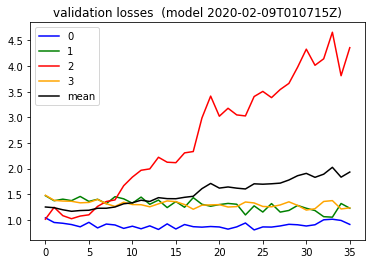
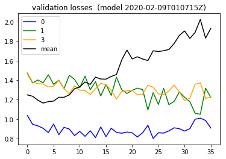

```python
from importlib import reload
import os
import pandas as pd
from io import StringIO
import itertools
import ipdb
import datetime
from collections import Counter

import h5py
import json
import tensorflow as tf
from tensorflow import keras

# Helper libraries
import numpy as np
import matplotlib.pyplot as plt
from tqdm import tqdm
import joblib
print(tf.__version__)

from keras.preprocessing import sequence
from keras.models import Sequential
from keras.layers import Dense, Embedding
from keras.layers import LSTM

from keras.callbacks import EarlyStopping
from tensorflow.compat.v1.losses import sparse_softmax_cross_entropy

from sklearn.preprocessing import StandardScaler
from sklearn.preprocessing import MinMaxScaler
import mytf.s3utils as msu
import mytf.utils as mu
import mytf.validation as mv
import mytf.plot as mp
```

    1.14.0


    Using TensorFlow backend.


```python
tf.enable_eager_execution()
```


```python
datadir = 'history/2020-02-03T000055Z'
ts = mu.quickts(); print('starting,', ts)

workdir = f'history/{ts}'
os.mkdir(workdir)
print(f'Made new workdir, {workdir}')
os.listdir(workdir)
```

    starting, 2020-02-09T010715Z
    Made new workdir, history/2020-02-09T010715Z


    []


```python
lstm_params = [{
    'units': 64,
    'dropout': 0.5,
    'recurrent_dropout': 0.5,
    'batch_input_shape': (None, 64, 8),
    'kernel_initializer': tf.initializers.glorot_normal() # GlorotNormal()
                           #tf.initializers.he_normal()
    },]

optimizer_params = {
    'learning_rate': 0.001,  
    'beta1': 0.9, 
    'beta2': 0.999, 
    'epsilon': 1e-08
}

def bake_model(lstm_params):
    model = tf.keras.Sequential([
        tf.keras.layers.LSTM(**lstm_params[0]),
        # 4 because 'A', 'B', 'C', 'D'.
        tf.keras.layers.Dense(4)])
    return model
```


```python
BATCH_SIZE = 32
EPOCHS = 4
#
print('datadir', datadir, 'workdir', workdir)
train_shuff_loc = f'{datadir}/train_scaled_balanced_shuffled.h5'

X, Ylabels = mu.read_h5_two(
                source_location=train_shuff_loc, 
                Xdataset=f'X',
                Ydataset=f'Ylabels')
size = X.shape[0]

# save base unfitted model.
model = bake_model(lstm_params)
mu.save_model(model=model, 
              loc=f'{workdir}/00000__unfitted_model.h5')
```

    datadir history/2020-02-03T000055Z workdir history/2020-02-09T010715Z


```python
%%time
modelloc = f'{workdir}/00000__unfitted_model.h5'
print(f'Start train with {modelloc}')
model = mu.load_model(modelloc)

class_weights = {0: 1., 1: 0., 2: 0., 3: 0.}
dataset_batches = mu.build_dataset_weighty_v3(
        {'x_train': X,
         'ylabels_train': Ylabels.astype('int64')},
        list(range(size)), 
        class_weights,
        batch_size=BATCH_SIZE)
    
mu.do_train(
        model,
        dataset_batches,
        k=size,
        num_epochs=EPOCHS,
        optimizer_params=optimizer_params,
        saveloc=workdir)

```

    Start train with history/2020-02-09T010715Z/00000__unfitted_model.h5
    WARNING:tensorflow:No training configuration found in save file: the model was *not* compiled. Compile it manually.


    HBox(children=(FloatProgress(value=1.0, bar_style='info', max=1.0), HTML(value='')))


    WARNING:tensorflow:From /home/ec2-user/anaconda3/envs/tensorflow_p36/lib/python3.6/site-packages/tensorflow/python/ops/losses/losses_impl.py:121: add_dispatch_support.<locals>.wrapper (from tensorflow.python.ops.array_ops) is deprecated and will be removed in a future version.
    Instructions for updating:
    Use tf.where in 2.0, which has the same broadcast rule as np.where
    


    HBox(children=(FloatProgress(value=1.0, bar_style='info', max=1.0), HTML(value='')))


    


    HBox(children=(FloatProgress(value=1.0, bar_style='info', max=1.0), HTML(value='')))


    


    HBox(children=(FloatProgress(value=1.0, bar_style='info', max=1.0), HTML(value='')))


    
    CPU times: user 46min 33s, sys: 3.1 s, total: 46min 36s
    Wall time: 46min 33s


### Validation


```python
test_loc = f'{datadir}/test_balanced.h5'
print('test_loc', mu.h5_keys(test_loc))
```

    test_loc ['X_0', 'X_1', 'X_2', 'X_3', 'Ylabels_0', 'Ylabels_1', 'Ylabels_2', 'Ylabels_3']


```python

modelnames_vec = []
for epoch in range(EPOCHS):
    for batch in list(np.arange(200, 1760, 200)) + [1760]:
        step = batch
        prefix = (f'{workdir}/epoch_{str(epoch).zfill(3)}'
                               f'_batch_{str(batch).zfill(5)}')

        modelname = f'{prefix}_model.h5'
        print(modelname, os.path.exists(modelname))
        modelnames_vec.append(prefix)
print('modelnames_vec', modelnames_vec)
```

    history/2020-02-09T010715Z/epoch_000_batch_00200_model.h5 True
    history/2020-02-09T010715Z/epoch_000_batch_00400_model.h5 True
    history/2020-02-09T010715Z/epoch_000_batch_00600_model.h5 True
    history/2020-02-09T010715Z/epoch_000_batch_00800_model.h5 True
    history/2020-02-09T010715Z/epoch_000_batch_01000_model.h5 True
    history/2020-02-09T010715Z/epoch_000_batch_01200_model.h5 True
    history/2020-02-09T010715Z/epoch_000_batch_01400_model.h5 True
    history/2020-02-09T010715Z/epoch_000_batch_01600_model.h5 True
    history/2020-02-09T010715Z/epoch_000_batch_01760_model.h5 True
    history/2020-02-09T010715Z/epoch_001_batch_00200_model.h5 True
    history/2020-02-09T010715Z/epoch_001_batch_00400_model.h5 True
    history/2020-02-09T010715Z/epoch_001_batch_00600_model.h5 True
    history/2020-02-09T010715Z/epoch_001_batch_00800_model.h5 True
    history/2020-02-09T010715Z/epoch_001_batch_01000_model.h5 True
    history/2020-02-09T010715Z/epoch_001_batch_01200_model.h5 True
    history/2020-02-09T010715Z/epoch_001_batch_01400_model.h5 True
    history/2020-02-09T010715Z/epoch_001_batch_01600_model.h5 True
    history/2020-02-09T010715Z/epoch_001_batch_01760_model.h5 True
    history/2020-02-09T010715Z/epoch_002_batch_00200_model.h5 True
    history/2020-02-09T010715Z/epoch_002_batch_00400_model.h5 True
    history/2020-02-09T010715Z/epoch_002_batch_00600_model.h5 True
    history/2020-02-09T010715Z/epoch_002_batch_00800_model.h5 True
    history/2020-02-09T010715Z/epoch_002_batch_01000_model.h5 True
    history/2020-02-09T010715Z/epoch_002_batch_01200_model.h5 True
    history/2020-02-09T010715Z/epoch_002_batch_01400_model.h5 True
    history/2020-02-09T010715Z/epoch_002_batch_01600_model.h5 True
    history/2020-02-09T010715Z/epoch_002_batch_01760_model.h5 True
    history/2020-02-09T010715Z/epoch_003_batch_00200_model.h5 True
    history/2020-02-09T010715Z/epoch_003_batch_00400_model.h5 True
    history/2020-02-09T010715Z/epoch_003_batch_00600_model.h5 True
    history/2020-02-09T010715Z/epoch_003_batch_00800_model.h5 True
    history/2020-02-09T010715Z/epoch_003_batch_01000_model.h5 True
    history/2020-02-09T010715Z/epoch_003_batch_01200_model.h5 True
    history/2020-02-09T010715Z/epoch_003_batch_01400_model.h5 True
    history/2020-02-09T010715Z/epoch_003_batch_01600_model.h5 True
    history/2020-02-09T010715Z/epoch_003_batch_01760_model.h5 True
    modelnames_vec ['history/2020-02-09T010715Z/epoch_000_batch_00200', 'history/2020-02-09T010715Z/epoch_000_batch_00400', 'history/2020-02-09T010715Z/epoch_000_batch_00600', 'history/2020-02-09T010715Z/epoch_000_batch_00800', 'history/2020-02-09T010715Z/epoch_000_batch_01000', 'history/2020-02-09T010715Z/epoch_000_batch_01200', 'history/2020-02-09T010715Z/epoch_000_batch_01400', 'history/2020-02-09T010715Z/epoch_000_batch_01600', 'history/2020-02-09T010715Z/epoch_000_batch_01760', 'history/2020-02-09T010715Z/epoch_001_batch_00200', 'history/2020-02-09T010715Z/epoch_001_batch_00400', 'history/2020-02-09T010715Z/epoch_001_batch_00600', 'history/2020-02-09T010715Z/epoch_001_batch_00800', 'history/2020-02-09T010715Z/epoch_001_batch_01000', 'history/2020-02-09T010715Z/epoch_001_batch_01200', 'history/2020-02-09T010715Z/epoch_001_batch_01400', 'history/2020-02-09T010715Z/epoch_001_batch_01600', 'history/2020-02-09T010715Z/epoch_001_batch_01760', 'history/2020-02-09T010715Z/epoch_002_batch_00200', 'history/2020-02-09T010715Z/epoch_002_batch_00400', 'history/2020-02-09T010715Z/epoch_002_batch_00600', 'history/2020-02-09T010715Z/epoch_002_batch_00800', 'history/2020-02-09T010715Z/epoch_002_batch_01000', 'history/2020-02-09T010715Z/epoch_002_batch_01200', 'history/2020-02-09T010715Z/epoch_002_batch_01400', 'history/2020-02-09T010715Z/epoch_002_batch_01600', 'history/2020-02-09T010715Z/epoch_002_batch_01760', 'history/2020-02-09T010715Z/epoch_003_batch_00200', 'history/2020-02-09T010715Z/epoch_003_batch_00400', 'history/2020-02-09T010715Z/epoch_003_batch_00600', 'history/2020-02-09T010715Z/epoch_003_batch_00800', 'history/2020-02-09T010715Z/epoch_003_batch_01000', 'history/2020-02-09T010715Z/epoch_003_batch_01200', 'history/2020-02-09T010715Z/epoch_003_batch_01400', 'history/2020-02-09T010715Z/epoch_003_batch_01600', 'history/2020-02-09T010715Z/epoch_003_batch_01760']


```python
print('starting validation', mu.quickts())
batch_losses_vec = []
print('test_loc', test_loc)
epoch = 0
for step, prefix in enumerate(tqdm(modelnames_vec)):
    # prefix = (f'{workdir}/epoch_{str(epoch).zfill(3)}'
    #                        f'_batch_{str(batch).zfill(5)}')

    modelname = f'{prefix}_model.h5'
    print(modelname, os.path.exists(modelname))

    steploss = mv.perf_wrapper(modelname,
                               dataloc=test_loc,
                               eager=True,
                              batch_size=32)
    batch_losses_vec.append([float(x) for x in steploss])
    mu.to_json_local({'batch_losses_vec': batch_losses_vec,
                  'step': int(step)
              }, 
              f'{prefix}_validation_losses.json')
    
print('done validation', mu.quickts())
#####
lossesarr = np.array(batch_losses_vec)
meanlossesarr = np.mean(lossesarr, axis=1)

batch_losses_vec[:5]
#batch_losses_vec = []

plt.plot([x[0] for x in batch_losses_vec], color='blue', label='0')
plt.plot([x[1] for x in batch_losses_vec], color='green', label='1')
plt.plot([x[2] for x in batch_losses_vec], color='red', label='2')
plt.plot([x[3] for x in batch_losses_vec], color='orange', label='3')
plt.plot(meanlossesarr, color='black', label='mean')
plt.title(f'validation losses  (model {ts})')
plt.legend()     
        
```

      0%|          | 0/36 [00:00<?, ?it/s]

    starting validation 2020-02-09T015930Z
    test_loc history/2020-02-03T000055Z/test_balanced.h5
    history/2020-02-09T010715Z/epoch_000_batch_00200_model.h5 True
    WARNING:tensorflow:No training configuration found in save file: the model was *not* compiled. Compile it manually.


      3%|▎         | 1/36 [04:46<2:47:19, 286.83s/it]

    history/2020-02-09T010715Z/epoch_000_batch_00400_model.h5 True
    WARNING:tensorflow:No training configuration found in save file: the model was *not* compiled. Compile it manually.
    ...

     61%|██████    | 22/36 [1:45:02<1:06:50, 286.47s/it]

    history/2020-02-09T010715Z/epoch_002_batch_01000_model.h5 True
    WARNING:tensorflow:No training configuration found in save file: the model was *not* compiled. Compile it manually.


```python
meanlossesarr
```


    array([1.2484009 , 1.23448573, 1.19409977, 1.16453309, 1.17931211,
           1.18497714, 1.22411191, 1.22398704, 1.24850054, 1.31103911,
           1.33118664, 1.38083243, 1.35652892, 1.4309701 , 1.41161321,
           1.40992384, 1.43772973, 1.4577726 , 1.60686302, 1.70862387,
           1.6175383 , 1.63973585, 1.6164977 , 1.6006812 , 1.70122978,
           1.69351995, 1.70193529, 1.71464974, 1.77576904, 1.85943067,
           1.90501527, 1.82791053, 1.88926429, 2.02341145, 1.83123823,
           1.93111178])


```python
plt.plot([x[0] for x in batch_losses_vec], color='blue', label='0')
plt.plot([x[1] for x in batch_losses_vec], color='green', label='1')
plt.plot([x[2] for x in batch_losses_vec], color='red', label='2')
plt.plot([x[3] for x in batch_losses_vec], color='orange', label='3')
plt.plot(meanlossesarr, color='black', label='mean')
plt.title(f'validation losses  (model {ts})')
plt.legend()    
```


    <matplotlib.legend.Legend at 0x7f138cd02ef0>





```python
batch_losses_vec
```


    [[1.0364662408828735,
      1.469323992729187,
      1.0106637477874756,
      1.4771496057510376],
     [0.9462652802467346,
      1.3707464933395386,
      1.2423536777496338,
      1.378577470779419],
     [0.9306474328041077,
      1.4015940427780151,
      1.0794546604156494,
      1.3647029399871826],
     [0.9055910706520081,
      1.3725917339324951,
      1.0196342468261719,
      1.3603153228759766],
     [0.8613853454589844,
      1.454492211341858,
      1.0715227127075195,
      1.3298481702804565],
     [0.9491506814956665,
      1.357450246810913,
      1.0957884788513184,
      1.3375191688537598],
     [0.8398747444152832,
      1.3996000289916992,
      1.2605162858963013,
      1.3964565992355347],
     [0.9153836965560913,
      1.3125518560409546,
      1.3554145097732544,
      1.3125981092453003],
     [0.897506058216095,
      1.4498804807662964,
      1.3869361877441406,
      1.2596794366836548],
     [0.8306414484977722,
      1.407802939414978,
      1.6638809442520142,
      1.341831088066101],
     [0.8735260367393494,
      1.3225979804992676,
      1.8323657512664795,
      1.2962567806243896],
     [0.8229602575302124,
      1.4416959285736084,
      1.9658347368240356,
      1.2928388118743896],
     [0.8800448775291443, 1.3010174036026, 1.9924670457839966, 1.2525863647460938],
     [0.810002326965332,
      1.3838090896606445,
      2.2199926376342773,
      1.310076355934143],
     [0.9191523194313049,
      1.2368559837341309,
      2.1230781078338623,
      1.3673664331436157],
     [0.819007933139801,
      1.3547263145446777,
      2.113858222961426,
      1.3521028757095337],
     [0.9060888886451721,
      1.2430899143218994,
      2.3052399158477783,
      1.2965002059936523],
     [0.8638473153114319,
      1.4312502145767212,
      2.331486701965332,
      1.2045061588287354],
     [0.8547900915145874,
      1.3014805316925049,
      2.987454414367676,
      1.2837270498275757],
     [0.8672727942466736,
      1.2630763053894043,
      3.4141523838043213,
      1.2899940013885498],
     [0.8585145473480225,
      1.2957249879837036,
      3.0212135314941406,
      1.2947001457214355],
     [0.8161418437957764,
      1.3180643320083618,
      3.176696300506592,
      1.2480409145355225],
     [0.8603163957595825,
      1.302321195602417,
      3.0468876361846924,
      1.2564655542373657],
     [0.9360082745552063,
      1.0937548875808716,
      3.0267374515533447,
      1.3462241888046265],
     [0.8008798360824585,
      1.2707523107528687,
      3.4056007862091064,
      1.3276861906051636],
     [0.8594471216201782,
      1.1499072313308716,
      3.505633592605591,
      1.259091854095459],
     [0.8561739921569824,
      1.3148897886276245,
      3.384519577026367,
      1.2521578073501587],
     [0.8786450624465942,
      1.148563265800476,
      3.5426719188690186,
      1.2887187004089355],
     [0.9102984070777893,
      1.180977702140808,
      3.662294626235962,
      1.3495054244995117],
     [0.9012715816497803,
      1.278735637664795,
      3.9783003330230713,
      1.2794151306152344],
     [0.8772254586219788,
      1.223985195159912,
      4.330445766448975,
      1.1884046792984009],
     [0.9015682339668274,
      1.1791021823883057,
      4.016104221343994,
      1.2148674726486206],
     [0.9984030723571777,
      1.0595409870147705,
      4.142508506774902,
      1.3566045761108398],
     [1.0097291469573975,
      1.0496412515640259,
      4.661198139190674,
      1.3730772733688354],
     [0.9858686327934265,
      1.3168312311172485,
      3.812196731567383,
      1.2100563049316406],
     [0.908311128616333,
      1.2249037027359009,
      4.359959602355957,
      1.2312726974487305]]


```python
plt.plot([x[0] for x in batch_losses_vec], color='blue', label='0')
plt.plot([x[1] for x in batch_losses_vec], color='green', label='1')
# plt.plot([x[2] for x in batch_losses_vec], color='red', label='2')
plt.plot([x[3] for x in batch_losses_vec], color='orange', label='3')
plt.plot(meanlossesarr, color='black', label='mean')
plt.title(f'validation losses  (model {ts})')
plt.legend()    
```


    <matplotlib.legend.Legend at 0x7f138ccefcc0>




