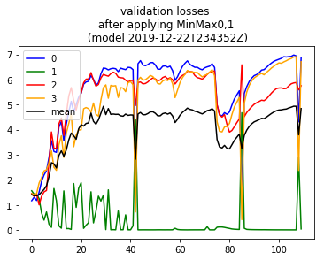

### Scaling

[On 2019-12-21](https://github.com/namoopsoo/aviation-pilot-physiology-hmm/blob/master/notes/2019-12-21--update.md) , I ended up trying out more scaling approaches, especially `MinMaxScaler`. I had `8` features I was focusing on at that point and I plotted how my `minMaxScaler` `min` and `max` parameters changed as I processed roughly `40` or so mini datasets I had in my h5 training file `data/2019-12-21T215926Z/train.h5`. _Re-posting [my image](https://github.com/namoopsoo/aviation-pilot-physiology-hmm/blob/master/notes/2019-12-21--update.md#plot-the-scale-parameters)_  : 

Luckily I found I was able to use just a single sklearn MinMaxScaler object to capture all `8` features at once. 
I then  [applied](https://github.com/namoopsoo/aviation-pilot-physiology-hmm/blob/master/notes/2019-12-21--update.md#make-scaled-data) the scalers to transform my `train.h5` data to a  `train_scaled.h5` dataset. And I also ended up with a [balanced dataset](https://github.com/namoopsoo/aviation-pilot-physiology-hmm/blob/master/notes/2019-12-21--update.md#ok-now-make-balanced-data-again) , `train_balanced.h5`, that I could use for training.

I trained a model and plotted training and validation loss curves the [next day](https://github.com/namoopsoo/aviation-pilot-physiology-hmm/blob/master/notes/2019-12-22.md) . 

And wow the validation loss ( [link](https://github.com/namoopsoo/aviation-pilot-physiology-hmm/blob/master/notes/2019-12-22.md#plotting-validation-loss-at-model-snapshots) ) looked intense , 

As a side note. although the validation loss here looks totally skewed towards `class 1` , I want to step back and note I really appreciate the technique of actually creating the _"balanced"_ test set I referred to above. That allows us to quickly knows the model is favoring one class over another in the first place. And also I really dig the technique of simply snapshotting the tensorflow models while training and then being able to know how the validation logloss looks across those training batches. I feel like combining these techniques was really helpful in digesting what is going on . I needed to enjoy little details like that amidst all of the trial and error that was happening here (Emphasis on the error part haha).

