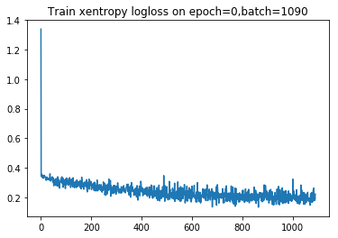
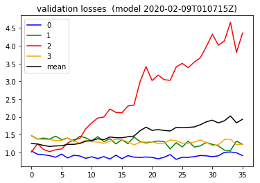

Here I write a bit retrospectively about my notes, trying to summarize some of the journey.

#### Trickiness of the how the data is laid out (crews and seats?!)
In the process of visualizing data, at one point I had accidentally been combining the data of multiple people.


Above, extracting a plot from my [2019-11-03 notebook](https://github.com/namoopsoo/aviation-pilot-physiology-hmm/blob/master/notes/2019-11-03-different-data-approach.md#plot-some-data), is an example of where I plot combined multi seat data by accident. At one point this was weirding me out. But I realized finally that I had been combining the data of multiple people.

For diagram above (^^) , I had written a quick function `produce_plots_for_col` for plotting four features simultaneously, given a pandas datagrame, some features and an interval, 

```python
mp.produce_plots_for_col(
    crew1df, ['r', 'ecg', 'gsr', 'eeg_fp1',], range(50, 200))
```

Indeed I had done this several times actually by accident. The data is complicated however. It includes four indexing columns: `id` , `time` , `crew` and `seat` . ...

### Scaling
I took a deeper [histogram](https://github.com/namoopsoo/aviation-pilot-physiology-hmm/blob/master/notes/2019-12-14--annotated.md) look at my data, seeing quite a lot of [ups and downs](https://github.com/namoopsoo/aviation-pilot-physiology-hmm/blob/master/notes/2019-12-14--annotated.md#another-time-series-look). 

_(Given that there were some crazy jumps, I thought I needed to do something about that)_


And so 
[on 2019-12-21](https://github.com/namoopsoo/aviation-pilot-physiology-hmm/blob/master/notes/2019-12-21--update.md) , I ended up trying out more scaling approaches, especially `MinMaxScaler`. I had `8` features I was focusing on at that point and I plotted how my `minMaxScaler` `min` and `max` parameters changed as I processed roughly `40` or so mini datasets I had in my h5 training file `data/2019-12-21T215926Z/train.h5`. _Re-posting [my image](https://github.com/namoopsoo/aviation-pilot-physiology-hmm/blob/master/notes/2019-12-21--update.md#plot-the-scale-parameters)_  : 


Luckily I found I was able to use just a single sklearn MinMaxScaler object to capture all `8` features at once. 
I then  [applied](https://github.com/namoopsoo/aviation-pilot-physiology-hmm/blob/master/notes/2019-12-21--update.md#make-scaled-data) the scalers to transform my `train.h5` data to a  `train_scaled.h5` dataset. And I also ended up with a [balanced dataset](https://github.com/namoopsoo/aviation-pilot-physiology-hmm/blob/master/notes/2019-12-21--update.md#ok-now-make-balanced-data-again) , `train_balanced.h5`, that I could use for training.

I trained a model and plotted training and validation loss curves the [next day](https://github.com/namoopsoo/aviation-pilot-physiology-hmm/blob/master/notes/2019-12-22.md) . 

And wow the validation loss ( [link](https://github.com/namoopsoo/aviation-pilot-physiology-hmm/blob/master/notes/2019-12-22.md#plotting-validation-loss-at-model-snapshots) ) looked intense , 


As a side note. although the validation loss here looks totally skewed towards `class 1` , I want to step back and note I really appreciate the technique of actually creating the _"balanced"_ test set I referred to above. That allows us to quickly knows the model is favoring one class over another in the first place. And also I really dig the technique of simply snapshotting the tensorflow models while training and then being able to know how the validation logloss looks across those training batches. I feel like combining these techniques was really helpful in digesting what is going on . I needed to enjoy little details like that amidst all of the trial and error that was happening here (Emphasis on the error part haha).


#### Shuffling and adjusting dropout
At a [later date](https://github.com/namoopsoo/aviation-pilot-physiology-hmm/blob/master/notes/2019-12-25.md) , I adjusted my  lstm dropout from `0.2` to `0.7` , seeing quite different behavior in the validation loss. I had also added some [shuffling code](https://github.com/namoopsoo/aviation-pilot-physiology-hmm/blob/master/notes/2019-12-25.md#do-a-shuffle) taking my `'history/2019-12-22T174803Z/train_balanced.h5'` dataset to produce `'history/2019-12-22T174803Z/train_scaled_balanced_shuffled.h5'` , to possibly change some of the choppiness of the validation curve seen above ^^ . That produced a [validation loss](https://github.com/namoopsoo/aviation-pilot-physiology-hmm/blob/master/notes/2019-12-25.md#validation-loss) , reposting the image here, 


#### More epochs?
On [2018-12-28](https://github.com/namoopsoo/aviation-pilot-physiology-hmm/blob/master/notes/2019-12-28-two.md) I got curious about whether just  throwing more data at this problem would help. So I extended my waiting time by `two` and let the training happen in two *epochs* . The validation loss [from here](https://github.com/namoopsoo/aviation-pilot-physiology-hmm/blob/master/notes/2019-12-28-two-plot.md#final-validation-logloss-plot)  , (reposting...) however showed that throwing more data is not always the answer. It always depends haha.


#### Weight initialization
Per my [notebook entry](https://github.com/namoopsoo/aviation-pilot-physiology-hmm/blob/master/notes/2020-01-12.md) I had read per [this article](https://adventuresinmachinelearning.com/weight-initialization-tutorial-tensorflow/) that the default tensor flow weight initialization I had [been using](https://www.tensorflow.org/api_docs/python/tf/keras/initializers) was  _GlorotUniform , ( which is aka Xavier Uniform apparently )_ . I realized it was at least worth considering weight initialization as another hyper parameter so here I tried the  _Glorot or Xavier Normal_ instead .  The [validation loss](https://github.com/namoopsoo/aviation-pilot-physiology-hmm/blob/master/notes/2020-01-12.md#validation-loss) did not necessarily convey the difference however: 


At this point I think I was realizing that the order of ideas to try matters. And you do not know in advance what is the best order. Perhaps the weight initialization matters a good deal, but I had not yet found the critical next step yet at that point.

#### Class balance
In my [next notebook](https://github.com/namoopsoo/aviation-pilot-physiology-hmm/blob/master/notes/2020-01-18.md) I wanted to understand why my `class 1` kept getting favored. I tried out [forcing the weights](https://github.com/namoopsoo/aviation-pilot-physiology-hmm/blob/master/notes/2020-01-18.md#force-weights) of my training data to basically 

```
{0: 1., 1: 0., 2: 0., 3: 0.}
```

to see what happens and sure enough, per the [validation loss](https://github.com/namoopsoo/aviation-pilot-physiology-hmm/blob/master/notes/2020-01-18.md#validation-loss) , the loss now went down only for class `0`. So the effect was controlled. 


#### Active Learning: changing the training approach 
Somehow I came upon the idea of preferentially training on what your model is doing poorly on. So on [2020-01-19](https://github.com/namoopsoo/aviation-pilot-physiology-hmm/blob/master/notes/2020-01-19--update.md)  I modified my training loop so that I dynamically adjusted my training weights according to which class was being misclassified. The effect on the [training loss](https://github.com/namoopsoo/aviation-pilot-physiology-hmm/blob/master/notes/2020-01-19--update.md#plotting-train-loss-now-and-per-label-losses-too) was really interesting. Everything was way smoother.

Looking at a training loss plot from earlier ( such as from [2019-12-28](https://github.com/namoopsoo/aviation-pilot-physiology-hmm/blob/master/notes/2019-12-28.md#crashed-last-batch-but-thats-okay)  )

  , it shows the batch loss is all over the place. That makes perferct sense perhaps, because each batch I have been using in stochastic gradient descent really is from all over the training data. And compared to the training loss plot for the two figures below (extracted from my [2020-01-19 notebook](https://github.com/namoopsoo/aviation-pilot-physiology-hmm/blob/master/notes/2020-01-19--update.md) ) the combined and per-class training batch losses  are way more stable looking. 


  

The validation loss was still favoring that one class, but I decided to hold on to this technique and keep trying other things.

#### Full training set error
Next in [this notebook](https://github.com/namoopsoo/aviation-pilot-physiology-hmm/blob/master/notes/2020-01-19--more-test-evaluate-train.md) I wanted to better answer whether my particular test set perhaps had some very different size data compared to my training set, which was blowing up my test set error. I did not have enough data to better split apart my data at the moment actually, but instead I took a quick detour to compare my training mini batch loss curves to the full training set losses, during training. Naturally one would expect that if batch training losses improve that overall training set loss should also improve. Per the below diagram from my notebook, that was indeed the case.


#### Shuffling train/test 
After having consistently weird results with validation error, I decided to try re-building my train/test sets by doing a full random shuffle instead, in my [2020-02-01 notebook](https://github.com/namoopsoo/aviation-pilot-physiology-hmm/blob/master/notes/2020-02-01.md). Up until this point I had been using the fact that the data is divided into `crew1, crew2, crew3, etc` and I have used `crew1` for train and `crew2` for test. And I had built `scalers` from my `crew1` training data, applying them to the the `crew2` test data. 

So this time around I instead built `scalers` from `crew1` and then changed my function, `build_many_scalers_from_h5` to take `scalers` as a parameter and I kept updating them with the test data. ( My scalers `'history/2020-02-02T044441Z/scalers.joblib'` was the restulting artifact). 

In [validation](https://github.com/namoopsoo/aviation-pilot-physiology-hmm/blob/master/notes/2020-02-01.md#final-chart) , I think for the first time, I saw the validation error actually start going down ,  

 

I took that further in [this 2020-02-08 notebook](https://github.com/namoopsoo/aviation-pilot-physiology-hmm/blob/master/notes/2020-02-08-take2--update--2.md) and ( _showing my figure again_ ) going 3 epochs instead, I got ..



So the bright side I take from this is that the validation loss is actually doing better for three out of four of the classes.

#### Reconsider that high dropout
Next in [2020-02-15 notebook](https://github.com/namoopsoo/aviation-pilot-physiology-hmm/blob/master/notes/2020-02-15.md), I decided to reduce my dropout slightly, after reading through [this post](https://machinelearningmastery.com/use-dropout-lstm-networks-time-series-forecasting/) about treating the dropout as yet another hyperparameter.  After retraining , across 2 epochs, I saw a validation loss curve, which looked better still. 


This indicates perhaps the context of hyperparameters being experimented with indeed matters . I think Andrew Ng's characterization of _"model babysitting"_.

https://github.com/namoopsoo/aviation-pilot-physiology-hmm/blob/master/notes/2020-02-15.md


